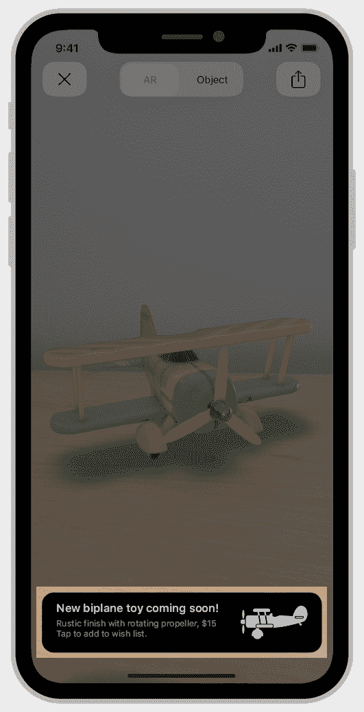

# Safari 13.1 的新功能-日志火箭博客

> 原文：<https://blog.logrocket.com/whats-new-in-safari-13-1/>

苹果发布了 Safari 浏览器的[最新版本](https://webkit.org/blog/10247/new-webkit-features-in-safari-13-1/)，适用于 macOS Catalina、iPadOS、iOS 和 watchOS 的 Safari 13.1。这个版本带来了跨越苹果平台的网络的几个改进。这个版本的重点是提高用户的隐私，优化浏览器的性能，并改善开发人员使用浏览器的体验。

在本帖中，我们将看看浏览器最新版本中的一些最新更新和功能。这些功能包括(但不限于):

## 智能跟踪预防

[智能跟踪预防](https://webkit.org/blog/7675/intelligent-tracking-prevention/)(2017 年推出)是 [WebKit](https://webkit.org/) 的一项功能，旨在通过阻止第三方 cookies 和阻止网站获取用户数据来减少跨站点跟踪，无论是在桌面上还是在移动设备上。

这个新的更新带来了智能跟踪预防的几个新的增强功能，包括全面的第三方 cookie 阻止和在 Safari 使用七天后非 cookie 网站数据的过期，这是如何做到的在苹果工程师[约翰·威兰德](https://twitter.com/johnwilander?)的[这篇博客文章](https://webkit.org/blog/10218/full-third-party-cookie-blocking-and-more/)中有解释。

### 完全第三方 cookie 阻止

默认情况下，跨站点资源的 Cookies 现在会被全面阻止。这一更新极大地改善了用户在 Safari 浏览器上的隐私，并使跟踪用户的行为变得更加困难。

完整的第三方 cookie 拦截通过确保没有 ITP 状态可以通过 cookie 拦截行为检测来消除 cookie 拦截中的状态，它还禁用“登录指纹”，这使得网站无法检测到您注册或登录到哪个平台。

在任何没有完全阻止第三方 cookie 的浏览器中，都可以检测您登录的平台。使用这个[现场演示](https://robinlinus.github.io/socialmedia-leak/)来测试您的浏览器的登录指纹。

### 所有浏览器存储选项的 7 天限制

除了现有的客户端 cookie 限制，ITP 还将开始删除网站上所有可写脚本的存储空间，如果用户在网站上使用 Safari 七天没有互动的话。

这些可写脚本的存储形式包括:

*   索引数据库
*   本地存储
*   媒体键
*   会话存储
*   服务工作人员注册和缓存

这一更新意味着每次用户访问您的网站时，它都会将数据保存到 localStorage 等存储形式中，如果用户在接下来的七天内没有访问您的网站，但继续使用 Safari 浏览器访问其他网站，则所有保存的数据都会被删除。如果用户根本不使用 Safari 或在指定的七天内访问您的网站，数据会保留在储存形式中。

## 定制的 AR 快速外观

用户可以从 web 上启动 AR 体验，内容作者可以定制覆盖 AR 视图的横幅。可以定制:

*   Apple Pay 按钮样式
*   动作按钮标签
*   项目标题
*   项目副标题
*   价格



或者，作者可以使用 HTML 创建完全自定义的横幅:

```
https://example.com/example.usdz#custom=https://example.com/customBanner.html
```

有关更多信息，请阅读关于在 AR Quick Look 中添加 [Apple Pay 按钮或自定义操作的信息。](https://developer.apple.com/documentation/arkit/adding_an_apple_pay_button_or_a_custom_action_in_ar_quick_look)

## JavaScript 和 CSS 附加功能

这个版本还包括对 JavaScript `[replaceAll(](https://v8.dev/features/string-replaceall))`方法的支持；用于替换字符串中出现的所有字符，该版本还支持 ES2020 中提供的 nullish 合并运算符(`??`)。

`String.prototype.replaceAll()`方法用提供的替换值替换字符串中出现的所有字符:

```
"My name is jola".replaceAll(" ", "-");

//My-name-is-jola
```

从[string . prototype . replace all proposal](https://github.com/tc39/proposal-string-replaceall)中了解有关此方法的更多信息。

根据 [MDN 单据](https://developer.mozilla.org/en-US/docs/Web/JavaScript/Reference/Operators/Nullish_coalescing_operator):

> 无效合并运算符(`??`)是一种逻辑运算符，当其左侧操作数为`[null](https://developer.mozilla.org/en-US/docs/Web/JavaScript/Reference/Global_Objects/null)`或`[undefined](https://developer.mozilla.org/en-US/docs/Web/JavaScript/Reference/Global_Objects/undefined)`时，返回其右侧操作数，否则返回其左侧操作数。

```
const nullValue = null;
const resultWithNull = nullValue ?? "default";        // "default"

const nonNullValue = 0;
const resultWithNonNull = nonNullValue ?? "default";  // 0
```

更多细节参见 JavaScript 提案的 [nullish 合并，你也可以在这里](https://github.com/tc39/proposal-nullish-coalescing)了解关于这个操作符[的更多信息。](https://blog.logrocket.com/optional-chaining-and-nullish-coalescing-in-javascript/)

## CSS 附加内容

在这个版本中还提供了一些字体关键字，这些关键字使得使用特定于平台的字体成为可能，例如`ui-serif`、`ui-sans-serif`、`ui-monospace`和`ui-rounded`。

这次更新还包括对`line-break: anywhere`值的支持，根据 MDN 的说法，这个[在每个印刷字符单元周围添加了软换行，包括任何标点符号或单词中间保留的空格，它甚至忽略了对换行符的限制。](https://developer.mozilla.org/en-US/docs/Web/CSS/line-break)

它还支持`dynamic-range`媒体查询，允许作者创建特定于显示功能的样式:

```
@media (dynamic-range: standard) {
    .example {
        /* Styles for displays not capable of HDR. */
        color: rgb(255, 0, 0);
    }
}

@media (dynamic-range: high) {
    .example {
        /* Styles for displays capable of HDR. */
        color: color(display-p3 1 0 0);
    }
}
```

## resize 观察者

根据 [MDN 文档](https://developer.mozilla.org/en-US/docs/Web/API/ResizeObserver)，“Resize Observer API 提供了一种性能机制，通过这种机制，代码可以监视元素的大小变化，每次大小变化时都会向观察者发送通知。”

WebKit 中添加的`ResizeObserver`使开发人员能够设计响应容器而不仅仅是视口的组件。您不再需要将一个`resize`事件监听器附加到一个元素上，就可以得到关于视窗尺寸变化的通知。

该 API 允许开发人员观察元素布局大小的变化，它允许更灵活的响应设计，其中容器可以对窗口大小的变化、方向的变化和布局中新元素的添加做出反应。

您创建了一个`ResizeObserver`对象的实例，并向构造函数传递了一个回调。回调将被赋予一个数组`ResizeObserverEntries`——每个被观察的元素一个条目——它包含元素的新维度:

```
var ro = new ResizeObserver( entries => {
  for (let entry of entries) {
    const cr = entry.contentRect;
    console.log('Element:', entry.target);
    console.log(`Element size: ${cr.width}px x ${cr.height}px`);
    console.log(`Element padding: ${cr.top}px ; ${cr.left}px`);
  }
});

// Observe one or multiple elements
ro.observe(someElement);
```

## 网络动画 API

该版本还支持 Web Animations API，根据 [MDN 文档](https://developer.mozilla.org/en-US/docs/Web/API/Web_Animations_API/Web_Animations_API_Concepts):“该 API 允许开发人员访问浏览器的动画引擎，并描述了动画应该如何跨浏览器实现”，它旨在弥合 CSS(动画和过渡)和 JavaScript 动画之间的差距。

这是在网络上制作动画最有效的方式之一，让浏览器在没有黑客或强制的情况下进行内部优化。

有了这个 API，开发人员可以创建、查询和控制动画，它为编程动画、CSS 动画和过渡提供了一个方便的统一模型。现在可以直接控制它们暂停、恢复、搜索或改变速度和方向，减少人工计算。此外，Web Inspector 已经更新，可以在媒体和动画时间线中显示它们的条目。


阅读更多关于 WebKit 中的[网页动画和 Safari 13.1](https://webkit.org/blog/8343/web-animations-in-webkit/) 中的[网页动画。](https://webkit.org/blog/10266/web-animations-in-safari-13-1/)

## 结论

Safari 浏览器的更新是巨大的，将改善浏览器的使用体验。还有更多惊人的特性没有在本文中介绍。有关更新的完整列表，请阅读[发行说明](https://webkit.org/blog/10247/new-webkit-features-in-safari-13-1/)。

一些更新，如所有脚本可写存储的 7 天上限，引发了一些反应，而[一些人称赞](https://ionicframework.com/blog/is-apple-trying-to-kill-pwas/)对隐私的关注，[其他](https://andregarzia.com/2020/03/private-client-side-only-pwas-are-hard-but-now-apple-made-them-impossible.html)并没有接受它，因为它被认为是反 PWA 的。

你怎么想呢?哪些新功能让你印象深刻？请在评论区告诉我。

## 使用 [LogRocket](https://lp.logrocket.com/blg/signup) 消除传统错误报告的干扰

[](https://lp.logrocket.com/blg/signup)

[LogRocket](https://lp.logrocket.com/blg/signup) 是一个数字体验分析解决方案，它可以保护您免受数百个假阳性错误警报的影响，只针对几个真正重要的项目。LogRocket 会告诉您应用程序中实际影响用户的最具影响力的 bug 和 UX 问题。

然后，使用具有深层技术遥测的会话重放来确切地查看用户看到了什么以及是什么导致了问题，就像你在他们身后看一样。

LogRocket 自动聚合客户端错误、JS 异常、前端性能指标和用户交互。然后 LogRocket 使用机器学习来告诉你哪些问题正在影响大多数用户，并提供你需要修复它的上下文。

关注重要的 bug—[今天就试试 LogRocket】。](https://lp.logrocket.com/blg/signup-issue-free)