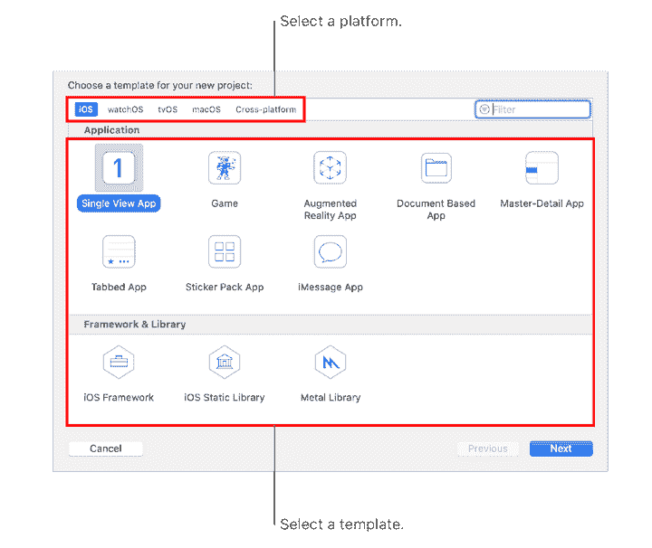
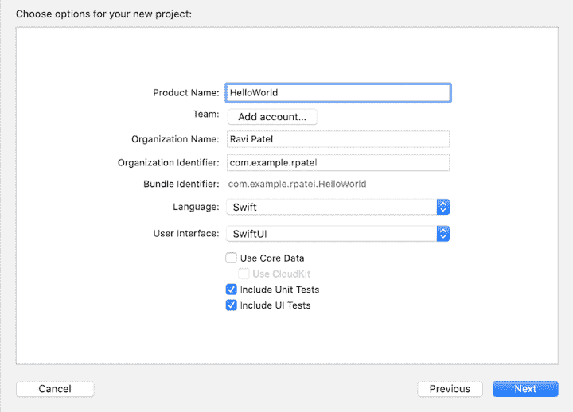
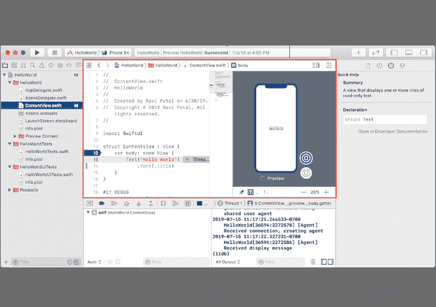
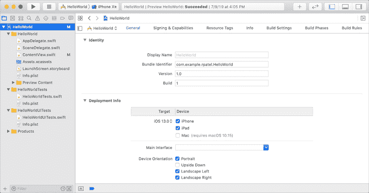

# 关于新的 Safari web 扩展，你需要知道什么

> 原文：<https://blog.logrocket.com/whats-new-in-safari-web-extensions/>

苹果操作系统的下一个主要版本 macOS Big Sur 将于今年秋天发布，为用户和开发者带来许多令人惊叹的新功能，包括简化的应用程序、更时尚的 dock 和改进的通知中心。

大苏尔最令人兴奋的功能之一是升级的 Safari 网络浏览器，这是苹果设备的官方浏览器。在本指南中，我们将聚焦 Safari web 扩展的变化，以及它们如何影响开发者体验。

## Safari 浏览器扩展是怎么回事？

扩展是一些小软件，用户可以安装它们来增强和定制浏览体验。它们提供了浏览器没有附带的附加功能。

例如，你曾经需要翻译网页的内容吗？对此有一些扩展，比如微软翻译器。其他常见的扩展类型包括密码管理器(例如， [LastPass](https://www.lastpass.com/) )、书签工具(例如， [Evernote Web Clipper](https://evernote.com/features/webclipper) )和校对应用程序(语法上用于 Safari 的)。这个清单还在继续。

Safari 支持扩展，但由于技术堆栈的差异和操作系统兼容性的问题，与 Mozilla Firefox 和 Google Chrome 等其他流行浏览器相比，safari 的生态系统相对较小。为了弥合这一差距，苹果将在 Safari 中提供对网络扩展的额外支持。

## Xcode 12 简介

Safari 浏览器现在将像其他浏览器一样使用扩展 API。对于用户来说，这将为 Safari 带来更广泛、更强大的扩展。对于开发人员来说，它使他们能够使用 HTML、CSS 和 JavaScript 创建 Safari web 扩展。

与 Safari web extensions 相关的最重要的变化之一是引入了 [Xcode 12](https://developer.apple.com/xcode/) ，它使开发者能够默认构建通用的应用程序，以支持使用苹果芯片的 Mac，而无需更改任何代码。

如果您想为 Safari 构建和部署一个扩展，您需要使用 Xcode 来打包和测试它们。您必须是 Apple 开发者计划的成员，才能将它们分发到 App Store。

Xcode 附带了大量惊人的功能，让您可以做更多的事情，而不仅仅是构建新的 Safari 扩展。例如，您可以将现有的浏览器扩展转换为 Safari 扩展，以便在所有苹果设备上使用，并在 App Store 中共享。更令人兴奋的是简化这一过程的命令行工具。

命令行工具包使您能够从终端执行命令。它可以单独下载和安装。幸运的是，Xcode 是自带的，所以如果你安装了 Xcode，你就可以访问命令行，不需要单独安装。

从命令行构建 Xcode 项目时，您可以测试、构建、查询、分析和归档操作。让我们看看几个可以从终端(命令行工具)执行的特定命令，以加速和简化开发人员的体验。

要开始，导航到包含您的项目的目录。以下命令将列出您的工作区中的所有方案。

```
xcodebuild -list -workspace <your_workspace_name>.xcworkspace 
```

用您实际的工作区名称替换`<your_workspace_name>`。

上述命令将导致以下结果。

```
$ cd /Users/username/Desktop/MyApplication

$ xcodebuild -list -workspace MyApplication.xcworkspace

Information about workspace "MyApplication":

    Schemes:

        iOSApp

        tvOSApp

        macOSApp

        iOSWithWatchApp

        iOSWithWatchApp WatchKit App

```

以下命令列出了项目中使用所有目标、构建配置和方案。

```
xcodebuild -list -project <your_project_name>.xcodeproj

```

输出如下所示:

```
$ cd /Users/username/Desktop/MyProject

$ xcodebuild -list -project MyProject.xcodeproj

Information about project "MyProject":

    Targets:

        iOS

        iOSTests

        iOSUITests

        watchOS App

        watchOS App Extension

        tvOS

        tvOSTests

        tvOSUITests

        macOS

        macOSTests

        macOSUITests

    Build Configurations:

        Debug

        Release

```

如果没有指定构建配置并且没有通过`-scheme`，则使用`Debug`。

```
    Schemes:

        iOS

        watchOS App

        tvOS

        macOS

```

您可以通过在终端中运行以下命令，使用命令行在项目中构建一个方案。

```
xcodebuild -scheme <your_scheme_name> build

```

结果将如下所示:

```
$ xcodebuild -scheme tvOS  build

=== BUILD TARGET tvOS OF PROJECT MyProject WITH CONFIGURATION Debug ===

...

```

您还可以创建一个新的 Safari 扩展，使用 Xcode 的内置模板在 App Store 中共享它，并重新打包它以与其他浏览器配合使用。有关更多详细信息，请查看[文档](https://developer.apple.com/documentation/xcode/)。

## 如何使用 Xcode

首先，使用 Xcode 为您的应用程序创建一个项目。在 Xcode 中创建项目之前，您需要向 Xcode 提供一些重要的详细信息来鉴定您的应用程序和组织:

*   **产品名称** —产品名称就是 app 的名字。无论它以何种形式出现，它都会出现在 App Store 和其他地方。没有有效的产品名称，您不能在 Xcode 中创建项目
*   **组织标识符** —这使得 Xcode 能够识别您的组织。您可以在没有组织标识符的情况下构建应用程序，但在提供组织标识符之前，您无法部署应用程序。如果您没有公司标识符，请使用`com.example.`后跟您的组织名称，并记住在分发您的应用程序之前替换它
*   **组织名称** —这是出现在应用程序样板文件中的名称。不一定要和 App Store 里出现的一样

### 创建项目

Xcode 启动后，在“欢迎使用 Xcode”窗口中点按“创建新的 Xcode 项目”或选取“文件”>“新建”>“项目”。在下一个显示屏上，选择目标操作系统并填写其他相关信息。



用于在整个系统中标识您的应用程序的包标识符是使用产品名称和组织标识符生成的。如果不提供这些细节，您将无法继续构建您的应用程序。如果您不属于某个组织，请输入您的姓名。



在点击“下一步”之前，选择 SwiftUI 作为用户界面。这使您能够为所有平台进行开发，并查看布局的交互式预览。

## 在主窗口中管理文件:

主窗口显示开发应用程序所需的文件和资源。当您创建项目或打开现有项目时，会出现该界面。

您可以从主窗口的导航区域访问项目的不同部分。使用项目导航器选择要在编辑器区域中编辑的文件。例如，当您在项目导航器中选择一个 Swift 文件时，该文件将在源代码编辑器*、*中打开，您可以在其中修改代码并设置断点。



该界面有一个检查器区域，您可以在其中选择属性检查器来编辑文件或用户界面元素的属性。您可以隐藏和显示检查器，为编辑创造更多空间。只需点击工具栏右上角的图标即可进行切换。对于 iOS 应用程序，从工具栏的“运行目的位置”菜单中选取应用程序目标和模拟器或设备，然后点按“运行”

对于 macOS 设备，过程略有不同。要运行应用程序，只需点击“运行”这也将打开调试区域，您可以在其中控制应用程序的执行并检查变量。当应用程序在断点处停止时，使用调试区域中的控件来逐句通过代码或继续执行。要在完成后停止应用程序，请点按工具栏中的“停止”按钮。

对于 Swift 用户，SwiftUI 在创建应用程序时提供用户界面的交互式预览。使用 Xcode 时所做的所有更改都保存在源文件、右侧的画布和同步的检查器中。您可以使用预览中的控制来运行带有调试器的应用程序。更多详情，请参见[文档](https://developer.apple.com/documentation/xcode/creating_your_app_s_interface_with_swiftui)。

要更改创建项目时输入的属性，请在顶部显示的项目导航器中选择项目名称。这将在编辑器区域打开项目编辑器。您输入的大多数属性将出现在项目编辑器的“常规”窗格中。



## 摘要

随着越来越多的 Safari 浏览器扩展的推出，Big Sur 将帮助用户更快更有效地完成常见的在线任务。如果您是一名开发人员，想要为 Safari 和其他浏览器创建自己的 web 扩展，Xcode 的一些特性会减轻开发过程的压力，例如:

*   易于理解和使用的简单用户界面
*   支持所有设备
*   能够转换现有的浏览器扩展以在 Safari 中工作
*   创建跨平台工作的新 web 扩展的能力
*   支持 Swift

关于 Xcode 的更多信息，请查看官方文档。

## 使用 [LogRocket](https://lp.logrocket.com/blg/signup) 消除传统错误报告的干扰

[](https://lp.logrocket.com/blg/signup)

[LogRocket](https://lp.logrocket.com/blg/signup) 是一个数字体验分析解决方案，它可以保护您免受数百个假阳性错误警报的影响，只针对几个真正重要的项目。LogRocket 会告诉您应用程序中实际影响用户的最具影响力的 bug 和 UX 问题。

然后，使用具有深层技术遥测的会话重放来确切地查看用户看到了什么以及是什么导致了问题，就像你在他们身后看一样。

LogRocket 自动聚合客户端错误、JS 异常、前端性能指标和用户交互。然后 LogRocket 使用机器学习来告诉你哪些问题正在影响大多数用户，并提供你需要修复它的上下文。

关注重要的 bug—[今天就试试 LogRocket】。](https://lp.logrocket.com/blg/signup-issue-free)