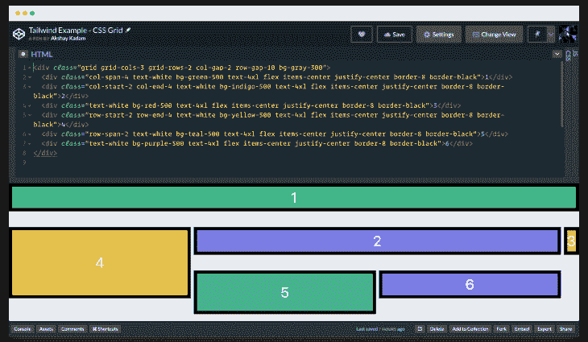

# Tailwind 1 . 2 . 0 的新特性:新特性和新增内容

> 原文：<https://blog.logrocket.com/whats-new-in-tailwind-v1-2-0-new-features-and-additions/>

在这篇文章中，我们将分析顺风最新版本 1.2.0 中的新特性。

Tailwind 的新版本有一些令人兴奋的新特性，比如过渡支持、转换支持和 CSS 网格支持。

也有一些小的补充，我们将进入下面。

## 什么是顺风 CSS？

据[官网](https://tailwindcss.com/):

> Tailwind CSS 是一个实用至上的 CSS 框架，用于快速构建定制设计。这是一个高度可定制的低级 CSS 框架，它为您提供了构建定制设计所需的所有构件，而没有任何令人讨厌的固执己见的风格。

大多数 CSS 框架做的太多了。

它们带有一组预构建的组件，如按钮、卡片、提醒、导航条、输入和表单，这些组件看起来都差不多。

它们在每个网站上都有相同的外观和感觉。定制它们也很麻烦。

那才是顺风真正发光的地方。

Tailwind CSS 提供了底层的工具组件，允许你以一种更令人愉快的方式设计你的站点。

他们通过提供定制的 CSS 类名来做到这一点，这样你不用写一行 CSS 就可以通过写 HTML 来设计你的整个网站。

由于 Tailwind 没有预先构建的组件，您可以通过定制设计来满足客户的需求和偏好，从而轻松脱颖而出。

真的，你可以把它想象成[明天的自举](https://blog.logrocket.com/tailwind-css-is-it-tomorrows-bootstrap-ebe560f9d00b/)。

让我们来看看 Tailwind 最新版本中最激动人心的特性。

### 装置

您可以通过键入以下命令来安装最新版本的 Tailwind(在撰写本文时为 1.2.0 版):

```
$ npm install tailwindcss
```

### 过渡支持

现在，您可以使用 Tailwind CSS 执行 CSS 过渡。它包括用于设置以下属性的实用程序:

*   `transition-property`
*   `transition-timing-function`
*   `transition-duration`

默认情况下，会生成以下实用程序:

```
.transition-none {
  transition-property: none !important;
}

.transition-all {
  transition-property: all !important;
}

.transition {
  transition-property: background-color, border-color, color, fill, stroke, opacity, box-shadow, transform !important;
}

.transition-colors {
  transition-property: background-color, border-color, color, fill, stroke !important;
}

.transition-opacity {
  transition-property: opacity !important;
}

.transition-shadow {
  transition-property: box-shadow !important;
}

.transition-transform {
  transition-property: transform !important;
}

.ease-linear {
  transition-timing-function: linear !important;
}

.ease-in {
  transition-timing-function: cubic-bezier(0.4, 0, 1, 1) !important;
}

.ease-out {
  transition-timing-function: cubic-bezier(0, 0, 0.2, 1) !important;
}

.ease-in-out {
  transition-timing-function: cubic-bezier(0.4, 0, 0.2, 1) !important;
}

.duration-75 {
  transition-duration: 75ms !important;
}

.duration-100 {
  transition-duration: 100ms !important;
}

.duration-150 {
  transition-duration: 150ms !important;
}

.duration-200 {
  transition-duration: 200ms !important;
}

.duration-300 {
  transition-duration: 300ms !important;
}

.duration-500 {
  transition-duration: 500ms !important;
}

.duration-700 {
  transition-duration: 700ms !important;
}

.duration-1000 {
  transition-duration: 1000ms !important;
}
```

我们来创造一个会慢慢消失的`button`。

为此，我们首先需要默认设置`opacity`为`1`。当用户悬停在它上面时，`opacity`应该被设置为`0`。

```
<div class="min-h-screen flex justify-around items-center">

 <button
  class="transition-opacity duration-1000 ease-out opacity-100 hover:opacity-0 bg-pink-500 text-white font-bold py-2 px-4 rounded-lg">
  Vanish Slowly 💨
 </button>

</div>
```


外部`div`确保`button`保持在中心。

里面的`button`有很多类。

重要的部分是`transition-opacity duration-1000 ease-out opacity-100 hover:opacity-0`。

其余的类是为了样式的目的。

让我们来分解这些类:`transition-opacity duration-1000 ease-out opacity-100 hover:opacity-0`。

首先，我们将使用`opacity-100`类将`opacity`设置为`1`。

在`hover`上，我们通过使用`opacity-0`类将`opacity`设置为`0`。

* * *

### 更多来自 LogRocket 的精彩文章:

* * *

然后我们将使用`transition-opacity`类来允许转换发生在`opacity`上。`transition-opacity`映射到 CSS 属性`transition-property: opacity;`。

稍后，我们将查看`ease-out`类，它允许我们执行`ease-out`动画。

最后，我们用`duration-1000`让动画为`1000ms`或`1s`表演。

您可以查看下面的现场演示:

> 添加外部样式表/笔此处添加的任何 URL 都将按顺序添加，并放在编辑器中的 CSS 之前。通过使用其 URL 和适当的 URL 扩展名，您可以使用另一个笔中的 CSS。JavaScript 预处理器巴贝尔包括 JSX 处理。

转换支持

## 现在支持 CSS Transform，它包括缩放、旋转、平移和倾斜元素的工具。

它包括对以下属性的支持:

`transform`

*   `transform-origin`
*   以及下列转换函数:

`scale`

*   `rotate`
*   `translateX`
*   `translateY`
*   v1.2.0 中提供的新的`transform`实用程序充当了一个“切换”⸺，您需要添加该类来启用元素上的转换。就其本身而言，它实际上不应用任何变换。

您可以通过为您想要应用的变换类型堆叠额外的实用程序来应用变换，如`scale-50`将元素缩放到其大小的 50%,或`rotate-90`将其旋转 90 度。

要指定`transform-origin`，请使用`origin-{side}`实用程序:

顺风包括`top`、`top-right`、`right`、`bottom-right`、`bottom`、`bottom-left`、`left`、`top-left`、`center`开箱即用，可以在你的主题中使用`transformOrigin`属性进行配置。

```
<div class="transform origin-top-left">...</div>
```

`translate`使用顺风的`spacing`刻度，包括`0`、`0.25rem`、`0.5rem`、`0.75rem`、`1rem`、`1.25rem`、`1.5rem`、`2rem`、`2.5rem`、`3rem`、`4rem`、`5rem`、`6rem`、`8rem`、`10rem`、`12rem`、`14rem`、`16rem`。

它可以在你的主题中使用`translate`键进行配置。

`rotate`包括`0deg`、`45deg`、`90deg`、`180deg`(加上负面版本)，可以在你的主题中使用`rotate`键进行配置。

`scale`包括`0`、`0.5`、`0.75`、`0.9`、`0.95`、`1`、`1.05`、`1.1`、`1.25`、`1.5`。

它可以在你的主题中使用`scale`键来定制。

让我们创建一个执行类似于`rotation`、`scaling`、`translation`和`skewing`的转换的`button`。


```
<div class="min-h-screen flex flex-wrap justify-around items-center">

 <button
  class="transform hover:rotate-180 transition duration-500 ease-in-out bg-indigo-600 text-white font-bold py-2 px-4 rounded-lg">
  Rotate Me 180°
 </button>

 <button
  class="transform hover:scale-150 transition duration-500 ease-in-out bg-orange-600 text-white font-bold py-2 px-4 rounded-lg">
  Scale Me 1.5×
 </button>

 <button
  class="transform hover:translate-x-20 hover:translate-y-20 transition duration-500 ease-in-out bg-teal-400 text-white font-bold py-2 px-4 rounded-lg">
  Translate Me 5rem
 </button>

 <button
  class="transform hover:skew-x-12 hover:skew-y-12 transition duration-500 ease-in-out bg-red-400 text-white font-bold py-2 px-4 rounded-lg">
  Skew Me 12°
 </button>

</div>
```

外部`div`确保所有按钮居中。

现在我们来分解一下按钮。

注意，`transition`类之后的一切都是为了样式和动画，所以我们将只关注`transition`类之前的类。

另外，`transform`类将作为一个“开关”来启用所有的转换。

第一个`button`悬停时旋转`180°`。`hover:rotate-180`类允许我们这样做。

第二个`button`在悬停时缩放`1.5×`。

这里，我们应用`hover:scale-150`类来实现这个结果。

第三个`button`在 x 轴和 y 轴上平移`5rem`。

`hover:translate-x-20`和`hover:translate-y-20`共同帮助我们实现目标。

第四个`button`向两个方向倾斜`12°`。

我们通过组合应用类`hover:skew-x-12`和`hover:skew-y-12`来实现这个结果。

现场演示如下:

没有描述

> No Description

CSS 网格支持

## 在我看来，Tailwind v1.2.0 中最有趣的特性是 CSS 网格支持。

它向`display`核心插件添加一个新的`grid`值。它还为以下 CSS 属性提供了新的核心插件:

`grid-template-columns`

*   `grid-column-gap`
*   `grid-column`
*   `grid-column-start`
*   `grid-column-end`
*   `grid-template-rows`
*   `grid-row-gap`
*   `grid-row`
*   `grid-row-start`
*   `grid-row-end`
*   `grid-template-columns`

### 这些实用程序采用`grid-cols-{key}`的形式，其中`key`是在你的主题配置中的`gridTemplateColumns`键下配置的任何值。

默认情况下，使用`gridTemplateColumns`键，Tailwind 提供必要的值来创建最多 12 列的基本等宽柱网:

上面的内容被翻译成类别`grid-cols-1`、`grid-cols-2`、`grid-cols-3`、`grid-cols-4`、`grid-cols-5`、`grid-cols-6`、`grid-cols-7`、`grid-cols-8`、`grid-cols-9`、`grid-cols-10`、`grid-cols-11`和`grid-cols-12`。

```
gridTemplateColumns: {
  none: 'none',
  '1': 'repeat(1, 1fr)',
  '2': 'repeat(2, 1fr)',
  '3': 'repeat(3, 1fr)',
  '4': 'repeat(4, 1fr)',
  '5': 'repeat(5, 1fr)',
  '6': 'repeat(6, 1fr)',
  '7': 'repeat(7, 1fr)',
  '8': 'repeat(8, 1fr)',
  '9': 'repeat(9, 1fr)',
  '10': 'repeat(10, 1fr)',
  '11': 'repeat(11, 1fr)',
  '12': 'repeat(12, 1fr)',
}
```

您可以通过将`gridTemplateColumns`编辑成以下内容来编写自定义类`grid-cols-header`:

默认情况下，基本的 12 列网格可用。如果这不能满足您的需要，您可以创建如上所示的定制类。

```
gridTemplateColumns: {
  'header': '150px minmax(min-content, 500px) 1fr',
}
```

`grid-column-gap`

### 这些实用程序采用`col-gap-{key}`的形式，其中`key`是在你的主题配置中的`gridColumnGap`键下配置的任何值。

默认使用`spacing`配置，包括`0`、`0.25rem`、`0.5rem`、`0.75rem`、`1rem`、`1.25rem`、`1.5rem`、`2rem`、`2.5rem`、`3rem`、`4rem`、`5rem`、`6rem`、`8rem`、`10rem`、`12rem`、`14rem`和`16rem`。

`grid-column`

### 这些实用程序采用`col-span-{key}`的形式，其中`key`是在你的主题配置中的`gridColumn`键下配置的任何值。

默认情况下，Tailwind 为跨列提供以下值:

您可以通过将`gridColumn`编辑成以下内容来编写自定义类`col-settings-icon`:

```
gridColumn: {
  auto: 'auto',
  'span-1': 'span 1 / span 1',
  'span-2': 'span 2 / span 2',
  'span-3': 'span 3 / span 3',
  'span-4': 'span 4 / span 4',
  'span-5': 'span 5 / span 5',
  'span-6': 'span 6 / span 6',
  'span-7': 'span 7 / span 7',
  'span-8': 'span 8 / span 8',
  'span-9': 'span 9 / span 9',
  'span-10': 'span 10 / span 10',
  'span-11': 'span 11 / span 11',
  'span-12': 'span 12 / span 12',
}
```

如果您想从网格线`1`开始一列，同时跨越到`4`列，您可以通过使用以下内容轻松实现:

```
gridColumn: {
  'settings-icon': 'settings',
}
```

如果您想在网格线`4`处结束该列，同时将它扩展到`2`列，您可以使用以下方法轻松完成:

```
<div class="col-span-4 col-start-1"></div>
```

`grid-column-start`

```
<div class="col-span-2 col-end-4"></div>
```

### 这些实用程序采用`col-start-{key}`的形式，其中`key`是在你的主题配置中的`gridColumnStart`键下配置的任何值。

默认情况下，顺风使用`gridColumnStart`键提供以下值:

`grid-column-end`

```
gridColumnStart: {
  auto: 'auto',
  '1': '1',
  '2': '2',
  '3': '3',
  '4': '4',
  '5': '5',
  '6': '6',
  '7': '7',
  '8': '8',
  '9': '9',
  '10': '10',
  '11': '11',
  '12': '12',
  '13': '13',
}
```

### 这些实用程序采用`col-end-{key}`的形式，其中`key`是在你的主题配置中的`gridColumnEnd`键下配置的任何值。

默认情况下，顺风使用`gridColumnEd`键提供以下值:

`grid-template-rows`

```
gridColumnEnd: {
  auto: 'auto',
  '1': '1',
  '2': '2',
  '3': '3',
  '4': '4',
  '5': '5',
  '6': '6',
  '7': '7',
  '8': '8',
  '9': '9',
  '10': '10',
  '11': '11',
  '12': '12',
  '13': '13',
}
```

### 这些实用程序采用`grid-rows-{key}`的形式，其中`key`是在你的主题配置中的`gridTemplateRows`键下配置的任何值。

默认情况下，使用`gridTemplateRows`键，Tailwind 提供必要的值来创建具有多达六行的基本等高行网格:

`grid-row-gap`

```
gridTemplateRows: {
  none: 'none',
  '1': 'repeat(1, minmax(0, 1fr))',
  '2': 'repeat(2, minmax(0, 1fr))',
  '3': 'repeat(3, minmax(0, 1fr))',
  '4': 'repeat(4, minmax(0, 1fr))',
  '5': 'repeat(5, minmax(0, 1fr))',
  '6': 'repeat(6, minmax(0, 1fr))',
}
```

### 这些实用程序采用`row-gap-{key}`的形式，其中`key`是在你的主题配置中的`gridRowGap`键下配置的任何值。

默认使用`spacing`配置，包括`0`、`0.25rem`、`0.5rem`、`0.75rem`、`1rem`、`1.25rem`、`1.5rem`、`2rem`、`2.5rem`、`3rem`、`4rem`、`5rem`、`6rem`、`8rem`、`10rem`、`12rem`、`14rem`和`16rem`。

`grid-row`

### 这些实用程序采用`row-span-{key}`的形式，其中`key`是在你的主题配置中的`gridRow`键下配置的任何值。

默认情况下，Tailwind 为跨行提供以下值:

`grid-row-start`

```
gridRow: {
  auto: 'auto',
  'span-1': 'span 1 / span 1',
  'span-2': 'span 2 / span 2',
  'span-3': 'span 3 / span 3',
  'span-4': 'span 4 / span 4',
  'span-5': 'span 5 / span 5',
  'span-6': 'span 6 / span 6',
}
```

### 这些实用程序采用`row-start-{key}`的形式，其中`key`是在你的主题配置中的`gridRowStart`键下配置的任何值。

默认情况下，顺风使用`gridRowStart`键提供以下值:

`grid-row-end`

```
gridRowStart: {
  auto: 'auto',
  '1': '1',
  '2': '2',
  '3': '3',
  '4': '4',
  '5': '5',
  '6': '6',
  '7': '7',
}
```

### 这些实用程序采用`row-end-{key}`的形式，其中`key`是在你的主题配置中的`gridRowEnd`键下配置的任何值。

默认情况下，顺风使用`gridRowEnd`键提供以下值:

注意，Tailwind 的 CSS 网格与 IE11 不兼容。对于在旧浏览器中构建网格布局，建议使用 Flexbox 而不是 CSS Grid，或者编写一些 CSS 来使用 CSS Grid。

```
gridRowEnd: {
  auto: 'auto',
  '1': '1',
  '2': '2',
  '3': '3',
  '4': '4',
  '5': '5',
  '6': '6',
  '7': '7',
}
```

> 让我们使用上面的所有属性来创建一个漂亮的 CSS 网格布局:



```
<div class="grid grid-cols-3 grid-rows-2 col-gap-2 row-gap-10 bg-gray-300">
    <div class="col-span-4 text-white bg-green-500 text-4xl flex items-center justify-center border-8 border-black">1</div>
    <div class="col-start-2 col-end-4 text-white bg-indigo-500 text-4xl flex items-center justify-center border-8 border-black">2</div>
    <div class="text-white bg-red-500 text-4xl flex items-center justify-center border-8 border-black">3</div>
    <div class="row-start-2 row-end-4 text-white bg-yellow-500 text-4xl flex items-center justify-center border-8 border-black">4</div>
    <div class="row-span-2 text-white bg-teal-500 text-4xl flex items-center justify-center border-8 border-black">5</div>
    <div class="text-white bg-purple-500 text-4xl flex items-center justify-center border-8 border-black">6</div>
</div>
```

我们使用`.grid`创建一个 CSS 网格。它有 3 列和 2 行，分别由`.grid-cols.3`和`.grid-rows-2`指定。

两列之间的间隙是由`.gap-2`指定的`0.5rem`，两行之间的间隙是由`.gap-10`指定的`2.5rem`。

网格中的每个`div`，即网格项目，都有一些类名，用于样式和对齐。

`text-white`之后的一切都是为了样式和对齐，所以让我们考虑它之前的一切。

第一个`div`横跨 4 列，感谢`.col-span-4`。

记住，网格只允许有三列，由`.grid-cols-3`指定，所以第一个`div`创建一个隐式列。

这可以从第三个`div`的位置看出。

第二个`div`开始于第二列线，结束于第四列线，分别由`.col-start-2`和`.col-end-4`指定。

第二个`div`一结束，第三个`div`就开始。这意味着它被放在由第一个`div`创建的隐式列中。

第四个`div`开始于第二行，结束于第四行，分别由`.row-start-2`和`.row-end-4`指定。

由于在第二个`div`之前有空间，它在那里调整自己。这就是网格的力量。

第五个`div`跨越两行，由`.row-span-2`指定。

第五个`div`一结束，第六个`div`就开始。

现场演示如下:

没有描述

> No Description

其他功能

## 以上是 Tailwind 1 . 2 . 0 版本中添加的主要特性。

它还包括一些其他的小功能，下面会解释。

新的`max-w-{screen}`实用程序

### 顺风的默认`max-width`刻度现在包含了匹配断点的值。它采取了`max-w-screen-{breakpointName}`的形式。

这些可以应用如下:

新的`max-w-none`实用程序

```
<div class="max-w-screen-sm">...</div>
<div class="max-w-screen-md">...</div>
<div class="max-w-screen-xl">...</div>
```

### 顺风的默认`max-width`刻度现在包含了一个`none`值。

它有助于消除元素可能有的任何`max-width`约束。

顺风的默认`border-radius`刻度现在包括一个`md`值，用于给元素一个`6px`边框半径。

```
<div class="max-w-lg xl:max-w-none">...</div>
```

新的`shadow-sm`和`shadow-xs`实用程序

```
<div class="rounded-md"></div>
```

### 顺风的默认`box-shadow`比例现在包括一个`sm`值，用于给元素一个非常微妙的小阴影(`box-shadow: 0 1px 2px 0 rgba(0, 0, 0, 0.05) !important;`)。

这对于给按钮或输入一点深度来说是很棒的。

顺风的默认`box-shadow`比例还包括一个`xs`值，用于给元素一个非常微妙的轮廓阴影(`box-shadow: 0 0 0 1px rgba(0, 0, 0, 0.05) !important;`)。

```
<div class="shadow-sm">...</div>
```

这比`sm`还要小。当我们需要从背景中获得一点点额外的区别时，就会用到它。

新的`stroke-width`实用程序

```
<div class="shadow-xs">...</div>
```

### Tailwind 现在包括用于控制 SVG 元素的`stroke-width`属性的实用程序:

它包含从`0`到`4`的默认值，没有任何单位。

```
<svg class="stroke-4">...</svg>
```

新的固定`line-height`实用程序

### 除了现有的相关`line-height`实用程序之外，Tailwind 现在还包括一组合理的固定值`line-height`实用程序。

这些实用程序采用`leading-{key}`的形式，其中`key`是在你的主题配置中的`lineHeight`键下配置的任何值。

它目前包括(包括相对值和绝对值):

表格元素的新显示实用程序

```
lineHeight: {
  none: '1',
  tight: '1.25',
  snug: '1.375',
  normal: '1.5',
  relaxed: '1.625',
  loose: '2',
  '3': '.75rem',
  '4': '1rem',
  '5': '1.25rem',
  '6': '1.5rem',
  '7': '1.75rem',
  '8': '2rem',
  '9': '2.25rem',
  '10': '2.5rem',
}
```

### Tailwind 现在包括一套完整的表格元素显示实用程序:

由`table-caption`、`table-column`、`table-column-group`、`table-footer-group`、`table-header-group`和`table-row-group`组成。

```
<div class="table-header-group">...</div>
```

新的`box-sizing`实用程序

### Tailwind 现在包括用于设置元素的`box-sizing`属性的`box-border`和`box-content`实用程序。

因为 Tailwind 覆盖了基本样式中的`box-sizing`，所以提供这些实用程序来帮助依赖于默认浏览器值`box-sizing: content-box;`的第三方库。

```
<div class="box-content">...</div>
```

新的透明工具

### Tailwind 现在包括使用`clear`属性清除浮动的`clear-left`、`clear-right`和`clear-both`实用程序。

结论

```
<div class="clear-left">...</div>
```

## 在本教程中，我们了解了 Tailwind 的 [v1.2.0 版本中引入的新特性。](https://github.com/tailwindcss/tailwindcss/releases/tag/v1.2.0)

我们研究了过渡支持、转换支持和 CSS 网格支持。

我们还研究了这个版本中的新增内容。这可能是 Tailwind 历史上最激动人心的功能发布。

Tailwind 是最好的基于实用程序的框架之一。

[文档](https://tailwindcss.com/)很优秀。学习顺风的资源有[文本](https://tailwindcss.com/docs/)和[视频](https://www.youtube.com/adamwathan)两种格式。

《顺风》的创作者亚当·瓦森甚至有一部很棒的《T2》系列视频《T3》，从头开始教《顺风》。他还在 [Twitch](https://www.twitch.tv/adamwathan/) 上直播。

如果你还没有尝试过 Tailwind，我强烈推荐你尝试一下。

它一开始看起来确实很奇怪，但是一旦你使用它，你就不能再写普通的 CSS 了。

顺风让设计网站变得有趣。

你的前端是否占用了用户的 CPU？

## 随着 web 前端变得越来越复杂，资源贪婪的特性对浏览器的要求越来越高。如果您对监控和跟踪生产环境中所有用户的客户端 CPU 使用、内存使用等感兴趣，

.

[try LogRocket](https://lp.logrocket.com/blg/css-signup)

LogRocket 就像是网络和移动应用的 DVR，记录你的网络应用或网站上发生的一切。您可以汇总和报告关键的前端性能指标，重放用户会话和应用程序状态，记录网络请求，并自动显示所有错误，而不是猜测问题发生的原因。

[](https://lp.logrocket.com/blg/css-signup)[https://logrocket.com/signup/](https://lp.logrocket.com/blg/css-signup)

现代化您调试 web 和移动应用的方式— [开始免费监控](https://lp.logrocket.com/blg/css-signup)。

Modernize how you debug web and mobile apps — [Start monitoring for free](https://lp.logrocket.com/blg/css-signup).