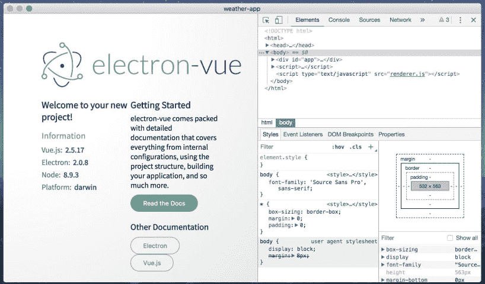

# Vuex 3.1.1 中的新特性- LogRocket 博客

> 原文：<https://blog.logrocket.com/whats-new-in-vuex-3-1-1-d796b0c791bf/>

JavaScript 已经成为一个巨大的、多样化的、快速增长的编程世界的母语。一旦一个框架或库得到更新，社区就开始处理与之相关的项目——vue . js 及其周围的项目也是如此。

Vuex 因以简单直接的方式为州政府提供服务而赢得了声誉。然而，它仍然遵循其著名的父代的路径，这意味着我们有时会在已经使用最新版本 Vue.js 的环境中看到某些功能的延迟交付。

例如，原生移动应用遍布各处。许多 JavaScript 项目都有相应的库、框架等。来处理 app 开发。

Vue 也是一样: [NativeScript-Vue](https://nativescript-vue.org/) 是一个 [NativeScript](https://www.nativescript.org/) 插件，允许你使用 Vue 来制作你的移动应用。Vuex 还可以与 NativeScript-Vue 集成，用于处理组件的状态机，但它缺乏良好的调试机制。

Vuex 的 3.1.1 版本已经发布，旨在解决这个问题。除了支持在 NativeScript 应用程序中调试 Vuex，该更新还提供了其他改进，如包含 jsDelivr CDN npm 包，并修复了模块注册的内存泄漏等问题。这个版本没有突破性的变化，所以你应该放心升级你的项目。

您可以阅读 [changelog](https://github.com/vuejs/vuex/releases/tag/v3.1.1) 了解更多关于这些的信息，以及 PRs 和贡献者提交。让我们仔细看看。

### 支持在 NativeScript 应用程序中调试 Vuex

[Vue-remote-devtools](https://github.com/vuejs/vue-devtools/tree/dev/shells/electron) (基于[电子](https://electronjs.org/))是官方的 Vue devtools 应用程序，用于使用 Vue.js 进行 NativeScript 应用程序开发。它基于 Node.js 和 Chromium，允许您轻松调试您的 HTML/CSS/JS 应用程序(在本例中为 Vue):



*Application example.*

另一方面， [vue-devtools](https://github.com/vuejs/vue-devtools) ，一个用于调试基于 web 的 vue 应用程序的浏览器扩展，以与 Vuex 及其状态管理库无缝集成而闻名，它允许您可视化以前的状态并在它们之间切换。这对于我们所说的时间旅行调试(即，您可以在状态之间来回切换)来说是非常棒的。

然而，对于 NativeScript 项目，在这个版本之前是不可能的。现在，[您可以在非浏览器环境中检查 Vuex 状态](https://github.com/vuejs/vuex/pull/1404)。如果你不太熟悉 Vuex 状态管理，你可以[在这里](https://vuex.vuejs.org/guide/state.html)了解更多。

### 为浏览器构建的新的 minifier 和 ES 模块

在 [ES 模块](https://hacks.mozilla.org/2018/03/es-modules-a-cartoon-deep-dive/)出现之前，开发人员通常会将 JavaScript 代码导入 HTML 页面，如下所示:

```
<script src="https://some-cdn.com/vue.js"></script>
<script>
  new Vue();
</script>
```

众所周知，这种导入 JS 库的经典方法也有缺点。每次进口的顺序必须正确；如果顺序不正确，一个接一个的脚本就找不到依赖关系。它还向全局名称空间公开对象和函数，因此任何人都可以访问和修改它们。您可能会错误地导入文件两次，这样的例子不胜枚举。

Vue 本身就面临这个问题。在 2.6 版本之前，它的构建过程中没有专门用于在浏览器中加载 Vue 模块的步骤。所以，这样的代码是行不通的:

```
<script type=”module” src=”vue.esm.js”></script>
```

最后，从 2.6 版本开始——因为现在每个人都在浏览器中使用 es 模块——Vue 与这个构建步骤捆绑在一起。你可以在这里阅读更多关于 Vue 如何工作的信息。

反过来，Vuex 也面临着同样的问题，这个问题在 3.1.1 版本中已经[修复。如果您想将 Vuex 直接导入浏览器，只需使用:](https://github.com/vuejs/vuex/pull/1533)

```
<script type=”module” src=”vuex.esm.browser.js”></script>
// Or below for the min version
<script type=”module” src=”vuex.esm.browser.min.js”></script>
```

此外，这个版本还包括一个新的迷你器， [Terser](https://github.com/terser-js/terser) 。这是因为之前的 minifier UglifyJS 是[不再维护](https://github.com/mishoo/UglifyJS2/issues/3156#issuecomment-392943058)，只支持 ECMAScript 5，而 Terser 支持 ES6+。

实际上，对于开发人员来说，这不会改变任何事情。另一方面，因为 Terser 是 UglifyJS 的一个分支，所以它保持了对 API 和 CLI 兼容 uglify-es 和[【电子邮件保护】](/cdn-cgi/l/email-protection)的支持

### 支持 jsDelivr

JsDelivr 确实比大多数 cdn 更快。[现在](https://github.com/vuejs/vuex/pull/1496)，你也可以[从这个 CDN](https://cdn.jsdelivr.net/npm/vuex@3.1.1/dist/vuex.js) 导入 Vuex。

### 使用 register module/unregister module 时的内存泄漏修复

[模块](https://vuex.vuejs.org/guide/modules.html)是将我们的商店分成更小、更可控的部分的好方法，因为整个状态包含在 Vuex 的一个大对象中。为了在商店中添加或删除模块，我们只需分别调用`store.registerModule`或`store.unregisterModule`。

然而，在大型应用程序中控制如何管理浏览器的堆内存可能有点棘手。这里有一个已知的问题,涉及到一个应用程序添加数百个模块，然后立即取消注册，这导致堆内存没有被清除。你可以想象接下来会发生什么…内存泄漏。

[修复](https://github.com/vuejs/vuex/pull/1508)包括简单地对函数`resetStoreVM`中的`oldVm`实例进行垃圾收集，该函数负责在剧烈活动后恢复虚拟机。

### 结论

你可以在这里找到[所有的变化，亲自看看 Vuex 在最新版本和之前的版本中有什么改进。或者，如果你想了解更多关于 Vuex 的信息，考虑深入了解他们的官方](https://github.com/vuejs/vuex/releases)[入门指南](https://vuex.vuejs.org/guide/)。

社区是任何开源项目成功的关键——你也是其中的一部分。如果您发现最新改进有任何问题，[请前往报告](https://github.com/vuejs/vuex/issues)。

如果您尚未升级到最新版本，以下命令将帮助您升级:

```
npm install — save — save-exact [email protected]
// or via yarn
yarn add — exact [email protected]
```

好好学习！

## 像用户一样体验您的 Vue 应用

调试 Vue.js 应用程序可能会很困难，尤其是当用户会话期间有几十个(如果不是几百个)突变时。如果您对监视和跟踪生产中所有用户的 Vue 突变感兴趣，

[try LogRocket](https://lp.logrocket.com/blg/vue-signup)

.

[](https://lp.logrocket.com/blg/vue-signup)[https://logrocket.com/signup/](https://lp.logrocket.com/blg/vue-signup)

LogRocket 就像是网络和移动应用程序的 DVR，记录你的 Vue 应用程序中发生的一切，包括网络请求、JavaScript 错误、性能问题等等。您可以汇总并报告问题发生时应用程序的状态，而不是猜测问题发生的原因。

LogRocket Vuex 插件将 Vuex 突变记录到 LogRocket 控制台，为您提供导致错误的环境，以及出现问题时应用程序的状态。

现代化您调试 Vue 应用的方式- [开始免费监控](https://lp.logrocket.com/blg/vue-signup)。

* * *