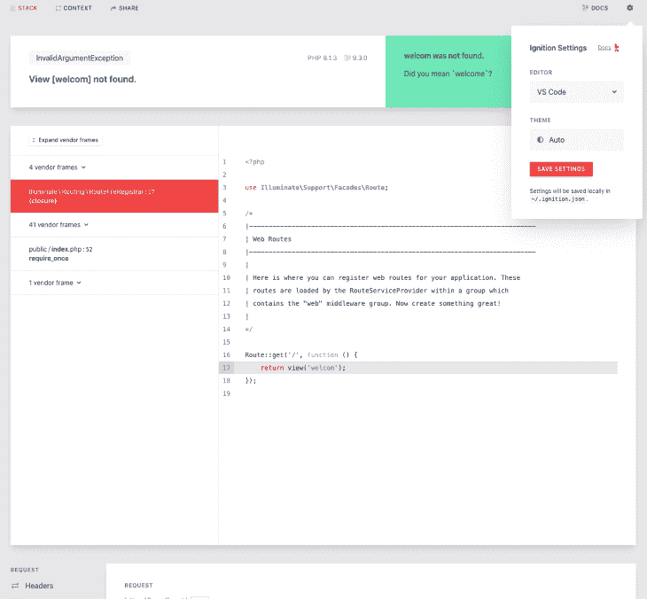
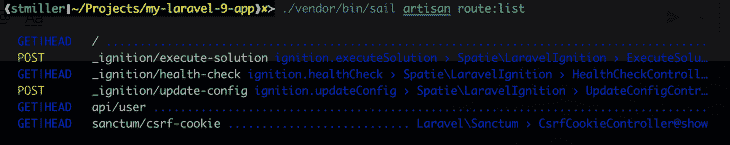
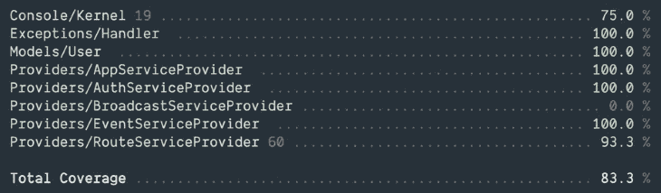

# Laravel 9 有什么新功能？

> 原文：<https://blog.logrocket.com/whats-new-laravel-9/>

Laravel 已经统治 PHP web 框架领域很多年了。如果你建立定制的 PHP 网站，你可能使用过这个框架一两次，并且知道每六个月就会有一个 Laravel 更新。

Laravel v9 于 2022 年 2 月 8 日发布，它提供了大量的新功能。

## 拉勒维尔的释放历史

虽然 Laravel 过去的版本每六个月发布一次，但新的发布周期将是每 12 个月一次，这确保了该版本与 Symfony(Laravel 在幕后使用)同步，并允许开发团队有更多的时间来修复与 Symfony 框架交互时出现的任何错误。

以下是 Laravel 最新和即将发布的产品:

| 版本 | PHP 版本 | 释放；排放；发布 | 错误修复，直到 | 安全修复，直到 |
| --- | --- | --- | --- | --- |
| 6 (LTS) | 7.2 – 8.0 | 2019 年 9 月 3 日 | 2022 年 1 月 25 日 | 2022 年 9 月 6 日 |
| 七 | 7.2 – 8.0 | 2020 年 3 月 3 日 | 2020 年 10 月 6 日 | 2021 年 3 月 3 日 |
| 8 | 7.3 – 8.1 | 2020 年 9 月 8 日 | 2022 年 7 月 26 日 | 2023 年 1 月 24 日 |
| 9 (LTS) | 8.0 – 8.1 | 2022 年 2 月 8 日 | 2024 年 2 月 8 日 | 2025 年 2 月 8 日 |
| 10 | 8.0 – 8.1 | 2023 年 2 月 7 日 | 2024 年 8 月 7 日 | 2025 年 2 月 7 日 |

您可以看到版本 9 是新的长期支持版本，取代了版本 6，到今年年底将不再支持版本 6。截止到这个月，v7 已经完全不支持了，所以如果你用的是 Laravel 6 或者 7，是时候升级到 v9 了。

## Laravel 9 有什么新功能？

在本文中，我们将介绍 Laravel 9 中当前的主要变化，但是希望很快看到更多的特性和变化。

### PHP 8 是最低要求

Laravel 用的是 Symfony 6，至少需要 [PHP 8](https://www.php.net/releases/8.0/en.php) 。PHP 8 附带了新的实时(JIT)编译器、 [OPcache 扩展](https://www.php.net/manual/en/book.opcache.php)、命名参数等等。

### Symfony Mailer 取代了 Swift Mailer

在 Laravel 使用多年的 Swift Mailer 正在被移除，将不再维护。在 Laravel v9 和未来的版本中，你必须使用 [Symfony Mailer](https://laravel.com/docs/9.x/mail) 。如果您正在升级现有的 Laravel 实例，请查看[升级指南](https://laravel.com/docs/9.x/upgrade#symfony-mailer)。

### 控制器路由组

您现在可以使用 Laravel 9 `Route`类的`controller`方法来定义将用于路由组中每条路由的控制器。

```
use App\Http\Controllers\PostController;

Route::controller(PostController::class)->group(function () {
    Route::get('/post/{id}', 'show');
    Route::post('/post', 'store');
});

```

### 雄辩术中更好的访问器和变异器

在 Laravel 9 中，您现在可以使用`Illuminate\Database\Eloquent\Casts\Attribute`来声明带有单个无前缀术语的模型前缀。使用一个方法调用，您现在可以获取和设置属性。

```
use Illuminate\Database\Eloquent\Casts\Attribute;

public function username(): Attribute
{
  return new Attribute(
    get: fn ($value) => strtoupper($value),
    set: fn ($value) => $value,
  );
}

```

### `Fulltext`索引和 where 子句

如果您在 Laravel 应用程序中使用 MySQL 或 [PostgreSQL](https://blog.logrocket.com/tag/postgresql/) ,那么现在您可以在迁移文件中的列定义上使用`fulltext`方法来生成全文索引。

```
$table->text('content')->fullText();

```

然后，可以使用`whereFullText`和`orWhereFullText`方法将全文 where 子句添加到查询中。

```
$laravelPosts= DB::table('post')
           ->whereFullText('content', 'laravel')
           ->get();

```

### 新的 Scout 数据库引擎

Laravel v9 配备了新的 Laravel Scout 数据库引擎。它为雄辩的模型提供了全文搜索功能。它使用模型观察器使搜索索引与有说服力的记录保持同步，对于使用中小型数据库或工作负载较轻的应用程序来说，这是一个不错的选择。该引擎在从数据库中筛选结果时将使用“where-like”子句。

要使用它，只需将`Laravel\Scout\Searchable`特征添加到模型中:

```
<?php

namespace App\Models;

use Illuminate\Database\Eloquent\Model;
use Laravel\Scout\Searchable;

class Article extends Model
{
    use Searchable;
}

```

### 带有 Next.js 的 Breeze API

Laravel v9 在其 Breeze starter kit 中包含了一个免费的 [Next.js](https://blog.logrocket.com/tag/nextjs/) 前端实现。通过使用这个初学者工具包搭建，您可以构建 Laravel 应用程序，该应用程序使用 Laravel Sanctum 身份验证作为后端和 JavaScript 前端。

### 嵌入式刀片渲染

如果您需要将原始刀片模板转换为有效的 HTML，现在可以使用内嵌刀片渲染来完成。

```
use Illuminate\Support\Facades\Blade;

return Blade::render('Hello, {{ $name }}', ['name' => 'Stephan Miller']);

```

### 新的查询生成器界面

新的查询生成器界面使输入提示成为可能。在过去，很难判断您是在处理`Query\Builder`、`Eloquent\Builder`还是`Eloquent\Relation`，每当出现类型错误时，让开发人员猜测应该修复什么。

```
return Model::query()
  ->whereNotExists(function($query) {
    // $query is a Query\Builder
  })
  ->whereHas('relation', function($query) {
    // $query is an Eloquent\Builder
  })
  ->with('relation', function($query) {
    // $query is an Eloquent\Relation
  });

```

### 带有枚举的隐式路由绑定

现在，您可以在 Laravel 路由定义中使用 PHP enum 键入提示。然后，Laravel 将仅在路由包含 URI 中的有效 enum 时调用该路由，并且如果没有找到 enum 之一，将返回 404。

```
enum Fruit: string
{
    case Apple = 'apple';
    case Cherry = 'cherry';
}

```

仅当`{fruit}`路线匹配其中一个枚举时，该路线才会被调用。

```
Route::get('/fruits/{fruit}', function (Fruit $fruit) {
    return $fruit->value;
});

```

### 强制范围路由绑定

Laravel 9 现在可以通过使用约定来猜测父模型的关系名称，自动确定查询的范围，以在路由定义中根据父模型检索嵌套模型。下面是一个使用范围绑定的示例:

```
use App\Models\Article;
use App\Models\User;

Route::get('/users/{user}/articles/{article}', function (User $user, Article $article) {
    return $article;
})->scopeBindings();

```

您还可以在一组路由定义上使用范围绑定。

```
use App\Models\Article;
use App\Models\User;

Route::get('/users/{user}/articles/{article}', function (User $user, Article $article) {
    return $article;
})->scopeBindings();

```

### Bootstrap 5 分页视图

如果您曾经尝试过编写自己的分页代码，您就会知道这并不好玩。Laravel 9 通过 Bootstrap 5 分页视图使在应用程序中添加分页变得简单。

你所要做的就是在你的应用程序的`App\Providers\AppServiceProvider`类的引导方法中包含`Illuminate\Pagination\Paginator`并调用它的`useBootstrapFive`方法。

```
use Illuminate\Pagination\Paginator;

/**
 * Bootstrap any application services.
 *
 * @return void
 */
public function boot()
{
    Paginator::useBootstrapFive();
}

```

### 新帮手

现在 Laravel 正在使用 PHP 8，它的`\Illuminate\Support\Str` facade 将使用 PHP 8 字符串函数，这些函数带有一些新方法，包括`str_contains`、`str_starts_with`和`str_ends_with`。新帮手包括`append`和`snake`。

* * *

### 更多来自 LogRocket 的精彩文章:

* * *

```
$string = str('Bob')->append(' Smith'); // 'Bob Smith'
$snake = str()->snake('LaravelIsGreat'); // 'laravel_is_great'

```

添加的另一个助手是`to_route`函数。这个函数为一个指定的路由创建一个重定向 HTTP 响应。您可以使用它从路线和控制器重定向到命名路线。

```
return to_route('posts.show', ['post' => 25]);

```

### 枚举属性转换

在 Laravel 9 中，现在可以将属性值转换为 PHP 枚举。下面是一个在模型中使用强制转换的示例:

```
use App\Enums\UserStatus;

/**
 * The attributes that should be cast.
 *
 * @var array
 */
protected $casts = [
    'status' => UserStatus::class,
];

```

在您的模型中定义了转换之后，该属性将自动转换为枚举或从枚举转换。

```
if ($user->status == UserStatus::optin) {
    $user->status = UserStatus::verified;

    $user->save();
}

```

### 检查并选择刀片指令

我不知道谷歌了多少次，“如何在 Laravel 中设置复选框”Laravel v9 使这变得更加容易。现在您可以使用`@checked`指令将复选框设置为`checked`。如果它评估为真，它将回显`checked`。

```
<input type="checkbox"
        name="optin"
        value="optin"
        @checked(old('optin', $user->optin)) />

```

还有一个类似的`@selected`指令，用于设置 select 中的 selected 选项。

```
<select name="notification">
    @foreach ($notifications as $notification)
        <option value="{{ $notification }}" @selected(old('notification') == $notification)>
            {{ $notification }}
        </option>
    @endforeach
</select>

```

### 更好地验证嵌套数组数据

`Illuminate\Validation\Rule`验证类现在有了一个新的`forEach`方法，该方法接受一个闭包，该闭包将在被验证的数组属性的每次迭代中运行。闭包将返回一个规则数组，分配给数组元素。

```
use App\Rules\HasPermission;
use Illuminate\Support\Facades\Validator;
use Illuminate\Validation\Rule;

$validator = Validator::make($request->all(), [
    'companies.*.id' => Rule::forEach(function ($value, $attribute) {
        return [
            Rule::exists(Company::class, 'id'),
            new HasPermission('manage-company', $value),
        ];
    }),
]);

```

### 套接字 echo 服务器

Laravel 现在附带了 [Soketi echo server](https://soketi.app/) ，这是一个为 Node.js 编写的 Laravel Echo 兼容 WebSocket 服务器，对于喜欢管理自己的 WebSocket 服务器的开发人员来说，它是 Ably 和 Pusher 的开源替代产品。

### 改进的异常页面

Laravel 9 也有一个新的和改进的异常页面，它是从头开始重新设计的。你可以选择亮暗主题，它甚至有一个“在编辑器中打开”的功能。



### 匿名存根迁移

匿名存根迁移现在是执行 Laravel 迁移时的默认行为。这个特性在 Laravel 8.3 中可用，但在 Laravel v9 中是默认的。此功能可防止与迁移类的名称冲突。在这一改变之前，如果重用一个类名，很难从头重新创建一个数据库。现在，你不用担心这个了。

### Artisan 中更好的路线列表

Laravel 已经有了`route:list` Artisan 命令，但它现在在你的应用程序中提供了一个更好的、彩色编码的路线细分。



### Flysystem 3.x

在 Laravel v9 中，Flysystem 从 v1.x 迁移到 v3.x，Flysystem 处理`Storage` facade 提供的所有文件操作功能。您将看到的一些变化是:

*   默认情况下，`put`、`write`和`writeStream`方法现在会覆盖现有文件
*   `put`、`write`和`writeStream`方法不再在写错误时抛出异常
*   如果您试图读取一个不存在的文件，将会返回`null`
*   现在删除一个不存在的文件会返回`true`

### 测试覆盖率

Artisan `test`命令现在有一个`--coverage`选项，它将在 CLI 输出中输出测试覆盖百分比。



### 不再有 server.php 文件

这不是列表中最大的变化，但是您不再需要项目中的`server.php`文件。现在它将包含在框架的其余部分中。

## 开始使用 Laravel v9

如果你准备尝试 Laravel 的新版本，有几种方法可以做到。如果您已经安装了 composer，您可以用它创建一个新的 Laravel 项目。

```
composer create-project laravel/laravel my-laravel-9-app
cd my-laravel-9-app
php artisan serve

```

您也可以使用 composer 全局安装 Laravel，并使用它创建一个新项目。

```
composer global require laravel/installer
laravel new my-laravel-9-app
cd my-laravel-9-app
php artisan serve

```

如果您在 Mac 上有 [Docker Desktop](https://www.docker.com/products/docker-desktop) ，您可以运行这些命令来启动运行 Laravel 9:

```
curl -s "https://laravel.build/my-laravel-9-app" | bash
cd my-laravel-9-app
./vendor/bin/sail up

```

你可以把`my-laravel-9-app`改成任何你想要的。最后一个命令使用了 [Laravel Sail](https://blog.logrocket.com/laravel-and-docker-a-guide-to-using-laravel-sail/) ，这是一个轻量级的命令行界面，用于与 Laravel 的 Docker 配置进行交互。首次运行该命令可能需要几分钟时间。之后，应用程序会启动得更快。

在 Windows 中，您可以在 WSL2 Linux 操作系统中的新终端会话中运行上述相同的命令。同样的命令也适用于 Linux——你只需要安装 [Docker Compose](https://docs.docker.com/compose/) 。

Laravel 9 值得额外等待吗？我也这么认为由于开发团队将在当前版本中推出新功能，因此有许多改进和更多改进。这也是新的 LTS 版本，所以它会存在一段时间。祝你的新 Laravel 9 应用好运！

## 使用 [LogRocket](https://lp.logrocket.com/blg/signup) 消除传统错误报告的干扰

[](https://lp.logrocket.com/blg/signup)

[LogRocket](https://lp.logrocket.com/blg/signup) 是一个数字体验分析解决方案，它可以保护您免受数百个假阳性错误警报的影响，只针对几个真正重要的项目。LogRocket 会告诉您应用程序中实际影响用户的最具影响力的 bug 和 UX 问题。

然后，使用具有深层技术遥测的会话重放来确切地查看用户看到了什么以及是什么导致了问题，就像你在他们身后看一样。

LogRocket 自动聚合客户端错误、JS 异常、前端性能指标和用户交互。然后 LogRocket 使用机器学习来告诉你哪些问题正在影响大多数用户，并提供你需要修复它的上下文。

关注重要的 bug—[今天就试试 LogRocket】。](https://lp.logrocket.com/blg/signup-issue-free)