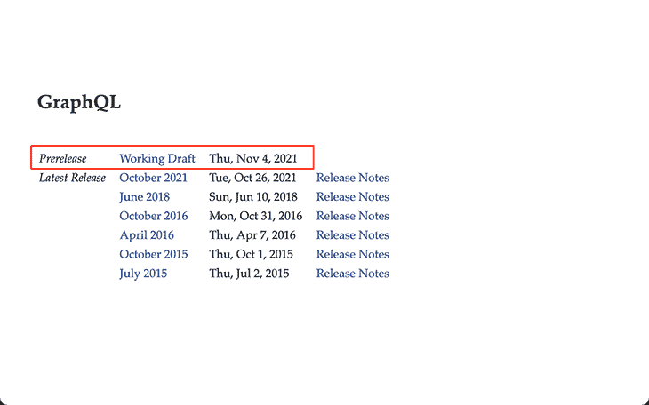
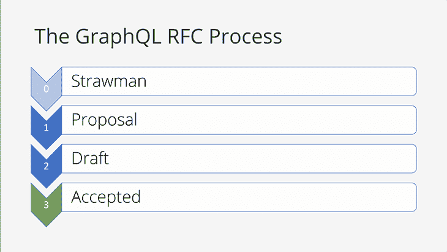

# 最新的 GraphQL spec 中有什么新内容

> 原文：<https://blog.logrocket.com/whats-new-latest-graphql-spec/>

GraphQL 规范的新版本已经发布:【2021 年 10 月版。这个新版本比上一个版本(从 2018 年 6 月开始)晚了三年多，涉及 35 名贡献者，他们做出了近 100 项更改。

你可能会认为，在三年的工作之后，规范中会有主要的新特性。不过，检查一下[变更日志](https://github.com/graphql/graphql-spec/blob/main/changelogs/October2021.md)，我们可以看到大部分的改变都是简单的改进，只有一小部分是真正的新特性。你可能会想，如果其中只有几个是新特性，为什么这个新版本要花三年多的时间来制作呢？

在本文中，我们将解决这个问题，仔细研究新添加的特性，看看哪些令人兴奋的新特性没有出现在新版本中。

## 为什么新规范过了这么久才发布？

生产一个新版本的 GraphQL 规范基本上相当于标记了 [GitHub repo `graphql/graphql-spec`](https://github.com/graphql/graphql-spec) 。为什么维护人员要花三年多的时间来做？

GraphQL Java 创建者和规范贡献者 Andi Marek 给了我们一个答案，他说[graph QL 规范发布并不重要](https://www.graphql-java.com/blog/spec-releases-are-not-important/)。正如他所解释的，除了正式发布之外，GraphQL spec 还[发布了预发布工作草案](https://spec.graphql.org/)，该草案更为常规且持续地更新:



因此，GraphQL 服务器、客户端和工具可以直接遵循正在进行的工作草案中的规范，而不需要等待三年以上才能加入新的特性。

## 为 GraphQL 规范做出贡献的过程

对 GraphQL 规范的补充必须满足[指导原则](https://github.com/graphql/graphql-spec/blob/main/CONTRIBUTING.md#guiding-principles):

*   向后兼容性
*   性能是一个特征
*   不赞成改变
*   启用由真实用例驱动的新功能
*   简单和一致胜过表达和简洁
*   保留选项值
*   可理解性和正确性一样重要

纳入`graphql/graphql-spec`的`main`分支的所有变更都将经过严格的流程，这也是工作草案作为可靠的临时参考的原因。该流程[要求冠军推动公关通过四个阶段](https://github.com/graphql/graphql-spec/blob/main/CONTRIBUTING.md#rfc-contribution-stages)，然后才能合并:

*   第 0 阶段:斯特劳曼
*   第一阶段:提案
*   第二阶段:草稿
*   第 4 阶段:接受



The GraphQL RFC process. Image credit: [Robert Zhu](https://www.youtube.com/watch?v=sMTNTy_aOU0)

在阶段 0，目标是尽早拒绝该提议(例如，因为它产生了不希望的副作用，增加了复杂性，该问题可以通过另一个提议或另一个原因来解决)。

如果没有被拒绝，提案将进入第 1 阶段，这表明指导规范开发的工作组承认这个问题需要解决，并且社区提供了一个或多个可能的解决方案并进行讨论。由于 GraphQL 规范是开源的，任何人都可以贡献自己的建议和解决方案。

在第 2 阶段，解决方案列表缩小到必须为 [`graphql-js,`(参考 GraphQL 服务器实施)](https://github.com/graphql/graphql-js/)成功实施的特定解决方案。

它在阶段 3“接受”结束，在这个阶段，解决方案被认为是完整的，并被添加到规范中。

要了解更多关于 GraphQL RFC 流程的信息，除了 [GraphQL 的投稿指南](https://github.com/graphql/graphql-spec/blob/main/CONTRIBUTING.md)，我推荐观看这些演讲:

## 2021 年 10 月规格的新特性

让我们探索一下最新 GraphQL 规范中添加的新特性。

### 自定义标量规范 URL

这个特性使我们能够通过一个新的指令`@specifiedBy`明确地识别定制标量的行为，该指令指向一个包含标量的数据格式、序列化和强制规则的文档。

例如，我们可以声明标量类型`DateTime`基于 RFC3339，如下所示:

```
scalar DateTime @specifiedBy(url: "https://tools.ietf.org/html/rfc3339")

```

### 实现其他接口的接口

我们现在可以声明 GraphQL 接口本身实现了另一个接口:

```
interface Node {
  id: ID!
}

interface Resource implements Node {
  id: ID!
  url: String
}

interface Image implements Resource & Node {
  id: ID!
  url: String
  thumbnail: String
}

```

请注意，接口仍然必须从其实现的接口中定义字段。这就是为什么字段`id`在所有三个接口中— `Node`、`Resource`和`Image`—`url`在`Resource`和`Image`中。

另外，`Image`通过`Resource`传递实现接口`Node`，它也需要显式声明它——这就是它实现`Resource & Node`的原因。

### 可重复指令和指令顺序非常重要

如果使用`repeatable`关键字声明，现在可以多次添加指令:

```
directive @delegateField(name: String!) repeatable on OBJECT | INTERFACE

type Book
  @delegateField(name: "pageCount")
  @delegateField(name: "author")
{
  id: ID!
}

```

这个新特性表明，应用指令的顺序非常重要。例如，根据提供`content`参数的顺序，应用指令`@appendContent`两次将产生不同的结果:

```
directive @appendContent(content: String!) repeatable on FIELD

query {
  post(id:1) {
    # Result: "Hello world! - By Leo - leoloso.com"
    title1: title
      @appendContent(content: " - By Leo")
      @appendContent(content: " - leoloso.com")
    # Result: "Hello world! - leoloso.com - By Leo"
    title2: title
      @appendContent(content: " - leoloso.com")
      @appendContent(content: " - By Leo")
  }
}

```

规范中还增加了声明指令顺序很重要的内容。

## 未达到 2021 年 10 月规格的特性

基本上， `graphql/graphql-spec`中的任何[打开拉取请求仍在进行中:](https://github.com/graphql/graphql-spec/pulls)


Open PRs in the spec

其中一些特性对 GraphQL 的未来非常重要，但可能需要几年时间才能将它们添加到规范中。

一个例子是包含多态输入联合类型，这将允许向同一个字段提供不同类型的值。这个特性将有助于[支持输入的标量类型](https://github.com/graphql/graphql-spec/issues/215)的联合(这在五年前就已经提出了)，并展示了对输出做同样事情的方法。

为什么要花这么长时间？答案是贡献者正在确保被接受的解决方案是可用的最佳解决方案。考虑到 GraphQL 已经变得如此之大，以及有多少利益相关者，这并不是一项容易的任务。

工作组阅读 GraphQL 输入联合上的 [RFC，证明了挑战的范围，以及贡献者对细节的关注。这个提议已经被反复讨论了好几次，每一次都取代了前一次:](https://github.com/graphql/graphql-wg/blob/main/rfcs/InputUnion.md)

经过贡献者的详尽研究，以及工作组内部的协商，似乎`oneof`输入对象和`oneof`字段[将是选择的解决方案](https://github.com/graphql/graphql-js/pull/1196#issuecomment-976455911)。因此，这个特性将(或者应该)很快被合并到 GraphQL 规范中。

尽管这一过程可能需要很长时间，但这种详细的研究和尽职调查意味着没有捷径可走，让我们长期安心。每当新的提议最终被规范接受时，我们很可能不会为它所采用的解决方案而后悔。

在开放的 pr 中，还有其他几个 pr，一旦获得批准，将对 GraphQL 产生重大影响:

*   允许完整的 Unicode 范围( [#849](https://github.com/graphql/graphql-spec/pull/849) )将在 GraphQL 查询中使用表情符号解锁🎉
*   输入值( [#805](https://github.com/graphql/graphql-spec/pull/805) )的弃用将增强版本控制
*   `@defer`和`@stream`指令( [#742](https://github.com/graphql/graphql-spec/pull/742) )将提高获取数据时的性能

我非常渴望看到这些 PRs 完成！

## 结论

在本文中，我们回顾了 2021 年 10 月的最新版本中添加了哪些重要贡献，并探索了接下来会有哪些令人兴奋的新功能。

新 GraphQL 规范的发布周期很慢，这就是为什么最新版本花了三年多才发布。这是有意为之的:GraphQL 已经很好地建立起来，并被无数的利益相关者使用，所以如果不仔细考虑就不能添加新的特性。除了我们上面列出的其他指导原则之外，当前的流程确保每个新功能都是确实需要的，并且不会与以前的版本不兼容。

然而，这并不代表一个问题，因为 GraphQL 生态系统可以依靠最新的工作草案保持稳定的发展速度，该草案正在不断更新最新的功能。

## 监控生产中失败和缓慢的 GraphQL 请求

虽然 GraphQL 有一些调试请求和响应的特性，但确保 GraphQL 可靠地为您的生产应用程序提供资源是一件比较困难的事情。如果您对确保对后端或第三方服务的网络请求成功感兴趣，

[try LogRocket](https://lp.logrocket.com/blg/graphql-signup)

.

[](https://lp.logrocket.com/blg/graphql-signup)[https://logrocket.com/signup/](https://lp.logrocket.com/blg/graphql-signup)

LogRocket 就像是网络和移动应用的 DVR，记录下你网站上发生的每一件事。您可以汇总并报告有问题的 GraphQL 请求，以快速了解根本原因，而不是猜测问题发生的原因。此外，您可以跟踪 Apollo 客户机状态并检查 GraphQL 查询的键值对。

LogRocket 检测您的应用程序以记录基线性能计时，如页面加载时间、到达第一个字节的时间、慢速网络请求，还记录 Redux、NgRx 和 Vuex 操作/状态。

[Start monitoring for free](https://lp.logrocket.com/blg/graphql-signup)

.