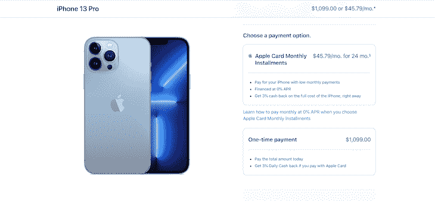
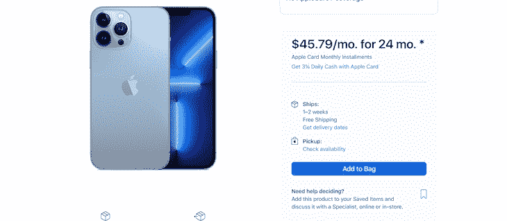
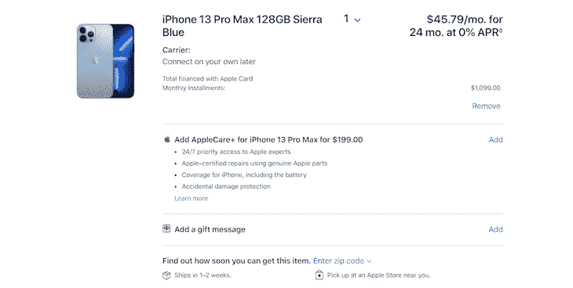

# Safari 15 - LogRocket 博客中 WebKit 的新特性

> 原文：<https://blog.logrocket.com/whats-new-webkit-safari-15/>

WebKit 是 Apple 设计的开源引擎，用于将 HTML 和 CSS 渲染到 Safari 和 Chrome 等 web 浏览器，它使用了 WebKit 的一个分支。除了网络浏览器， [WebKit 还被 PS3 以上的 PlayStation 游戏机、](https://en.wikipedia.org/wiki/WebKit)黑莓浏览器、Tizen 移动操作系统和亚马逊 Kindle 电子书阅读器浏览器使用。

Safari 15 对 WebKit 进行了重大改进，例如，隐私和安全性、向前迈进的互操作性、定制化等等。在本教程中，我们将了解 Safari 15 如何在不同的苹果设备上改进 WebKit 的各个方面。我们开始吧！

### WebKit 的起源

WebKit 的 HTML 和 JavaScript 引擎始于 KDE 的 KHTML 和 KJS 库。从那以后，苹果、谷歌、诺基亚和黑莓等 KDE 贡献者提供了显著的进步。

WebKit 支持 macOS、Windows、Linux 和其他类似 Unix 的操作系统。渲染引擎允许每个浏览器绘制 HTML/CSS 网页。以下是一些流行的浏览器及其渲染工具:

### 相关 WebKit 组件

Webcore 是由 WebKit 项目开发的用于 HTML 和 SVG 的开源 DOM 布局和呈现库。

JavaScriptCore 是一个框架，它为 WebKit 实现提供 JavaScript 引擎，并在 macOS 内部的不同上下文中提供脚本。JavaScriptCore 最初源于 KDE 的 JavaScript 引擎 KJS 和标准表达式库。

## Safari 15 中最新的 WebKit 功能

自从为 macOS Monterey、iPadOS 15、iOS 15 和 watchOS 发布 Safari 15 以来，除了 macOS Big Sur 和 macOS Catalina 之外，WebKit 还为 Safari 浏览器添加了一些巨大的[改进。](https://blog.logrocket.com/safari-next-internet-explorer/)

## WebKit 隐私和安全

Safari 15、iOS 15 上的 Safari 和 macOS Monterey 现在支持电脑化的 HTTPS 增强功能，可以隐藏您的 IP 地址，防止被识别的追踪器发现，确保您的个人信息不会被骗子或黑客获取。

### iCloud 钥匙串密码管理器鉴定

WebKit 现在支持在您的应用程序或网站中使用设备上的验证码，以便使用 iCloud 钥匙串密码管理器实现更稳定、更安全的登录过程。

要在 Safari 和自动填充中使用这些验证代码，首先，使用`autocomplete=one-time-code`给出一个`<input>`自动填充有效性。接下来，使用标准的`otpauth` URL 并用`apple-otpauth`更新模式，以直接链接到密码管理器。最后，使用光栅图像来允许在`otpauth` QR 码上的相关菜单，其提供设置验证码生成器。

要了解更多关于在应用程序中支持该过程的信息，请访问 [WWDC21](https://developer.apple.com/wwdc21/) ，查看关于使用 iCloud 钥匙串验证码创建安全登录的[指南。](https://developer.apple.com/videos/play/wwdc2021/10105/)

### 万能钥匙

随着时间的推移，密码在保护在线账户方面变得不那么有效。因此，苹果推出了 PassKeys，这是一种网络授权细节，旨在用设备备份和同步取代应用程序和网站的密码。

WebKit 中很容易获得密钥。要在 Safari 中启用 PassKeys，选择**开发**，然后启用**同步平台认证器**。你可以通过观看关于如何超越密码的[指南](https://developer.apple.com/videos/play/wwdc2021/10106/)来了解更多关于认证和密码的知识。

如果您已经拥有支持使用`totp`代码登录的基础设施，那么您应该熟悉`totp auth URLs`。基于时间的一次性密码(TOTP)生成器是一种通过共享私钥生成伪随机密码的算法。

`totp`URL 包含设置代码生成器的所有信息，包括 base-32 编码的密钥、每个代码中的字符数、每个代码验证所需的时间，以及您将设置为域名的 issuer 字段。

以下是一个示例:

```
otpauth://totp/Shiny:[email protected]?
secret=NBSWY3DP&digits=6&period=30&issuer=example.com

```

您将把这个 URL 编码成一个 QR 码，这是`totp`设置过程的一个常见部分。

## Apple Pay 的改进

WebKit 在 Safari 15 中对 Apple Pay 的添加允许开发者使用[支付请求 API](https://www.w3.org/TR/payment-request/) 来创建延期或例行支付，暗示交付方式的预期到达日期，支持优惠券代码，并将运输方式标记为店内提货。

假设你想用 Apple Pay 购买一部新 iPhone。在下面的图片中，您将看到一些正在运行的新功能:



除了一次性付款选项之外，您还可以使用付款请求 API 来安装每月付款。



在上图中，用户可以选择**获取交货日期。**



在上图的右下角，你可以选择输入你的邮政编码去附近的苹果商店取你新买的东西。

## 新的 web 扩展

WebKit 的推出为 iOS 和 iPadOS 带来了 [Safari Web 扩展](https://developer.apple.com/documentation/safariservices/safari_web_extensions)，这使得用户能够根据自己的偏好和需求个性化他们的 UX。WebKit 还附带了扩展 API，使开发人员能够编写各种有用的浏览器扩展。你可以观看[这个指南](https://developer.apple.com/videos/play/wwdc2021/10104/)来学习如何构建 Safari Web 扩展。

## 浏览器界面

不管你的网站设计或布局有多棒，WebKit 的浏览器界面看起来还是很死板。然而，随着最新的更新，Safari 15 通过改变其`background-color`将`tab-bar`与网站融合在一起。此外，它将网站的设计扩展到窗口的每一个边缘，使你的用户界面更加光滑，并将浏览者的注意力引向重要的内容。

您还可以控制浏览器明暗模式的颜色。下面是说明这一点的代码示例:

```
<!DOCTYPE html>
<html lang="en" dir="ltr">
  <head>
    <meta charset="utf-8">
    <title>Onome's Web Page</title>
    <meta name="theme-color" 
    content="#FFF1FA" 
    media="(prefers-color-scheme: light)">
    <meta name="theme-color" 
    content="#a9a9a9" 
    media="(prefers-color-scheme: dark)">
  </head>
  <body>
    <p>Onome's Webpage</p>  
  </body>
</html>

```

如果您输入的颜色对于深色模式来说太亮，或者对于浅色模式来说太暗，那么 Safari 15 将显示更亮或更暗的阴影。

在 iOS 上，Safari 15 的 UI 有了显著的改进，增加了像`theme-color`这样的新功能，它被用作设置任何网站浏览器外观的基点。此外，`tab-bar`被移到了屏幕的底部，直接放在用户的拇指下，更容易够到，特别是对于惯用右手的用户。

要在选项卡之间切换，您可以在`tab-bar`上横向滑动。对于所有打开标签页的网格布局，向上推送。当用户向下滚动网页时，`tab-bar`会最小化到底部，确保用户知道他们在哪里。当用户在网页中向上导航时,`tab-bar`再次出现。\

* * *

### 更多来自 LogRocket 的精彩文章:

* * *

当你设计你的网页时，如果你在页面底部有一些重要的东西，你可以在你的 CSS 中使用环境变量来减少`tab-bar`的影响。

在下面的 CSS 代码示例中，我们展示了如何使您的网站背景颜色与 Safari 的颜色相融合，以及如何使页脚适应`tab-bar`的位置:

```
:root {
    --first-color: #FFFDD0;
    --second-color: #8B0000

;
}
html {
    background-color: var(--first-color);    
}
footer {
    background-color: var(--first-color);
    position: sticky;
    padding-top: 1rem;
    padding-left: 1rem;
    padding-right: 1rem;
    padding-bottom: calc(1rem + env(safe-area-inset-bottom));
}

```

## WebKit 中的新 CSS

是一个相对较新的 CSS 属性，允许你为任何元素设置一个首选的纵横比。假设你网页上有一幅图片，它的宽度是长度的三倍。那幅图像的长宽比为 3/1。

当您在 Safari 上打开网站时，您可能会注意到图像和视频是网页上响应性最强的元素，因为它们具有自然的宽高比。其他元素，比如容器中的`input`或`text`元素，没有任何自然的纵横比。

WebKit 现在提供 CSS 来使这些其他元素融入浏览器并提高它们的响应能力，使用户的浏览体验无缝。

下面的代码示例说明了如何将`1 / 1`的`aspect-ratio`添加到文本容器中:

```
article {
    grid-column: 2 / 3;
    width: auto;
    height: auto;
    aspect-ratio: 1 / 1;
    overflow: scroll;
}

```

你也可以用其他度量写`aspect-ratio`，比如小数。

## 媒体升级

Safari 15 现在包括用户和开发者的媒体升级，比如播放速度和章节菜单。语言/字幕轨道菜单现在很容易在 iOS 和 iPadOS 上找到。有了 WebKit，Safari 15 为[媒体会话 API](https://developer.mozilla.org/en-US/docs/Web/API/Media_Session_API) 提供了支持，允许用户获得[共享播放](https://developer.apple.com/shareplay/)的体验。

## 结论

苹果为 Safari 15 发布的 WebKit 引入了许多新功能，这对隐私、安全、snd 定制都有重大好处。在本文中，我们讨论了 WebKit 的起源及其提供的优势。在 iPad OS 15、iOS 15 或 macOS Monterey、macOS Big Sur 或 macOS Catalina 上运行 Safari 的用户可以访问这些更改。

如果你有任何问题，欢迎在下面留言。我希望你喜欢这个教程！

## 使用 [LogRocket](https://lp.logrocket.com/blg/signup) 消除传统错误报告的干扰

[](https://lp.logrocket.com/blg/signup)

[LogRocket](https://lp.logrocket.com/blg/signup) 是一个数字体验分析解决方案，它可以保护您免受数百个假阳性错误警报的影响，只针对几个真正重要的项目。LogRocket 会告诉您应用程序中实际影响用户的最具影响力的 bug 和 UX 问题。

然后，使用具有深层技术遥测的会话重放来确切地查看用户看到了什么以及是什么导致了问题，就像你在他们身后看一样。

LogRocket 自动聚合客户端错误、JS 异常、前端性能指标和用户交互。然后 LogRocket 使用机器学习来告诉你哪些问题正在影响大多数用户，并提供你需要修复它的上下文。

关注重要的 bug—[今天就试试 LogRocket】。](https://lp.logrocket.com/blg/signup-issue-free)