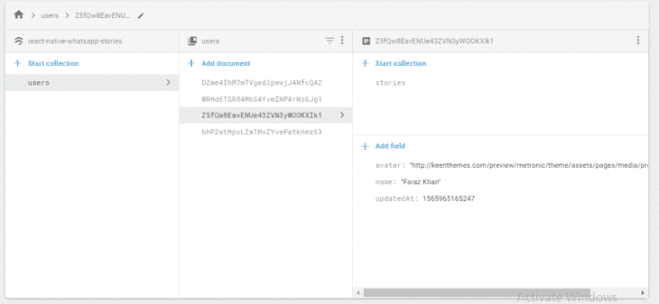
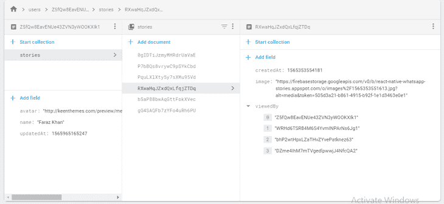
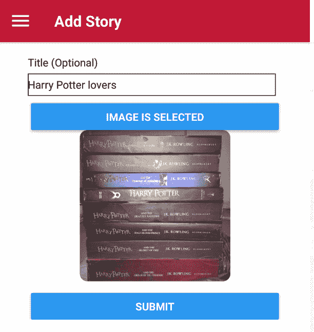
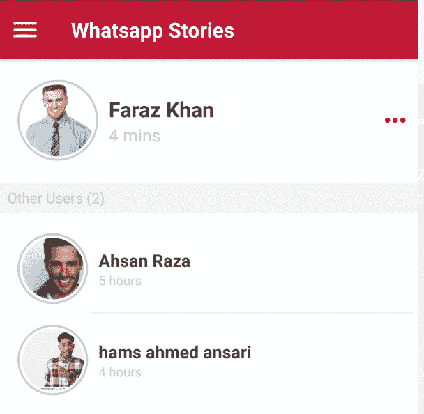
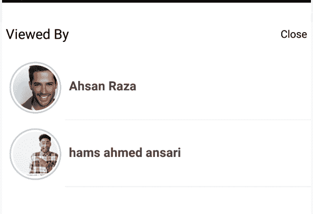

# 使用 React Native 和 Firestore 模仿 WhatsApp 的故事

> 原文：<https://blog.logrocket.com/whatsapp-stories-using-react-native-firestore/>

故事现在是大多数社交媒体应用程序的趋势特征，包括 WhatsApp、Snapchat、Instagram 等。此功能为我们提供了另一种途径，以图像、视频和文本的形式与您的联系人或朋友共享媒体，并让您知道谁查看了您的故事。故事更吸引人的一个方面是它们是短暂的——它们通常只有 24 小时可以观看。


如果你知道，为什么你会在这里？

哦！我明白了。你需要关于如何使用 [React Native](https://blog.logrocket.com/the-state-of-react-native-web-in-2019-6ab67ac5c51e/) 和 Firestore 开发你自己的故事功能的教程！让我们开始吧。

我已经用 React 导航、Redux 和 Firebase 身份验证以及 Firestore 数据库配置了基本的项目设置。在继续之前，让我们回顾一下数据库结构！

`users` → `<userIds>` → `<userData>`



`users` → `<userId>` → `stories` → `<storyId>` → `<storyData>`



## 开始吧！

现在，我们必须实现三个目标:

1.  添加您的故事/状态
2.  列出用户的所有状态
3.  查看用户的所有状态

所以先说第一点！

### 1.)添加您的故事/状态

让我们首先从 Expo 的[图像拾取器](https://docs.expo.io/versions/latest/sdk/imagepicker/)中拾取一些图像，并将它们转换成 blob，以便上传到 Firebase 存储，并将记录上传/添加到 Firestore 收藏中。

#### AddStory.js

```
  _handleSelectImage = async () => {
    let result = await ImagePicker.launchImageLibraryAsync({
      mediaTypes: "Images"
    });
    if (!result.cancelled) {
      this.setState({ image: result.uri });
    }
  };

  _handleSubmit = async () => {
    const { userId } = this.props;
    const { image, title } = this.state;

    if (image) {
        try {
          // Converting image to blob
          const image = await blobMaker(image);

          // Uploading image in Firebase storage
          const tempImage = await firebase
            .storage()
            .ref()
            .child(`images/${new Date().getTime()}.jpg`)
            .put(image);
          const imageURL = await tempImage.ref.getDownloadURL();
          const createdAt = firebase.firestore.Timestamp.now().toMillis();
          // Preparing object to be pushed in Firestore
          const payload = {
            image: imageURL,
            viewedBy: [],
            createdAt
          };
          if (title) {
            payload.title = title;
          }
          // Pushing story data into `stories` subcollection of collection `users`
          await firebase
            .firestore()
            .collection("users")
            .doc(userId)
            .collection("stories")
            .add(payload);
          // And updating the last story time in user's document, this will help us to sort by latest story in the list screen
          await firebase
            .firestore()
            .collection("users")
            .doc(userId)
            .set(
              {
                updatedAt: createdAt
              },
              { merge: true }
            );

          this.props.navigation.navigate("Stories")
        } catch (error) {

          this.setState({ loading: false });
        }
      }
    }
  };

  render() {
    <ScrollView contentContainerStyle={styles.container}>
        {/* Title View */}
        <View style={styles.inputContainer}>
            <Text>Title (Optional)</Text>
            <TextInput
              style={styles.input}
              value={title}
              onChangeText={title => this.setState({ title })}
            />
        </View>
        {/* Image View */}
        <View style={styles.buttonContainer}>
            <Button
              title={image ? "Change Image" : "Select Image"}
              style={styles.button}
              onPress={this._handleSelectImage}
            />
            {image && <Image source={{uri: image}} style={styles.image}/>}
        </View>
        {/* Submit View */}
        <View style={styles.buttonContainer}>
            <Button
              title="Submit"
              style={styles.button}
              onPress={this._handleSubmit}
            />
        </View>
    </ScrollView>
}
```



Congratulations! We are done with uploading our very first image/story to Firebase storage and updating the record in Firestore. Now let’s move to the second target.

### 2.)列出用户的所有状态

因此，我们向 Firestore 用户集合中添加了记录。现在我们去拿那些记录。首先，我们需要使用快照对所有用户集合进行 Firebase 查询。你会问，为什么要快照？因为我们需要所有用户的实时数据。

#### AllStories.js

```
listenAllUsers = async () => {
    const { userId } = this.props;
    try {
      // Listening to users collections
      await firebase
        .firestore()
        .collection("users")
        .onSnapshot(snapshot => {
          if (!snapshot.empty) {
            let user;
            let allUsers = [];

            snapshot.forEach(snap => {
              const data = { ...snap.data(), _id: snap.id };
              if(data._id === userId) {
                user = data;
              }
              else {
                allUsers.push(data);
              }
            });
            this.setState({ allUsers, user });
          }
        });
    } catch (error) {
      console.log("listenAllUsers-> error", error);
    }
  };
```

现在我们已经有了所有的用户，让我们通过更新状态来保存它们。我们的目标是找到所有在过去 24 小时内有故事的用户——那么我们应该怎么做呢？

我们必须用一个间隔循环来过滤来自所有用户的消息，该循环将重新运行函数，以便我们获得最新的故事状态。

```
componentDidMount() {
    // Listening for all users
    this.listenAllUsers();
    // Interval
    this.timeIntervalSubscription = setInterval(() => {
      if (this.state.allUsers.length) {
        // Filtering all users 
        this.filterUsers();
      }
    }, 500);
}  

filterUsers = () => {
    const { allUsers } = this.state;
    const filterUsers = allUsers.filter(user => dateIsWithin24Hours(user.updatedAt));

    this.setState({ filterUsers });
};
```

现在我们只需要渲染这些东西。我已经创建了自己的样式组件(`AvatarWithStory`)来渲染它们——您可以尝试自己的样式组件！

```
  render() {
    const { user, filterUsers, allUsers } = this.state;
    return (
      <ScrollView contentContainerStyle={styles.container}>
        {/* My story */}
        <View style={styles.containerWithPadding}>
            <AvatarWithStory
              hasStories={dateIsWithin24Hours(user.updatedAt)}
              user={{ ...user, time: dateFormatter(user.updatedAt) }}
            />
          )}
        </View>
        <HrWithText text={`Other Users (${filterUsers.length})`} />
        {/* All users */}
        <View style={styles.containerWithPadding}>
          {filterUsers &&
            filterUsers.map(user => (
             <AvatarWithStory
                user={{ ...user, time: dateFormatter(user.updatedAt) }}
             />
            ))}
        </View>
      </ScrollView>
    );
  }
}
```



恭喜你。我们刚刚达到了第二个目标。现在我们来看最后一个目标。

### 3.)查看用户的所有状态/经历

现在，我们处于应用程序的最后阶段:我们需要呈现选定的用户故事/状态。考虑到我们从 props 或所选用户的导航参数中获取用户 ID，我们需要做的就是查询并从其子集合中获取数据。

对于滑动图像，我使用[react-native-banner-carousel](https://github.com/f111fei/react-native-banner-carousel)。

#### 故事. js

```
componentDidMount() {
    // Listening for the selected user story
    this.fetchSelectUserStory();
}  

fetchSelectUserStory = async () => {
    // Updating currentIndex from -1 to 0 in order to start stories
    this.setState(pre => ({ ...pre, currentIndex: pre.currentIndex + 1 }));
    // Previous 24 hours server time
    const currentTimeStamp =
      firebase.firestore.Timestamp.now().toMillis() - 24 * 60 * 60 * 1000;
    try {
      // Listening for selected users sub-collections of stories where createdAt is greater than currentTimeStamp
      const tempStories = await firebase
        .firestore()
        .collection("users")
        .doc(this.props.navigation.state.params.id) // Here considering userId is from navigation props
        .collection("stories")
        .orderBy("createdAt", "asc")
        .where("createdAt", ">", currentTimeStamp)
        .get();
      if (!tempStories.empty) {
        const stories = [];
        tempStories.forEach(story => {
          stories.push({
            ...story.data(),
            id: story.id
          });
        });
        // Updating state according to fetched stories
        this.setState({ stories });
        // Changing slide 
        this.interval();
      }
    } catch (error) {
      console.log("fetchSelectUserStory -> error", error);
    }
  };
```

像 WhatsApp 一样，我们可以检查谁看过我的故事，这是一个非常棒的功能！因此，让我们在应用程序中也加入这一点。当用户查看我的故事时，我们需要做的就是用这些用户的 id 更新 Firestore 子集合。

```
// Will run on page change
onPageChanged = async index => {
    const { stories } = this.state;
    const { userId } = this.props;
    // Getting active story from state 
    const activeStory = stories[index];
    // Updating currentIndex 
    this.setState({ currentIndex: index });
    // Changing slide
    this.interval();
    // Checking whether user already viewed the story
    const alreadyViewed = activeStory.viewedBy.filter(
      user => user === userId
    );
    // If already viewed, return from function
    if (alreadyViewed.length) {
      return;
    }
    // If not, then update record in Firestore 
    try {
      await firebase
        .firestore()
        .collection("users")
        .doc(this.props.id)
        .collection("stories")
        .doc(activeStory.id)
        .set(
          {
            viewedBy: [...activeStory.viewedBy, this.props.userId]
          },
          { merge: true }
        );
    } catch (error) {
      console.log("TCL: Story -> error", error);
    }
  };
```

让我们在故事中加入[自动滑动](https://blog.logrocket.com/how-to-make-tinder-like-card-animations-with-react-native/)来获得更自然的感觉。10s 呢？我认为那太多了——让我们坚持 6s 吧。

```
interval = () => {
    // Clearing timeout if previous is in subscription
    if (this.clearTimeOut) clearTimeout(this.clearTimeOut);

    // New subscription for current slide
    this.clearTimeOut = setTimeout(() => {
      const { currentIndex, stories} = this.state;
      // If current slide is the last slide, then remove subscription
      if (Number(currentIndex) === Number(stories.length) - 1) {
        clearTimeout(this.clearTimeOut);
      } else {
        // Updating current slide by 1
        this.setState({ currentIndex: currentIndex + 1 });
        // Checking if carousel exists (ref: check <Carousel /> in render())
        if (this._carousel) {
          const { currentIndex} = this.state;
          // If yes, then move to next slide
          this._carousel.gotoPage(currentIndex);
        }

      }
    }, 6000);
  };
```

看看我们的`render`功能:

```
  // Render single slide
  renderPage = (story, index) => {
    // Changing slide on press 
    const onPress = () => 
      {
          this.setState(pre => ({
            ...pre,
            currentIndex:
              pre.currentIndex === pre.stories.length ? 0 : pre.currentIndex + 1
          }));
          this._carousel.gotoPage(this.state.currentIndex);
          this.interval();
        }
      return (
        <TouchableOpacity
          onPress={onPress}
        >
          <View key={index}>
            <Image source={{ uri: story.image }} />
            {story.title && (
              <View>
                <Text style={styles.overlayText} numberOfLines={3}>
                  {story.title}
                </Text>
              </View>
            )}
          </View>
        </TouchableOpacity>
      );
    };
  // Pause slider function
  pauseSlider = () => clearTimeout(this.clearTimeOut);
  // Go back to screen
  goBack = () => this.props.navigation.navigate("StoriesScreen");
  // Close modal
  closeModal =() => 
    {
      this.setState({ modalVisible: false });
      this.interval();
    }
  render() {   
    const { currentIndex, stories, isLoading, stories } = this.state;

    return (
        <View style={styles.container}>
        {/* Header View */}
          <View style={styles.topContainer}>
            {/* Progress Bars on the top of story. See the component below */}
            <TopBar
              index={currentIndex}
              totalStories={stories.length}
              isLast={currentIndex === stories.length- 1}
            />
            <Header
              goBack={this.goBack}
              user={this.props.user}
              views={
                stories[currentIndex] && stories[currentIndex].viewedBy.length
              }
              viewsOnPress={this.setModalVisible}
            />
          </View>
          {/* Carousel Images View */}
          <View style={styles.bottomContainer}>
            <Carousel
              ref={ref => (this._carousel = ref)}
              autoplay={false}
              loop={false}
              pageSize={BannerWidth}
              onPageChanged={this.onPageChanged}
              index={currentIndex === -1 ? 0 : currentIndex}
              showsPageIndicator={false}
            >
              {stories.map((story, index) => this.renderPage(story, index))}
            </Carousel>
          </View>
        </View>
        {/* Viewed By View */}
        <Modal
          animationType="slide"
          transparent={false}
          visible={this.state.modalVisible}
          onRequestClose={() => {
            this.setState({ modalVisible: false });
            this.interval();
          }}
        >
          <ScrollView>
            <View style={styles.viewedBy}>
              <Text>Viewed By</Text>
              <TouchableOpacity
                onPress={this.closeModal}
              >
                <Text>Close</Text>
              </TouchableOpacity>
            </View>
            {this.state.storiesViewedBy.map(user => (
              <AvatarWithStory user={{ ...user }} />
            ))}
          </ScrollView>
        </Modal>
    );
  }
```


Viewing a user story



Our viewed-by modal

这是故事顶部的进度条组件:

#### TopBar.js

```
  // Setting current index of stories & number of stories to state 
  static getDerivedStateFromProps(nextProps, prevState) {
      return {
        currentIndex: nextProps.index,
        noOfStories: nextProps.totalStories
      };
  }

  componentDidMount() {
    this.updateNoOfProgress();
  }

  componentDidUpdate(prevProps, prevState) {
    // Checking if slide changed
    if (prevProps.index !== this.props.index) {
      // If yes, then clear interval
      if (this.interVal) clearInterval(this.interVal);
      // Reset and update progress bar
      this.updateNoOfProgress();
    }
  }

  // Resetting progress bar 
  updateNoOfProgress = () => {
      const duration = 60;
      this.setState({ noOfProgress: 0 });
      this.interval = setInterval(() => {
        const { noOfProgress } = this.state;
        // If progress bar is complete, then clear interval
        if (noOfProgress === 100) {
          clearInterval(this.interval);
        } else {
          // Otherwise, keep updating progress bar by 1
          this.setState(pre => ({ ...pre, noOfProgress: pre.noOfProgress + 1 }));
        }
      }, duration);
  };

  render() {
    const { currentIndex, noOfStories, noOfProgress } = this.state;

    return (
      <View style={styles.container}>
        {[...Array(noOfStories)].map((story, index) => (
          <View
            style={[
              styles.single,
              { width: Math.floor(width / noOfStories) - noOfStories }
            ]}
            key={index}
          >
            <ProgressBarAndroid
              styleAttr="Horizontal"
              indeterminate={false}
              progress={
                !(index >= currentIndex)
                  ? 1
                  : index === currentIndex
                  ? noOfProgress / 100
                  : 0
              }
              style={styles.bar}
              color="#fff"
            />
          </View>
        ))}
      </View>
    );
  }

const styles = StyleSheet.create({
  container: {
    marginTop: StatusBar.currentHeight,
    width,
    height: height * 0.03,
    paddingTop: height * 0.01,
    flexDirection: "row",
    justifyContent: "space-evenly"
  },
  bar: { transform: [{ scaleX: 1.0 }, { scaleY: 1 }], height: height * 0.01 },
  single: { marginLeft: 1 }
});
```

## 演示和总结

终于！我们已经实现了第三个也是最后一个目标。查看下面的演示，也可以查看 [GitHub repo](https://github.com/Expertizo/rn-stories) 以了解更多细节和工作代码。也可以通过 [Expo](https://expo.io/@hamsahmedansari/expertizo-rn-kit) 直接经营。


感谢您阅读帖子！希望它有助于满足您的需求！

## [LogRocket](https://lp.logrocket.com/blg/react-native-signup) :即时重现 React 原生应用中的问题。

[](https://lp.logrocket.com/blg/react-native-signup)

[LogRocket](https://lp.logrocket.com/blg/react-native-signup) 是一款 React 原生监控解决方案，可帮助您即时重现问题、确定 bug 的优先级并了解 React 原生应用的性能。

LogRocket 还可以向你展示用户是如何与你的应用程序互动的，从而帮助你提高转化率和产品使用率。LogRocket 的产品分析功能揭示了用户不完成特定流程或不采用新功能的原因。

开始主动监控您的 React 原生应用— [免费试用 LogRocket】。](https://lp.logrocket.com/blg/react-native-signup)