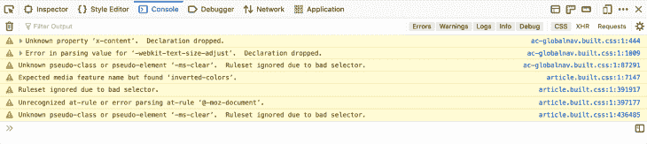
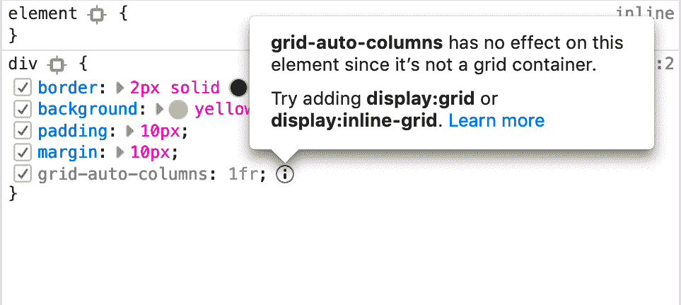
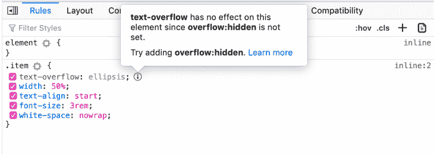

# 当 CSS 什么都不做的时候

> 原文：<https://blog.logrocket.com/when-css-doesnt-do-anything/>

你知道当你试图用 CSS 实现一些样式或布局，但却行不通的感觉吗？我知道我有，如果你做过任何 CSS 工作，你可能也有过很多次这种感觉，尤其是在你刚开始的时候。

CSS 表面上看起来很简单，因此人们不会花太多时间去了解它。当然不会像对另一种更传统的语言那样。

然而，大量的属性、值以及组合它们的方式使它成为一种复杂的语言，并且很难知道如何实现给定的结果。最重要的是，CSS 是一种非常灵活的编程语言。它将适用于您的网页，至少部分。即使您弄错了，如果您仍然遵循一般语法，您的代码将被加载、解析和(部分)运行。

JavaScript 作为一种命令式语言，让你描述*如何*做某事。如果你写的代码没有得到预期的结果，那么你就要调查原因。这通常通过添加控制台日志或使用调试器来完成。

另一方面，CSS 是一种声明性语言。有了它，你告诉电脑*做什么*，而不是*怎么做*。这意味着浏览器引擎是计算出“如何”部分的引擎，而这一切对你来说都是隐藏的。您无法访问这部分代码，也无法向其中添加控制台消息或连接调试器。

如果您的语法无效，您可能会得到一些错误消息，这是好的，但是这不足以调试代码解析和执行都很好，但是没有做您想要它做的事情的情况。

可能你添加的很多 CSS 规则和属性被浏览器认为是完全有效的，但实际上并没有产生你想要的效果，你也不能调试。

## 当 CSS 无效时

当内容无效时，浏览器会显示某些 CSS 警告。下面是 Firefox 的 web 控制台中显示的一些不同 CSS 警告的截图:



如上所示，Firefox 对丢弃的声明(当属性名未知时)、无法解析的值、错误的选择器或 at-rules 发出警告。

这些警告非常有用，但是当您的代码是有效的，但是没有产生预期的结果时，有时您得不到任何警告。那你会怎么做？你不断尝试直到成功。你问别人。你学 CSS。

我们都把这当成了使用这种语言的正常方式，但是让我们面对它，这是非常低效的，也不是一个好的开发者体验。

## 调试 CSS

如果我们可以调试浏览器在页面上应用 CSS 代码后的行为，这会有用吗？我不确定。考虑到布局引擎有多复杂，它实际上可能非常复杂。

CSS 与 JavaScript 等语言的不同之处还在于其他一些东西，这可能是它的一个优势。CSS 是一种特定于领域的语言，在这个意义上，它比 JavaScript 更受限制。它的唯一目的是设计页面上的元素样式。

我们举个例子。如果你使用的是`width`属性，那么可以很有把握地假设你正在试图描述一个元素应该有多宽，如果你添加或删除这个属性并没有在视觉上影响页面的样式，那么这个属性并没有做你想要做的事情。因此，也许我们需要的不是传统意义上的调试器，而是一个上下文助手，告诉你什么时候事情没有像你想象的那样运行。

但是在下结论之前，让我们先看几个例子。

## 常见模式

让我列举几个 CSS 代码可以很好地应用但不能做任何事情的常见例子。

### 隐藏溢出的文本

假设您有一行文本，您希望它总是适合某个容器元素，不管它的宽度如何。解决这一问题的常见设计模式是在文本溢出之前将其截断，并显示一个省略号。

是 CSS 属性，可以让你做到这一点。它有一个不言自明的名字和合理数量的似乎有意义的值。从表面上看，这是一个非常简单的属性，对吗？

如果你已经成功地使用过，那么请假设你还没有。回到你不知道的时候。或者上 [Stack Overflow](https://stackoverflow.com/search?q=css+text-overflow+not+working) 看看有多少人问起这件事，试着设身处地的想一想。

原来这个属性只对块元素起作用，它也只对文本行前进的方向起作用(即不在一段文本的底部)，而且它也只在元素也应用了`overflow:hidden`的情况下起作用。

不再那么简单了，是吗？它实际上比这更复杂，因为它确实与一些内联元素一起工作，导致布局引擎中的“块框架”。例如，`fieldset's legend`元素是一个内嵌元素，但是它仍然支持`text-overflow`,因为布局引擎在运行时“阻止”了这个元素。

* * *

### 更多来自 LogRocket 的精彩文章:

* * *

所以，关键是，对元素应用`[text-overflow](https://developer.mozilla.org/en-US/docs/Web/CSS/text-overflow)`属性只是难题的一部分。这将适用于罚款，但在许多情况下不会导致人们期望的结果。另一方面，会导致很多挫败感和时间的流失。

### 尺寸元素

`width`和`height`不适用于行内元素，只适用于块。这对你来说似乎是显而易见的，但是再一次，假设你刚开始使用 CSS 并且还不知道它。

我当然记得当我开始我的职业生涯时不得不查阅了几次，当时我并不清楚为什么这些看起来超级有用的属性对我的元素没有任何影响。再说一次，因为 CSS 初看起来真的很简单，我想我们只是忽略了大多数编程语言通常都会有的传统学习阶段。如果你想使用一个 JavaScript 函数，很可能你会在 [MDN](https://developer.mozilla.org/) 上查找它，并检查它适用于什么。

但是对于 CSS，因为像`color:blue`这样的东西看起来很简单，我们假设它的其余部分也很简单，我们只是试着使用它。

在`width`和`height`的情况下，它们只适用于块元素，这意味着你必须先知道什么是块元素，什么是内联元素。但是更重要的是，你还需要知道什么是[替代元素](https://developer.mozilla.org/en-US/docs/Web/CSS/Replaced_element)，这涉及到更多的内容。

被替换的元素是不通过 CSS 呈现其内容的元素。例子有``和`<audio>`。现在，这些可以是(默认情况下是)内联元素，但是`width`和`height`无论如何都要处理它们！

### 对齐元素

这可能是人们最常见的沮丧来源之一。CSS 拥有所有这些听起来有用的属性，比如`vertical-align`或`align-items`，看起来它们会做你想让它们做的事情。

然而，事实证明你需要知道很多复杂的概念，比如什么是[块](https://developer.mozilla.org/en-US/docs/Web/Guide/CSS/Block_formatting_context)或[内联](https://developer.mozilla.org/en-US/docs/Web/CSS/Inline_formatting_context)格式上下文，或者什么是[网格](https://developer.mozilla.org/en-US/docs/Web/CSS/CSS_Grid_Layout)或 [flex](https://developer.mozilla.org/en-US/docs/Web/CSS/CSS_Flexible_Box_Layout) 布局，然后你才能自信地开始使用这些属性(而不是，你知道，直到它们工作为止)。

例如，`align-*`属性仅适用于布局的块/交叉/列方向，而`justify-*`属性适用于其他方向。

因此，正如你所看到的，有些情况下，CSS 表面上看起来非常简单，但实际上需要专业知识才能实现特定的效果。

像上面这样的例子还有几十个。如果你有自己的例子，我很想听听！发微博给我。

## 在 Firefox 中引入非活动 CSS

如果有一种开发人员工具可以帮助你做到以上几点，会怎么样？我们有 JavaScript 调试器和控制台来调查 JS 代码什么时候没有做我们想要它做的事情。但是我们没有太多的 CSS。

从传统意义上来说，调试 CSS 代码可能不是正确的想法，但是工具在这方面仍然有所帮助。CSS 非常有表现力，它对页面有视觉冲击。基于此，应该可以在 CSS 没有任何作用的时候主动通知 DevTools 用户。

这就是 Firefox 不活跃的 CSS 特性的用武之地。这是我和我的团队在 2019 年底开发并在 [Firefox 70](https://hacks.mozilla.org/2019/10/firefox-70-a-bountiful-release-for-all/#developertools) 中发布的一项功能。

下面是显示该功能的截图:



其核心是非常简单和直观。任何被检测为非活动状态的 CSS 声明都将显示为灰色，后面会有一个信息图标，提供有关问题的解释。

非活动声明在语法上是有效的，可以很好地应用于元素，但不会对元素产生任何影响。

下面是另一个截图示例:



## 它从哪里来的？

回到 2018 年，我们向网络作者提出了许多问题，涉及他们在编写 CSS 时遇到的挑战。某些事情一遍又一遍地出现，比如为什么这个元素不适合这个空间？为什么那个属性什么都不做？这个元素怎么会有那么大？很明显，人们需要帮助来理解什么属性对元素有影响。

另一个真正让我们点击的是 Sarah Lim 的研究论文和 Ply Web Inspector 工具。在论文中，Sarah 和她的同事描述了在使用 CSS 时“视觉上无效的属性”是如何导致沮丧和时间浪费的主要原因。这些属性，无论是添加还是删除，都不会对页面造成任何影响。

## 我们是怎么做到的？

Sarah Lim 的 Ply 工具使用视觉差异来检测不活动的 CSS 属性。这实质上意味着获取一个应用了属性的屏幕截图，然后获取另一个没有应用属性的屏幕截图，并区分这两个图像。

这种方法非常通用，将以同样的方式应用于所有的属性，这很好，而且对 ply 也很有效。对于应用于 DevTools 中特定元素的所有属性，这样做所需的处理成本可能会高一些。我们知道这不是我们可以使用的方法。

在 Firefox DevTools 中，我们为非活动 CSS 设计的用户体验是这样的，当您在检查器面板中选择一个元素时，您会得到一个关于属性的警告，并且其应用的 CSS 规则会显示在规则侧栏中。这是用户经常做的事情，我们不能再慢了。所以不同的图像对 DevTools 来说不是一个可行的方法。

相反，我们在 DevTools 中添加了一个简单的规则引擎来完成这项工作。在这个引擎中，每个规则负责根据当前条件检查一个属性(或一组属性)是否是活动的。

例如，下面是这些规则之一的(简化)代码:

```
// Flex container property used on non-flex container
{
  invalidProperties: ["flex-direction", "flex-flow", "flex-wrap"],
  when: () => !this.flexContainer,
}
```

这意味着，当当前元素不是 flexbox 容器，并且在该元素上使用了`flex-direction`、`flex-flow`或`flex-wrap`之一时，引擎将返回一个警告。

[这里的](https://searchfox.org/mozilla-central/rev/d5b34cc8872177d3ee071e06f787c2a14268595b/devtools/server/actors/utils/inactive-property-helper.js#48)是 DevTools 中当前实现的所有规则。

## 什么不是？

我认为重要的是要认识到这个特性有一些限制，所以让我告诉你它不是什么。

这个工具不会告诉你所有的 CSS 属性。如果你看了当前实现的规则列表，你可能会意识到我们已经做了，所以它将只告诉你最常见的陷阱。不活动的 CSS 警告你的事情的列表会随着时间的推移而增加，但是首先从少量的常见情况开始对于确保特性坚如磐石是很重要的。

其次，它不是一个审计工具。这样的工具会很棒，但这不是非活动 CSS 的目的。许多人问它是否可以扫描他们的整个 CSS 代码库，并告诉他们可以删除的内容。这不是不活跃的 CSS 做的！相反，它可以告诉你在当前情况下(窗口大小、状态等)在这个给定的页面上、这个特定的元素上的事情。)具有根本没有任何效果的给定属性。

从这个意义上说，非活动 CSS 是一个调试工具，而不是审计工具。解决方法是，如果您试图创建一些布局，或使某些内容居中，或对齐某些内容，但这些内容不起作用，则在检查器面板中选择该元素，并让工具告诉您为什么某些属性不起作用。

## 你的前端是否占用了用户的 CPU？

随着 web 前端变得越来越复杂，资源贪婪的特性对浏览器的要求越来越高。如果您对监控和跟踪生产环境中所有用户的客户端 CPU 使用情况、内存使用情况等感兴趣，

[try LogRocket](https://lp.logrocket.com/blg/css-signup)

.

[](https://lp.logrocket.com/blg/css-signup)[https://logrocket.com/signup/](https://lp.logrocket.com/blg/css-signup)

LogRocket 就像是网络和移动应用的 DVR，记录你的网络应用或网站上发生的一切。您可以汇总和报告关键的前端性能指标，重放用户会话和应用程序状态，记录网络请求，并自动显示所有错误，而不是猜测问题发生的原因。

现代化您调试 web 和移动应用的方式— [开始免费监控](https://lp.logrocket.com/blg/css-signup)。