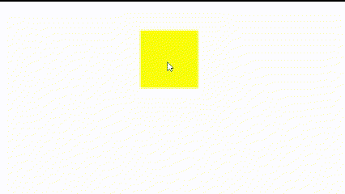

# 何时以及如何使用 CSS 将会改变

> 原文：<https://blog.logrocket.com/when-how-use-css-will-change/>

CSS 属性是一个强大的工具，允许开发者向浏览器提示页面上可能很快会改变的元素。这使浏览器有机会提前优化这些元素的呈现，从而有可能获得更好的性能。

本文将讨论如何使用`will-change`属性以及何时避免使用它。我们还将分享有关其浏览器支持的信息。

***注意，** `will-change`应谨慎使用，因为过度使用实际上会损害性能，而不是提高性能。*

*向前跳转:*

什么是`will-change`？

## `will-change`是一个 CSS 属性，它告诉浏览器元素的哪些属性(例如，内容、滚动位置、不透明度等)。)将来可能会改变。这使得浏览器可以提前优化元素的呈现，从而有可能提高性能。

例如，假设您有一个包含许多相同大小和颜色的元素的页面。如果您知道这些元素中的一个将很快改变大小或颜色，您可以使用`will-change`在这种改变发生之前通知浏览器。

这种“抬头”将允许浏览器优化元素的呈现，当发生变化时，可能会带来更好的性能。

为什么要用`will-change`？

## 有几个原因可能会让你想使用`will-change`。让我们来看看。

优化性能

### 如前所述，使用`will-change`的主要原因是为了提高性能。通过让浏览器知道哪些元素可能会很快改变，它可以提前优化这些元素的呈现，从而在改变实际发生时潜在地带来更好的性能。

改进动画

### `will-change`[能否提高动画的性能](https://blog.logrocket.com/understanding-animation-transition-timing-functions-css/)。它允许浏览器优化元素呈现，潜在地产生更平滑和更流畅的动画。如果你知道一个元素将被动画化，你可以使用`will-change`来通知浏览器。

防止重画和重排

### 重绘和重排是开销很大的操作，会显著影响页面的性能。当对元素进行不影响 DOM 布局的更改时(例如，元素背景的更改)，会发生重绘。当对元素的改变确实影响 DOM 布局(例如，元素的宽度或高度的改变)时，发生重排。

通过使用`will-change`，你可以帮助避免不必要的重画和重排版，进一步提高页面的性能。

分解`will-change`语法

## `will-change`语法看起来像这样:

`will-change`属性可以有一个或多个值:

```
will-change: <animateable-feature> = auto | scroll-position | contents | <custom-ident>

```

`auto`:告诉浏览器应该应用标准优化；这是默认值

*   `scroll-position`:告诉浏览器一个元素的滚动位置将在稍后被动画显示，并且应该为在该元素的滚动窗口中不可见的内容做准备
*   `contents`:告诉浏览器某个元素的内容将会改变，所以浏览器不应该缓存这个元素的内容
*   `<custom-indent>`:可以是任何自定义属性，如 transform 或 background。它告诉浏览器属性的值将很快改变；它也可以是由逗号分隔的一个或多个属性
*   **注意，**如果你指定一个简写属性作为`custom-indent`值(例如`background`，你是在告诉浏览器`background-color`、`background-image`、`background-position`以及其他与背景相关的属性可能会改变

> 向元素添加`will-change`

## 使用`will-change`属性相对简单。只需将`will-change`添加到您想要优化的元素中，并指定可能会改变的属性，如下所示:

在上面的例子中，我们告诉浏览器元素的高度、宽度和颜色属性可能很快会改变。这允许浏览器优化元素的呈现，当属性发生更改时，可能会带来更好的性能。

```
element {

will-change: height, width, color;

}

```

不要在动画或过渡点使用`will-change`属性；相反，在过渡或动画之前使用它。`will-change`应该告诉浏览器一个即将到来的变化，以便浏览器能够做好准备。

浏览器无法为当前正在发生或已经发生的更改做准备。

例如，不是在转换点直接将它添加到元素，就像这样:

当还没有发生变化时，您将把它添加到元素的初始状态:

```
my-element:hover {
  will-change: color;
  color: red;
}

```

此外，最好的做法是在期望的变化发生之前和之后打开和关闭`will-change`,特别是如果这种变化不经常发生的话。从 CSS 样式表中很难做到这一点，但是使用 JavaScript，您可以轻松地将它添加(和删除)到元素中:

```
.element {
  will-change: color;
  transition: color 300ms ease-in-out;
}

.my-element:hover {
  color: red;
} 

```

既然我们已经了解了如何使用`will-change`，那就来看看什么时候使用吧。

```
const el = document.querySelector('.parent-element')
el.addEventListener('mouseenter', addWillChange)
el.addEventListener(mouseleave, removeWillChange)

const addWillChange = () => {
  this.style.willChange = 'color'
}

const removeWillChange = () => {
  this.style.willChange = 'auto'
}

```

何时使用 CSS `will-change`

## 在不同的情况下，您可能希望使用 CSS `will-change`属性来[提高页面](https://blog.logrocket.com/best-practices-improving-css-performance/)的性能。例如，如果您发现动画的某些部分运行不流畅，并且其他优化没有帮助，您可以尝试`will-change`使其更加流畅和清晰，从而提高动画性能:



```
//CSS file
#animated-element {
  will-change: transform, opacity;
}

#animated-element.animated {
  transition: transform 0.5s, opacity 0.5s;
  transform: scale(2);
  opacity: 0;
}

//JS file
const element = document.querySelector('#animated-element');

element.addEventListener('click', () => {
  element.classList.toggle('animated');
});

```

在上面的例子中，我们使用`will-change`让浏览器知道当元素被点击时`#animated-element`的变换和不透明属性可能会改变。这使得浏览器能够优化其元素呈现，潜在地产生更平滑和更流畅的动画。

CSS `will-change`属性的另一个用例是当你知道一个元素的大小或位置将很快改变时。使用`will-change`提前通知浏览器这一变化，使浏览器能够优化元素的呈现，当变化发生时，可能会带来更好的性能:


```
//CSS file
#changing-element {
  will-change: width, height, transform;
}
#changing-element.changed {
  width: 200px;
  height: 200px;
  transform: translateX(100px);
}

//JS file
const element = document.querySelector('#changing-element');
element.addEventListener('click', () => {
  element.classList.toggle('changed');
});

```

这里，我们使用`will-change`让浏览器知道`#changing-element`的宽度、高度和变换属性在被点击时可能会改变。

其他`will-change`有用的例子是当一个元素的样式，比如颜色、字体大小或文本装饰，即将改变时。

何时避免使用`will-change`

## 在某些情况下，`will-change`属性对于优化性能和改进动画效果很有用，但是在某些情况下，最好避免使用它。谨慎使用`will-change`,并且只在可能很快改变并受益于优化的元素上使用。

以下是一些应该避免使用`will-change`的情况:

**在活动动画或过渡期间**:当动画或过渡已经开始时，不要将`will-change`应用于元素。只有当变化即将发生或可能在不久的将来发生时，才使用`will-change`,以便给浏览器足够的时间来优化其渲染。当变化已经发生或不再迫近时使用`will-change`会使浏览器过度紧张并损害性能

*   **不可预测的变化**:如果一个元素的变化是不可预测的，并且可能频繁或意外地发生，那么就不值得使用`will-change`，因为它会导致不必要的性能开销

*   **小元素** : `will-change`对于页面上的小元素来说可能会适得其反，因为优化小元素的渲染所带来的性能提升可能是微不足道的

*   **不可设置动画的属性**:如果你在不可设置动画的属性上使用`will-change`，比如字体大小或者边框半径，它可能对性能没有影响，甚至会对性能产生负面影响

*   **传统浏览器** : `will-change`是一个相对较新的 CSS 属性，可能在较旧的浏览器中不被支持。如果你需要支持旧的浏览器，你可能需要完全避免使用`will-change`

*   **过度使用**:过度使用`will-change`实际上会损害而不是提高表现。你应该避免将`will-change`应用到一个页面的多个元素上。这会导致浏览器占用机器资源，从而降低页面加载时间。相反，只将它用在可能很快改变并从优化中受益的元素上。一般来说，`will-change`最适合用作响应性能问题的解决方案，而不是预先采取措施

*   浏览器对 CSS 的支持`will-change`

## 大多数现代浏览器都支持`will-change`属性，包括微软 Edge 79+、谷歌 Chrome 36.0+、Mozilla Firefox 36.0+、苹果 Safari 9.1+和 Opera 24+。你可以在这里了解更多关于[的浏览器支持。](https://caniuse.com/will-change)

结论

## CSS 属性是一个很有价值的工具，可以优化页面上可能很快改变的元素的性能。通过让浏览器提前了解这些变化，浏览器可以优化这些元素的呈现，从而潜在地提高性能。

然而，`will-change`应该谨慎使用，因为过度使用实际上会损害性能，而不是提高性能。您应该将此属性的使用限制在有特定需要的情况下，例如当动画元素时，或者当您知道元素的属性将会改变时。然后，一旦不再需要就将其移除。

同样重要的是要意识到，如果不必要，浏览器可能会忽略`will-change`提示。大多数现代浏览器都支持`will-change`。

通过了解何时以及如何使用 CSS `will-change`属性，开发人员可以利用这个强大的工具来提高他们的网站和应用程序的性能。

你的前端是否占用了用户的 CPU？

## 随着 web 前端变得越来越复杂，资源贪婪的特性对浏览器的要求越来越高。如果您对监控和跟踪生产环境中所有用户的客户端 CPU 使用、内存使用等感兴趣，

.

[try LogRocket](https://lp.logrocket.com/blg/css-signup)

LogRocket 就像是网络和移动应用的 DVR，记录你的网络应用或网站上发生的一切。您可以汇总和报告关键的前端性能指标，重放用户会话和应用程序状态，记录网络请求，并自动显示所有错误，而不是猜测问题发生的原因。

[](https://lp.logrocket.com/blg/css-signup)[https://logrocket.com/signup/](https://lp.logrocket.com/blg/css-signup)

现代化您调试 web 和移动应用的方式— [开始免费监控](https://lp.logrocket.com/blg/css-signup)。

Modernize how you debug web and mobile apps — [Start monitoring for free](https://lp.logrocket.com/blg/css-signup).