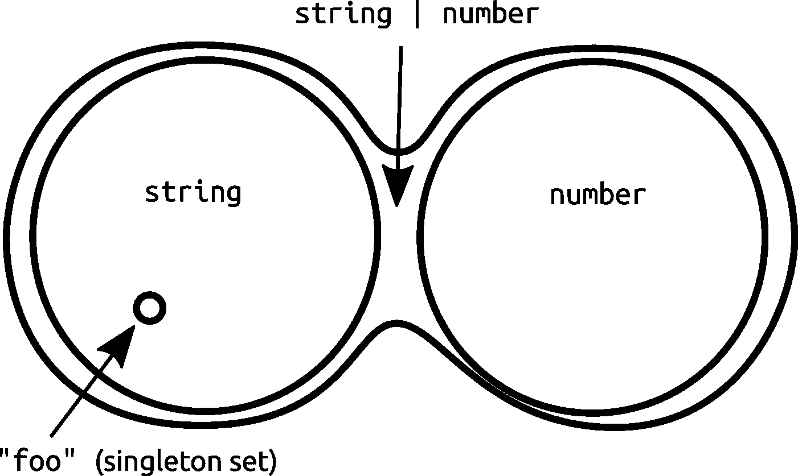
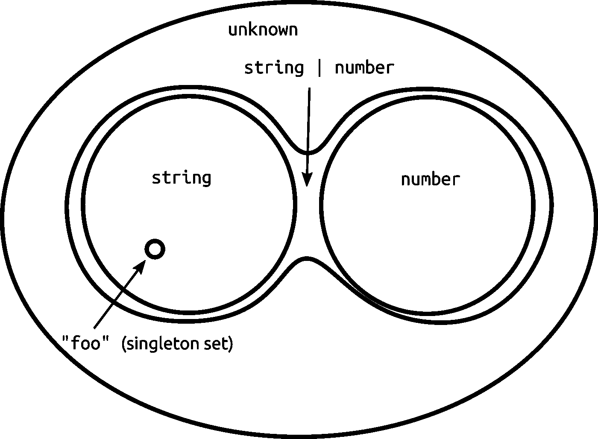
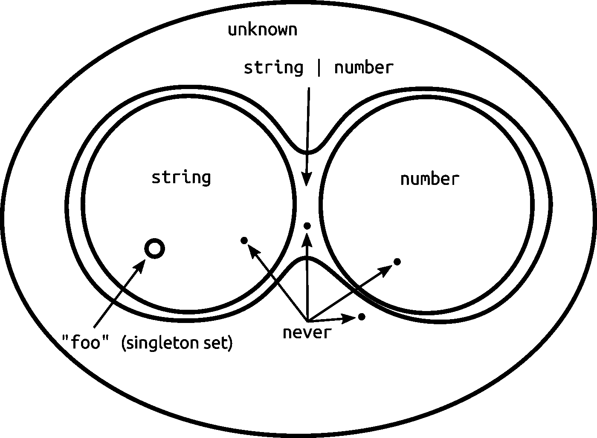

# 在 TypeScript - LogRocket 博客中何时使用“从不”和“未知”

> 原文：<https://blog.logrocket.com/when-to-use-never-and-unknown-in-typescript-5e4d6c5799ad/>

### 用集合论解释的类型

当你深入到一个基本定义时，一个*类型*就是一组可能的值，仅此而已。例如，TypeScript 中的类型`string`是所有可能字符串的集合。类型`Date`是`Date`类的所有实例的集合(加上所有结构兼容的对象)，类型`Iterable<T>`是为给定类型的迭代值实现 iterable 接口的所有对象的集合。

TypeScript 特别忠实于类型的集合论基础；在其他特性中，TypeScript 具有联合和交集类型。像`string | number`这样的类型被称为“联合”类型，因为它实际上是所有字符串集合和所有数字集合的联合。



The set `string | number` contains both the `string` and `number` sets.

因为`string | number`包含所有的`string`和所有的`number`值，所以它被称为`string`和`number`的超类型。

`unknown`是所有可能值的集合。任何值都可以赋给类型为`unknown`的变量。这意味着`unknown`是所有其他类型的超类型。`unknown`因此被称为*顶级*型。



The set `unknown` contains all other sets.

`never`是空集。没有可以分配给类型为`never`的变量的值。事实上，将值的类型解析为`never`是错误的，因为这将是一个矛盾。空集可以放入任何其他集，所以`never`是所有其他类型的子类型。这就是为什么`never`被称为*底*型。[](#4f3d)



The empty set, `never`, exists as a point inside every other set.

底部和顶部类型的有用属性是分别关于并集和交集操作的*标识元素*。对于任何类型`T`:

```
T | never ⇒ T
T & unknown ⇒ T
```

这类似于一个数字加零不会改变它的想法，同样的道理也适用于一个数字乘以一。零是加法的单位元，一是乘法的单位元。

具有空集的并集不会添加任何东西，所以`never`是关于并集的恒等式。交集选择两个集合之间的公共元素，但是`unknown`包含了一切，所以`unknown`是关于交集的同一性。

`never`是类型联合中唯一可以“分解”的类型，这使得它在某些情况下是不可或缺的，我们将在下一节中看到。

### 代表永远不会发生的事情

让我们编写一些发出网络请求的代码，但是如果请求时间太长，就会失败。我们可以通过使用`Promise.race`将网络响应的承诺与给定时间长度后拒绝的承诺结合起来。下面是构造第二个承诺函数:

```
function timeout(ms: number): Promise<never> {
  return new Promise((_, reject) =>
    setTimeout(() => reject(new Error("Timeout elapsed")), ms)
  )
}
```

注意返回类型:因为`timeout`从不调用`resolve`,所以我们可以为 promise 类型参数使用任何类型，不会有矛盾。但是最特别的类型是`never`。(我所说的“最具体”是指代表最小可能值集的类型)。

现在让我们看看`timeout`的实际情况:

```
async function fetchPriceWithTimeout(tickerSymbol: string): Promise<number> {
  const stock = await Promise.race([
    fetchStock(tickerSymbol), // returns `Promise<{ price: number }>`
    timeout(3000)
  ])
  return stock.price
}
```

这个很好用。但是编译器如何从那个`Promise.race`调用中推断出正确的返回类型呢？`race`返回单个承诺以及第一个承诺结算的结果或失败。在这个例子中，`Promise.race`的签名是这样的:

```
// `Promise.race` specialized for two inputs.
// The real signature is more general than this.
function race<A, B>(inputs: [Promise<A>, Promise<B>]): Promise<A | B>
```

输出承诺中解析值的类型是输入解析类型的并集。上面的例子结合了`fetchStock`和`timeout`，所以输入承诺解析类型是`{ price: number }`和`never`，输出解析类型(变量`stock`的类型)应该是`{ price: number } | never`。因为`never`是相对于 unions 的恒等式，该类型简化为`{ price: number }`，这正是我们想要的。

如果我们使用除了`never`之外的任何类型作为`timeout`中返回类型的参数，事情就不会这么简单了。如果我们使用了`any`，我们将失去类型检查的好处，因为`{ price: number } | any`等同于`any`。

如果我们使用了`unknown`，那么`stock`的类型将会是`{ price: number } | unknown`，简化为`unknown`。在这种情况下，如果不进一步缩小类型，我们将无法访问`price`属性，因为关于`price`属性存在的信息将会丢失。

### 使用``never`删除条件类型

你会经常看到在[条件类型](https://www.typescriptlang.org/docs/handbook/advanced-types.html#conditional-types)中使用`never`来删除不想要的案例。例如，这些条件类型从函数类型中提取参数和返回类型:

```
type Arguments<T> = T extends (...args: infer A) => any ? A : never
type Return<T> = T extends (...args: any[]) => infer R ? R : never

function time<F extends Function>(fn: F, ...args: Arguments<F>): Return<F> {
  console.time()
  const result = fn(...args)
  console.timeEnd()
  return result
}
```

如果`T`是一个函数类型，那么编译器推断它的参数类型或者返回类型。但是如果`T`不是一个函数类型，那么对于`Arguments<T>`或者`Return<T>`来说就没有合理的结果。我们在每个条件的 else 分支中使用`never`,使该情况成为错误:

```
// Error: Type '3' is not assignable to type 'never'.
const x: Return<"not a function type"> = 3
```

条件修剪对于缩小联合类型也很有用。TypeScript 的库包括从联合类型中移除了`null`和`undefined`的`NonNullable<T>`类型([源](https://github.com/Microsoft/TypeScript/blob/eb2297df022f6b1f284aff96e93c06097bb01ea5/lib/lib.es5.d.ts#L1459))。定义如下:

```
type NonNullable<T> = T extends null | undefined ? never : T;
```

这是因为条件类型[将](https://www.typescriptlang.org/docs/handbook/advanced-types.html#distributive-conditional-types)分布在类型联合上。给定形式为`T extends U ? X : Y`的任何类型，当联合类型替换`T`时，该类型会扩展以将条件分布到该联合类型的每个分支:

```
// if T = A | B

T extends U ? X : T == (A extends U ? X : A) | (B extends U ? X : B)
```

在每个联合分支中，`T`的每一次出现都被替换联合类型中的一个成分替换。如果`T`出现在 true case 而不是 false case 中，或者出现在更大的类型表达式中，这也适用:

```
// if T = A | B

T extends U ? SomeGeneric<T> : Y
  == (A extends U ? SomeGeneric<A> : Y) | (B extends U ? SomeGeneric<B> : Y)
```

所以像`NonNullable<string | null>`这样的类型按照以下步骤进行解析:

```
NonNullable<string | null>
  // The conditional distributes over each branch in `string | null`.
  == (string extends null | undefined ? never : string) | (null extends null | undefined ? never : null)

  // The conditional in each union branch is resolved.
  == string | never

  // `never` factors out of the resulting union type.
  == string
```

结果是给定一个联合类型`NonNullable<T>`产生一个潜在的缩小类型，使用`never`来删除不需要的联合分支。

### 对于可以是任何值的值，使用``unknown`

任何值都可以赋给类型为`unknown`的变量。因此，当一个值可能有任何类型，或者不方便使用更具体的类型时，就使用`unknown`。例如，一个漂亮的打印函数应该能够接受任何类型的值:

```
function prettyPrint(x: unknown): string {
  if (Array.isArray(x)) {
    return "[" + x.map(prettyPrint).join(", ") + "]"
  }
  if (typeof x === "string") {
    return `"${x}"`
  }
  if (typeof x === "number") {
    return String(x)
  } 
  return "etc."
}
```

你不能直接用一个`unknown`值做很多事情。但是您可以使用类型保护来缩小类型，并对缩小类型上的代码块进行准确的类型检查。

在 TypeScript 3.0 之前，编写`prettyPrint`的最佳方式是使用`any`作为`x`的类型。类型收缩处理`any`的方式与处理`unknown`的方式基本相同；所以编译器可以检查我们是否正确地使用了`map`和`join`，在这种情况下`x`被缩小为一个数组类型，而不管我们是使用`any`还是`unknown`。但是使用`unknown`将拯救我们，如果我们犯了一个错误，我们认为类型已经被缩小，但实际上，它没有:

```
import isArray from "isarray"

function prettyPrint(x: any): string {
  if (isArray(x)) { // whoops - this `isArray` is not a type guard!
    return "[" + x.mop(prettyPrint).join(", ") + "]"
  }
  /* snip */
  return "etc."
}
```

isarray 包不包含将`isArray`函数转变为类型保护的类型定义。但是我们可能在没有意识到细节的情况下使用 isarray。因为`isArray`不是一个类型守卫，而我们用`any`做`x`的类型，`x`的类型在`if`体内依然是`any`。因此，编译器不会捕捉到这个版本的`prettyPrint`中的错别字。如果`x`的类型是`unknown`，我们会得到这个错误:

> *对象属于“未知”类型。*

此外，使用`any`会让你通过执行不一定安全的操作来作弊。让你保持诚实。

### 如何在``never``、``unknown``、``any``之间选择

`prettyPrint`中的类型`x`和`timeout`的返回类型中的承诺类型参数都是值可以有任何类型的情况。不同之处在于，在`timeout`中，promise resolution 值可以是任何类型，因为它永远不会存在。

*   在没有或不应该有值的位置使用`never`。
*   在有值的地方使用`unknown`,但是它可能有任何类型。
*   避免使用`any`，除非你真的需要一个不安全的逃生出口。

一般来说，使用最具体的类型将工作。`never`是最具体的类型，因为没有比空集更小的集合。`unknown`是最不具体的类型，因为它包含所有可能的值。`any`不是一个集合，它破坏了类型检查；所以，尽可能假装它不存在。