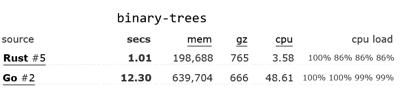
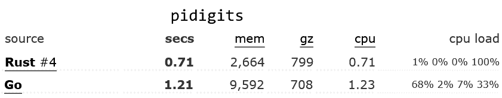
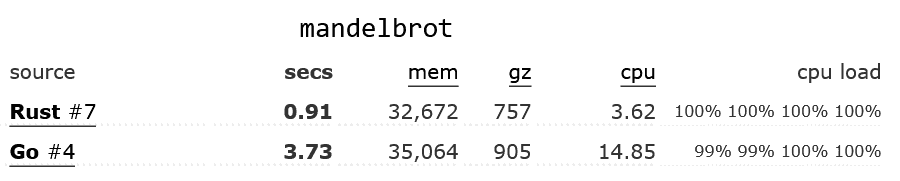

# 何时使用 Rust，何时使用 Go 

> 原文：<https://blog.logrocket.com/when-to-use-rust-when-to-use-golang/>

***编者按:**本文更新于 2022 年 6 月 1 日，以反映更多关于 Rust 和 Go 的最新信息。*

从一开始， [Go](https://blog.logrocket.com/tag/go/) 和 [Rust](https://blog.logrocket.com/tag/rust/) 就有明显的区别。Go 更注重构建可以无限扩展的 web APIs 和小型服务，尤其是借助 [Goroutines](https://blog.logrocket.com/concurrency-patterns-golang-waitgroups-goroutines/) 的强大功能。对于 Rust 来说，后者也是可能的，但是从开发者体验的角度来看，事情要困难得多。

Rust 非常适合处理大量数据和其他 CPU 密集型操作，如执行算法。这是 Rust 相对于 Go 的最大优势；要求高性能的项目通常更适合 Rust。

在本教程中，我们将比较 Go 和 Rust，评估每种编程语言的性能、并发性、内存管理和整体开发人员体验。我们还将对这些元素进行概述，以帮助您一眼就能为项目选择正确的语言。

如果你刚开始接触 Rust，在你进一步阅读之前，最好先温习一下[这本初学者指南](https://blog.logrocket.com/getting-up-to-speed-with-rust/)。

如果你们都赶上了，让我们开始吧！

### 内容

## 表演

Go 最初由谷歌的工程师设计，于 2009 年向公众推出。它的创建是为了提供一个 C++的替代品，更容易学习和编码，并优化运行在多核 CPU 上。

从那以后，对于那些想利用这种语言提供的并发性的开发人员来说，Go 是一个很好的选择。该语言提供了 Goroutines，使您能够将函数作为子流程运行。

Go 的一个很大的优势是你可以很容易地使用 Goroutines。简单地将`go`语法添加到一个函数中，就可以使它作为一个子进程运行。Go 的并发模型允许您跨多个 CPU 内核部署工作负载，使其成为一种非常高效的语言:

```
package main

import (
    "fmt"
    "time"
)

func f(from string) {
    for i := 0; i < 3; i++ {
        fmt.Println(from, ":", i)
    }
}

func main() {

    f("direct")

    go f("goroutine")
    time.Sleep(time.Second)
    fmt.Println("done")
}

```

Rust 从一开始就被设计成高性能的——事实上，这是对“为什么是 Rust？”的第一个回答在 Rust 网站上！Rust 处理内存管理的方式意味着它不需要垃圾收集器，不像 Go，引用的使用让对象很容易传递，而不需要复制。

## Rust 与 Go 基准测试

单个基准可能是可博弈的，也很难解释。[基准测试游戏](https://benchmarksgame-team.pages.debian.net/benchmarksgame/fastest/rust-go.html)通过允许每种语言使用多个程序来处理这个问题，并比较它们运行的时间以及内存使用和代码复杂性，以更好地了解语言之间的权衡。

对于所有被测试的算法，最优化的 Rust 代码比最优化的 Go 代码至少快 30 %,在许多情况下甚至更快；对于[二叉树](https://benchmarksgame-team.pages.debian.net/benchmarksgame/performance/binarytrees.html)基准测试，优化最多的 Rust 代码比优化最多的 Go 代码快 12 倍！在许多情况下，即使优化程度最低的 Rust 代码也比优化程度最高的 Go 代码快。

以下是一些优化的 Rust and Go 代码示例:







## 可量测性

这两种语言都擅长利用多个 CPU 并行处理数据。在 Go 中，你可以使用一个 Goroutine 来处理每一段数据，并使用一个`WaitGroup`来等待它们全部完成。在 Rust 中， [rayon](https://docs.rs/rayon/) 是一个非常方便的板条箱，可以很容易地并行迭代一个容器。

## 并发

如上所述，Go 支持并发。例如，假设您正在运行一个处理 API 请求的 web 服务器。您可以使用 Go 的 Goroutines 将每个请求作为一个子进程来运行，通过将任务卸载到所有可用的 CPU 内核来最大化效率。

Goroutines 是 Go 内置函数的一部分，而 Rust 只接收了原生的 async/await 语法来支持并发。因此，当涉及到并发时，开发人员体验优势将会消失。然而，Rust 在保证内存安全方面要好得多。

下面是一个简化螺纹生锈的例子:

```
use std::thread;
use std::time::Duration;

fn main() {
   // 1\. create a new thread
   for i in 1..10 {
      thread::spawn(|| {
         println!("thread: number {}!", i);
         thread::sleep(Duration::from_millis(100));
      });
   }

  println!("hi from the main thread!");
}

```

并发一直是开发者的棘手问题。在不损害开发人员体验的情况下保证内存安全的并发性并不是一件容易的事情。然而，这种极端的安全关注导致了[可证明正确的并发性](https://blog.rust-lang.org/2015/04/10/Fearless-Concurrency.html)的产生。

Rust 试验了所有权的概念，以防止未经请求的资源访问，从而防止内存安全错误。Rust 提供了四种不同的并发范例来帮助您避免常见的内存安全隐患。在接下来的小节中，我们将仔细研究两个常见的范例:通道和锁。

### 频道

一个[通道](https://doc.rust-lang.org/stable/rust-by-example/std_misc/channels.html)帮助将消息从一个线程传输到另一个线程。虽然这个概念也存在于 Go 中，但是 Rust 允许你将一个[指针](https://doc.rust-lang.org/std/primitive.pointer.html)从一个线程转移到另一个线程，以避免资源竞争。通过传递指针，Rust 可以加强通道的线程隔离。Rust 再次展示了它对并发模型中内存安全的痴迷。

### 锁

仅当[锁](https://doc.rust-lang.org/std/sync/struct.Mutex.html)被保持时，数据才可被访问。Rust 依靠的是锁定数据而不是 cod 的原理，这种原理在 Java 等编程语言中很常见。

有关所有权概念和所有并发范例的更多详细信息，请查看“[使用 Rust](https://blog.rust-lang.org/2015/04/10/Fearless-Concurrency.html) 的无畏并发”

## 内存安全

早期的所有权概念是 Rust 的主要卖点之一。Rust 将类型安全提升到了一个新的高度，这对于支持内存安全的并发性也很重要。

根据 [Bitbucket 博客](https://bitbucket.org/blog/why-rust)，“Rust 非常严格和迂腐的编译器会检查你使用的每个变量和引用的每个内存地址。它避免了可能的数据竞争情况，并通知您未定义的行为。”

这意味着你不会因为 Rust 对内存安全的极度痴迷而导致缓冲区溢出或竞争情况。然而，这也有它的缺点。例如，在编写代码时，您必须对内存分配原则非常敏感。时刻保持记忆安全并不容易。

## 开发者体验

首先，我们来看看每种语言相关的学习曲线。Go 的设计考虑到了简单性。开发者经常称它为“无聊”的语言，也就是说它有限的内置特性使得 Go 很容易被采用。

此外，Go 提供了一个比 C++更简单的替代方案，隐藏了内存安全和内存分配等方面。Rust 采用了另一种方法，迫使你去思考诸如内存安全之类的概念。所有权的概念和传递指针的能力使得 Rust 不再是一个吸引人的学习选择。当你不断地考虑内存安全时，你的工作效率会更低，你的代码肯定会更复杂。

与围棋相比，Rust 的学习曲线相当陡峭。然而，值得一提的是，与 Python 和 JavaScript 等更动态的语言相比，Go 的学习曲线更加陡峭。

## 开发周期

对于现代软件开发人员来说，能够快速迭代是非常重要的，能够让多人参与同一个项目也是如此。Go 和 Rust 以稍微不同的方式实现这些目标。

Go 语言编写和理解起来非常简单，这使得开发人员很容易理解彼此的代码并对其进行扩展。然而，在 Go 代码中，你必须非常小心错误检查和避免`nil`访问；编译器在这里没有提供太多的帮助，所以隐式地理解哪些变量可能是`nil`，哪些肯定不是`nil`。

Rust 代码更难编写和编译；开发人员必须对引用和生存期等有很好的理解才能成功。然而，Rust 编译器在捕捉这些问题方面做得非常好。(并且发出非常有用的错误信息——在最近的一项调查中[90%的 Rust 开发者认可它们](https://blog.rust-lang.org/2022/02/15/Rust-Survey-2021.html#challenges-ahead)！)所以虽然“一旦你的代码编译了，它就是正确的！”对于任何一种语言都不成立，对于 Rust 来说更接近于成立，这给了其他开发人员更多的信心来迭代现有的代码。

## 特征

这两种语言都有各种各样的特性。正如我们在上面看到的，Go 内置了对许多有用的并发机制的支持，主要是 Goroutines 和 channels。该语言支持接口，并且从 2022 年 3 月发布的 Go v1.18 开始支持泛型。但是，Go 不支持继承、方法或操作符重载，也不支持断言。因为 Go 是在 Google 开发的，所以毫不奇怪 Go 对 HTTP 和其他 web APIs 有很好的支持，而且还有一个由 Go 包组成的[大型生态系统](https://pkg.go.dev/)。

Rust 语言比 Go 语言功能更加丰富；它支持 traits(一个更复杂的接口版本)、泛型、宏和针对可空类型和错误的丰富内置类型，以及用于简单错误处理的`?` [操作符](https://blog.logrocket.com/understanding-rust-option-results-enums/#using-operator)。从 Rust 调用 C/C++代码也比从 Go 调用更容易。Rust 也有一个由板条箱组成的大型生态系统。

## 何时使用 Go

Go 适用于各种各样的用例，是创建 web APIs 的 Node.js 的绝佳替代品。正如[洛里斯·克罗](https://kristoff.it/blog/why-go-and-not-rust/)所说，“Go 的并发模型非常适合必须处理多个独立请求的服务器端应用”。这正是 Go 提供 Goroutines 的原因。

更重要的是，Go 内置了对 HTTP web 协议的支持。您可以使用内置的 HTTP 支持快速设计一个小 API，并将其作为微服务运行。所以 Go 非常契合微服务架构，服务于 API 开发者的需求。

简而言之，如果您重视开发速度，并且喜欢语法简单而不是性能，那么 Go 是一个很好的选择。最重要的是，Go 提供了更好的代码可读性，这是大型开发团队的一个重要标准。

在以下情况下选择“开始”:

*   你关心简单性和可读性
*   您需要一种简单的语法来快速编写代码
*   您希望使用一种支持 web 开发的更灵活的语言

## 何时使用铁锈

当性能很重要时，Rust 是一个很好的选择，比如当你处理大量数据时。此外，Rust 让您能够更好地控制线程的行为以及线程之间如何共享资源。

另一方面，Rust 具有陡峭的学习曲线，并且由于内存安全的额外复杂性而降低了开发速度。这不一定是缺点；Rust 还保证你不会遇到内存安全错误，因为编译器会检查每一个数据指针。对于复杂的系统，这种保证可以派上用场。

在以下情况下选择生锈:

*   你关心性能
*   您希望对线程进行细粒度的控制
*   比起简单性，你更看重内存安全

## 围棋 vs .铁锈:我的真实看法

让我们从强调相似之处开始。Go 和 Rust 都是开源的，旨在支持微服务架构和并行计算环境。两者都通过并发优化了可用 CPU 内核的利用率。

但是说到底，哪种语言最好呢？

有许多方法可以解决这个问题。我建议考虑一下你想要构建什么类型的应用程序。Go 非常适合创建 web 应用程序和 API，这些应用程序和 API 在支持微服务架构的同时利用了其内置的并发特性。

你也可以使用 Rust 来开发一个 web API，但是它并没有考虑到这个用例。Rust 对内存安全的关注增加了复杂性和开发时间，尤其是对于一个相当简单的 web API。但是，对代码的更大控制允许您编写更优化、更节省内存和更高性能的代码。

尽可能简单地说，Go 对 Rust 的争论实际上是简单性对安全性的问题。

## [log rocket](https://lp.logrocket.com/blg/rust-signup):Rust 应用的 web 前端的全面可见性

调试 Rust 应用程序可能很困难，尤其是当用户遇到难以重现的问题时。如果您对监控和跟踪 Rust 应用程序的性能、自动显示错误、跟踪缓慢的网络请求和加载时间感兴趣，

[try LogRocket](https://lp.logrocket.com/blg/rust-signup)

.

[](https://lp.logrocket.com/blg/rust-signup)

LogRocket 就像是网络和移动应用程序的 DVR，记录你的 Rust 应用程序上发生的一切。您可以汇总并报告问题发生时应用程序的状态，而不是猜测问题发生的原因。LogRocket 还可以监控应用的性能，报告客户端 CPU 负载、客户端内存使用等指标。

现代化调试 Rust 应用的方式— [开始免费监控](https://lp.logrocket.com/blg/rust-signup)。