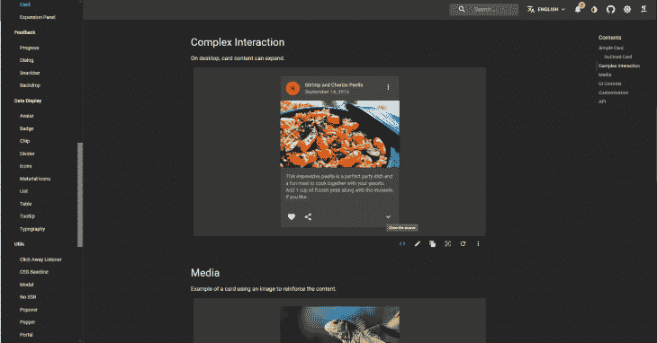
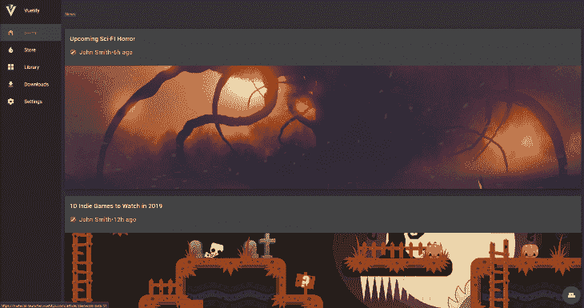
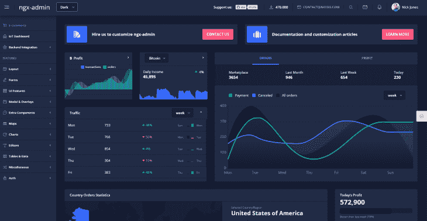
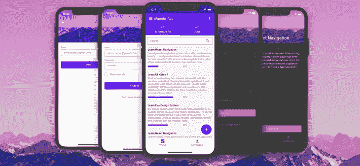
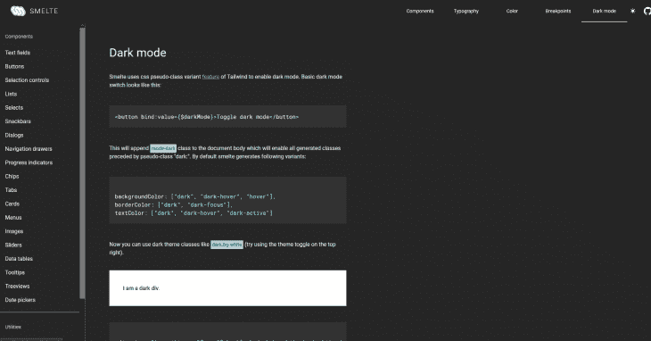
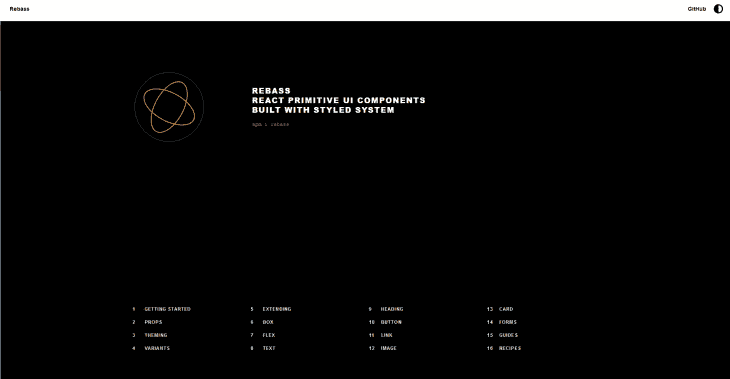
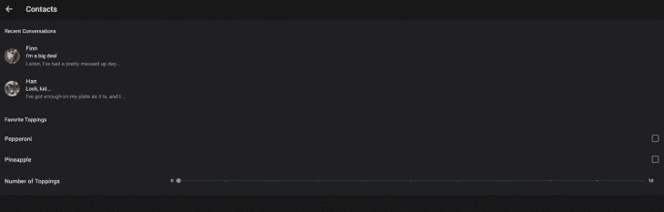
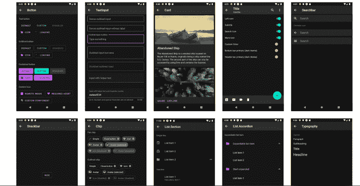

# 哪些 UI 库支持黑暗模式？- LogRocket 博客

> 原文：<https://blog.logrocket.com/which-ui-libraries-support-dark-mode/>

如今，黑暗模式是 web、桌面和移动应用程序中经常请求的功能。

通过添加可定制的界面来改善开发人员在 UI 库中的体验是非常重要的，这可以促使许多开发人员使用特定的 UI 库。

下面是一些已知的支持黑暗模式的 UI 库。



有了 GitHub 上的 57k+ stars，React JS 的材质设计 UI 框架有了一个简单的、面向开发者的、可扩展的主题化工具。它基于著名的 CSS-in-JS，使开发人员能够在三种不同风格的 API 之间进行选择，这三种 API 属于相同的底层概念。

任何熟悉 Material UI 的开发人员都可以证明，它的主题化和调色板管理功能是生态系统中最好的。

遵循[主题化文档](https://material-ui.com/customization/theming/)，我们可以很容易地在一个基本的材质 UI 应用上添加一个黑暗主题。

此外，当我们访问文档时，我们能够切换亮/暗模式和切换调色板，以帮助可视化所有提供的具有不同主题的材料组件。



在 GitHub 上拥有 25k+颗星，Vuetify 是 Vue 中极其受欢迎的 UI 框架。

它是众所周知的，因为它充分利用了 Vue API。在 Vuetify 上，主题系统构建得非常好。给你的网络应用一个黑暗的主题是非常容易的。

Vuetify 支持材质设计规范的亮暗两种变体。

这种指定从根应用程序组件`v-app`开始，并得到大多数组件的支持。默认情况下，您的应用程序将使用浅色主题，但这可以通过在主题服务中添加深色选项来轻松覆盖。

当您将一个组件指定为亮或暗时，除非另外指定，否则它的所有子组件都将继承并应用相同的组件。您可以通过将`this.$vuetify.theme.dark`更改为 true 或 false 来手动打开和关闭黑暗。

定制也很容易做到和可用。



基于 [Eva 设计系统](https://eva.design/)的 Nebular 是 Angular 中最美的 UI 库之一。

星云非常注重其组成部分的美丽和 UX。星云船与一个完全可定制的默认主题，宇宙主题，企业主题和黑暗主题。



UI Kitten 是一个基于 Eva 设计系统(移动版 Nebular)的 React 原生 UI 库。它有 25 个以上的通用组件，并且有一个类似于 Nebular 的主题化系统。他们有一个[入门应用](https://github.com/akveo/kittenTricks)，用 40 个明暗主题的屏幕展示他们的组件。



Smelte 是一个 [SvelteJS](https://svelte.dev/) UI 框架，建立在 [TailwindCSS](https://tailwindcss.com/) 之上，遵循材料设计指南。你知道给 Smelte 加个黑暗模式有多容易吗？这就像在你的 Smelte options 对象中添加`darkMode:true`一样简单。

此外，你可以任意切换这个设置，也可以在黑暗模式开启时自定义外观。


随着 GitHub 上超过 15k 的星星和 npm 上超过 100k 的每周下载量，很明显 Blueprint UI 将在 2020 年对 UI 库产生影响。

然而，它脱颖而出的原因是因为它能够如此轻松地切换到黑暗模式。这甚至展示在[他们的文档](https://blueprintjs.com/docs/)中，你可以通过按`shift` + `D`来切换明暗主题。

Blueprint v3 附带了两种 UI 颜色主题。要应用深色主题，我们只需将类`bp3-dark`应用到一个容器元素，以主题化所有嵌套的子元素。使用我们前面提到的开关，所有的组件都可以在两个主题中看到。



Rebass 如此专注于制作主题化组件，以至于他们的口头禅是“我们的组件都是在考虑主题化的情况下构建的。”这是非常真实的。它们提供了一个简单的主题 API。Rebass 因为在风格上不固执己见而受人喜爱。

你可以按照文档中的[主题指南定制你的应用主题。](https://rebassjs.org/getting-started#themeprovider)

你可以在 Rebass 文档的[演示部分](https://rebassjs.org/demo/)玩 Rebass 的主题


Chakra UI 是一个简单的、模块化的、可访问的组件库，它为您提供了构建 React 应用程序所需的所有构件。

Chakra 的主题化界面可以帮助开发者在整个应用程序中快速引用定制主题的值。

它提供了一个明智的[默认主题](https://github.com/chakra-ui/chakra-ui/blob/master/packages/chakra-ui/src/theme),灵感来自于 Tailwind CSS，可以根据你的设计进行定制。

它的大部分组件都是黑暗模式兼容的，它使用了一个[定制的反应钩子](https://chakra-ui.com/color-mode) : `useColorMode`，它的值存储在`localStorage`中，在页面加载时使用。

## 更大的

Tailwind CSS 是一个流行的 CSS 框架。它是高度可定制的，并为您提供构建设计所需的所有必要构件。

不幸的是，顺风没有自带黑暗模式。然而，其令人敬畏的社区提出了一个[黑暗模式插件](https://github.com/ChanceArthur/tailwindcss-dark-mode)，它可以与该库耦合，以帮助开发人员引入黑暗模式支持。

这个插件有[个变体](https://github.com/ChanceArthur/tailwindcss-dark-mode#available-variants)，它们和 Tailwind 的工作方式一样，可以完全定制风格。

Quasar framework 是一个基于 Vue.js 的框架，允许开发者快速创建多种风格的网站、移动和桌面应用。

Quasar 框架附带了许多组件、指令、插件和扩展，这将帮助你构建令人敬畏的应用。

幸运的是，Quasar 有一个[黑暗模式插件](https://quasar.dev/quasar-plugins/dark#Introduction)，它是自动安装的，相对容易操作。

这个插件可以很好地运行基本的 Vue 应用和 SSR 构建。

### 移动的

在跨平台移动框架上也有支持黑暗模式的 UI 库。这是使用各种框架的开发人员经常要求的特性。



Ionic 已经存在很长时间了，所以它的开发者明白跨平台移动在审美方面需要什么。

Ionic 现在可以非常容易地改变你的应用程序的主题，包括支持深色方案。

随着原生应用对黑暗模式的支持越来越多，Ionic 开发者现在希望将它添加到他们的应用中，以支持用户偏好。此外，Ionic 不仅是一个移动用户界面库，而且它在 web 应用程序上也非常好用

在 Ionic 中，添加配色方案首选项就像为 CSS 编写媒体查询一样简单:

```
@media (prefers-color-scheme: dark) {
  :root {
    /* dark mode variables go here */
  }
}
```



[Paper](https://callstack.github.io/react-native-paper/) 是 React Native 的一组可定制和可生产的组件，遵循 Google 的材料设计准则。它有一组设计非常好的组件，可以很容易地集成到 React Native 中。

由于 Paper v3 [支持黑暗模式](https://callstack.github.io/react-native-paper/theming.html#dark-theme)，这是一个非常坚实的点，推动了对这个库的巨大关注。

## 结论

黑暗模式是对应用程序用户体验的巨大改进。因此，创建支持开箱即用的工具将使开发人员的生活更加轻松。