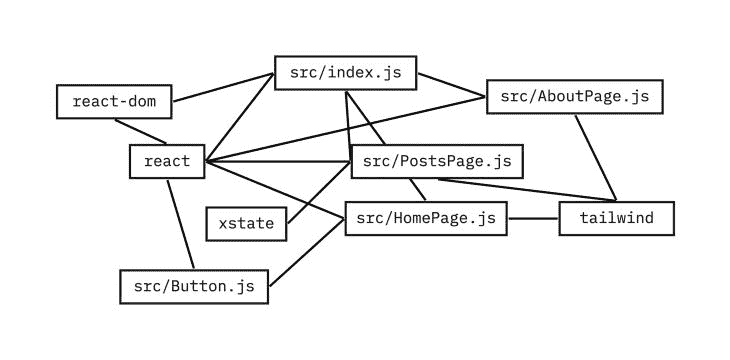

# Snowpack 与 webpack:构建工具比较

> 原文：<https://blog.logrocket.com/why-and-how-to-use-snowpack-instead-of-webpack/>

***编者按:**这篇文章于 2022 年 3 月 14 日更新，包含了与 Snowpack v3 和 webpack v5 相关的信息。*

很少有工具像 webpack 一样对 JavaScript 生态系统如此重要。JavaScript 模块 bundler 于 2012 年推出，是现代 JavaScript 的基石和工程壮举。如果没有 webpack 带来的想法，JS 生态系统就不会有今天。 [Snowpack](https://www.snowpack.dev) 于 2019 年推出，作为现代 JavaScript 应用的下一代构建工具。它允许开发人员编写最新的 ESNext JavaScript，无需配置，工具更简单，构建速度极快。

在没有从 webpack 在推动 JS 开发工具生态系统方面的遗产和影响中带走任何东西的情况下，许多开发人员问“Snowpack 能取代 webpack 吗？”就不足为奇了承认这两种工具出现在 JavaScript 发展的不同时期是很重要的。webpack 是在 ES 模块(ESM)存在之前推出的，Snowpack 是在现代浏览器支持 ESM 和 ESNext 的时候推出的。

那么，考虑到所有这些，并从今天的生态系统的角度来看，Snowpack 和 webpack 的表现如何呢？从一个切换到另一个有多容易？本文将尝试通过详细比较这两种工具的特性和优点来解决所有这些问题。我们还将分享一个开始使用 Snowpack 的指南。我们开始吧！

目录

在这里听我们关于 Snowpack 和 webpack 的播客。

**先决条件**

## 对于本文的演示部分，您需要以下内容:

用 [ESM 就绪代码](https://www.pika.dev/)编写的 JavaScript 应用

*   支持 ES 模块语法的现代浏览器，比如最近发布的 Chrome、Firefox 或 Edge
*   ***N.B.*** ，现代浏览器的要求只适用于开发环境。一旦你用 Snowpack 创建了最终版本并将其推向生产，用户可以在任何现代或传统浏览器中查看你的站点。更多细节可以在[这里](https://www.snowpack.dev/concepts/build-pipeline#legacy-browser-support)找到。

Snowpack 是如何工作的？

## Snowpack 使用 JavaScript 的 es 模块系统，将文件更改直接即时写入浏览器，无需等待时间。与 webpack 这样的捆绑器不同，Snowpack 只需构建一次文件，然后缓存文件。它只需要在发生更改时重建一个文件，并且重建只针对该单个文件。这被称为[非捆绑开发](https://www.snowpack.dev/concepts/how-snowpack-works#unbundled-development)，与 webpack 和旧的构建工具中的传统捆绑开发相反。稍后会有更多的细节。

webpack 是如何工作的？

## webpack 是一个模块捆绑器，它获取大量的 JavaScript 文件，并将其转换为一个输出文件或几个较小的文件，您可以使用这些文件来运行您的应用程序。

webpack 创建一个依赖图来管理模块之间的依赖关系。随着加载器的加入，该工具还可以捆绑除 JavaScript 之外的其他文件类型，如 CSS、PNG、JPG 等等。这有效地允许您将所有静态资产——连同您的 JavaScript——添加到依赖关系图中，这节省了您手动管理每个依赖关系的额外工作。

配置和学习曲线

## 众所周知，webpack 很难配置，尤其是对于初学者。但同样重要的是要记住，webpack 能够做非常大、非常强大的东西，因此使用所有这些功能需要一些配置和知识是有道理的。尽管如此，即使在今天，也没有简单的命令来设置一个“简单”的 webpack，它仍然需要很高的学习曲线，并理解它对大多数人的作用。

相比之下，Snowpack 不需要对大多数 JavaScript 应用进行任何配置。使用 [include](https://www.snowpack.dev/#automatic-installs-(recommended)) 标志，您只需告诉它扫描您的哪些文件中的导入，如下所示:

就是这样！假设您的 JavaScript 文件都是有效的 ESNext(即没有 JSX 或特殊语法)，它将安装您的所有依赖项，您可以将代码直接发送到浏览器/产品。但是关于 ES 模块的话题，你可能没有意识到大多数开发人员编写的导入并没有严格遵循 ESM 规范。

```
npx snowpack --include './src/**.js'

```

让我们看看如何编写有效的 ESM 导入:

虽然大多数开发人员写的是`react`，而不是`react.js`，但是如果没有文件扩展名，浏览器就无法理解它，因为它不是一个有效的 URL。Snowpack 允许你将 npm 包捆绑成单个文件，所以它可以生成浏览器可以理解的扩展的`react.js`。虽然这可能是您的代码库的一个变化，幸运的是，它可以像几个查找并替换命令一样简单(例如，用`'/web_modules/react.js'`替换`'react'`)。

```
-import React from 'react'; // 🚫 invalid ESM
+import React from '/web_modules/react.js'; // ✅ valid ESM

```

当谈到替代语法时，如`.jsx`、`.vue`或`.svelte`，Snowpack 有一些[入门项目](https://github.com/pikapkg/snowpack-init)，可以帮助你在那里开始运行。根据设置的不同，这可能意味着与 webpack 相同的配置级别，或者稍低一点！但是使用 Snowpack 很少会导致更多的管理。

**优势:🗻积雪场**

如果您在想“等等 ESM 导入可以在任何 URL 进行吗？哪怕是远程的？”那你就有大发现了！ESM 可以使用远程 URL，我们将在下面的使用 CDN 部分回到这一点。

> 建筑开发

## 说到捆绑，Snowpack 可以帮助构建处理，而不需要复杂的配置步骤。有了 Snowpack，我们只需要构建每个文件一次，然后文件就永远被缓存了。这意味着 Snowpack 只在我们监视的文件发生全局变化时才重建单个文件。这不同于我们习惯于使用的旧捆绑工具，如 webpack 和 [Parcel](https://parceljs.org) ，当单个文件发生变化时，它们会重建所有文件。

本质上，Snowpack 支持“非捆绑开发”流程，在开发模式下，只有被更改或更新的单个文件被发送到生产环境中。这都是因为 ESM 导入和导出语法。与其他构建工具不同，它们专注于“捆绑开发”。这意味着，我们所做的每一项更改都必须与应用程序中未更改的部分捆绑在一起，然后才能在浏览器中反映出来。

**优势:🗻积雪场**

构建时间

## webpack 是一个转换代码的捆绑器。Snowpack 是一个安装时工具，不做任何事情。webpack 的捆绑能力虽然令人印象深刻，但也是有代价的，这意味着每次点击 save ( [时都要等待 JavaScript 代码，而在大型应用程序上，这可能需要一分多钟来构建](https://medium.com/onfido-tech/speed-up-webpack-ff53c494b89c)！😱).

直接为浏览器编写 ES 模块意味着无需等待，并且可以立即预览您的代码。webpack 在每次保存时运行，而 Snowpack 只在安装新的 npm 包时运行。

更糟糕的是:通过捆绑，等待代码生成的时间与应用程序的大小成线性比例。也就是说，app 越大，等待的时间越长。但是有了 Snowpack，不管你的应用程序代码有多大，没有构建时间就意味着没有构建时间。乍看起来，节省几毫秒的时间似乎不多，但经过每天数百次的过程，几年后，这可能会成为你生命中的几个小时！

**优势:🗻积雪场**

贮藏

## 今天的大多数 JavaScript 应用程序都有 2MB 或更多的 JS。让用户下载并执行那么多的 JS 会让用户[的交互延迟很多秒](https://v8.dev/blog/cost-of-javascript-2019)。因此，如果这对于第一次访问是不可避免的，至少，用户在以后的访问中应该避免这种情况。webpack 的缓存策略围绕着[如何拆分代码](https://webpack.js.org/guides/code-splitting/)，或者不拆分。更改一行代码或一个依赖项将导致用户通过互联网重新下载大部分或全部代码。虽然您的 webpack 代码分割设置可以帮助减少这种情况，但在大多数情况下，它会导致用户重新下载比更改或更新的代码更多的代码。

但是 webpack 还有一个更大的危险等待着我们——重复代码！当您开始拆分您的包时，如果您没有使用 [webpack-bundle-analyzer](https://github.com/webpack-contrib/webpack-bundle-analyzer) 仔细分析它的所有内容，您很可能会有重复的代码。因此，如果用户访问你的应用程序，他们可能不仅会下载大量的 JS，还可能会多次下载！



Snowpack + ES 模块遵循不同的策略。您没有捆绑任何东西，而是选择向浏览器显示 ESM 导入树。因为浏览器了解你的应用程序结构，它可以有效地直接获取它需要的东西，并且只获取它需要的东西。浏览器完成所有的工作，不需要你投入任何时间。此外，复制代码或依赖项是不可能的。

因此，当使用 Snowpack + ESM 时，如果您更改了代码或 npm 依赖项，访问您站点的用户只需下载发生更改的确切文件和依赖项，仅此而已。如果`react`的版本改变了，用户下载`react`的新版本和它从缓存中取出的所有东西。说到缓存，Snowpack 真的大放异彩——在这方面，它几乎是*的完美之作。*

**优势:🗻积雪场**

webpack 的核心专长是捆绑，因此从设计上来说，它会尝试并组合任何代码和依赖项。很难配置 webpack，因为一个更改的文件只会导致用户重新下载该文件。我之所以说“近乎完美”,是因为 ESM 还无法让你的应用程序代码“摇树”(详见“摇树”一节)。

> 网络

## 如果你通读了这篇文章中的缓存部分，你可能会想到一个问题:webpack 和 Snowpack 在网络性能方面有何不同？加载网络资产是这两种工具之间最复杂、最有趣、最微妙的比较之一。

Snowpack 的作者 Fred K. Schott 在[一个没有网络包的未来](https://dev.to/pika/a-future-without-webpack-ago)中更详细地谈到了这个主题。但是简单来说，Snowpack + ESM 将导入树暴露给浏览器。这意味着浏览器下载并扫描一个`<script>`标签，然后在该文件中列出导入内容。然后，它扫描这些导入，以及这些导入的导入，直到到达“树”的最末端与 webpack 的捆绑相比，文件的爬行过程通常会导致更多的网络请求。但是要抓取的文件越多并不一定意味着速度越慢。

虽然减少你的请求数量看起来[像是捆绑](https://medium.com/webpack/webpack-http-2-7083ec3f3ce6)的一目了然的事情，而且，是的，捆绑文件几乎总是[提高每个单独文件的下载速度](https://medium.com/@asyncmax/the-right-way-to-bundle-your-assets-for-faster-sites-over-http-2-437c37efe3ff)，但现实是，现代 JS 应用程序的情况比网络请求的总和还要考虑更多的因素。其中包括:

你在应用中使用的异步语句越多，Snowpack 和 webpack 的性能就越好，因为 JS 抓取是由你的应用决定的，而不是工具

1.  考虑到“使用 CDNs”一节，你的应用程序利用 CDNs 越多，Snowpack 和 webpack 的表现也越相似
2.  如果使用积极获取资产的[服务工作者](https://developers.google.com/web/fundamentals/primers/service-workers/),那么 Snowpack 和 webpack 也将表现类似，因为加载行为是由它决定的
3.  让我们回顾一下，减少请求是 webpack 的亮点，但前提是您的应用程序包含对服务器上托管的其他模块的同步`import`语句。您提供的延迟加载代码越多，从远程 CDN 提供的模块越多，Snowpack 和 webpack 在请求数量和整体网络速度方面的表现就越相似。

更多来自 LogRocket 的精彩文章:

* * *

### **优势:📦webpack，但仅在初始无缓存加载时使用**

* * *

使用 cdn

## 可以说，ESM 最酷的特性是能够对远程模块使用`import`语句:

这是巨大的！尽管成千上万的网站使用 React，但大多数网站可能都有自己的版本，而不是使用 CDN，这意味着当你浏览网页时，你可能已经下载了数百次相同版本的 React，而且还在不断增加。尽管这不是网站的错——在 2020 年为 npm 依赖关系加载`<script>`标签是如此古老！它撤销了 es 模块给我们的所有工作。

```
import preact from 'https://cdn.pika.dev/preact';

// ┳┻|
// ┻┳|_    Psst…
// ┳┻|•.•) this is a really
// ┳┻|⊂ﾉ   big deal
// ┻┳|

```

但有了 ESM，你实际上可以从远程服务器加载模块——无论是像 [Pika](https://www.pika.dev/cdn) 这样的 CDN，还是你自己设置的普通 CDN。

所以积雪场是明显的赢家，对吗？没那么快！虽然，是的，Snowpack 确实支持远程模块开箱即用，但第三方 [webpack 插件](https://github.com/ScriptedAlchemy/webpack-external-import)已经出现，允许您从其他 webpack 捆绑包导入外部包。不过现在已经集成到了 [webpack v5 版本](https://webpack.js.org/blog/2020-10-10-webpack-5-release/)！想了解如何在 webpack 中原生导入远程 URL，看看 webpack 的[官方文档](https://webpack.js.org/concepts/)。万岁，CDN！

**优势:👯‍♂️两个！**

树摇晃

## 如果你对这个术语不熟悉的话，抖动树是从你的应用程序中移除不用的代码的过程。比方说你安装并导入了[重量级](https://bundlephobia.com/result?p=lodash@4.17.15) `lodash`包到你的 app 里，但是最后没有使用。那不应该对你不利，对吗？有了摇树，你的应用就可以小到不能再小了。webpack 实际上是摇树运动的典型代表。这是一个摇树怪兽，它为你做所有的事情，而不需要你配置任何东西。

但是仅仅因为 Snowpack 是一个安装时工具并不意味着它不能动摇！当你运行`snowpack--optimize`，它可以[树动摇你使用的依赖](https://www.snowpack.dev/#production-optimization)。诚然，Snowpack 不能动摇你的应用程序代码，但这也是因为它不接触你的应用程序代码。如果你的应用程序代码需要树抖动，你将不得不使用一个独立的工具 Snowpack，由 Rollup 驱动。但是公平的评价是对每一个工具，两棵树都动摇了他们管理的所有代码。

**优势:👯‍♂️两个！**

灵活性

## 最后一个值得比较的是灵活性。当谈到 Snowpack 与 webpack 时，它们各自可以处理多少种不同的设置和应用类型？每一个给你多少控制独特的设置？

虽然值得一提的是，Snowpack 确实可以让你使用常见的设置，如 [JSX +预动作](https://github.com/pikapkg/snowpack-init)或[苗条](https://github.com/jakedeichert/svelvet)，但当谈到 Snowpack 时，有两件重要的事情需要考虑:

Snowpack 需要 [ESM 就绪包](https://www.pika.dev/registry)，这意味着你只能使用[NPM 包的一小部分](https://www.pika.dev/about/stats)

1.  尽管在本文中已经多次提到，Snowpack 的设计不会触及你的应用程序代码；这要由你来配置
2.  Snowpack 旨在帮助您在不放弃 npm 包和 JS 生态系统的情况下，为浏览器编写 ESM 就绪代码。除此之外，就看你的了！

如果你需要处理代码转换，翻译，缩小，等等。然后 webpack 就有了你需要的所有工具。

webpack 不是唯一的工具——你可以单独使用 Babel，或 Rollup，或任何你需要的单独的东西，但当谈到“瑞士军刀”完整的包时，webpack 是无与伦比的。尽管灵活性是一个模糊不清的术语，但是无论您需要什么，可能都有一个 webpack 插件可以满足您的需求。

**优势:📦网络包**

Snowpack 比 webpack 好吗？

## 正如引言中所述，webpack 和 Snowpack 问世相隔七年，webpack 比它早了不少。两者都是在 JavaScript 历史的不同时期引入的。两者都试图解决引入时最普遍的问题。webpack 想给 JavaScript 一个模块系统，集成包管理，捆绑。Snowpack 希望清理工具，让浏览器在保持 npm 的同时处理 JavaScript 模块。同样，在比较它们时，不能低估 webpack 是一个里程碑式的成就，以及 webpack 在网络历史上是多么的基础(webpack 甚至有一个[维基百科页面](https://en.wikipedia.org/wiki/Webpack)——有多少开源项目可以这样说呢？).

也许你读到这篇文章的时候想知道“我应该用 webpack 还是 Snowpack 开始我的项目？”我会推荐 Snowpack，但前提是你可以使用 ESM 就绪的软件包(你可以在 [pika.dev](https://pika.dev/registry) 上搜索)。这是一个快速而轻松的过程，如果需要，您可以随时轻松地迁移到 webpack。但是根据你的需要，你可能会发现上面的一个比较是你项目的核心，可能会给你任何一个方向的提示。

**开始使用 Snowpack**

## 如果你决定在下一个 JavaScript 应用项目中尝试 Snowpack，请跟随我们的指南。我们将引导您完成迁移开发环境的步骤，并使用 Snowpack 启动和运行您的应用。

第一步。安装 Snowpack
使用以下安装命令安装带有 npm 或 yarn 的 Snowpack。请注意，Snowpack 的创建者建议尽可能在本地安装，而不是全局安装。

第二步。启动 Snowpack 命令行界面
有三种方法可以在本地运行 Snowpack CLI:

```
id="globalinstallation">global installation
npm install -g snowpack

local installation per project
npm install --save-dev snowpack

local installation per project 
yarn add --dev snowpack

```

使用`root package.json`文件

*   使用 npm 命令:`npx snowpack`
*   使用纱线命令:`yarn snowpack`
*   第三步。初始化应用程序
    创建一个新的应用程序项目，使用[创建 Snowpack 应用程序](https://github.com/snowpackjs/snowpack/tree/master/create-snowpack-app) (CSA)。使用 CSA，您可以获得一个使用 Snowpack 的应用程序模板配置的新的初始化应用程序。Snowpack 为 React、Vue、Svelte 和其他流行的框架提供了模板。

下面是一个使用 Snowpack 模板进行 React 的初始化命令示例:

你也可以在 [Snowpack 文档页面](https://www.snowpack.dev/#official-app-templates)上找到官方 CSA 模板列表。

```
npx create-snowpack-app new-dir --template \[@snowpack/app-template-react\] [--use-yarn]
```

第四步。将您现有的应用程序迁移到 Snowpack
使用您使用 CSA 模板创建的应用程序作为迁移您现有应用程序的起点。

Snowpack 支持当今用于 web 开发的大多数技术，例如 Babel、PostCSS、Create React App 等等。很有可能，你的应用已经使用了这些支持的技术之一，所以迁移到 Snowpack 应该很容易。

事实上，如果您有一个现有的 Create React App 项目，您可以直接通过 CSA 运行它，而无需做任何更改。

要迁移应用程序，首先要使用您选择的 CSA 模板初始化一个新的应用程序项目(有关说明，请参见上一节)。接下来，复制现有应用程序站点的`src`和`public`目录中的所有文件。现在，启动您的开发服务器，使用以下命令在本地加载站点:`snowpack dev`

现在是时候解决您可能遇到的任何问题了。如果你卡住了，查看[积雪文件](https://www.snowpack.dev/#troubleshooting)寻求帮助。

最后，当您准备好之后，使用:`snowpack build`命令构建您的生产站点。

**结论**

## 在本文中，我们比较了 Snowpack 和 webpack JavaScript 构建工具的特性和优势。我们还提供了一个逐步安装和运行 Snowpack 应用程序的指南。

Snowpack 让你在一个快如闪电的、非绑定的开发环境中工作，甚至让你的最终版本保持非绑定和可运行。在将应用推广到生产环境时，您还可以选择支持捆绑版本。你所要做的就是为你最喜欢的捆绑器添加正确的插件，或者甚至使用 [Snowpack 插件 API](https://www.snowpack.dev/guides/plugins) 编写你自己的插件。

与 webpack 等传统打包工具相比，Snowpack 具有以下优势:

更改会立即写入浏览器，无需等待重建

*   无重复下载的高效缓存
*   由于 Snowpack 的 ESM 基础，能够从 CDN 服务器导入模块
*   简单易用的配置流程
*   简单学习曲线
*   请在评论中告诉我这个比较的结果，或者是否有你想看的其他比较！

Let me know in the comments how this comparison stacked up, or if there are any other comparisons you’d like to see!