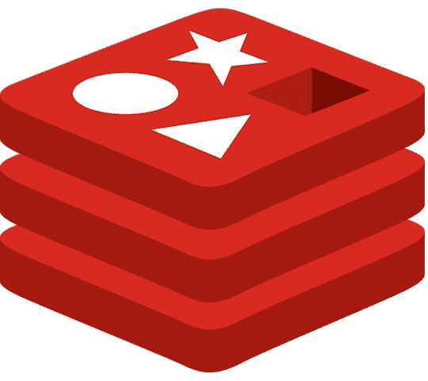
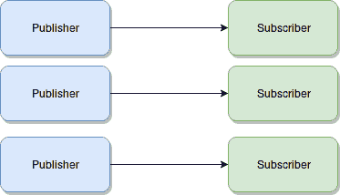
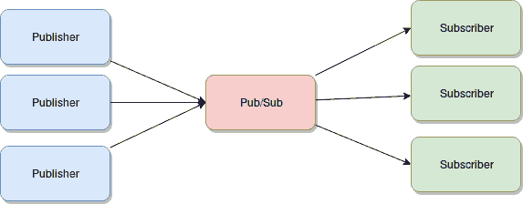

# 为什么我们在 Redis 得到流？

> 原文：<https://blog.logrocket.com/why-are-we-getting-streams-in-redis-8c36498aaac5/>



不久前，Redis 发布了它的最新版本，他们宣布了一种全新的数据类型[，叫做 Streams](https://redis.io/topics/streams-intro) 。现在，如果您阅读了他们的文档，或者至少了解了一些皮毛(需要消化大量的文本)，您可能已经看到了与 Pub/Sub 甚至一些智能结构(如阻塞列表)的相似之处。

在本文中，我将总结 Redis 流中的文档，并借此机会告诉您有关发布/订阅和阻止列表的信息，以防您不了解它们。

[](https://logrocket.com/signup/)

### 对过去的快速回顾

我们先来回顾一下之前存在的结构和力学。快速复习(如果你已经使用过)或快速介绍(如果你以前没有使用过)。不要误解我的意思，它们是非常强大和有用的工具，可以作为您的开发人员的一部分，但是它们不是本文的主要焦点，所以我不会详细讨论它们。

### 发布/订阅

这是我最喜欢的 Redis 特性之一，我倾向于尽可能多地使用它，因为它基本上是一个嵌入在键值内存数据库中的免费消息队列。你买一送一。

现在，它的要点是，通过使用它，Redis 为开发人员提供了访问发布/订阅消息传递范例的权限，这允许您与两个或多个实体进行通信，而他们彼此并不了解。

换句话说，您有您的“消息发送者”(也称为发布者)和“消息接收者”(也称为订阅者)，如果您希望您的发布者与您的订阅者通信，您有几个选项:

你可以直接与他们交流:



这带来了几个缺点，例如:

*   如果你的出版商崩溃了，突然不能出版任何东西，他们就会失去订户
*   发布者需要知道他们的订阅者的确切地址，这在订阅者有动态地址时是行不通的
*   如果出版商的生产速度超过订阅者的处理速度，他们可能会压倒订阅者

你也可以走更疯狂的路线，直接与每个出版商和每个订户沟通:


虽然上面的设置解决了订阅者崩溃的问题，但是您增加了发布者端的复杂性，因为您必须知道每个订阅者的确切位置。而且绝大多数问题还没有解决，事实上，现在每个用户都获得了更多的流量，所以让他们崩溃会更容易。

或者，你可以在中间添加一个类似缓冲区的结构，允许发布者尽可能快地创建内容，允许订阅者以自己的速度获取内容。此外，不再需要了解每个相关订阅者的地址，简化了发布者机制的逻辑和管理。



当然，上面的图表是这个范例的一个非常简化的版本，但是它足以解释这个问题。

与此相关的发布/订阅的一些关键属性如下:

*   Pub/Sub 在“火了就忘了”的前提下工作。这实质上意味着每个发布的消息都将被传递给尽可能多的订阅者，然后它将从缓冲区中丢失
*   所有消息都将发送给所有订户。请注意，您可以让订户收听不同的频道，这可以防止这种情况发生。但是，如果在同一个频道上有一个以上的用户，那么他们都会收到相同的消息。到那时，将由他们来决定对此做些什么。
*   没有 ACK 消息。一些通信协议处理确认消息，以便订户让发布者知道消息已被接收。在这种情况下，没有类似的东西，所以如果您的订户收到消息，然后崩溃，数据将永远丢失

### 你什么时候使用 Pub/Sub？

发布/订阅的一些经典示例如下:

*   聊天服务器，通过让 Redis 负责在用户之间分发消息的所有繁重工作，允许您轻松地创建聊天室。默认情况下，这些聊天室不会保存消息，但是您可以通过向聊天服务器添加一些存储逻辑来找到解决方法
*   通知服务:另一个有趣的用例，您可以订阅一组您想要接收的通知，然后发布者将它们发送到正确的渠道
*   日志集中化。你可以很容易地构建一个日志中心，在这里你自己的应用程序是发布者，不同的服务确保它们将信息发送到正确的目的地。这将允许您拥有一个非常灵活的日志记录方案，能够从存储到磁盘切换到将所有内容发送到 ELK 实例或云服务，甚至一次全部发送！想想各种可能性！

### 阻止列表

现在，阻塞列表与上面的结构非常相似(为了不破坏神秘感，但是您会发现对于流也是如此)。不过，主要的区别在于，这并不是 Redis 附带的另一个独立特性，相反，它只是一种数据类型(列表),具有对我们有利的特定阻塞机制。让我解释一下。

在 Redis 中使用列表时，可以向列表中添加元素(用 LPUSH 添加到列表的头部，或者用 RPUSH 添加到列表的尾部)，并且可以获得顶部的元素(用头部的 LPOP 和尾部的 RPOP)。默认情况下，*POP 操作没有阻塞，这意味着如果列表没有数据，您将得到一个空结果，这就是结束。

但是您还有两个非常有用的阻塞命令 BLPOP 和 BRPOP，它们是它们的对应命令 LPOP 和 RPOP 的阻塞版本。他们阻塞的事实在这里很重要，因为当使用空列表时，从客户端到 Redis 的连接将被阻塞，直到添加新元素。这种阻塞机制实质上为您提供了一个可以使用的消息传递系统。

本质上，我们模仿了与发布/订阅相同的设置，任意数量的发布者可以将内容发送到类似缓冲区的结构中，任意数量的订阅者可以侦听新数据并对其做出反应。但是，正如他们所说的，细节决定成败，所以让我们深入一点:

*   我提到的类似缓冲区的结构只是一个列表
*   发布者只需使用 LPUSH 或 RPUSH 将消息添加到列表中
*   订阅者并不真的订阅，相反，他们只是做一个阻塞 POP(bl POP 或 BRPOP)

这就是它的要点，关键是 POP 操作的阻塞机制，因为它会让用户一直等待，直到一条消息被添加到列表中。一旦发生这种情况，等待时间最长的用户会立即自动弹出提示。

这种结构与发布/订阅的主要区别在于:

*   消息不会分发给所有的订户，事实上，每条消息只发送给一个订户，因为第一个被通知的订户会弹出消息
*   事实上，消息被存储在 Redis 的一个列表中，它们被存储在其中，直到一个用户被连接。如果您将 Redis 配置为将数据存储在磁盘中，您可以得到一个相当可靠的排队系统

### 展望未来:什么是流？

既然我已经介绍了已知的和现有的结构，让我们看看全新的闪亮的流。

Streams 背后的主要设计思想是*日志文件。*说起来很有趣，但是听我说:当你为了调试你的应用程序而检查日志文件时，你*通常*会做这样的事情:

$ tail -f yourlogfile.log

这将显示文件的最后几行，让您知道最近发生的一些事情。不仅如此，命令行也将被阻塞，因为它将一直等待新的行被添加到您的文件中，一旦它们出现就立即显示出来。

到目前为止，它听起来很像阻止列表，不是吗？但是正如您将要学习的，Streams 实现了一些更复杂的操作，这让您可以更好地控制如何使用它们(与阻塞列表相比)。

到目前为止，我们看到的所有内容与 Streams 之间的另一个主要区别是，消息的内部结构是一组键值对，而不仅仅是能够处理字符串元素，因此您的消息实际上可以直接在 Redis 中具有复杂的结构(而不是 JSON 对象的字符串化版本)。

### 从流中消费并发布到流中

您可以在流上执行的基本操作是将数据推入流和从流中取出数据。

要向其中发布数据，可以使用 XADD 命令，这非常简单:

`>XADD yourstreamname *key1 value1 key2 value2`

该命令会将如下结构添加到名为“yourstreamname”的流中:

```
{
"key1":"value1,
"key2":"value2"
}
```

添加到流中的每个消息都有一个内部 ID，这是 XADD 操作的第二个参数。传递一个“*”将让 Redis 知道为我们自动生成它，反过来，它将返回它作为我们添加操作的结果。您可以自己指定一个 ID，但是对于大多数用例，您不需要担心这个问题，您可以让 Redis 来处理它。

### 阅读日期

现在，从数据流中获取数据是事情变得有趣的地方。有两种方法可以从流结构中获取数据。

您可以使用 XREAD 做一些类似于我们目前所做的事情。这个命令将允许您订阅一个等待新消息到达的流。

`>XREAD COUNT 2 STREAMS yourstreamname 0`

或者

* * *

### 更多来自 LogRocket 的精彩文章:

* * *

`>XREAD BLOCK 0 STREAMS yourstreamname 0`

该命令的第一个版本将返回添加到“yourstreamname”的 ID 大于 0 的前两条未读消息。但是这个版本没有阻塞，所以正如您所料，如果没有新内容，这个命令将不会返回任何消息。

第二个版本是阻塞，超时为 0(意味着没有超时)，所以这一次，就像阻塞列表一样，命令不会返回，直到添加了新消息。

一些评论:

*   虽然阻塞操作看起来像一个阻塞列表，但是新消息被发送到每个订阅的客户端，就像发布/订阅一样
*   现在，虽然您可能认为这类似于 Pub/Sub，但是添加到流中的消息被保存在流中(不像 Pub/Sub 的 fire and forget 机制)
*   由于上述事实，实际上有另一种方法可以用 XRANGE 从流中获取数据，我们接下来将会看到这一点

使用 XRANGE 和 XREVRANGE(与另一个相同，但返回数据的顺序相反)可以从流中获得一系列消息，这是以前的结构无法做到的！

`>XRANGE yourstreamname 13213131-0 + COUNT 3`

该命令并不复杂，参数是:

1.  您正在读取的流的名称
2.  要读取的第一个 ID
3.  要读取的最后一个 ID (+是可能的最大 ID)
4.  或者，您还可以限制返回的结果数量

### 关于消息 id 的一句话

很清楚，消息 id 有两部分，第一部分是以毫秒表示的本地时间(在本地 Redis 节点中)。第二部分只是一个自动增量，意在解决在完全相同的时间收到消息时可能发生的冲突。

### 消费群体呢？

另一个很大的区别，也是流为发布者/订阅者机制增加的最有趣的东西之一，是消费者群体。

这不是一个新概念，事实上，卡夫卡也有同样的概念，尽管实现的方式不同。

消费者群体的主要用例是当您希望不同的消费者以不同的速度从相同的流中获取数据时。在这些情况下，您可能希望只将消息传递给一个消费者，本质上就像阻止列表而不是发布/订阅那样工作。

如果您这样做，就可以确保:

*   消息只传递给组内的一个消费者
*   消费者需要在他们所属的群体中被唯一地识别。id 区分大小写，需要由消费者自己提供
*   每个群组都会跟踪未读消息，因此当用户需要时，它总是会返回一条未读消息
*   消费者需要向 Redis 发回一条 ACK 消息，通知消息已被正确处理

### 创建群组

当创建一个组时，您指定该组所属的流、其名称和顶部 ID，这意味着任何高于该 ID 的 ID 都将被添加到该组中。

为此，您可以使用 XGROUP 命令:

`> XGROUP CREATE yourstreamname yourgroup $`

示例中使用的顶部 ID(`$`)引用了最后一个 ID，因此在上面的组中，只添加创建组后收到的新消息。

您可能会创建这样一个组:

`> XGROUP CREATE yourstream historicgroup 0`

创建这个新组将包含曾经收到的所有消息。

### 小组阅读

XREADGROUP 命令可用于从组中获取数据。语法与 XREAD 相同，但是添加了一个名为“GROUP”的属性，该属性接收组名和使用者名。

所以，它看起来会像这样:

`> XREADGROUP GROUP historicgroup consumer1 BLOCK 0 STREAMS yourstream`

上述命令实际上(以阻塞方式)从 *yourstream* 流的 *historicgroup* 组中读取，将自己标识为*消费者 1* 消费者。

### 确认已读消息

最后，为了确认您已经成功阅读了一条消息，您需要将 XACK 命令发送回 Redis，否则，这条消息将保持挂起状态。

该操作所需的属性是流的名称、组的名称，最后是消息 Id:

`>XACK yourstream historicgroup 1231241142-0`

### 就是这样！

不完全是，实际上还有更多我没有讲到的内容。不过，本文的内容应该足以理解如何使用流，以及为什么将它们添加到已经存在的数据类型集中。

如果你想了解更多关于流和你可以用它们做的任何事情，请随意阅读完整的文档。

非常感谢您的阅读，如果您已经在使用 Streams 或者打算这样做，请随时留下您的评论！

## 使用 [LogRocket](https://lp.logrocket.com/blg/signup) 消除传统错误报告的干扰

[](https://lp.logrocket.com/blg/signup)

[LogRocket](https://lp.logrocket.com/blg/signup) 是一个数字体验分析解决方案，它可以保护您免受数百个假阳性错误警报的影响，只针对几个真正重要的项目。LogRocket 会告诉您应用程序中实际影响用户的最具影响力的 bug 和 UX 问题。

然后，使用具有深层技术遥测的会话重放来确切地查看用户看到了什么以及是什么导致了问题，就像你在他们身后看一样。

LogRocket 自动聚合客户端错误、JS 异常、前端性能指标和用户交互。然后 LogRocket 使用机器学习来告诉你哪些问题正在影响大多数用户，并提供你需要修复它的上下文。

关注重要的 bug—[今天就试试 LogRocket】。](https://lp.logrocket.com/blg/signup-issue-free)