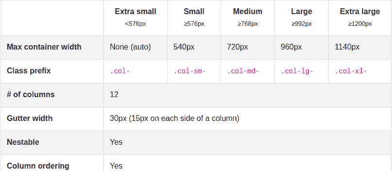
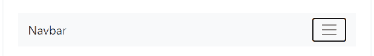
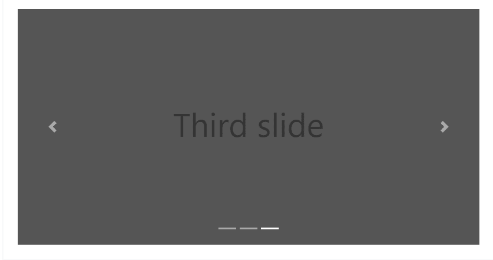
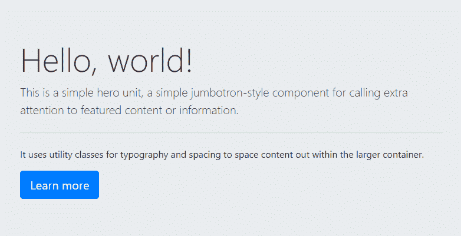

# Bootstrap 为什么这么受欢迎？

> 原文：<https://blog.logrocket.com/why-is-bootstrap-so-popular/>

如果您决定搜索当前排名前五的前端框架，Bootstrap 很有可能会在其中出现。

这不是巧合，因为 Bootstrap 一直为使用它的开发者提供巨大的价值。

Bootstrap 于 2011 年正式发布，经历了各种变化和更新，以成为今天这样稳定可靠的框架。

让我们来讨论一下 Bootstrap 到底是什么，以及它为什么如此受欢迎。

### 这是什么？

Bootstrap 是一个 HTML、CSS 和 JavaScript 框架，可以帮助开发人员在很短的时间内构建移动优先的响应网站。Bootstrap 为用户做后台工作，让他们有更多的时间专注于网站设计和他们希望自己的网站如何出现。

Bootstrap 已经被用来建立许多伟大的网站，如[Taskade.com](https://www.taskade.com/)、[暴研](https://www.crit-research.it/it/)、 [saleor.io](https://saleor.io/) 、[超级马里奥奥德赛](https://www.nintendo.co.uk/Games/Nintendo-Switch/Super-Mario-Odyssey-1173332.html)等等。

要查看更多用 Bootstrap 创建的令人惊叹的网站，你可以点击此链接查看 [Bootstrap 网站示例](https://expo.getbootstrap.com/)。

将 Bootstrap 称为框架，意味着它被创建为正在构建的应用程序的构建块的一部分，并且可以根据个人的喜好和风格进行定制。像 Bootstrap 这样的框架不能独立运行——我们仍然需要编写利用框架特性的代码。

现在来说说 Bootstrap 为什么会这么受欢迎。

### 令人印象深刻的文件

在开发人员社区和整个世界，文档就像地图:关于事物如何工作和如何使用的官方指南。Bootstrap 有一个令人印象深刻的文档。非常详细，初学者友好。

不熟悉 Bootstrap 的人可以访问该网站，并在不到十分钟的时间内开始使用它的功能。它的特性得到了很好的解释，文档中包含了可视化的例子以及它如何工作的代码例子。您将看到特性是如何工作的，负责创建这些特性的代码，以及这些代码在 web 页面上的可视化表示。

有如此多的引导组件，从用于在网站上展示关键营销信息的轻量级组件 Jumbotron，到“循环播放一系列内容的幻灯片”的 Carousels。有了这样一个功能丰富的工具包，新手很容易不知所措。然而，文档用解释清楚、易于理解的文字处理了这个问题，使您想立即开始使用 Bootstrap。

### 热情的社区

当有人支持我们时，当我们有一个社区，当我们有问题或想展示我们想出的新东西时，我们都能茁壮成长。Bootstrap 为开发人员提供了社区所需的一切。

由于已经存在了相当一段时间，它已经聚集了很多用户，他们已经成为使用 Bootstrap 的专家甚至专家。这使得新手在寻求帮助时更容易获得帮助，也更容易解决他们在使用工具包时遇到的问题。

当你在网上浏览引导教程时，你会发现成百上千的引导教程。有很多教程指导用户如何使用 Bootstrap，以及如何定制 Bootstrap 以创建令人惊叹的页面。然而，这并不意味着文档做得不够。相反，它表明人们已经从文献中学习，并且也找到了新的方法来实现他们现在想要与世界分享的各种事情。

在 Bootstrap 的网站上，也有一个 Slack 频道的链接，这是 Bootstrap 的所有内容。你会很容易在互联网上看到很多致力于使用 Bootstrap 的团体和社区，帮助初学者在 Bootstrap 之旅中前进。

### 强大的电网系统

Bootstrap 的一个惊人特性是它的网格系统和它提供的响应能力。如果使用得当，Bootstrap 使响应式设计变得相对容易。

Bootstrap 运行一个 12 列网格系统，用户可以根据不同的设备视图宽度自由定制自己的页面。

例如，可以决定让页面上的项目在较小的屏幕上占据整个视图宽度，而在超大屏幕上占据设备宽度的四分之一。这是 Bootstrap 的固有特性，因此在尝试实现该特性时没有压力。

Bootstrap 能够通过使用其预定义的类前缀，使其组件、图像和网页作为一个整体做出响应。

它的响应能力适合所有尺寸的屏幕，从超小型到中型、大型和超大型。

响应能力是一个非常重要的特性，因为现在比以往任何时候都有更多不同的设备用于浏览网站和 web 应用程序，一个没有响应能力的网站会造成糟糕的用户体验。使用 Bootstrap 的网格系统可以减少工作时对响应的担心。

### 著名的引导导航条

Bootstrap 有一个非常强大且响应迅速的导航条。这是一个不小的壮举，因为导航栏就像网页的欢迎垫。正是这个东西引起你的注意，并把你带到网站的其他部分。漂亮的导航条很有吸引力，会让网站访问者感到满意。导航栏也意味着易于理解和使用。

导航栏是网站中不容易创建的功能之一。你需要决定它的外观，导航条的结构，以及它将包含的组件，如徽标、搜索栏等。有了 Bootstrap，就不需要担心从零开始构建了。Bootstrap 提供了 Navbars，内置了对一些子组件的支持，您可以根据自己的喜好进行选择和定制。这些子组件包括:

*   哪一个空间用于展示贵公司的品牌、名称或形象
*   `.navbar-nav`用于全高和轻量级导航(包括支持下拉)
*   `form-inline`对于任何表单控件和动作
*   `.navbar-text`用于添加垂直居中的文本字符串
*   `.collapse.navbar-collapse`通过父断点对导航栏内容进行分组和隐藏

下面是一个导航栏的例子，它包括了移动和桌面模式下的所有子组件:

我提到过这些导航条是完全响应的吗？嗯，他们有。Navbar 的响应性消除了很多压力，这些压力可能来自于试图让它在所有设备上看起来都很美观:无论是大的、中的、小的还是超小的。如果你想创建一些功能强大、反应灵敏的东西，而又不想花太多时间，Bootstrap Navbars 是你的首选组件。

### 广泛的可定制组件

Bootstrap 有大量组件可供选择。它的组件从卡片到传送带，到按钮，甚至是配备验证的复杂表单。这些组件使得构建网页的过程变得简单明了。如果你想在你的网站上有一个表单，你只需要导入它并根据你的喜好定制它。

像旋转木马这样的组件过去很难实现，但是有了 Bootstrap，它就开箱即用了，并且有多种选择。

有些转盘带有下一个和上一个控制，有些转盘带有指示器来显示您当前正在查看的幻灯片，甚至还有带有淡入淡出过渡效果的转盘。所以你需要做的就是选择你想要的传送带的类型，然后把你的图片或者任何你想要的东西放在传送带上合适的位置，然后瞧！你的幻灯片已经准备好了。

对 Bootstrap 来说，提供许多组件并使它们完全可定制是一个惊人的壮举。还有一个被称为超大屏幕的组件。

在 Bootstrap 网站上，超大屏幕被介绍为“一个轻量级、灵活的组件，用于展示英雄单位风格的内容”。当您想要展示某些内容时，当您想要突出这些内容时，可以使用它。在大屏幕上，标题文字比我们习惯的默认 H1 要大。大屏幕使用显示标题。引导显示标题的范围从显示-1 到显示-4，前者(显示-1)是最大的显示尺寸。

Jumbotrons are great for hero styled sections which may include images, texts, and buttons.

## 结论

从它提供的巨大可用性到广泛的可用特性，我们可以清楚地看到为什么 Bootstrap 的受欢迎程度仍在上升，并且不会很快消退。

Bootstrap 定期发布更新，这意味着它保持最新，并随着每个版本的发布而不断改进。许多其他框架已经成为关注的焦点，但是 Bootstrap 在过去几年里仍然很重要。

它为用户提供的便利是值得称赞的，完全可定制的组件使 web 开发变得更加容易和快速。

你可以随时查看 getbootstrap.com 的官方网站来熟悉 Bootstrap。

## 通过理解上下文，更容易地调试 JavaScript 错误

调试代码总是一项单调乏味的任务。但是你越了解自己的错误，就越容易改正。

LogRocket 让你以新的独特的方式理解这些错误。我们的前端监控解决方案跟踪用户与您的 JavaScript 前端的互动，让您能够准确找出导致错误的用户行为。

LogRocket 记录控制台日志、页面加载时间、堆栈跟踪、慢速网络请求/响应(带有标题+正文)、浏览器元数据和自定义日志。理解您的 JavaScript 代码的影响从来没有这么简单过！

[Try it for free](https://lp.logrocket.com/blg/javascript-signup)

.