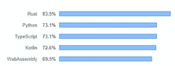
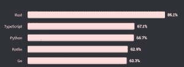
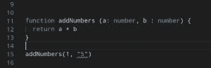

# 为什么 TypeScript 要超越 Python？- LogRocket 博客

> 原文：<https://blog.logrocket.com/why-is-typescript-surpassing-python/>

2019 年，StackOverflow 举行了他们的年度[开发者调查](https://insights.stackoverflow.com/survey/2019#technology-_-most-loved-dreaded-and-wanted-languages)，这是对全世界编码人员最大、最全面的调查。这项调查描绘了来自数千名开发人员(当年有 90，000 人)的数据，并将他们分组。其中一个类别包括“最喜爱、最恐惧和最想要的语言”

在这一类别中受欢迎的部分，Typescript 和 Python 获得了相同的票数，分别为 73.1%，显示了他们在科技行业的突出地位。

进入 2020 年，最近的调查显示，随着 Typescript(67.1%)以 0.4%的优势超过 Python，这种平衡已经被打破。





想知道为什么开发人员对 TypeScript 越来越感兴趣吗？我用几个理由解释一下。

## JavaScript 的流行

很明显，JavaScript 已经成为 web 开发世界的重要组成部分，并且也进入了移动应用程序开发领域。

通过 NPM，开发者可以获得大量的软件包来帮助开发。这个 NPM 生态系统非常庞大，并且还在不断增长，每天都有开发者为其贡献力量。这种流行正是 TypeScript 从中受益的原因。

就其本质而言，JavaScript 是一种灵活的语言。它使开发人员能够混合使用面向对象编程和函数式编程。但是 JavaScript 拥有的灵活性就像一把双刃剑。

一方面，这种语言速度快，不太严格，并且是多范例的，这意味着一个问题可以产生多种解决方案。

另一方面，很容易编写糟糕且易受攻击的代码，从而影响性能、安全性和可伸缩性。

为了让 JavaScript 更具伸缩性，微软发布了 Typescript，它是 JavaScript 的超集。Google 甚至将它作为编写 Angular 的主要语言，Angular 是他们创建的开源前端框架。

TypeScript 旨在消除代码中的愚蠢错误、打字错误和歧义。变量类型(即字符串、布尔型等。)不能像在普通 JavaScript 中那样在执行过程中动态改变。

相反，在使用它们之前，必须显式定义它们的类型，并且以后不能更改。

因为 JavaScript V8 引擎不能解释 Typescript，所以 Typescript 代码必须经过编译器，编译器将其转换为兼容所有浏览器的 JavaScript 版本。默认的目标版本是 ES2015，尽管可以进行配置。

与 JavaScript 一样，Typescript 还有一个额外的好处，即可以在 web 应用程序的前端或后端使用。

### 可选静态类型

Typescript 将静态类型引入 JavaScript 世界，并允许开发人员在构建应用程序时调整严格程度。

当启用时，静态类型消除了灵活性，并在早期捕捉到错误。但是这些并不是静态类型的唯一优点。

静态类型为您的代码提供了更多的结构，增强了调试和重构，同时也使您的代码看起来像是自我记录的。

Typescript 的编译器会提醒开发人员与类型相关的错误，确保这些错误不会只在运行时才被发现。这将在执行过程中产生更好的性能。

让我们以这个 JavaScript 函数为例:

```
function addNumbers (a, b) {
  return a + b
}
```

这个函数返回两个数的和。在 JavaScript 中，我可以如下调用上面的函数:

```
addNumbers(1, 5) // 6
addNumbers(1, "5") // 15
```

在第二次调用时，我们得到了一个意想不到的结果。即使我们假设传入的参数是数字，我们的函数仍然会被执行。像这样的小错误会毁掉你的项目。

Typescript 将帮助您避免这种情况，如下所示:

```
function addNumbers (a: number, b : number) {
  return a + b
}
```

如果你试图这样调用这个函数:

```
addNumbers(1, "5")
```

一个好的代码编辑器，例如 Visual Studio 代码，会让你知道你正在尝试做一些错误的事情。在这种情况下，错误的参数带有红色下划线:



您可以看到，甚至在代码编译之前，就已经防止了将来的错误。这就是 TypeScript 如此强大的原因。

因为 Python 是动态类型的，变量类型只在运行时确定，导致它在执行过程中消耗大量内存。像这样的巨大挫折使得 Python 非常不适合内存密集型进程。

### 移动计算存在

随着从台式机到手机的大量转移，智能手机占全球网络流量的 53.3%。自 2017 年以来，他们一直徘徊在 50%左右，所以很明显，移动开发不会有任何进展。

尽管 Python 在数据科学、桌面和服务器平台方面占据突出地位，但它在移动计算方面并没有很大的发言权。很少有移动应用是用 Python 开发的，在应用前端也很少见到。

TypeScript 可以与其他 JavaScript 框架(例如 React Native)结合使用来制作移动应用程序。有了好的 IDE，TypeScript 加快了企业级应用程序的开发过程。

### 速度

作为开发人员，速度是开发应用程序时要考虑的一个重要因素。这个因素可以从不同的角度来看，其中包括:

*   显色法
*   运行时/执行
*   原始性能

Python 加快了开发过程，因为它简洁且易于编写，您可以快速启动并运行应用程序。你也不必经历静态类型的麻烦，因为在运行时一切都会为你完成。

另一方面，TypeScript 看起来比较冗长，需要相当长的时间来组装一个应用程序。

这两种语言在运行时执行上的差异并不显著。对于不需要最大 CPU 能力的小规模应用程序，这两种语言都可以做得很好，而且速度非常快。

与 Typescript 项目相比，较大的应用程序需要在编译器上执行繁琐的任务，并且在 Python 项目中会显著降低执行时间。

就原始性能而言，Typescript 比 Python 快得多。

当用 Python 编写内存密集型任务时，例如游戏，使用高端 3D 图形，CPU 开始受到冲击，性能显著下降。

与 Typescript 不同，Python 本质上不是异步的。它要求 AsyncIO 库能够实现异步编程。

Python 也有所谓的 GLI(全局解释器锁)，一次只允许一个线程执行。虽然这是对性能的奖励，但它阻碍了并行性。

### 多才多艺

如前所述，TypeScript 可以在 web 应用程序的前端和后端使用。像 React 和 Vue 这样的流行 JavaScript 框架与 TypeScript 集成得很好。它还与 Node.js 兼容，后者可用于实现服务器端功能。

因为 TypeScript 可以在 web 应用程序的两端使用，所以坚持使用这种语言并保持代码库的内聚性会更方便，而不必为了实现相同的功能而掌握完全不同的服务器端语言。

## 结论

我不打算怀疑 Python 是一种编程语言。如图表所示，TypeScript 仅以微弱优势超过了它，所以现在还没什么好担心的。

Python 仍然是一种令人敬畏的通用语言，它让编程变得有趣。它简单的语法使得这种语言对任何初学者都很友好。Python 还可以用来自动化几乎任何任务，这很酷。十有八九是一门编程语言的初学者首选。

我们都可以争论是使用 TypeScript 而不是 Python，还是让编程语言互相竞争。但到了最后，这都不重要了。作为开发人员，与您相关的是对您使用的工具感到舒适，并为正确的任务使用正确的工具。

## [LogRocket](https://lp.logrocket.com/blg/typescript-signup) :全面了解您的网络和移动应用

[](https://lp.logrocket.com/blg/typescript-signup)

LogRocket 是一个前端应用程序监控解决方案，可以让您回放问题，就像问题发生在您自己的浏览器中一样。LogRocket 不需要猜测错误发生的原因，也不需要向用户询问截图和日志转储，而是让您重放会话以快速了解哪里出错了。它可以与任何应用程序完美配合，不管是什么框架，并且有插件可以记录来自 Redux、Vuex 和@ngrx/store 的额外上下文。

除了记录 Redux 操作和状态，LogRocket 还记录控制台日志、JavaScript 错误、堆栈跟踪、带有头+正文的网络请求/响应、浏览器元数据和自定义日志。它还使用 DOM 来记录页面上的 HTML 和 CSS，甚至为最复杂的单页面和移动应用程序重新创建像素级完美视频。

[Try it for free](https://lp.logrocket.com/blg/typescript-signup)

.