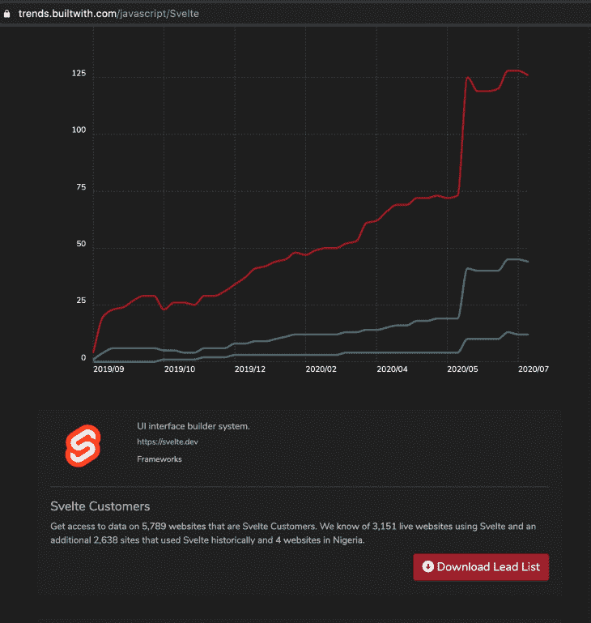
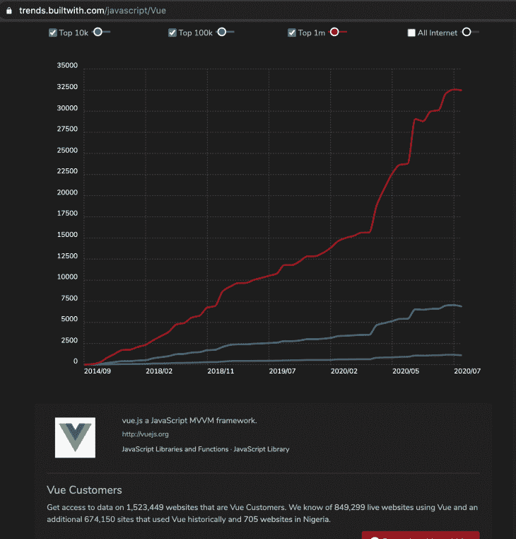
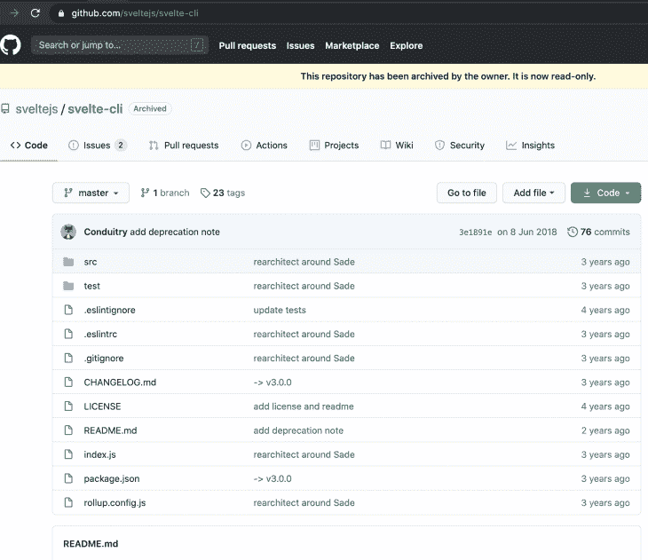
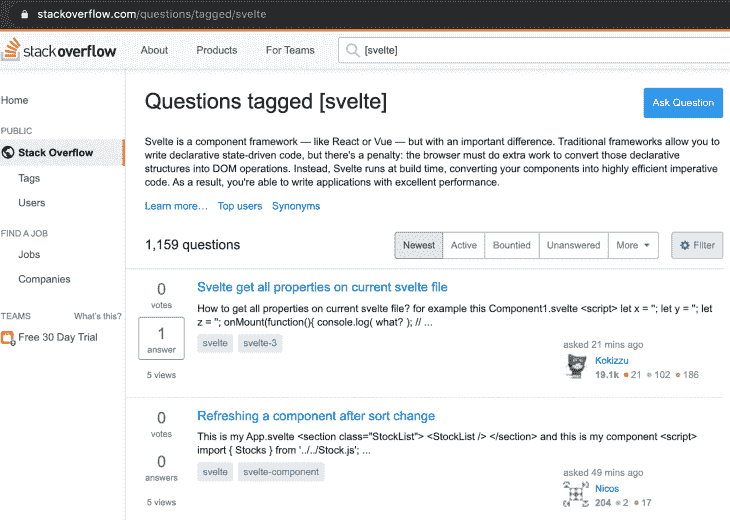
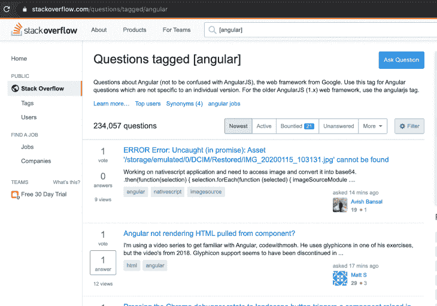

# 为什么人们不转向苗条的博客

> 原文：<https://blog.logrocket.com/why-people-arent-switching-to-svelte-yet/>

Svelte 是一个轻量级的基于组件的框架，如 React、Vue 或 Angular，它允许开发人员用 JavaScript 编写易读的代码，然后将编写的代码编译成在浏览器中运行超快的高效普通 JavaScript。

虽然 React 等其他框架采用了虚拟 DOM diffing 技术，但 Svelte 将您的代码编译成 JavaScript，当组件中的状态发生变化时，它会更新 DOM。

自从 2016 年 11 月由[理查德·哈里斯](https://twitter.com/rich_harris)首次发布以来，许多开发人员已经爱上了这种构建应用程序的新方法，随着在其官方 Github [资源库](https://github.com/sveltejs/svelte)上超过 [39k 颗星星，Svelte 将留在这里，并在首选的顶级 JavaScript 前端框架中争夺一席之地。](https://github.com/sveltejs/svelte)

尽管有这些统计数据，但是，很多人在前端开发过程中犹豫是否采用 Svelte 作为框架。

根据[trends.builtwith.com](https://trends.builtwith.com/framework/Svelte)的数据，截至 2020 年 10 月，总共只有大约 6000 个近似注册的实时和历史网站使用 Svelte 作为他们的首选前端库。与 React 的大约 340 万，Vue 的超过 150 万，Angular 的超过 370 万相比，这个属性是非常低的。



A screenshot of Svelte’s usage stats according to trends.builtwith.co



A screenshot of Vue’s usage stats according to trends.builtwith.com

## 为什么开发者还没有转向苗条

### 后期类型脚本支持

例如，当来自 Angular 这样的框架时，您会非常习惯于开箱即用地为您预配置一个 TypeScript 开发环境。Svelte 团队刚刚在 2020 年 7 月发布了包含[官方支持 TypeScript 的更新。](https://svelte.dev/blog/svelte-and-typescript)

这意味着开发人员现在可以在创建一个瘦项目时运行以下命令来设置 TypeScript:

```
npx degit sveltejs/template svelte-typescript-app
cd svelte-typescript-app
node scripts/setupTypeScript.js
```

虽然可以预先使用 TypeScript，但是初始设置过程是相当麻烦的，因为它涉及到大量耗时的定制 Webpack 和苗条的预处理配置。这是一件好事，现在[默认包含了 TypeScript 支持](https://developer.mozilla.org/en-US/docs/Learn/Tools_and_testing/Client-side_JavaScript_frameworks/Svelte_TypeScript)，因为这个主要的缺失点似乎是阻碍开发人员学习和使用该框架的因素之一。当 [Deno](https://deno.land/) 前一段时间正式发布时，开发人员认为它的一个关键卖点是它相对于 Node 的 TypeScript 集成优势。

### 没有官方的 CRA 或苗条 CLI

如果您需要快速搭建 React 应用程序，您可以通过简单地运行`create react app myreactproject`命令，轻松地使用 [create-react-app](https://github.com/facebookincubator/create-react-app) CLI 应用程序(假定它是全局安装的),并且您会自动生成您的应用程序搭建。

使用 Vue，过程是类似的，您只需运行这个命令，只要您的机器上安装了 Vue CLI，您的搭建就已经设置好了:

```
vue init myvueproject
```

然而，Svelte 没有官方维护的用于脚手架项目的 CLI 应用程序，因为`svelte/cli`包在 2018 年被弃用。



您需要总是从它的`npx`存储库中取出脚手架模板(它已经集成了 CLI)。这意味着每次你想创建一个苗条的应用程序时，你都需要运行以下命令来建立一个苗条的项目:

```
npx degit sveltejs/template my-svelte-project
cd my-svelte-project
npm install
npm run dev
```

虽然这可能看起来像是一个小的 DX(开发者体验)缺陷，但它肯定是可以由 Svelte 团队研究的东西。

### 小社区

与其他主要的前端开发框架相比，Svelte 的社区非常小。如果你使用一种有很大社区的流行语言，你更有可能找到可以合作的人。你也更有可能找到参考资料和资源。

例如，在栈溢出时，只有大约[一千个讨论(问题和答案)在苗条的标签](https://stackoverflow.com/questions/tagged/svelte)下提出。分别对比 250k+的 React，234k+的 Angular，64k+的 Vue，还有很多工作要做。这意味着，如果你作为开发者在使用 Svelte 时遇到问题，那么获得帮助的机会相对较小。





### 较少的封装/工具支持

许多开发人员发现，集成现有的有助于更快完成任务的包更容易。由于 Svelte 的受欢迎程度相对较低，因此来自软件包和实用程序的支持较少。例如，如果您想在 React 中实现一个日期选择器组件，那么 NPM 存储库中有数百个包可供选择。然而，对于 Svelte，您没有这种奢侈，因为只有少数几个可供开发人员选择，因此，开发人员经常花时间从头开始实现这些功能。

### 行业需求低

如果雇主对某个工具有足够的需求，那么开发者学习该工具是有道理的。作为一名开发人员，如果学习某个工具是有利可图的，那么您会希望获得该工具的知识。

Svelte 在 JavaScript 领域相对年轻，因此，行业对 Svelte 开发人员的需求很低，因为许多公司还没有在他们的基础设施中使用 Svelte。

## 为什么公司还没有转向苗条

### 公司支持

React 得到了脸书的大力支持，因为它的内部员工最初开发了它，Angular 的开发团队由来自谷歌的开发人员领导，他们也在自己的职业网站上使用 [Vue。例如，苹果公司也在他们的](https://madewithvuejs.com/google-careers) [SwiftUI 教程网站](https://developer.apple.com/tutorials/swiftui)中使用 Vue。然而，这些主要的科技公司并没有明显地支持 Svelte。我坚信，如果 Svelte 得到这些公司的支持，将会有更多的公司开始采用它。如果这些公司中的任何一家在其基础设施中采用或支持该框架，Svelte 的受欢迎程度可能会飙升。

### 成熟

如果一项技术存在的时间较长，人们会认为它比它的同类产品更可靠，因为技术往往会随着时间的推移而改进，包括错误修复、更多的文档和教程、语言语法和安全性的改进等。

因为在前端框架领域，Svelte(2016 年发布)比 React、Vue 和 Angular 等更年轻，相对较新，所以对其成熟度存在某种程度的担忧是很自然的。我相信很多公司都怀疑采用 Svelte 来生产产品的安全性，因为它已经过时了。

## 结论

毫无疑问，就其目前的受欢迎程度和实用性而言，苗条是 web 开发未来的重要组成部分。作为一名 svelite 开发者，如果有更多的公司和开发者采用 svelite 和它的所有优点作为他们制作 web 应用程序的首选前端 web 框架，那就太棒了。

## 使用 [LogRocket](https://lp.logrocket.com/blg/signup) 消除传统错误报告的干扰

[](https://lp.logrocket.com/blg/signup)

[LogRocket](https://lp.logrocket.com/blg/signup) 是一个数字体验分析解决方案，它可以保护您免受数百个假阳性错误警报的影响，只针对几个真正重要的项目。LogRocket 会告诉您应用程序中实际影响用户的最具影响力的 bug 和 UX 问题。

然后，使用具有深层技术遥测的会话重放来确切地查看用户看到了什么以及是什么导致了问题，就像你在他们身后看一样。

LogRocket 自动聚合客户端错误、JS 异常、前端性能指标和用户交互。然后 LogRocket 使用机器学习来告诉你哪些问题正在影响大多数用户，并提供你需要修复它的上下文。

关注重要的 bug—[今天就试试 LogRocket】。](https://lp.logrocket.com/blg/signup-issue-free)