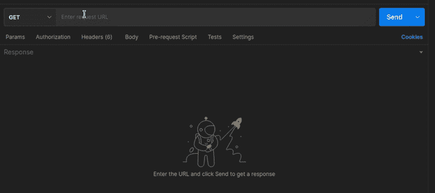
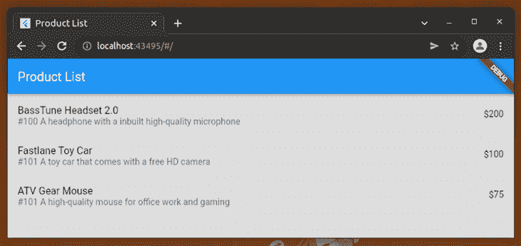
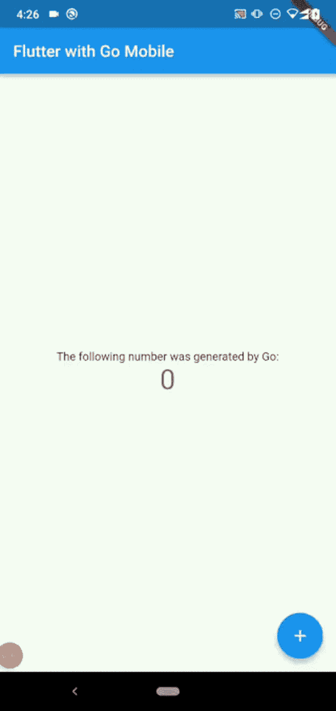

# 为什么你应该在 Flutter - LogRocket 博客中使用 Go 后端

> 原文：<https://blog.logrocket.com/why-use-go-backend-flutter/>

Flutter 是一个流行的开源框架，用于创建在 Android、iOS、Linux、macOS、Windows、Fuchsia、web 等平台上发布的跨平台应用程序。由于 Flutter 的性能和内置的独立于平台的 UI 小部件，以及友好的开发环境，它越来越受欢迎。

Go 是一种编译的、静态类型的、高性能的语言，语法简单。

在 Google 发起这两个开源项目后，Flutter 和 Go 在开发人员社区中变得流行起来。现在很多开发者选择用 Go 和 Flutter 一起。与其他流行的后端语言相比，使用 Go 后端作为 Flutter 前端有很多优势。

在本文中，我们将讨论这些优势，并通过构建一个全栈应用来验证它们。

## 为 Flutter 应用程序使用 Go 后端的优势

应用程序前端通常使用各种网络通信概念与服务器端模块进行通信，例如 REST、WebSocket、GraphQL、SOAP 和 gRPC。

上述通信概念是技术栈不可知的，因此后端技术不会影响前端，反之亦然。然而，基于 Go 的后端为 Flutter 前端带来了许多非技术性和隐藏的好处。此外，您可以通过直接使用 Flutter 应用程序中的 Go 模块来避免耗时的业务逻辑重写。

Go 和 Flutter 都是 Google 开源项目。Google 开源社区通过提供免费的基于社区的开发者支持、贡献代码和创建资源来支持这两个项目。您可以在官方 [Go 邮件帖](https://groups.google.com/g/golang-nuts)中讨论您的围棋开发问题，在官方 [Flutter 邮件列表](https://groups.google.com/g/flutter-dev)中讨论与 Flutter 相关的问题。

[谷歌在 2012 年发布了 Go v1](https://go.dev/doc/go1) ，而[在 2018 年推出了 Flutter v1](https://docs.flutter.dev/development/tools/sdk/release-notes/release-notes-0.0.21-1.0.0) ，但这两项技术在 2019 年末都经历了基于云的商业应用的快速增长。这两个项目现在每天都越来越受欢迎，并拥有良好的声誉、社区支持和最新的谷歌工程技术。

### Go 和 Flutter 是性能优先的技术

如今，由于强大的计算机硬件组件，一些开发人员倾向于忽略应用程序的性能。例如，许多人使用功能强大的计算机和移动设备，因此混合应用程序不会出现性能问题，尽管这些应用程序的运行速度通常比本机应用程序慢。此外，由于强大的云计算基础设施，许多 web 开发人员很少需要优化 web 后端性能。基于 Go 的后端在低端服务器计算机上运行良好。然而，Flutter 在低端移动设备上运行良好。

Go 和颤振项目都力求通过仔细考虑性能因素来解决首要的技术问题。

Flutter 通过由 [Skia](https://github.com/google/skia) 和原生平台通道概念支持的渲染画布提供接近原生的性能。

Go 编译器生成快速和优化的原生二进制文件，使 Go 快速和敏捷，类似于其他现代、流行的企业级编程语言，如 C#、Java 和 JavaScript (Node.js)。

Go 后端为 Flutter 应用提供快速高效的原生服务器端服务，实现更好的原生性能。

### 开发环境的相似性

Flutter 使用 Dart 作为跨平台应用程序开发语言。Dart 和 Go 提供了解决不同技术问题的功能。然而，Go/Dart 语法、开发人员工具和第三方库有相当多的相似之处。因此，同一个全栈开发团队可以同时处理后端和前端项目，而不会有任何生产力问题。由于 Go 的最小语法，Flutter 开发者也可以轻松地开始 Go 后端开发。

此外，Go 开发工具可以在所有 Flutter 开发工具的操作系统上完美工作。因此，您可以在您的 Flutter 开发计算机上配置一个高效的 Go 开发环境。

### 在 Flutter 中重用 Go 后端逻辑

有时我们必须在前端应用程序中直接重用后端代码。如果后端使用 Node.js，前端使用 React Native，那么通过创建一个 JavaScript 包，可以很容易地共享公共业务逻辑。

通过共享 Dart 包，如果我们使用 Dart 来实现后端 web 服务，我们可以轻松地重用前端和后端代码。 [Conduit](https://github.com/conduit-dart/conduit) 、 [Shelf](https://github.com/dart-lang/shelf) 和 [Angel](https://github.com/dukefirehawk/angel) 帮助开发者用 Dart 构建 RESTful APIs，但 Dart 的服务器端支持仍在增长，还无法与 Go 生态系统相提并论。因此，在使用 Dart 编写后端之前，您应该三思而行。

然而，Dart 的服务器端支持仍在增长，还不能与 Go 生态系统相提并论，因此在使用 Dart 编写后端之前，您需要三思。

如果您使用 C#、Java 或 Node.js 来开发您的后端，您可能需要在 Flutter 前端的 Dart 中重写相同的现有业务逻辑。 [Go mobile](https://github.com/golang/mobile) 项目提供了一种从特定于平台的移动开发环境(如 Java 和 Android)中调用 Go 代码的方法。

因此，我们可以将 Go mobile 与 Flutter 连接起来，构建一种高效的方法来重用基于 Go 的业务逻辑。

### 使用 Go 服务于 Flutter web 应用程序

你可能已经知道，用户可以通过支持 Flutter web 的 web 浏览器访问 Flutter 应用程序。但是，如何从您的云环境中服务您的 Flutter web 应用程序呢？您要么需要使用预先构建的静态服务器，要么用首选的后端语言编写一个。

用几行代码就可以在 Go 中编写一个快速完整的静态文件服务器。你甚至可以从 Go RESTful 后端提供你的 Flutter web 应用，而不需要创建一个单独的 Go web 服务器实例 。

## 教程:用 Go 后端构建一个 Flutter 应用程序

现在我们知道了使用 Go 后端开发 Flutter 应用程序的好处，让我们开发一个 Go RESTful web 服务和一个 Flutter 前端来验证上述优点。我们将使用 Go REST API 和 Flutter 前端构建一个全栈产品列表应用程序。基于 Go 的 RESTful web 服务将[返回 JSON 格式的产品列表](https://blog.logrocket.com/using-json-go-guide/)，而 Flutter 应用程序将通过调用 web 服务来显示产品列表。

我们还将[将 Flutter 应用程序转换成 web 应用程序](https://blog.logrocket.com/build-cross-platform-web-app-flutter/)，并使用相同的 RESTful web 服务提供服务。最后，我将通过使用 Go mobile 项目演示如何与 Flutter 应用程序共享 Go 代码。

### 开发一个 Go RESTful 后端

我们将创建一个 RESTful 后端来生成 JSON 格式的产品列表。首先，从[官方 Go 下载页面](https://go.dev/dl/)安装最新的 Go 开发工具，或者如果你的电脑没有 Go 编译器，用一个包管理器工具(例如 [Snap](https://snapcraft.io/) )安装。接下来，使用以下命令创建一个新的 Go 模块:

```
mkdir go_backend
cd go_backend
go mod init go_backend

```

我们需要一个 HTTP 路由库来开发 RESTful web 服务。Gin web 框架提供了几乎所有基于 HTTP 的后端开发特性，比如路由、JSON 绑定和验证。使用以下命令将 Gin 框架包添加到当前项目中:

```
go get -u github.com/gin-gonic/gin

```

我们还需要启用 CORS，因为我们将在本教程中使用颤振网页。使用以下命令将 [Gin CORS](https://github.com/gin-contrib/cors) 中间件包下载到您的项目中:

```
go get github.com/gin-contrib/cors

```

现在，创建一个名为

```
main.go
```

并添加以下代码:

```
package main
import (
    "github.com/gin-gonic/gin"
    "github.com/gin-contrib/cors"
)
type Product struct {
    Id int `json:"id"`
    Name string `json:"name"`
    Price int `json:"price"`
    Description string `json:"description"`
}
func productsHandler(c *gin.Context) {
    products := []Product {
        Product {100, "BassTune Headset 2.0", 200, "A headphone with a inbuilt high-quality microphone"},
        Product {101, "Fastlane Toy Car", 100, "A toy car that comes with a free HD camera"},
        Product {101, "ATV Gear Mouse", 75, "A high-quality mouse for office work and gaming"},
    }
    c.JSON(200, gin.H{
        "products": products,
    })
}
func main() {
    r := gin.Default()
    r.Use(cors.Default())
    r.GET("/products", productsHandler)
    r.Run(":5000")
}

```

上面的代码实现了

```
GET /products
```

用于返回 JSON 格式的产品列表的端点。在这里，我们通过创建一个

```
Product
```

结构切片

```
[] Product
```

语法。我们在产品结构中用

```
json:
```

将导出的标题 case 结构字段转换为小写 JSON 字段的符号。出于演示目的，我们使用硬编码的产品列表，但是您可以使用任何首选的数据库连接来获取存储的产品详细信息。

### 测试 Go 后端

我们来测试一下上面的 Go 后端。首先，使用以下命令启动 web 服务:

```
go run main.go
```

上面的命令启动 Gin RESTful 服务器，接受来自端口的 HTTP 请求

```
5000
```

。您可以使用众所周知的 Postman 工具测试产品列表端点，如下所示。



### 用 Flutter 创建应用前端

让我们用 Flutter 创建一个产品列表，并显示来自上述 Go 后端的数据。如果你还没有安装 Flutter，你可以从官方的 Flutter 二进制文件[发布页面](https://docs.flutter.dev/get-started/install)轻松安装。

首先，使用以下命令创建一个新的 Flutter 应用程序:

```
flutter create flutter_frontend

```

创建项目后，用

```
flutter run
```

命令并在 Chrome 或您的移动设备上测试它，以验证一切正常。我们需要为每个主要 JSON 对象创建 Dart 类，以使代码库可维护和可读。将下面的代码添加到

```
lib/product_model.dart
```

定义产品型号的文件:

```
class Product {
  final int id;
  final String name;
  final String description;
  final int price;

  const Product({
    required this.id,
    required this.name,
    required this.description,
    required this.price,
  });

  factory Product.fromJson(Map json) {
    return Product(
      id: json['id'],
      name: json['name'],
      description: json['description'],
      price: json['price']
    );
  }
} 
```

接下来，我们可以创建一个 Dart 服务来与 Go 后端进行通信。我们将使用 [Dio HTTP 客户端库](https://pub.dev/packages/dio)，因此使用以下命令将其添加到您的 Flutter 项目中:

```
flutter pub add dio

```

现在，在

```
lib/product_service.dart
```

包含以下 Dart 源的文件:

```
import 'package:dio/dio.dart';
import 'package:flutter_frontend/product_model.dart';

class ProductService {
  final String productsURL = 'http://localhost:5000/products';
  final Dio dio = Dio();

  ProductService();

  Future<List<Product>> getProducts() async {
    late List<Product> products;
    try {
      final res = await dio.get(productsURL);

      products = res.data['products']
        .map<Product>(
          (item) => Product.fromJson(item),
        )
        .toList();
    }
    on DioError catch(e) {
      products = [];
    }

    return products;
  }
}

```

在这里，我们创建了

```
getProducts
```

异步函数获取产品作为

```
Product
```

通过 Dio 客户端调用 Go 后端来建模。上面的源代码通过 Dart 服务提供业务数据，但是如果您使用许多 RESTful 端点[工作，您可以使用存储库模式](https://blog.logrocket.com/implementing-repository-pattern-flutter/)更好地组织代码。

上述产品服务使用

```
localhost
```

在 URL 中，由于我是在 Chrome (Flutter web mode)上运行 app 进行演示的。如果您需要在移动设备上测试应用程序，请使用您电脑的本地网络 IP 地址，而不是

```
localhost
```

而且 PC 和移动都用同一个 WiFi 网络。

最后，我们可以通过导入上述产品服务来创建产品列表应用程序前端。替换中的现有代码

```
lib/main.dart
```

包含以下代码的文件:

```
import 'package:flutter/material.dart';
import 'package:flutter_frontend/product_service.dart';
import 'package:flutter_frontend/product_model.dart';

void main() => runApp(MyApp());

class MyApp extends StatelessWidget {
  final _productService = ProductService();

  @override
  Widget build(BuildContext context) {
    const title = 'Product List';

    return MaterialApp(
      title: title,
      theme: new ThemeData(scaffoldBackgroundColor: const Color(0xffdddddd)),
      home: Scaffold(
        appBar: AppBar(
          title: const Text(title),
        ),
        body: FutureBuilder<List<Product>>(
          future: _productService.getProducts(),
          builder: (context, snapshot) {
            var products = snapshot.data ?? [];

            if(!snapshot.hasData) {
              return const Center(child: CircularProgressIndicator());
            }

            return ListView.builder(
              itemCount: products.length,
              itemBuilder: (context, index) {
                var product = products[index];
                return ListTile(
                  title: Text(products[index].name),
                  subtitle: Text('#${product.id} ${product.description}'),
                  trailing: Text('\$${product.price}')
                );
              },
            );
          },
        ),
      ),
    );
  }
}

```

在上面的代码片段中，我们使用了

```
FutureBuilder
```

类显示加载动画，直到前端从后端获取所有产品。通过输入以下命令在您的移动设备或 Chrome 上运行该应用程序

```
flutter run
```

命令。

您将看到工作产品列表应用程序界面，如下所示。


### 使用 Go 服务 Flutter web 应用程序

现在，我们将通过 Go 后端将我们的 Flutter 应用程序公开为一个 web 应用程序。然后，我们可以使用任何现代网络浏览器访问该应用程序。我们可以通过静态中间件轻松地将静态文件服务支持添加到现有的 web 服务中。从项目目录安装静态中间件包。

```
go get github.com/gin-contrib/static

```

接下来，将下面的包导入添加到主 Go 源文件中。

```
"github.com/gin-contrib/static"

```

最后，用下面的代码行请求 Gin 框架提供静态 web 内容:

```
r.Use(static.Serve("/", static.LocalFile("./static", false)))

```

确保最终的 web 服务源如下所示:

```
package main

import (
    "github.com/gin-gonic/gin"
    "github.com/gin-contrib/cors"
    "github.com/gin-contrib/static"
)

type Product struct {
    Id int `json:"id"`
    Name string `json:"name"`
    Price int `json:"price"`
    Description string `json:"description"`
}

func productsHandler(c *gin.Context) {
    products := []Product {
        Product {100, "BassTune Headset 2.0", 200, "A headphone with a inbuilt high-quality microphone"},
        Product {101, "Fastlane Toy Car", 100, "A toy car that comes with a free HD camera"},
        Product {101, "ATV Gear Mouse", 75, "A high-quality mouse for office work and gaming"},
    }
    c.JSON(200, gin.H{
        "products": products,
    })
}

func main() {
    r := gin.Default()
    r.Use(cors.Default())
    r.Use(static.Serve("/", static.LocalFile("./static", false)))

    r.GET("/products", productsHandler)

    r.Run(":5000")
}

```

我们现在可以构建 Flutter web 应用程序来获取静态 web 资源。输入以下命令并生成 Flutter web app 资源:

```
flutter build web

```

创建名为的新目录

```
static
```

在 Golang 项目中，从

```
./build/web
```

目录到

```
static
```

目录。

启动 Go 后端服务器并转到

```
http://localhost:5000
```

web 浏览器中的 URL。您将看到正在工作的 Flutter web 应用程序，如下所示。



您可以通过使用像 [Docker](https://docs.docker.com/language/golang/build-images/) 这样的容器系统，使用 Flutter web 资源将 Go 项目部署到您的云环境中。然后每个人都可以从 web 浏览器访问你的全栈 Flutter web app。

## 在 Flutter 应用程序中重用 Go 代码

Go mobile 项目提供了从 Go 源文件生成原生 Android 和 iOS 库的工具。Flutter 项目使用特定于平台的主机应用程序(也称为嵌入程序)来初始化每个平台上的 Flutter 引擎。因此，我们可以通过 Go 移动项目和 Flutter 平台通道 API 来使用 Flutter 中的 Go 模块。例如，在 Android 平台上，我们可以通过来自 Dart 的 Flutter 平台通道 API 调用 Java 代码，然后我们可以通过 Java Go mobile 绑定调用 Go mobile 生成的库函数。这种方法有助于开发人员在 Flutter 应用程序中重用 Go 后端代码，而无需在 Dart 中重写 Go 模块。

现在，我们将通过显示一个随机数来修改众所周知的 Flutter 演示应用程序，而不是每次点击浮动操作按钮都增加现有的数字。我们将通过 Go 模块生成这个随机数。在下面的例子中，我将解释如何在 Android 应用程序中嵌入 Go 模块。你也可以用类似的方法在 iOS 应用中嵌入 Go 模块。

在继续学习本教程之前，请确保您的计算机具有以下组件，这些组件可以通过 Android Studio 轻松安装:

*   Android SDK
*   安卓 NDK
*   Clang 编译器和 Make

首先，我们需要使用以下命令安装 Go mobile CLI:

```
go install golang.org/x/mobile/cmd/[email protected]
gomobile init

```

如果

```
gomobile
```

命令在安装过程后不工作，您可以通过将 Go mobile 二进制文件添加到

```
PATH
```

环境变量，如下所示。

```
export PATH=$PATH:~/go/bin

```

让我们创建一个新的 Go 模块来生成一个随机数。首先，在您的工作目录中创建一个新的 Go 项目。

```
mkdir gomobilelib
cd gomobilelib
go mod init gomobilelib

```

接下来，创建一个名为

```
gomobilelib.go
```

并添加以下源代码。

```
package gomobilelib

import "math/rand"

type (
    GoMobileLib struct {}
)

func (p *GoMobileLib) RandomNumber() int {
    return rand.Intn(100);
}

```

我们可以使用 Go mobile 的绑定特性为每个移动操作系统生成特定于原生平台的库。在使用之前，我们需要安装 Go mobile [绑定包](https://pkg.go.dev/golang.org/x/mobile/bind)。

```
go get golang.org/x/mobile/bind

```

现在，我们可以使用以下命令生成一个 Android 库文件:

```
gomobile bind --target android

```

运行上面的命令后，您可以看到

```
gomobilelib.aar
```

Go 模块目录中的文件。的。aar 文件包含 Go 运行时库和上面的

```
gomobilelib
```

针对每个移动 CPU 架构的平台特定二进制格式的模块。

让我们通过创建一个新的 Flutter 项目来使用 Android 库。使用基于 Java 的主机应用程序创建一个新的 Flutter 项目。

```
flutter create gomobilefrontend -a java

```

复制

```
gomobilelib.aar
```

文件到

```
./gomobilefrontend/android/app/src/main/libs
```

目录。将新创建的库与 Android 主机应用程序链接起来，方法是将以下配置添加到

```
./gomobilefrontend/android/app/build.gradle
```

文件。

```
repositories {
    flatDir {
         dirs 'src/main/libs'
    }
}
dependencies {
    api(name:'gomobilelib', ext:'aar')
}

```

接下来，替换

```
MainActivity.java
```

包含以下代码的文件:

```
package com.example.gomobilefrontend;

import androidx.annotation.NonNull;
import io.flutter.embedding.android.FlutterActivity;
import io.flutter.embedding.engine.FlutterEngine;
import io.flutter.plugin.common.MethodChannel;
import gomobilelib.GoMobileLib;

public class MainActivity extends FlutterActivity {
  private static final String CHANNEL = "example.com/gomobilelib";

  @Override
  public void configureFlutterEngine(@NonNull FlutterEngine flutterEngine) {

    GoMobileLib goMobileLib = new GoMobileLib();

    super.configureFlutterEngine(flutterEngine);
      new MethodChannel(flutterEngine.getDartExecutor().getBinaryMessenger(), CHANNEL)
        .setMethodCallHandler(
          (call, result) -> {
            if(call.method.equals("getRandomNumber")) {
              result.success(goMobileLib.randomNumber());
            }
            else {
              result.notImplemented();
            }
          }
        );
  }
}

```

上面的代码公开了 Android 库的

```
randomNumber
```

作为...起作用

```
getRandomNumber
```

到 Flutter 应用程序。现在我们可以调用

```
getRandomNumber
```

从 Flutter 应用程序接收新的随机数。

现在可以创建一个异步 Dart 函数来调用导出的 Android 库函数。例如，以下 Dart 函数更新

```
_counter
```

由 Go 模块生成的随机数变量:

```
static const platform = MethodChannel('example.com/gomobilelib');
int _counter = 0;

Future<void> _getRandomNumber() async {
  int randomNumber;
  try {
    randomNumber = await platform.invokeMethod('getRandomNumber');
  } on PlatformException catch (e) {
    randomNumber = 0;
  }

  setState(() {
    _counter = randomNumber;
  });
}

```

注意，我们需要在 Flutter 应用程序和 Android 主机应用程序中使用相同的平台通道标识符，以使一切正常工作。请看下面显示随机数的修改后的演示应用程序的完整源代码:

```
import 'package:flutter/material.dart';
import 'package:flutter/services.dart';

void main() {
  runApp(const MyApp());
}

class MyApp extends StatelessWidget {
  const MyApp({Key? key}) : super(key: key);

  @override
  Widget build(BuildContext context) {
    return MaterialApp(
      title: 'GoMobileFlutter',
      theme: ThemeData(
        primarySwatch: Colors.blue,
      ),
      home: const MyHomePage(title: 'Flutter with Go Mobile'),
    );
  }
}

class MyHomePage extends StatefulWidget {
  const MyHomePage({Key? key, required this.title}) : super(key: key);

  final String title;

  @override
  State<MyHomePage> createState() => _MyHomePageState();
}

class _MyHomePageState extends State<MyHomePage> {
  static const platform = MethodChannel('example.com/gomobilelib');
  int _counter = 0;

  Future<void> _getRandomNumber() async {
    int randomNumber;
    try {
      randomNumber = await platform.invokeMethod('getRandomNumber');
    } on PlatformException catch (e) {
      randomNumber = 0;
    }

    setState(() {
      _counter = randomNumber;
    });
  }

  @override
  Widget build(BuildContext context) {
    return Scaffold(
      appBar: AppBar(
        title: Text(widget.title),
      ),
      body: Center(
        child: Column(
          mainAxisAlignment: MainAxisAlignment.center,
          children: <Widget>[
            const Text(
              'The following number was generated by Go:',
            ),
            Text(
              '$_counter',
              style: Theme.of(context).textTheme.headline4,
            ),
          ],
        ),
      ),
      floatingActionButton: FloatingActionButton(
        onPressed: _getRandomNumber,
        tooltip: 'Get a random number',
        child: const Icon(Icons.add),
      ),
    );
  }
}

```

如果您使用

```
flutter run
```

命令，您可以通过单击浮动操作按钮来生成一个新的随机数，如下面的预览所示。



与上面的示例应用程序类似，您可以在 Flutter 应用程序中重用 Go 模块，而无需在 Dart 中重写它们。因此，如果您选择 Go 来编写后端 web 服务，您可以直接使用 Flutter 前端来高效地使用核心业务逻辑模块。从[官方颤振文档](https://docs.flutter.dev/development/platform-integration/platform-channels?tab=android-channel-java-tab)中了解更多关于平台通道的信息。

这个项目的源代码可以在[我的 GitHub 库](https://github.com/codezri/flutter-gomobile)获得。

## Go 后端与其他 Flutter 后端选项

特定的 fullstack 应用程序的后端和前端是两个不同的独立模块。应用程序的前端通常通过网络使用技术栈无关的协议与后端通信。因此，后端语言的选择并不直接影响前端的实现。

但是，正如我们之前所讨论的，使用 Go 作为后端语言带来了许多非技术性和隐藏的技术优势，比如代码可重用性。如果我们使用一种后端技术而不是 Go 来开发 Flutter 应用程序，会怎么样？

让我们将 Go-powered 后端与其他流行的 Flutter 后端选项进行比较:

| 比较因素 | 去 | Node.js (JavaScript) | 。网络核心(C#) | 镖 | Java 语言(一种计算机语言，尤用于创建网站) |
| --- | --- | --- | --- | --- | --- |
| 流行的 RESTful 框架/库 | 杜松子酒、狂欢酒、马丁尼酒、回声酒、枸杞酒和大猩猩酒 | Express、Fastify、Nest.js、Koa 和 Connect | 内置的。NET Core web API | 导管、架子、天使、美洲虎和导水管 | 春天、火花、垂直和针织 |
| 非 RESTful 通信策略(即 WebSocket、GraphQL) | 具有用于实现 WebSockets、GraphQL 和 gRPC 后端的库。为 WebSockets 提供了一个官方模块 | 包含用于实现 WebSockets、GraphQL 和 gRPC 后端的库 | 有实现 GraphQL 和 gRPC 后端的库；为 WebSockets 提供内置支持 | 具有用于实现 WebSockets、GraphQL 和 gRPC 后端的库。也为 WebSockets 提供了内置支持 | 有实现 GraphQL 和 gRPC 后端的库；Java EE 和社区项目提供了 WebSockets 支持 |
| 表演 | 多线程性能好；Go 代码在最短的运行时间内被编译成优化的特定于平台的程序集 | 由于单线程的性质，适合于实时的 CPU 占用较少的任务；使用 V8 的 JIT 优化代码执行 | 多线程性能好；源代码被翻译成虚拟机的优化 CIL(通用中间语言) | 由于单线程特性，适用于实时 CPU 占用较少的任务；可以生成本机二进制文件以获得更好的性能 | 多线程性能好；源代码被翻译成虚拟机的优化字节码 |
| 第三方开源包的可用性 | 好；每个社区包都倾向于遵循 Go 的最小设计概念 | 好；能够找到几乎任何东西的许多包，所以如果没有详细的比较，很难找到满足特定需求的整体最佳包 | 很好，但是大多数高质量的库都有专有的许可模型 | 不断增长的开发人员社区— Dart 的服务器端生态系统尚未成熟 | 好；每个社区包都倾向于遵循 Java 的设计原则，并提供生产就绪的解决方案 |
| 开发者支持和受欢迎程度 | 自 2012 年首次发布以来，人气增长迅速；来自维护者和社区的良好的开发者支持 | 流行主要是因为它易于开发；来自维护者和社区的良好的开发者支持 | 流行主要是因为在企业应用程序开发中的使用；附带商业组件，但是基于社区的开发人员支持很好 | 不断增长的开发者支持和受欢迎程度；一些包，比如 Aqueduct，已经被维护者停止使用了 | 流行主要是因为在企业应用程序开发中的使用；附带商业组件，但是基于社区的开发人员支持很好 |
| 与颤振的相似性 | CLI、开发工作流、语言语法和内部设计原则(即性能优先设计)的相似性；由同一个组织支持:谷歌 | 语言语法和运行时的相似性 | 语言语法和设计原则的相似性(solid OOP) | 使用相同的编程语言，因此代码可重用性非常好；由同一个组织支持:谷歌 | 语言语法和设计原则的相似性(solid OOP) |
| Flutter 中后端代码的可重用性 | 能够通过 Go mobile 自动生成与本地库的特定于平台的语言绑定 | 需要重写 | 需要重写 | 能够直接与 Dart 包共享代码 | 能够用一个 Java 包把代码分享给 Android 需要为 iOS 重写 |

许多 React 开发人员通常喜欢用 Node.js 构建他们的后端服务，因为他们可以使用 JavaScript 开发整个 fullstack 应用程序。类似地，也可以用 Dart 开发后端。不幸的是，Dart 的服务器端生态系统仍未成熟，因此如果您选择 Dart 作为应用程序的后端，您可能会面临基于社区的包和开发人员支持的问题。

Node.js 也是一个受欢迎的后端选择，但是许多有经验的开发人员不推荐 Node.js 用于 CPU 密集型操作。带有 TypeScript 或 Deno 的 Node.js 与 Dart 语言语法有一些相似之处，但 Node.js 的开发工作流程和体验有很多不同之处(即编译、CLI 功能等。)随着颤动。

Go 和 Dart 有很多相似之处，Go 的开发工具和 Flutter 的开发工具也有相似之处。Flutter 和 Go 努力实现更好的性能，并由同一个组织提供支持。此外，在 Flutter 应用中重用后端的 Go 代码也是可能的。因此，为你的 Flutter 应用程序使用 Go-powered 后端是一个不错的决定。

但是，这并不意味着其他后端选项会对你的 Flutter 应用程序产生负面影响。后端技术的选择不会影响前端。但是，在 Flutter 应用程序的后端使用 Go 会比其他后端选项带来令人印象深刻的优势。

使用[后端即服务(BaaS)](https://en.wikipedia.org/wiki/Mobile_backend_as_a_service) 解决方案，如 Firebase 或 Supabase，也是 Flutter 应用程序流行的现代后端选项。然而，使用这个选项，您可能仍然需要使用首选后端语言创建云函数，以运行自定义代码来执行不属于您前端代码的操作。

## 结论

在本文中，我们讨论了将 Go 用于带有示例 RESTful web 服务的 Flutter 应用程序的优势。我们还将与其他流行的后端选项 进行了对比。许多开发人员将 RESTful web 服务模式用于现代面向云的应用程序，但是 RESTful 方法并不能解决所有的技术需求。例如，对于双向异步通信，您可能必须使用 WebSockets 协议；对于轻量级和高速流呼叫，可以考虑使用 gRPC 协议。

Go 包生态系统为 WebSockets 和 gRPC 协议都提供了包，因此您可以使用 Go 来实现任何首选通信协议的 Flutter 前端的后端。

正如我们所讨论的，Go 后端为 Flutter 应用程序带来了许多好处。Go 和 Flutter 开发环境有很多相似之处，两种技术都有相同的流行程度和声誉、开发者支持、不断增长的包生态系统，以及性能优先的设计原则 。

## 用[log 火箭](https://lp.logrocket.com/blg/signup)突破传统错误报告的噪音

[](https://lp.logrocket.com/blg/signup)

[LogRocket](https://lp.logrocket.com/blg/signup) 是一个数字体验分析解决方案，它可以保护您免受数百个假阳性错误警报的影响，只针对几个真正重要的项目。LogRocket 会告诉您应用程序中实际影响用户的最具影响力的 bug 和 UX 问题。

然后，使用具有深层技术遥测的会话重放来确切地查看用户看到了什么以及是什么导致了问题，就像你在他们身后看一样。

LogRocket 自动聚合客户端错误、JS 异常、前端性能指标和用户交互。然后 LogRocket 使用机器学习来告诉你哪些问题正在影响大多数用户，并提供你需要修复它的上下文。

关注重要的 bug—[今天就试试 LogRocket】。](https://lp.logrocket.com/blg/signup-issue-free)