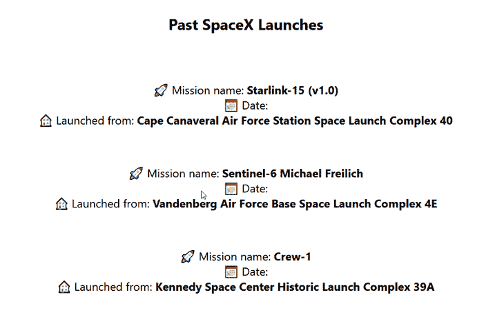

# 为什么在 Apollo - LogRocket 博客中使用 Next.js

> 原文：<https://blog.logrocket.com/why-use-next-js-apollo/>

在其核心，阿波罗是一个 GraphQL 实现，帮助人们管理他们的数据。他们还制作和维护了一个 GraphQL 客户端(Apollo Client ),我们可以在 Next.js 这样的 React 框架中使用它。

Apollo 客户端是一个状态管理客户端，允许您使用 GraphQL 管理本地和远程数据，并且可以使用它来获取、缓存和修改应用程序数据。

在本文中，我们将讨论:

所以，事不宜迟，我们开始吧。

## 为什么我们应该在 Next.js 中使用 Apollo 客户端

首先，让我们看看为什么我们应该在 Next.js 中使用 Apollo 客户端。使用 Apollo 客户端有三个主要原因:

1.  对缓存的现成支持
2.  内置加载和错误状态
3.  数据提取的声明性方法

### 对缓存的现成支持<

用阿波罗自己的话说，“缓存一个图表不是一件容易的事情，但是我们已经花了两年时间专注于解决它。”

Apollo 投入了大量时间来尽可能提高缓存过程的效率和效果。那么，为什么要尝试重新发明轮子呢？如果您在应用程序中获取数据并使用 GraphQL，那么 Apollo 客户机是处理数据的一种很好的方式。

另一个好处是使用客户端的开发人员只需要很少的设置。阿波罗甚至给它贴上“零配置”的标签我们将在后面的应用程序示例中看到这一点，但是要在应用程序中设置缓存，我们需要做的就是将下面的代码添加到我们的应用程序中:

```
import { ApolloClient, InMemoryCache } from '@apollo/client';

const client = new ApolloClient({
  cache: new InMemoryCache()
})

```

Apollo 的文档中有一篇关于零配置缓存的精彩文章；如果你有兴趣阅读，你可以点击这里。

### 内置加载和错误状态

Apollo 客户端内置了一个定制的 React 钩子，名为 use query，我们将在示例应用程序中使用它，它为我们提供了内置的加载和错误状态。

虽然这听起来并不令人印象深刻，但对于开发人员来说，这意味着我们不需要自己花时间来实现这个逻辑，我们可以只使用钩子返回的布尔值，并根据需要更改我们的应用程序呈现。

由于这些内置的状态，使用 Apollo 客户端意味着我们可以少花时间担心实现数据获取逻辑，而专注于构建我们的应用程序。

### 数据提取的声明性方法

Apollo 客户机实现`useQuery`钩子的另一个好处是，用 Apollo 客户机获取数据是声明性的，而不是命令性的。

这意味着我们只需要告诉 Apollo 我们想要什么数据，它就会为我们得到它；我们不需要写逻辑，也不需要给它一个如何做或处理的一步一步的指令列表。再一次，这是一个很好的例子，说明了 Apollo 客户机如何帮助加速开发，并使我们在使用 GraphQL 时成为更高效的开发人员。

## 在 Next.js 的每种渲染方法中使用 Apollo

Next.js 有四种呈现方法，我们可以结合 Apollo 客户机使用。这些是[静态站点生成、服务器端呈现](https://blog.logrocket.com/ssg-vs-ssr-in-next-js/)、增量静态重新生成和客户端呈现。

让我们来看看它们，它们在 Next.js 中做什么以及如何工作。然后，我们将构建我们的应用程序来展示 Apollo 客户端如何与 Next.js 和这些呈现方法一起工作。

### 静态站点生成(SSG)

有了 SSG，我们的页面会在用户请求之前的构建时在服务器上生成并转换成 HTML。这意味着当用户请求页面时，唯一必须做的事情就是将生成的 HTML 发送给用户并显示出来。

结果，用户体验到更快的加载时间，因为当请求进来时，服务器上没有呈现。

对于很多网站来说，比如登陆页面或博客，这种呈现页面的方法很棒。不过，使用 SSG 有一个固有的缺点，那就是您只能在构建时更新数据。这意味着两件事:

1.  数据必须在构建时可供服务器查询
2.  如果数据在页面构建之后更新，那么数据就过时了，只能通过部署新的构建来更新

解决这个陈旧数据问题的一种方法是使用 SSR，所以让我们来看看。

### 增量静态再生(ISR)>

SSG 是一种呈现静态内容的神奇方式，但是如果内容经常变化，SSG 就不太实用了。这是因为每次您想要获取或显示新数据时，都需要重新构建整个站点。

然而，这正是 ISR 设计来解决的[问题。](https://blog.logrocket.com/whats-new-next-js-12/)

使用 ISR，您可以在每页的基础上使用静态生成，但与 SSG 不同，ISR 不要求您每次刷新数据时都重建整个站点。实际上，这意味着您可以在扩展到数千(如果不是数百万)个页面的同时保留静态呈现的优势。

这是通过缓存实现的。当请求使用 ISR 的页面时，初始请求和在定义的重新验证期间收到的任何请求都会显示在缓存的页面上。在重新验证期过后提交的任何请求仍将显示(陈旧的)缓存页面，但是在后台，Next.js 将触发页面的重新构建。一旦新页面准备就绪，Next.js 将使旧的缓存无效，并显示更新后的页面。

简而言之，如果你想要静态渲染/生成的好处，而不需要每次都重建你的整个网站，ISR 是你的渲染方法。

### 服务器端呈现(SSR)

使用 SSR，服务器仍然生成类似 SSG 的页面，但是它不是在构建时生成一次，而是为用户发送的每个请求生成一次。这解决了困扰 SSG 的问题，因为我们可以在网站部署之间将内容更新到最新版本。

但是，这种呈现方法的缺点是，通过对服务器的每个请求进行呈现，我们增加了额外的处理时间，这会增加服务器的响应延迟。

### 客户端渲染(CSR)

如果你想降低服务器响应延迟，[使用 CSR 是有帮助的](https://blog.logrocket.com/next-js-vs-create-react-app/#comparing-ssr-csr)。CSR 是典型的 React 应用程序的工作方式；React 呈现一个页面，然后请求数据。一旦它检索到数据，它将在页面上显示它。

这种呈现方法可以保持页面快速加载，但它的缺点是与搜索生成的 HTML 的 SEO 爬虫不兼容。这是因为数据不会像 SSR 和 SSG 那样在服务器上生成 HTML 相反，一旦客户端呈现它，它就会被添加到页面中。

如您所见，Next.js 支持的三种不同的呈现策略各有利弊。您为页面选择的呈现方法以及如何使用 Apollo 客户端在 Next.js 中获取数据将取决于您的具体情况。

现在，让我们构建一个示例应用程序来展示这四种方法。

## 如何在 Next.js 中使用 Apollo

在我们看如何使用 Next.js 和 Apollo 创建应用程序之前，让我们花一点时间来看看我们将在应用程序中使用的 API。

这个 API 是一个非官方的 SpaceX API，跟踪他们所有过去和即将到来的任务。如果你感兴趣，你可以[在这里](https://api.spacex.land/graphql)使用 API 中的数据。但是，请注意，虽然这个 API 上的数据似乎已经过时，并且最近没有更新，但它仍然适用于本教程。

介绍完 API 之后，让我们开始构建我们的应用程序。首先，让我们创建一个新的 Next.js 应用程序；我们可以通过在终端中运行以下命令来实现这一点:

```
npx create-next-app <name-of-your-project>

```

我将我的项目命名为`nextjs-apollo`，但是你可以随意命名。

排序后，我们可以通过在终端中运行以下命令进入项目文件夹:

```
cd nextjs-apollo

```

现在，我们要做的第一件事是安装 Apollo 客户端，我们可以使用以下命令来完成:

```
npm install @apollo/client graphql

```

我们现在已经完成了项目所需的所有依赖项的安装。但是，在我们开始构建之前，我们需要配置我们的 Apollo 客户端来使用我们的 API。

为此，在您选择的 IDE 中打开您的项目，并在项目的根目录下创建一个名为`apollo-client.js`的新文件。

在这个文件中，放入以下代码；这将创建 Apollo 客户机，并允许我们在整个 Next.js 应用程序中查询 API:

```
import { ApolloClient, InMemoryCache } from "@apollo/client";

const client = new ApolloClient({
    uri: "https://api.spacex.land/graphql",
    cache: new InMemoryCache(),
});

export default client;

```

有了这个设置，我们现在可以在我们的应用程序中构建四个页面，展示我们前面提到的四种呈现方法。

### 使用 SSG 页面的 Apollo 客户端获取数据

为了查询 SSG 页面的数据，我们不会使用任何钩子从 Apollo 客户端获取数据；相反，我们将使用 Next.js 内置的`getStaticProps()`函数。通过一起使用`getStaticProps()`和 Apollo 客户端，我们可以轻松地创建 SSG 页面。

首先，导航并打开`pages/index.js`。在该文件中，将以下代码添加到页面底部:

```
export async function getStaticProps() {
  const { data } = await client.query({
    query: gql`
      query NextLaunch {
        launchNext {
          mission_name
          launch_date_local
          launch_site {
            site_name_long
          }
        }
      }
    `,
  });
  return {
    props: {
      nextLaunch: data.launchNext,
    },
 };
}

```

然后，将这几行添加到文件的顶部:

```
import { gql } from "@apollo/client";
import client from "../apollo-client";

```

添加了这些代码部分后，当我们启动开发服务器并且 Next.js 为我们的应用程序生成页面时，它将等待从我们的 API 获取所请求的数据。一旦数据返回，它就被提供给要构建的页面。

我们一会儿将布局页面，但是首先，让我们看看上面的代码中发生了什么。

首先，我们定义一个查询，其中包含我们希望从 API 返回的字段。之后，我们使用导入的`client`来查询这些数据。一旦数据从 API 返回，我们就析构出数据对象。

尽管在 API 请求的字段中看不到`data`，GraphQL 会自动将返回的数据包装在一个`data`对象中。所以，通过在这里析构它，我们可以省去以后做`.data`的麻烦。

最后，我们从`getStaticProps()`函数返回一个`props`对象，Next.js 需要它来生成页面。在这个`props`对象内部，我们传递我们想要在页面上使用的数据。

现在，让我们布置我们的主页，并在页面上显示我们刚刚获取的数据。用以下代码替换`index.js`文件中的`Home`函数:

```
export default function Home({nextLaunch}) {

  const {mission_name, launch_date_local, launch_site} = nextLaunch;
  const nextLaunchDate = fetchDate(launch_date_local).join('/');

  return (
    <div className={styles.container}>
      <Head>
        <title>Create Next App</title>
        <meta name="description" content="Generated by create next app" />
        <link rel="icon" href="/favicon.ico" />
      </Head>
      <main className={styles.main}>
        <h1 className={styles.title}>
          Next SpaceX Launch
        </h1>
        <p className={styles.description}>
          <span>🚀 Mission name: <strong>{mission_name}</strong></span>
          <span>📅 Date: <strong>{nextLaunchDate}</strong></span>
          <span>🏠 Launched from: <strong>{launch_site.site_name_long}</strong></span>
        </p>
      </main>
    </div>
  )
}

```

然后，为了正确显示我们的日期，在我们刚刚替换的`Home`函数之上添加以下函数:

```
function fetchDate(date) {
  const newDate = new Date(date);

  const day = newDate.getDate();
  const month = newDate.getMonth();
  const year = newDate.getFullYear();

  return [day, month, year];
};

```

最后，用下面的 CSS 代码替换`Home.module.css`文件的内容:

```
.container {
  padding: 0 2rem;
}
.main {
  min-height: 100vh;
  padding: 4rem 0;
  flex: 1;
  display: flex;
  flex-direction: column;
  justify-content: center;
  align-items: center;
}
.footer {
  display: flex;
  flex: 1;
  padding: 2rem 0;
  border-top: 1px solid #eaeaea;
  justify-content: center;
  align-items: center;
}
.footer a {
  display: flex;
  justify-content: center;
  align-items: center;
  flex-grow: 1;
}
.title a {
  color: #0070f3;
  text-decoration: none;
}
.title a:hover,
.title a:focus,
.title a:active {
  text-decoration: underline;
}
.title {
  margin: 0;
  line-height: 1.15;
  font-size: 4rem;
}
.title,
.description {
  text-align: center;
}
.description {
  display: flex;
  flex-direction: column;
  font-size: 1.5rem;
}
.code {
  background: #fafafa;
  border-radius: 5px;
  padding: 0.75rem;
  font-size: 1.1rem;
  font-family: Menlo, Monaco, Lucida Console, Liberation Mono, DejaVu Sans Mono,
    Bitstream Vera Sans Mono, Courier New, monospace;
}
.grid {
  display: flex;
  align-items: center;
  justify-content: center;
  flex-wrap: wrap;
  max-width: 800px;
}
.card {
  margin: 1rem;
  padding: 1.5rem;
  text-align: left;
  color: inherit;
  text-decoration: none;
  border: 1px solid #eaeaea;
  border-radius: 10px;
  transition: color 0.15s ease, border-color 0.15s ease;
  max-width: 300px;
}
.card:hover,
.card:focus,
.card:active {
  color: #0070f3;
  border-color: #0070f3;
}
.card h2 {
  margin: 0 0 1rem 0;
  font-size: 1.5rem;
}
.card p {
  margin: 0;
  font-size: 1.25rem;
  line-height: 1.5;
}
.logo {
  height: 1em;
  margin-left: 0.5rem;
}
.missionContainer {
  margin: 5rem;
}
@media (max-width: 600px) {
  .grid {
    width: 100%;
    flex-direction: column;
  }
}

```

现在，我们可以在终端中用`npm run dev`启动我们的开发服务器，并导航到主页；默认应该在`[http://localhost:3000/](http://localhost:3000/)`。进入该页面后，您应该会看到类似这样的内容:

>>>>>gd2md-html 预警:内联图片链接此处(to images/image2.png)。将图像存储在图像服务器上，并根据需要调整路径/文件名/扩展名。
( [回顶](#) )( [下次预警](#gdcalert3))
>>>>>


### 使用 Apollo 客户端获取 ISR 页面数据

因为我们的示例应用程序中的 API 不提供最新的数据或者不经常改变数据，所以我们看不到 ISR 的好处——但是这不应该阻止我们建立一个页面来使用它。

我们要做的第一件事是复制我们的`index.js`页面，并将其重命名为`isr.js`。接下来，我们要将页面上的函数 export 重命名为下面的。

```
export default function ISR({nextLaunch}) {
….rest of code here

```

然后，我们需要做的就是在本页设置 ISR，而不是 SSG，修改页面底部的`getStaticProps`函数。在这个函数的底部，我们从数据获取中返回属性，我们还需要返回一个`revalidate`属性。

```
 return {
    props: {
    nextLaunch: data.launchNext,
    },
    revalidate: 10, // In seconds <- Add this line
 };

```

将这一行添加到我们的`getStaticProps`函数后，ISR 现在已经设置并配置在我们的`/isr`路线上，重新验证周期为`10`秒。

现在，如前所述，由于数据已经过时，它将显示与以前的 SSG 页面相同的输出。如果我们有更新的或快速变化的数据，ISR 会在 10 秒钟的重新验证期之外提出请求时刷新数据。

### 使用 Apollo 客户端为 SSR 页面提取数据

既然我们已经设置了 SSG 页面，那么使用 Apollo 客户端生成包含数据的 SSR 页面就很容易了。

首先，让我们复制我们的`index.js`文件，并将其重命名为`ssr.js`。然后，我们需要做的就是用`getServerSideProps()` 替换我们为 SSG 页面使用的 [`getStaticProps()`函数。](https://blog.logrocket.com/the-latest-features-in-next-js/)

通过将函数更改为`getServerSideProps()`，我们指示 Next.js 不要在构建时静态呈现页面，而是在每次请求服务器时都这样做。

现在，如果我们在应用程序中导航到我们的`ssr`页面，我们应该看到一个看起来与使用 SSG 的主页相同的页面，但是现在是由服务器根据请求呈现的。


### 使用 Apollo 客户端为 CSR 页面获取数据

CSR 渲染比我们为 SSG 和 SSR 页面所做的要复杂一些。因为我们现在必须在 React 内部获取数据，所以我们想使用 Apollo 客户端提供的`useQuery`钩子。为了使用它，让我们首先将我们的应用程序包装在`ApolloProvider`中。

打开`_app.js`文件，在`pages`目录中找到另外两个文件`index.js`和`ssg.js`。在`_app.js`文件中，让我们导入在本教程开始时创建的`ApolloProvider`和客户端:

```
import { ApolloProvider } from "@apollo/client";
import client from "../apollo-client";

```

然后，让我们用下面的组件替换现有的`MyApp`组件:

```
function MyApp({ Component, pageProps }) {
  return (
    <ApolloProvider client={client}>
      <Component {...pageProps} />
    </ApolloProvider>
  );
}

```

现在用`ApolloProvider`包装我们的应用程序，我们可以在应用程序的任何地方使用来自 Apollo 客户端的`useQuery`钩子。但是，在我们开始使用这个钩子并为我们的 CSR 页面获取数据之前，我们必须解决另外一件事。

如果我们实现了`useQuery`钩子来获取 CSR 页面上的数据，那么我们就可以在页面呈现时向 API 发出请求。但是，我们希望避免这样做，因为这意味着页面将在 API 请求返回和 Next.js 将数据传递给页面之前生成。

为了解决这个问题，我们必须实现一个名为`ClientOnly`的定制组件。该组件确保我们只从浏览器请求数据，而不是在用户请求之前在服务器上呈现页面。

要创建这个新组件，在根级别创建一个名为`components`的新目录，并在该目录中创建一个名为`ClientOnly.js`的新文件。然后，粘贴以下代码，这些代码最初是由 Josh Comeau 编写的:

```
import { useEffect, useState } from "react";

export default function ClientOnly({ children, ...delegated }) {
  const [hasMounted, setHasMounted] = useState(false);

  useEffect(() => {
    setHasMounted(true);
  }, []);

  if (!hasMounted) {
    return null;
  }

  return <div {...delegated}>{children}</div>;
}

```

这个组件排序后，我们可以继续为我们的 CSR 页面实现数据获取。为此，创建另一个名为`PastLaunches.js`的新组件；该组件获取最近十次启动并显示给用户。

在`pastLaunches.js`文件中，粘贴以下代码:

```
import { useQuery, gql } from "@apollo/client";
import styles from "../styles/Home.module.css";

const QUERY = gql`
  query PastLaunches {
    launchesPast(limit: 10) {
        mission_name
        launch_date_local
        launch_site {
        site_name_long
        }
    }
}
`;

export default function PastLaunches() {
    const {data, loading, error} = useQuery(QUERY);

    if (loading) {
        return (
            <h2>Loading Data...</h2>
        );
    };

    if (error) {
        console.error(error);
        return (
            <h2>Sorry, there's been an error...</h2>
        );
    };

    const {launchesPast} = data;

    return (
        <>
            {launchesPast.map((launch) => (
                <div key={launch.mission_name} className={styles.missionContainer}>
                    <p className={styles.description}>
                        <span>🚀 Mission name: <strong>{launch.mission_name}</strong></span>
                        <span>📅 Date: <strong>{launch.nextLaunchDate}</strong></span>
                        <span>🏠 Launched from: <strong>{launch.launch_site.site_name_long}</strong></span>
                    </p>
                </div>
            ))}
        </>
    )
}

```

在`PastLaunches()`函数的顶部，可以看到我前面提到的 Apollo 客户端的`useQuery()`钩子。要使用这个钩子，定义一个 GraphQL 查询，然后将它传递给钩子，然后钩子返回我们可以在应用程序中使用的三个值:

1.  `data`，查询返回的数据
2.  `loading`，取数据时控制渲染的布尔值
3.  `error`一个布尔值，当获取数据出错时控制渲染

创建了这个组件后，我们需要做的就是为我们的 CSR 页面添加新的页面文件，并使用这两个组件。为此，在我们的`pages`目录中创建一个名为`csr.js`的新文件，并粘贴以下代码:

```
import Head from "next/head";
import styles from "../styles/Home.module.css";
import ClientOnly from "../components/ClientOnly";
import PastLaunches from "../components/PastLaunches";

export default function ClientSide() {
  return (
    <div className={styles.container}>
      <Head>
        <title>Past SpaceX Launches</title>
        <link rel="icon" href="/favicon.ico" />
      </Head>
      <main className={styles.main}>
        <h1>Past SpaceX Launches</h1>
        <ClientOnly>
          <PastLaunches />
        </ClientOnly>
      </main>
    </div>
  );
}

```

这段代码比用于 SSG 和 SSR 页面的代码要小得多，因为我们将所有的显示和数据获取代码都移到了`PastLaunches`组件中。

但是，最重要的是，您可以看到我们在前面的`ClientOnly`组件中包装了`PastLaunches`组件，以防止从浏览器之外的任何地方获取数据。

如果我们现在导航到`[http://localhost:3000/csr](http://localhost:3000/csr)`，您可以看到我们在客户端上获取的数据。最初，它在获取数据时显示加载状态，然后一旦检索到数据，它就切换并显示给用户。



我们的应用程序现在已经完成，我们已经用 Next.js 中可用的所有四种不同的呈现技术实现了 Apollo 客户机。

## 结论

在这篇文章中，我们看了什么是 Apollo 客户端，为什么我们应该使用它，以及我们如何通过 SSG、ISR、SSR 和 CSR 以三种不同的方式在 Next.js 中实现它。

如果你想看这个项目的 GitHub 库，[你可以在这里看到](https://github.com/conermurphy/nextjs-apollo-tutorial)。

我希望这篇关于为什么以及如何在 Next.js 中使用 Apollo 的文章对您有所帮助。如果你这样做了，[请考虑在 Twitter](https://twitter.com/MrConerMurphy) 上关注我，在那里我发布了关于 JavaScript 生态系统和整个 web 开发的有用且可行的技巧和内容。

或者，如果你不喜欢 Twitter，[访问我的博客](https://conermurphy.com/blog)了解更多我的内容。

## [LogRocket](https://lp.logrocket.com/blg/nextjs-signup) :全面了解生产 Next.js 应用

调试下一个应用程序可能会很困难，尤其是当用户遇到难以重现的问题时。如果您对监视和跟踪状态、自动显示 JavaScript 错误、跟踪缓慢的网络请求和组件加载时间感兴趣，

[try LogRocket](https://lp.logrocket.com/blg/nextjs-signup)

.

[](https://lp.logrocket.com/blg/nextjs-signup)[](https://lp.logrocket.com/blg/nextjs-signup)

LogRocket 就像是网络和移动应用的 DVR，记录下你的 Next.js 应用上发生的一切。您可以汇总并报告问题发生时应用程序的状态，而不是猜测问题发生的原因。LogRocket 还可以监控应用程序的性能，报告客户端 CPU 负载、客户端内存使用等指标。

LogRocket Redux 中间件包为您的用户会话增加了一层额外的可见性。LogRocket 记录 Redux 存储中的所有操作和状态。

让您调试 Next.js 应用的方式现代化— [开始免费监控](https://lp.logrocket.com/blg/nextjs-signup)。