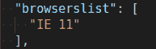
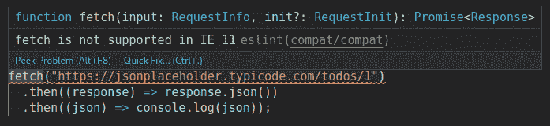
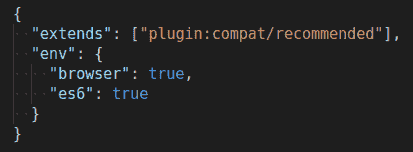
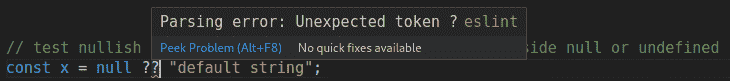

# 为什么你不需要巴别塔博客

> 原文：<https://blog.logrocket.com/why-you-dont-need-babel/>

2020 年，前端开发者还在过多的工具化上浪费大量时间。巴别塔被一些人视为必需品，但我的目的是向你展示它不是。

看完这篇文章，你会知道:

*   如何根据具体情况确定哪些浏览器确实需要支持
*   如何用 Visual Studio 代码 lint 来避免对 Babel 的需求
*   另一个可以更快完成同样工作的软件选择

## 巴别塔是什么，它解决什么问题？

Babel 是一个编译器，它可以将你的现代 JavaScript 转换成在旧的浏览器上运行。它还可以执行其他工作，如转换 JSX 语法，但它不是唯一的工具。

随着浏览器的发展，增加了新的 API 和 ECMAScript 特性。不同的浏览器发展速度不同，优先考虑不同的功能。这给我们留下了一个棘手的问题要解决:我们如何支持所有这些功能，同时还能使用现代功能？有些会不兼容。

一个常见的解决方案是使用最新的特性编写代码，然后向下转换成浏览器能够理解的老式代码。Transpiling 描述了一种特殊类型的编译。在不同的语境中有不同的含义。在我们的例子中，传输也有两个独立的部分。

### transpiling 和 polyfilling 的区别

Transpiling 是将旧浏览器无法理解的新语言语法转换成它们可以识别的旧语法的过程。

下面是一个编译`let`语句的例子:

```
// the new syntax `let` was added in ECMAScript 2015 aka ES6
let x = 11;

// `let` transpiles to the old syntax `var` if your transpiler target was ES5
var x = 11;

```

多填充是通过提供您自己版本的缺少的本机代码，将缺少的方法、属性或 API 添加到旧浏览器的过程。

可以认为是填补空白。例如，以下是`isNaN`的聚合填充:

```
// check if the method `isNaN` exists on the standard built-in `Number` object
if (!Number.isNaN) {
  // if not we add our own version of the native method newer browsers provide
  Number.isNaN = function isNaN(x) {
    return x !== x;
  };
}

```

获得 polyfils 的最佳途径是通过 [core-js](https://github.com/zloirock/core-js) 。

Transpiling 和 polyfilling 有时是不可能的，并且会增加很多代码膨胀，如果可能的话，最好完全避免它们。这就是为什么我们要讨论的第一个选择是最好的。

## 选择 1:不支持旧的浏览器

如果用户升级他们的浏览器，我们可以避免传输文件的麻烦，他们也可以享受新浏览器增强的功能和性能。不幸的是，事情没那么简单。

罪魁祸首是大公司不得不支持遗留软件。典型的例子是 Internet Explorer，它从一开始就是 web 开发的绊脚石。

也就是说，近年来情况已经有了很大改善。现在，大多数浏览器都是常青树，这意味着它们会不断更新。微软现在推广其 evergreen Edge 浏览器，该浏览器方便地使用了与 Chrome 相同的 V8 引擎，这意味着支持的引擎减少了一个。

要确定您是否必须支持特定的浏览器，请问自己以下问题。

### 1.您的客户目前正在使用哪些浏览器？

如果你已经有一个服务于相同客户群的网站或应用程序，你可以从分析软件中获得这些信息。以下是我管理的一家英国音响工程网站的一些最新统计数据。如果这是一个 JavaScript 应用程序，拥有相同的客户群体，我会假设他们会使用相同的浏览器。


如果你没有安装分析软件，你就不知道你需要支持哪些浏览器。你必须做出有根据的猜测。如果你有企业客户，你更有可能需要支持 IE11，而不是向精通网络的技术爱好者推销。

当你支持一个浏览器，你就做出了承诺。您真的希望每个版本都有额外的测试、额外的构建工具要配置、额外的依赖要照看吗？

经历这么多麻烦，肯定有明确的经济原因。失去那些无法访问你的网站或应用程序的客户会比支持浏览器的成本更高吗？

### 2.你想使用哪些现代浏览器功能？

使用现代语言功能和浏览器 API 使得编写代码更容易、更快、更有趣。这也使您的代码更易于维护。

如果你乐于编写 ES5 和使用`XMLHttpRequest()`，你肯定不需要 Babel，但是你可能需要某种治疗。

* * *

### 更多来自 LogRocket 的精彩文章:

* * *

这些数据可以通过[我能使用](https://caniuse.com/)吗？但是手动查找是浪费时间。既然您已经知道了想要支持的浏览器的名称，那么使用 awesome `Browserlist`应用程序就可以自动查找兼容的特性(下一节将详细介绍)。

## 备选方案 2:使用 eslint-plugin-compat

您可以完全避免整个传输过程，而是让您的代码编辑器在您使用任何对客户的浏览器来说太现代的功能时提醒您。这是最简单的选择，因为它:

*   消除对运输工具的依赖
*   让您重新获得对生产代码的实际控制

如果有一个你离不开的现代功能，你可以手动填充它。否则，您可以在需要时使用旧的语法。

### 创建一个测试

在我们分析利弊之前，我们需要确认我们的巴别塔替代品可以做同样的基本工作。让我们创建一个小测试。

下面是我们希望目标环境支持的现代代码。

运输之后，每个功能都有一个`console.assert`来验证它是否按预期工作。在`eslint-plugin-compat`的情况下，我们将检查不兼容的代码是否在林挺中被标记。

#### `test.js`

```
// test nullish coalescing - return right side when left side null or undefined
const x = null ?? "default string";
console.assert(x === "default string");

const y = 0 ?? 42;
console.assert(y === 0);

// test optional chaining - return undefined on non existent property or method
const adventurer = {
  name: "Alice",
  cat: {
    name: "Dinah",
  },
};

const dogName = adventurer.dog?.name;
console.assert(dogName === undefined);

console.assert(adventurer.someNonExistentMethod?.() === undefined);

// use browser API fetch, to check linting
fetch("https://jsonplaceholder.typicode.com/todos/1")
  .then((response) => response.json())
  .then((json) => console.log(json));

```

### 对 eslint-plugin-compat 使用 eslint `env`属性

我们需要一个解决方法，将语言特性和浏览器 API 结合在一起。

您可以使用 eslint 来检查语言语法。为此，将`es2020`的`env`属性向下更改。

要检查浏览器 API 兼容性，请使用`eslint-plugin-compat`。它使用与 Babel 和其他工具相同的 Browserlist 配置。

完整的说明可以在 [eslint-plugin-compat repo](https://github.com/amilajack/eslint-plugin-compat) 中找到。我们将使用 browserlist `defaults`预设来使用默认设置。根据您的分析，用您自己的选择替换它。

### 什么是 browserlist？


Browserlist automatically selects a list of browsers based on various criteria you give it.

看看 browserlist 的`defaults`设置支持的[浏览器列表。`defaults`是快捷方式:](https://browserl.ist/?q=defaults)

*   > 0.5%(由全局使用统计选择的浏览器版本)
*   最后两个版本(每个“没有死”的浏览器)
*   火狐 ESR
*   没有死(24 个月没有官方支持或更新的浏览器)

前往 [GitHub](https://github.com/browserslist/browserslist#full-list) 查看可用于选择您支持的浏览器的完整查询列表。

### 为 Visual Studio 代码设置 eslint-plugin-compat

将以下包添加到项目中。

```
npm install --save-dev eslint eslint-plugin-compat

```

将以下内容添加到`package.json`。

```
  "browserslist": [
    "defaults"
  ]

```

创建以下`.eslintrc.json`文件或将这些设置添加到您当前的文件中。

```
{
  "extends": ["plugin:compat/recommended"],
  "env": {
    "browser": true,
    "es2020": true
  }
}

```

确保您已经安装了 [VS Code ESLint 扩展](https://marketplace.visualstudio.com/items?itemName=dbaeumer.vscode-eslint)

现在，任何与您的`package.json`中的`browserlist`配置不兼容的浏览器 API 都会显示为林挺错误。您可以使用`.eslintrc.json`文件中的`env`属性单独控制您想要支持的 ECMAScript 版本。

如果`eslint-plugin-compat`也能自动显示语言特性就好了，但这是目前[未解决的问题](https://github.com/amilajack/eslint-plugin-compat/issues/206)。

选择`IE 11`设置—



—我们的`fetch()` API 被标记。



将`env`属性更改为`es6`。



尝试使用作为 Es2020 的一部分发布的`nullish coalescing`时，您会立即看到一个错误。



## 替代方案 3:用其他软件代替巴别塔

在我们看替代品之前，让我们快速回顾一下如何使用巴别塔。

### 利用巴别塔进行传输和聚合填充

首先，创建一个迷你项目目录并安装我们需要的依赖项。

```
mkdir babel-test
cd babel-test
npm init -y
mkdir src dist
npm install --save-dev @babel/core @babel/cli @babel/preset-env
npm install --save @babel/polyfill

```

将以下内容添加到您的`package.json`中。

```
"browserslist": "defaults",

```

将`test.js`文件写入`src`，然后发出以下命令。

```
npx babel src --out-dir dist [email protected]/env

```

最后，运行该文件以检查测试是否仍然有效。

```
node dist/test.js

```

应该没有断言错误，但是它会说`fetch is not defined`，因为 Node.js 没有`fetch()`方法。下面是生成的转换代码。观察所有额外的 cruft 和膨胀增加。

```
"use strict";

var _ref, _, _adventurer$dog, _adventurer$someNonEx;

// test nullish coalescing - return right side when left side null or undefined
var x = (_ref = null) !== null && _ref !== void 0 ? _ref : "default string";
console.assert(x === "default string");
var y = (_ = 0) !== null && _ !== void 0 ? _ : 42;
console.assert(y === 0); // test optional chaining - return undefined on non existent property or method

var adventurer = {
  name: "Alice",
  cat: {
    name: "Dinah",
  },
};
var dogName =
  (_adventurer$dog = adventurer.dog) === null || _adventurer$dog === void 0
    ? void 0
    : _adventurer$dog.name;
console.assert(dogName === undefined);
console.assert(
  ((_adventurer$someNonEx = adventurer.someNonExistentMethod) === null ||
  _adventurer$someNonEx === void 0
    ? void 0
    : _adventurer$someNonEx.call(adventurer)) === undefined,
); // use browser API fetch, to check linting

fetch("https://jsonplaceholder.typicode.com/todos/1")
  .then(function (response) {
    return response.json();
  })
  .then(function (json) {
    return console.log(json);
  });

```

### 使用巴别塔的利弊

优点:

*   这个最基本的设置相对简单
*   在撰写本文时，Babel 有一个庞大的社区来支持和持续更新 36.8k GitHub stars

缺点:

*   缓慢的编译时间
*   许多依赖项，即使它们是开发依赖项(安装了 269 个包)
*   根据`du -sh`的报告，使用了 39M 的磁盘空间
*   根据`find . -type f | wc -l`的报告，安装了 5728 个文件

### 使用 swc 蒸发和聚合填充


swc is a new competitor to Babel. It is written in Rust and up to 20 times faster. This can be very important if you find yourself waiting a long time to build your project.

要设置它:

```
mkdir swc-test
cd swc-test
npm init -y
mkdir src dist
npm install --save-dev @swc/cli @swc/core browserslist

```

将以下内容添加到您的`package.json`中。

```
"browserslist": "defaults",

```

将`.swcrc`配置文件写入项目根目录。

```
{
  "env": {
    "coreJs": 3
  },
  "jsc": {
    "parser": {
      "syntax": "ecmascript"
    }
  }
}
```

将您的测试文件写入`src`，然后向 transpile 发出以下命令。

```
npx swc src -d dist

```

运行结果文件，检查测试是否仍然有效。

```
node dist/test.js

```

生成的 SWC-trans filed 文件如下所示:

```
var ref, ref1;
var ref2;
// test nullish coalescing - return right side when left side null or undefined
var x = (ref2 = null) !== null && ref2 !== void 0 ? ref2 : "default string";
console.assert(x === "default string");
var ref3;
var y = (ref3 = 0) !== null && ref3 !== void 0 ? ref3 : 42;
console.assert(y === 0);
// test optional chaining - return undefined on non existent property or method
var adventurer = {
  name: "Alice",
  cat: {
    name: "Dinah",
  },
};
var dogName =
  (ref = adventurer.dog) === null || ref === void 0 ? void 0 : ref.name;
console.assert(dogName === undefined);
console.assert(
  ((ref1 = adventurer.someNonExistentMethod) === null || ref1 === void 0
    ? void 0
    : ref1.call(ref1)) === undefined,
);
// use browser API fetch, to check linting
fetch("https://jsonplaceholder.typicode.com/todos/1")
  .then(function (response) {
    return response.json();
  })
  .then(function (json) {
    return console.log(json);
  });

```

### 使用 swc 的利与弊

优点:

*   swc 比[快得多](https://github.com/swc-project/swc#performance)
*   更少的依赖项(安装了 43 个包)

缺点:

## 其他选择:Google Closure 编译器和 TypeScript

我没有把 [Google Closure 编译器](https://developers.google.com/closure/compiler/)作为一个选项，因为它使用起来非常复杂。也就是说，它可以很好地完成传输和聚合填充。如果你有空闲时间，我建议你去看看——特别是如果你重视小文件的话，因为它内置的缩小功能明显更好。

您还可以使用 [TypeScript](https://www.typescriptlang.org/) 来传输文件，使用 core-js 来手动填充，但是这是一个笨拙的解决方案，很容易产生比它解决的问题更多的问题。

## 结论

你不需要自动支持旧的浏览器。首先查看您的分析数据以了解您的客户实际上在使用哪些浏览器非常重要。

如有必要，您可以使用林挺来确保向后兼容性。这将省去创建特殊构建步骤和依赖 transpilation 的麻烦。

如果你选择自动翻译，那么 SWC 比巴别塔快得多，包含的依赖也少得多。也可以选择使用 Google Closure Compiler 或 TypeScript，但是这需要更多的配置工作。

## 使用 [LogRocket](https://lp.logrocket.com/blg/signup) 消除传统错误报告的干扰

[](https://lp.logrocket.com/blg/signup)

[LogRocket](https://lp.logrocket.com/blg/signup) 是一个数字体验分析解决方案，它可以保护您免受数百个假阳性错误警报的影响，只针对几个真正重要的项目。LogRocket 会告诉您应用程序中实际影响用户的最具影响力的 bug 和 UX 问题。

然后，使用具有深层技术遥测的会话重放来确切地查看用户看到了什么以及是什么导致了问题，就像你在他们身后看一样。

LogRocket 自动聚合客户端错误、JS 异常、前端性能指标和用户交互。然后 LogRocket 使用机器学习来告诉你哪些问题正在影响大多数用户，并提供你需要修复它的上下文。

关注重要的 bug—[今天就试试 LogRocket】。](https://lp.logrocket.com/blg/signup-issue-free)