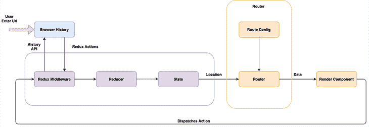

# 为什么不需要将路由状态与 Redux - LogRocket Blog 混合

> 原文：<https://blog.logrocket.com/why-you-dont-need-mix-routing-state-with-redux/>

***编者的** **注**:本帖于 2021 年 12 月 7 日更新，删除了对已弃用的 react-router-redux 包的引用，用官方的 react-router-redux 替换重新编写了教程，改进了对动态路由的描述，并更清楚地说明了何时应该考虑复杂性。*

本文涵盖了不需要将路由状态与 Redux 混合的一些原因。

在我们开始解释不需要混合路由状态的原因之前，让我们先回顾一下将路由状态与 Redux 集成的可用方法，并理解它是如何工作的。

## React 常用的路由状态库

有不同的库和方法可以用来集成路由状态和 Redux。最常用的有:

*   [connected-react-router](https://www.npmjs.com/package/connected-react-router) (以前被称为已弃用的 [react-router-redux](https://www.npmjs.com/package/react-router-redux) ):当你想要将你的路线历史与你的应用状态同步，并通过 redux 管理路线时，这个库是合适的。它提供了一些特性，如`push`、`replace`、`go`、`goBack`和`goForward`，以便在应用程序中方便地导航。
    *   [React-router-dom](https://reactrouter.com/) :这是一个备受推崇的库，用于在 React 应用程序中实现导航和路由，它提供了`BrowserRouter`、`Link`、`Route`和`Switch`等特性，所有这些特性使得它的集成无缝
        *   Redux-first-router :另一个 React 库，它让你可以在浏览器历史记录和应用程序中用户的当前位置/URL 中导航
        *   [Redux-first-history](https://www.npmjs.com/package/redux-first-history) :这个库的开发者的主要目标是让这个库的用户能够混合组件，这些组件通过它的`state.router.location`方法从任何其他库获得导航历史

如果您有兴趣探索其他集成了路由和 Redux 的库，您可以查看[这个 GitHub repo 以获得更多见解](https://github.com/markerikson/redux-ecosystem-links/blob/master/routing.md)。

## 【Redux 路由是如何工作的？

Redux 是一个状态管理工具，它使应用程序内部和应用程序之间的数据或状态保持同步。它通过组件状态所在的单一位置来实现这一点。这个单一的位置被认为是商店。

可能会更改应用程序状态的操作将被分派到此存储区，并且状态将被更新。应用程序中订阅该状态的任何组件都将被通知该组件的新状态，并且该值将通过该组件呈现。



通常情况下，浏览器历史记录和 Redux 存储会不断相互通信以保持同步。每次用户在应用程序中导航时，浏览器历史和商店中的位置更改都会更新。

这似乎违背了 Redux 的“单一来源的真理”原则，但事实并非如此。只要您能够保证存储在浏览器历史和 Redux 存储中的路由数据是相同的，您就可以配置您的应用程序只从存储中获取数据，从而维护单一来源的事实原则。

## 浏览您的应用程序

用户可以通过两种方式在应用程序中导航:内部和外部。

### 内部导航

当用户单击应用程序中的链接时，就会出现这种类型的导航，例如导航栏上的**联系人**选项卡/按钮，或者将用户导向应用程序另一个页面的任何链接。

这通常由管理应用程序路由的库的`history`特性来处理。Redux 中间件接收动作，并与 Redux 一起更新浏览器历史，Redux 更新 Redux 状态。

之后，我们连接的路由监听状态的变化，并根据 Redux 状态确定页面如何呈现。

### 外部导航

一个很好的例子是从另一个网站访问一个网页，或者通过 URL 栏、外部链接，或者当您使用浏览器的导航按钮在页面之间来回导航时。简单来说，通过浏览器的导航栏访问网页被认为是外部导航。

当浏览器中的 URL 发生变化时，Redux 存储中的监听器会观察到变化，并调度一个动作来更新状态和历史。

## 实施冗余优先路由方法

让我们探索一个冗余优先路由方法的简单例子。这将帮助您理解它在我们的应用程序中是如何实现的。

在您的终端中运行下面的代码行，创建一个 React 应用程序:

```
npx create-react-app redux-first-demo

```

`cd`进入 React app，安装`redux-first-router`库。

```
cd redux-first-demo

npm i redux-first-router

```

### 配置`store.js`文件

让我们从创建一个文件开始，我们在这个文件中配置保存应用程序状态的存储。创建一个名为`store.js`的文件，并添加以下代码片段:

```
import { applyMiddleware, combineReducers, compose, createStore } from 'redux'
import { connectRoutes } from 'redux-first-router'

import page from './pageReducer'

const routesMap = {
  HOME: '/',
  USER: '/user/:id'
}

export default function store(preloadedState) {
  const { reducer, middleware, enhancer } = connectRoutes(routesMap)

  const rootReducer = combineReducers({ page, location: reducer })
  const middlewares = applyMiddleware(middleware)
  const enhancers = compose(enhancer, middlewares)

  const store = createStore(rootReducer, preloadedState, enhancers)

  return { store }
}

```

在上面的`store.js`文件中，`connectRoutes`将路由器映射到我们想要渲染的组件。`routesMap`是一个对象，它包含路径和它们所呈现的各个组件的键。

然后，我们使用经过处理的`combineReducers`和`applyMiddleware`API 的值，用`createStore` API 初始化商店。

### 用`pageReducer.js`更新状态

reducer 调度 Redux 操作来更新应用程序的状态。下面的代码是我们的应用程序的`reducer`函数的一个实现，它包含需要根据路线呈现的组件。

这里，我们检查传递给减速器的动作类型。例如，如果动作的类型是`HOME`，我们返回它的状态。

* * *

### 更多来自 LogRocket 的精彩文章:

* * *

```
import { NOT_FOUND } from 'redux-first-router'

const components = {
  HOME: 'Home',
  USER: 'User',
  [NOT_FOUND]: 'NotFound'
}

export default (state = 'HOME', action = {}) => {
  return components[action.type] || state
}

```

### 渲染 React 组件

`components.js`文件包含了我们可以在 React 应用程序中渲染的组件。

```
import React from 'react'
import { connect } from 'react-redux'

const Home = () => <h3>Home</h3>

const User = ({ userId }) => <h3>{`User ${userId}`}</h3>
const mapStateToProps = ({ location }) => ({
  userId: location.payload.id
})
const ConnectedUser = connect(mapStateToProps)(User)

const NotFound = () => <h3>404</h3>

export { Home, ConnectedUser as User, NotFound }

```

### `App.js`帮助加载正确的页面

最后，`App.js`文件是 Redux 的`page`参数的状态根据导航状态决定要加载的组件的地方。我们从`components.js`文件中导入所有组件，并在用户导航到相应的路线时呈现它们各自的内容。

```
import React from 'react'
import { connect } from 'react-redux'

// Contains 'Home', 'User' and 'NotFound'
import * as components from './components';

const App = ({ page }) => {
  const Component = components[page]
  return <Component />
}

const mapStateToProps = ({ page }) => ({ page })

export default connect(mapStateToProps)(App)

```

## **为什么路由不需要 Redux】**

在某些情况下，将路由状态存储在 Redux 中可能是一个不错的选择，例如当您希望:

*   访问路由状态的历史实例
*   防止组件充当路由状态和应用程序状态之间的中介
*   使用调度的操作在应用程序中导航
*   使用 Redux devtools 更改路线时利用行程调试
*   保持路由数据和存储数据同步

然而，随之而来的问题也很多。

### 复杂性

在 Redux 中使用路由状态时，您将面临的一个主要问题是复杂性。

您无法预测它会有多复杂，并且您的完整应用程序状态将依赖于 Redux。

对于我们中一些拥有大量代码的人来说，这种复杂性可能是一件好事。大型应用程序很可能会被分解成许多组件，从而使代码更具可读性——这是一个很好的优势，但是在调试和跟踪性能方面，您将有更多的工作要做。

您还必须在一个地方管理一切，随着应用程序开始增长，这可能很难扩展。在我看来，这是不必要的——这就像在一个地方管理所有组件的状态一样。想想当你的代码库增长时会有多难。

### 多重“真相来源”

Redux 最突出的属性之一是它的单一真理来源原则。当您将路由与 Redux 集成在一起时，遵守这一原则可能会很麻烦，因为 Redux 存储不保存有关您的 URL 和导航历史的信息——这是由 React 路由器库和路由组件处理的。

由于 URL 的当前位置也决定了视图上呈现的数据，这意味着除了 Redux 存储之外，您还必须考虑路由组件提供的数据。

为了保持 Redux Store 作为获取准确数据的主要来源，您必须编写代码来跟踪 Store 和路由器之间的数据，并在用户与 React 应用程序交互时保持它们同步。

### 冗长

您可能需要处理的另一个问题是，您最终会得到大量用于解决简单问题的代码。您可能需要编写大量代码来导航到一个页面，而这是很容易避免的。

您必须管理仅用于路由的所有动作和归约器，以及用于更新路由的浏览器历史 API 的中间件。

### 代码冗余

如果您使用 Redux 进行路由，您可能最终会编写大量冗余代码，这是很容易避免的。例如，您可能需要编写许多动作和 reducer 函数来处理路由功能。

这可能给你一些权力来控制自己的路由器逻辑，但你可能不需要这种权力来处理应用程序的大部分需求。

因此，如果使用客户端路由，您可能最终会编写可以简化的代码。

## Redux 路由的替代方案

React 生态系统中管理路由问题的一种流行方法是 [react-router](https://reacttraining.com/react-router/) ，在本文开始时对其进行了简要描述。它是一个客户端路由器，解决了我们在开发 React 应用程序时面临的大多数问题。

让我们看看 React 路由器库的一些优点。

### 动态路线匹配

使用 React 路由器，我们可以将动态路由与 React 组件相匹配。假设您有一个动态子域的应用程序需求:

```
logrocket.slack.com

```

这里，子域是动态变化的。我们可以使用 React 路由器轻松处理路由。我们还可以使用 React Router 基于子域执行一些操作，而无需使用 Redux。

### 浏览器历史功能

在 React Router 中，浏览器历史特性(如在我们的应用程序路径上来回导航)是现成的。

### 惰性装载

React 路由器支持延迟加载。这有助于您根据优先级分割代码包。您可以在顶部捆绑包中加载主要功能，在分割捆绑包中加载次要功能。

## 最后的想法

归根结底，最重要的是我们解决的问题。最重要的是，我们需要简单而有效地做到这一点，使用 Redux-first 路由方法会有一些好处。

但是我们可以使用本文中讨论的更简单的方法来解决同样的问题。有很多库可以帮助我们做到这一点，比如 React Router。

## [LogRocket](https://lp.logrocket.com/blg/react-signup-general) :全面了解您的生产 React 应用

调试 React 应用程序可能很困难，尤其是当用户遇到难以重现的问题时。如果您对监视和跟踪 Redux 状态、自动显示 JavaScript 错误以及跟踪缓慢的网络请求和组件加载时间感兴趣，

[try LogRocket](https://lp.logrocket.com/blg/react-signup-general)

.

[ ](https://lp.logrocket.com/blg/react-signup-general) [](https://lp.logrocket.com/blg/react-signup-general) 

LogRocket 结合了会话回放、产品分析和错误跟踪，使软件团队能够创建理想的 web 和移动产品体验。这对你来说意味着什么？

LogRocket 不是猜测错误发生的原因，也不是要求用户提供截图和日志转储，而是让您回放问题，就像它们发生在您自己的浏览器中一样，以快速了解哪里出错了。

不再有嘈杂的警报。智能错误跟踪允许您对问题进行分类，然后从中学习。获得有影响的用户问题的通知，而不是误报。警报越少，有用的信号越多。

LogRocket Redux 中间件包为您的用户会话增加了一层额外的可见性。LogRocket 记录 Redux 存储中的所有操作和状态。

现代化您调试 React 应用的方式— [开始免费监控](https://lp.logrocket.com/blg/react-signup-general)。