# 为什么你可能应该使用一个设计系统(以及如何建立一个)

> 原文：<https://blog.logrocket.com/why-you-should-probably-be-using-a-design-system-and-how-to-build-one-39d7ba69047d/>

### 作为开发人员扩展 UI 的步骤

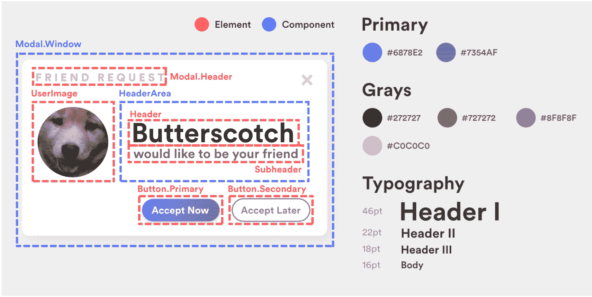

也许你已经听到了营销团队中的窃窃私语。或者你可能已经听到一个产品经理在极度恐惧中说出这些话。也许你甚至看到过 ProductHunt 上偶尔出现的关于它的网站。英语中最有争议、最令人恐惧、但最受欢迎的两个词:

*设计系统。*

如果你正在读这篇文章，你可能已经知道什么是“一个”,或者至少以前听说过这个术语。然而，在极少数情况下你不知道:简而言之，设计系统(有时被称为设计语言)是构建产品视觉外观的基石，这通常转化为产品品牌的清晰实现。

举个简单的例子，我们可以求助于品牌发展的领导者之一谷歌:

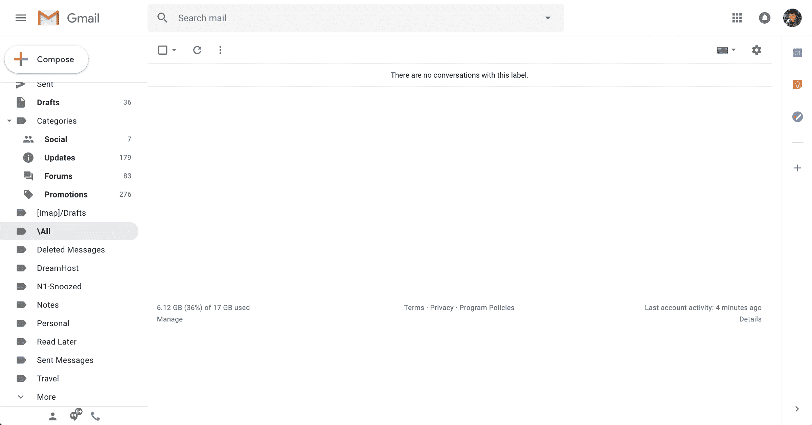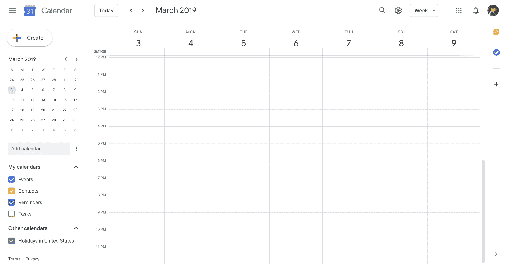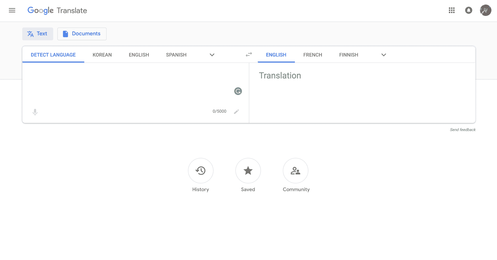

以上是谷歌的三个产品:邮件、日历和翻译。请注意这三者之间的连续性。Mail 和 Calendar 都有一个突出的白色(然而是彩色的)“行动号召”按钮，以及相同风格的文本框。日历和翻译共享相同风格的平面导航操作按钮。

这三个都是完全独立的产品:它们都存在于不同的领域，通常彼此完全独立地使用。然而，忽略“谷歌”标志，你仍然可以告诉它是一个谷歌产品。

虽然设计系统通常与设计团队联系在一起，但并不一定如此。有一些简单的指标和原则可以应用到你自己的工作中，帮助统一你的前端设计，提高它的整体品牌和一致性。

在这篇文章中，我们将讨论开始构建和实施你自己的设计语言时可以遵循的一般准则和步骤。这可能是一个相当大的问题，所以我们将保持高水平，我还会提供您可以参考的其他资源的链接。

### 设计系统的剖析

在深入研究之前，首先了解典型设计系统的结构是很重要的。也许你以前听说过“原子设计”这个术语。原子设计是由 web 开发人员 Brad Frost 设计的一个隐喻，用来描述设计系统中组件的层次结构:

1.  **Atoms —** 表示 UI 最原始的构件(比如按钮和文本字段)
2.  **分子—** 表示页面上的复合元素(如表单)
3.  **有机体—** 表示页面的部分或块(如页脚或导航条)
4.  **模板—** 表示包含动态数据的可重用页面(如个人资料页面)
5.  **页面—** 表示模板的特定实现(例如特定的用户资料页面)

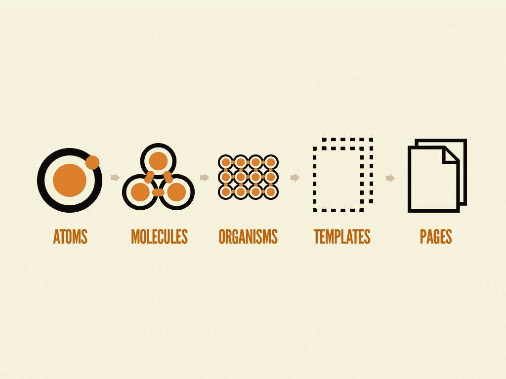

Atomic Design by Brad Frost (2013)

大多数设计系统主要关注原子和分子，有时也包含一些有机体，如页眉、页脚和侧边导航。模板和页面实现通常留给设计系统的消费者来实现(即前端开发者)。

也就是说，超越网页设计的概念，一般来说，设计系统可以用以下层次来表示:

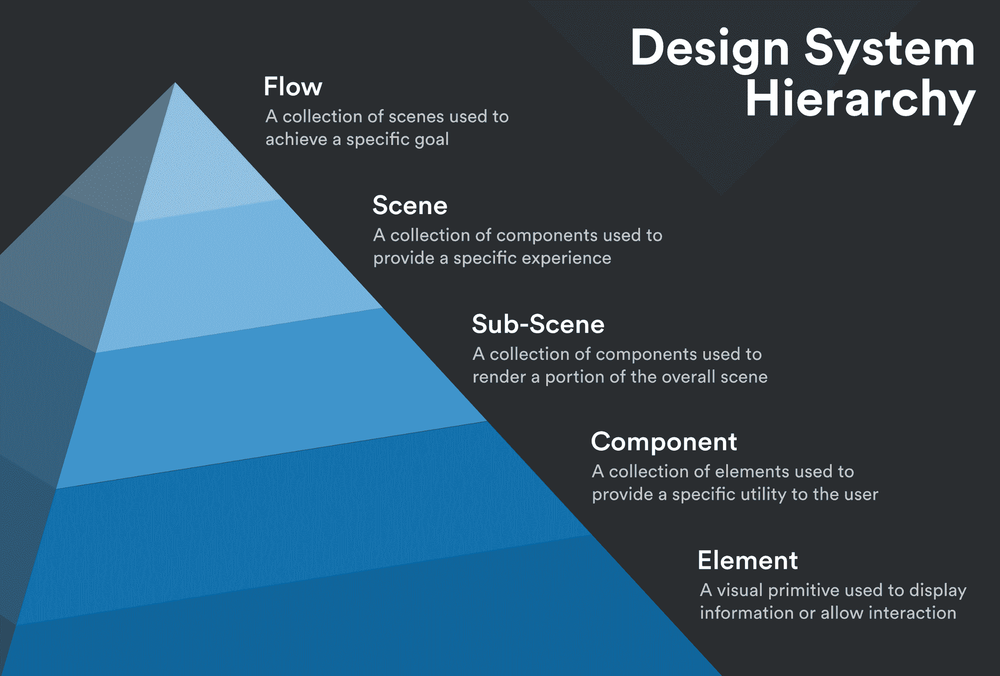

在下面的章节中，我们将主要致力于开发和提炼原子，或者设计元素，用它们你可以开始构建一种设计语言。

### 入门指南

构建综合设计语言的秘密其实可以归结为一个词:泛化。您的组件越不具体，系统就变得越可重用，越“可采用”。

事实上，在某种程度上，设计世界可能是少数鼓励刻板印象的环境之一。例如:

> "我应该假设这个网站上的每个红色按钮都执行一个破坏性的操作吗？"

见鬼了。是的。

你能想象如果一个“删除文件”按钮根据你在网站上的浏览位置彻底改变它的颜色会有多令人沮丧吗？基本上有 99%的把握你会不小心不可逆转地删除一些东西。

品牌(以及驱动它们的设计系统)是围绕一致性而建立的。

如果一个品牌非常不一致，用户如何准确地评估它？他们如何学会信任它？

### 反省

这就把我们带到了第一步:自省和可视化审计。梳理整个用户界面，问自己一个非常重要的问题:

> “哪些组件可以整合？任何两个有相同的目的吗？”

在设计语言中，每个工件都应该有一个明确的目的和与其他元素不同的独特的视觉区别。如果你有太多以完全相同的方式使用或者看起来几乎相同的组件，那么你永远不知道什么时候使用其中的一个(信不信由你，人们讨厌[做出选择](https://www.nytimes.com/2010/02/27/your-money/27shortcuts.html))。

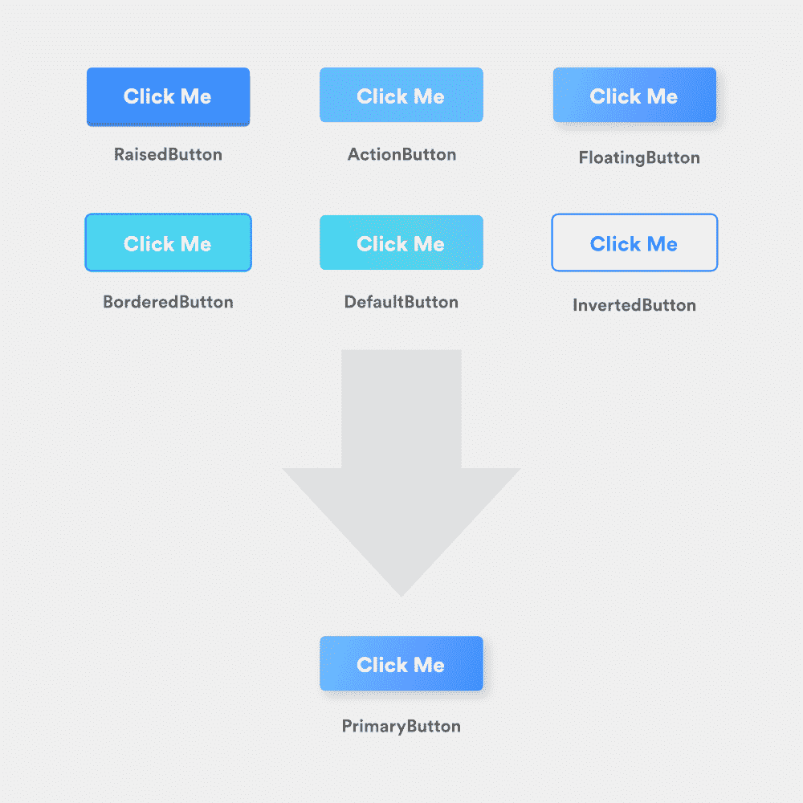

Say you’re building a confirmation dialog and can use any of the above buttons… how would you know which to use? They’re definitely all unique but do they really differ in purpose?

在审核结束时，您希望确保所有剩余的组件和样式都存在，以服务于不同的目的并传达各自的意义。

为了帮助指导我们完成这些指南，我们将围绕以下模型改进设计系统:

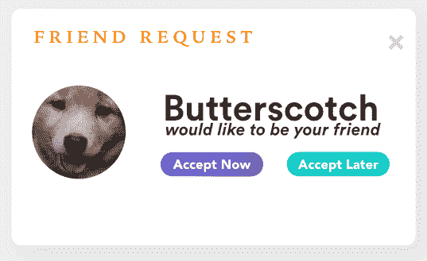

看起来像垃圾网站上的东西，不是吗？

### 尺寸、间距和类型

在大多数设计系统中，数字倍数决定了用户界面中各种字体和填充大小的数量。这意味着，与构建组件时选择您喜欢的填充/边距/字体大小相反，您应该从一组“基本”或中间大小中选择。

例如，如果我们要定义一个 8pt 大小的系统，基本大小将是 8px、16px、24px、32px 等。并且可以包含 12px、14px、16px、20px 等的定制中间尺寸。

为了便于区分，中间尺寸通常是 2 的倍数，可以是你选择的任何尺寸，只要它们在视觉上是独一无二的。总的来说，你的整个设计系统中不应该有超过 10 个不同的尺寸，从微小的(例如 10px)到巨大的(例如 72px)。

所有的尺寸都应该根据它们使用的上下文来分配给人类可读的名称。下面我们来谈谈其中的两种情况:间距和字体。

#### 间隔

每个组件的间距标签可能不同，通常类似于衬衫的尺寸:xs、s、m、lg、xlg。这些尺寸彼此之间应该非常独特，这样才能产生强烈的视觉区别(例如，不要将超小尺寸(xs)设为 11px，将小尺寸(s)设为 12px)。

一般来说，关系密切的元素之间应该使用较小的空格([格式塔理论](https://uxplanet.org/gestalt-theory-for-ux-design-principle-of-proximity-e56b136d52d1))，而较大的空格可以用来提高重点，增加某些元素的可读性(比如标题)。

#### 字体

字体大小应根据其预期用途进行标注，并直接表明其大小。在 IBM 的 Carbon 设计系统的[排版部分](https://www.carbondesignsystem.com/guidelines/typography/overview)可以看到一个字体大小一致的好例子。

此外，所有的排版都不应该使用两种以上的字体系列，并且应该为每种字体指定一个权重以保持一致性。例如，所有标题可能是 32px，字体粗细为 600，而正文可能是 16px，字体粗细为 400。

随意混合和匹配重量和尺寸将导致整个 UI 的不一致性，并破坏设计系统的整体目的。

#### 例子

回到我们用 Butterscotch 的例子，我们可以巩固和规范我们的大小、字体和类型，以极大地改善模态的结构，并利用我们的新设计系统:

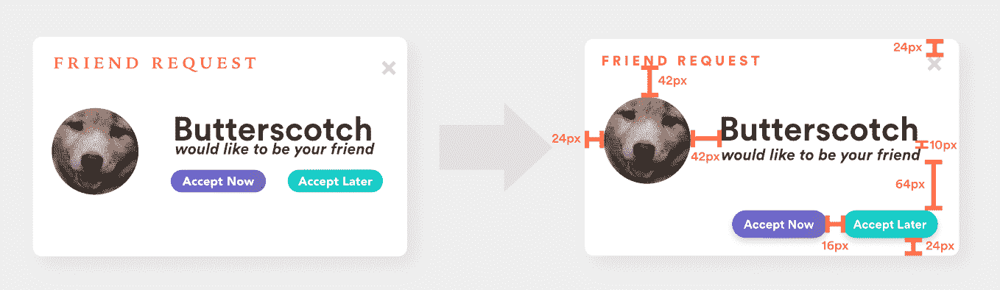

值得注意的是:

1.  这些字体被合并成一个字体系列
2.  重新评估字体样式，以使用模态页眉(18pt，900)、页眉(46pt，800)、副标题(22pt，800)和粗体正文(16pt，700)
3.  按钮组合在一起，而标题更靠近标题图像。标题和副标题有 10 便士的喘息空间
4.  卡片填充现在是一致的

#### 资源

1.  请多加点填料！
2.  [UI 设计中留白的力量](https://uxplanet.org/https-medium-com-viktorija-bachvarova-the-power-of-empty-space-in-uidesign-14f14f8b203)
3.  [类型刻度](https://type-scale.com/)

### 颜色；色彩；色调

一个品牌中的颜色细分通常如下:

1.  **原色:***品牌颜色。与您的产品、公司等最相关的颜色。想想“脸书蓝”或“Spotify 绿”。*
**   **辅色:**可选的辅助色，用来补充原色。例如，联邦快递使用紫色作为原色，橙色作为辅色。*   灰色:正文中使用的几种不同的灰色阴影，以及阴影、边框、分隔线和其他结构组件。灰色、白色和黑色应该构成你界面的大部分。更多关于那个[的信息在这里](https://blog.logrocket.com/designing-as-a-developer-in-2018-eca1ab5bff2)。*   **强调:**用于强调卡片和横幅等组件的各种亮色。口音也可以用来表达特定的意思(例如，红色代表危险/错误，绿色代表成功，等等)。).寻找柔和原色来补充品牌[的一个好资源可以在这里找到](http://www.flatuicolorpicker.com/)。*

 *考虑到悬停和按下状态，原色和二次色通常有亮和暗的版本，可能还有四到五种强调色。

总的来说，设计系统应该由大约 16 种独特的颜色组成。

#### 例子

回到 Butterscotch，我们可以通过选择一种原色(在本例中是紫色)来标准化调色板，并对 UI 的其余部分应用灰度。鉴于“稍后接受”提供了一个次要动作，它不应该与主要动作按钮争夺注意力。

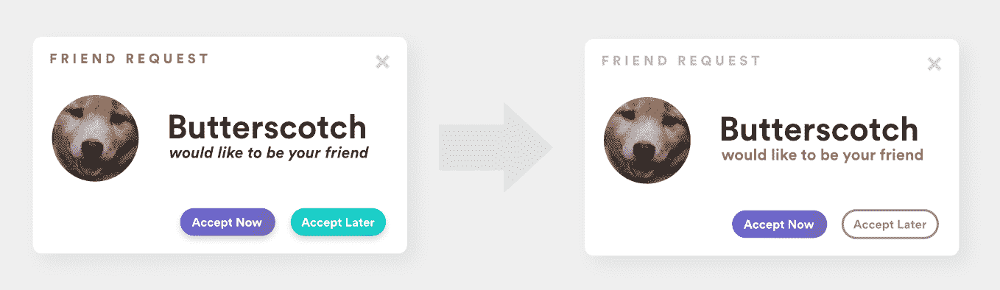

注意特定灰色阴影的重复使用，特别是在模型的标题栏中。

#### 资源

1.  [UI 设计中的色彩:一个(实用的)框架](https://medium.com/@erikdkennedy/color-in-ui-design-a-practical-framework-e18cacd97f9e)
2.  [挑选颜色](https://medium.com/hh-design/picking-colors-part-1-techniques-4d67b314781d)
3.  [设计系统中的颜色](https://medium.com/eightshapes-llc/color-in-design-systems-a1c80f65fa3) s

### 海拔

向您的前端呈现一个定义良好的维度与管理其元素的组成一样重要。现代网站通常使用内部和外部阴影等灯光效果，以及组件分层，在页面上建立元素的视觉层次。

虽然这种技术经常会渲染出奇妙的用户界面，但是过度使用或者一直为阴影选择随机值会造成混乱，扰乱页面的流动。

你的用户界面不应该是一个 MC 埃舍尔难题。看看下面的界面，试着确定哪个元素在上面。是左导航吗？为什么没有顶影？导航条是附在导航条上的吗？如果是这样的话，为什么顶部的导航没有阴影呢？顶部导航是如何连接到两侧导航的，而两侧导航却有不同的高度？

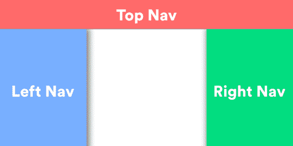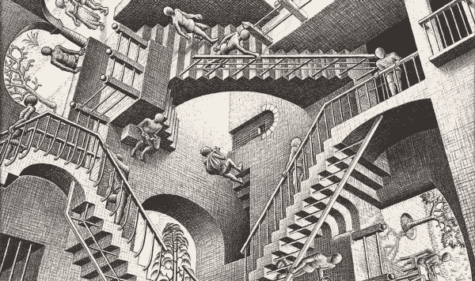

在构建设计语言时，明确组件的独特标高是至关重要的。谷歌的材料设计库做了[出色的工作](https://material.io/design/environment/elevation.html)定义了八个独特的标高，并为特定组件指定标高范围，以确保等级保持一致。

根据材料设计，标高有三个主要用途:

1.  允许表面在其他表面的前面和后面移动，例如在导航栏后面滚动内容
2.  反映空间关系并将元素相互分离
3.  将注意力集中在海拔最高的元素上

仰角也可以用来表示三维空间中的焦点。例如，Google 在材料设计中使用 elevation 来表示卡片何时被“拿起”(提升的焦点)，而 Udacity 则使用 elevation 来表示悬停时按下按钮(取消提升的焦点)。

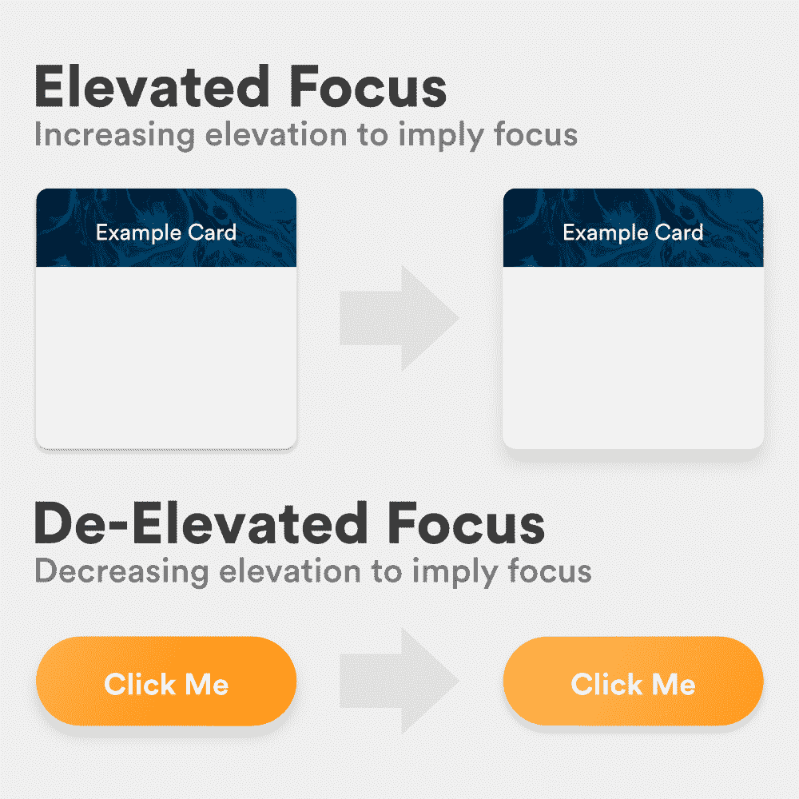

在决定用户界面的标高时，要问的重要问题应该是:

1.  在我的每个组件中，哪些元素是重叠的？重叠元素的存在是为了服务于相同的*功能目的*还是每个元素服务于自己的目的？应该通过彼此来区分它们吗？
2.  我最重要的元素在显示的时候是在屏幕的“最前面”吗？
3.  我的元素是如何表示各种状态的？状态出现在三维或二维空间有意义吗？

#### 例子

回到 Butterscotch，你会注意到，到目前为止，模态中的所有东西都是平坦的。为了在屏幕上以物理对象的形式显示我们的操作按钮，我们可以利用降低焦点来赋予它可点击的感觉:

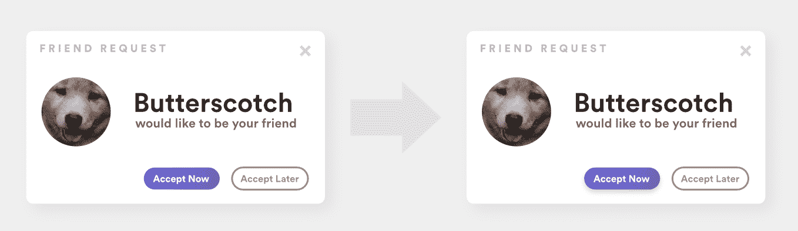

#### 资源

1.  作为真实世界反映的图形用户界面:阴影和高度
2.  [材料设计:标高](https://material.io/design/environment/elevation.html)
3.  [如何在现代 UI 设计中使用阴影和模糊效果](https://www.smashingmagazine.com/2017/02/shadows-blur-effects-user-interface-design/)

### 结论

总的来说，通过将上述概括和限制的指导方针应用到您的 UI 中，您可以开始将您的设计抽象成一个通用的设计系统，该系统可以适用于 React 或 Angular 组件、UIViews 等。

设计系统是高度复杂的，高度讨论的努力，不幸的是，这篇文章只是开始触及表面。当你继续构建你自己的设计系统时，你必须继续研究，学习关于它们的不断发展的实践。

现在，我们的模型结构更好了，我们可以运行一个最终审计，并确定我们的设计系统可以包含哪些组件、颜色、字体和大小:

虽然我们的调色板和排版可能看起来不完整，但请记住，这只是如何播种设计系统的一个例子。当这种分析在整个平台上运行时，可以很容易地构建一个全面的系统。

## 使用 [LogRocket](https://lp.logrocket.com/blg/signup) 消除传统错误报告的干扰

[LogRocket](https://lp.logrocket.com/blg/signup) 是一个数字体验分析解决方案，它可以保护您免受数百个假阳性错误警报的影响，只针对几个真正重要的项目。LogRocket 会告诉您应用程序中实际影响用户的最具影响力的 bug 和 UX 问题。

然后，使用具有深层技术遥测的会话重放来确切地查看用户看到了什么以及是什么导致了问题，就像你在他们身后看一样。

LogRocket 自动聚合客户端错误、JS 异常、前端性能指标和用户交互。然后 LogRocket 使用机器学习来告诉你哪些问题正在影响大多数用户，并提供你需要修复它的上下文。

关注重要的 bug—[今天就试试 LogRocket】。](https://lp.logrocket.com/blg/signup-issue-free)*