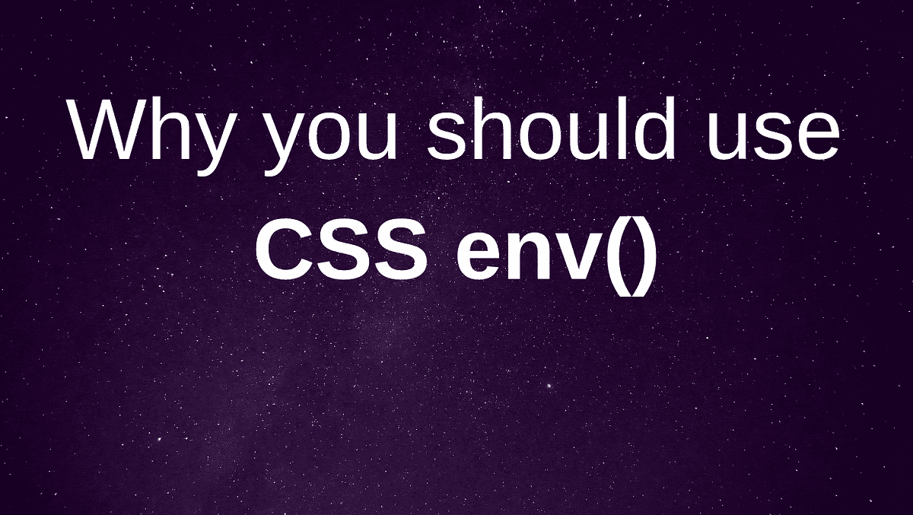
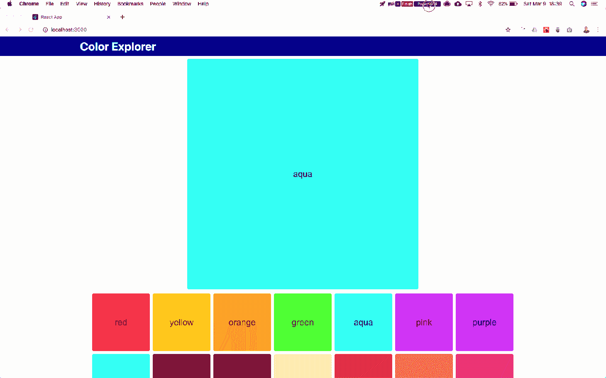
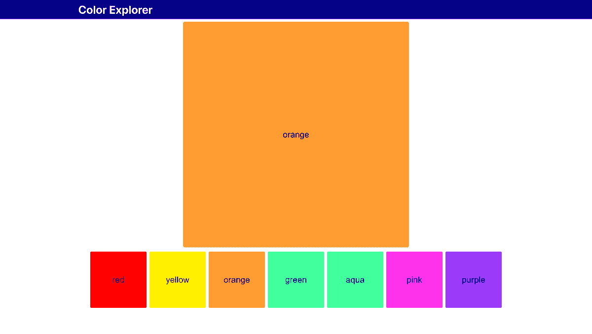
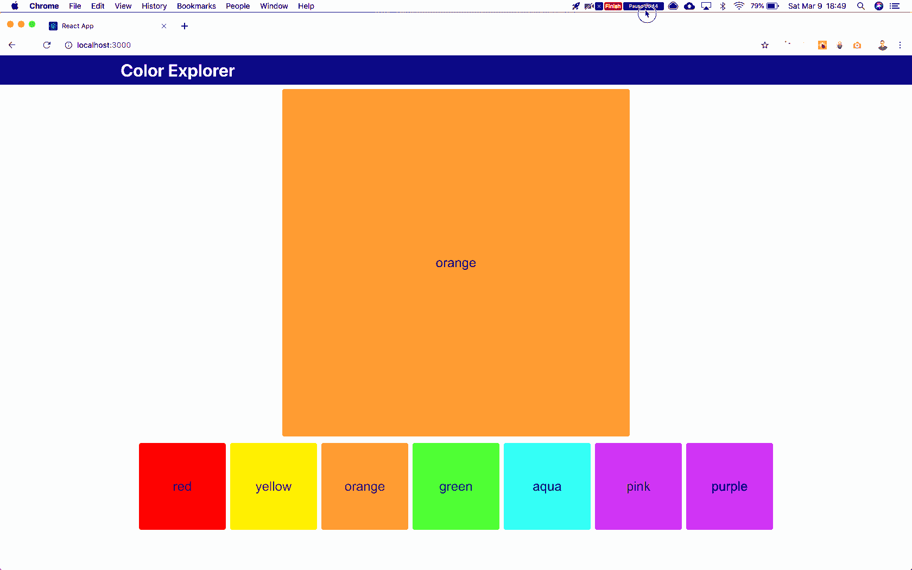
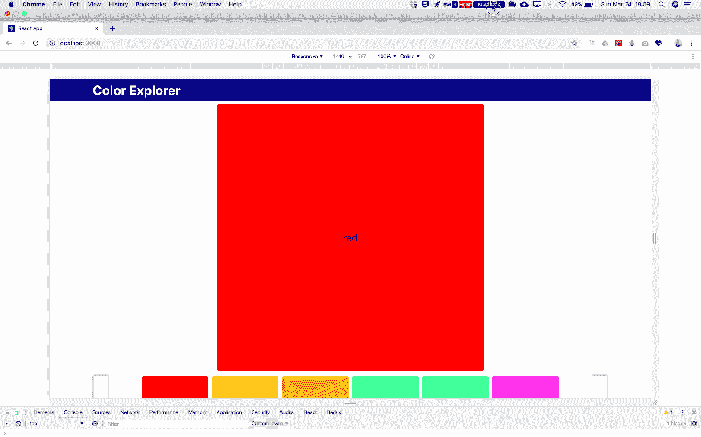

# 为什么应该使用 CSS env() - LogRocket Blog

> 原文：<https://blog.logrocket.com/why-you-should-use-css-env-9ee719ce0f24/>



难以保持共享的 CSS 和 JavaScript 值更新和同步？更新共享值时，你是否面临看似随机的 bug？在本文中，您将了解如何使用即将推出的 CSS env()特性和 PostCSS 插件在 CSS 和 JS 之间共享相同的变量，并将它们存储在一个文件中。

这里有一个你可能已经面对过的常见场景:

*   *你有一个相对复杂、响应迅速的设计来实现*
*   单独的 CSS 选择器和 calc()不能影响设计，所以你求助于你信任的朋友 JavaScript
*   *要解决这个问题，你需要从 JavaScript* 访问 CSS 值(例如容器尺寸、间距值)

您现在面临一个选择，是单独用 JavaScript 管理变量，还是使用内联样式来应用样式？

或者你在两个地方管理变量，CSS 和 JS 文件？

你进退两难。两种解决方案都不令人满意。

一方面，通过应用内联样式，您放弃了用任何其他方法覆盖样式的机会。现在，您必须始终使用内联样式来覆盖您应用的特定声明。

在下面的例子中，`MyComponent`将总是“红色”,字体大小为 2，因为内联样式优先于应用于组件的类名:

```
.my-component {
  font-size: 1rem;
  color: blue;
}
```

Inline styles take priority

另一方面，管理两个不同文件中的变量会使您面临维护风险。如果需要更改值，就有可能只在其中一个文件中更新值，导致应用程序以奇怪的方式中断。

但是还有一个办法！

一些伪代码展示了在 CSS 和 JS 之间共享变量的可能性。来源:[哈里·尼科尔斯的推特](https://twitter.com/HarryNicholls/status/1104790799508819969)

请允许我介绍一下 [CSS 环境变量](https://developer.mozilla.org/en-US/docs/Web/CSS/env)，并向您展示如何在 CSS 和 JS 之间共享变量，同时将值存储在一个地方。

问题是

[](https://logrocket.com/signup/)

### 下面是我最近遇到的一个更具体的问题。

比方说，我正在开发一个名为 Color Explorer 的应用程序，它允许用户查看颜色列表并选择一个要放大的颜色。

这是最初的版本:

看起来不错，有一个颜色列表，您可以单击小样本来更改大样本中显示的颜色。



Color Explorer with overflowing color list

但是我不喜欢你必须向下滚动才能看到所有的颜色，我希望它们被限制在一行中。

最简单的解决方案是对颜色列表应用 overflow: hidden:

看起来不错，但是有个问题。



Color Explorer with overflow: hiddenapplied to the ColorListcomponent

即使溢出的样本在视觉上是隐藏的，我仍然可以使用键盘来访问它们:

这是一个问题。



Visually hidden color swatches can be accessed via the Tab button

我需要我们的朋友 JavaScript 的一点帮助来解决这个问题。

我要做的是测量颜色列表容器，计算一行可以容纳多少颜色样本，并隐藏和禁用所有其他颜色样本。

要做到这一点，我需要知道颜色列表容器有多宽，每个颜色样本有多宽(包括边距)，以及在颜色列表容器的一行中有多少个颜色样本可以并排放置。

我不能从 CSS 中这样做，因为颜色列表容器是响应性的:

色板的宽度是固定的，现在它们的宽度是通过 CSS 设置的，那么我们如何从 JS 访问这些信息呢？



Desired responsive behavior of the color palette

解决方案 1:冒险的方式

### 最容易实现的解决方案是在 JS 中存储`ColorSwatch` width 变量。

只需将值复制并粘贴到 JS 文件中，如下所示:

请看 [CodePen](https://codepen.io) 上卢克·图比尼斯([@卢克·格罗基特](https://codepen.io/lukelogrocket) )
的笔 [CSS ENV](https://codepen.io/lukelogrocket/pen/BEGNwM/) 。

See the Pen [CSS ENV](https://codepen.io/lukelogrocket/pen/BEGNwM/) by Luke Tubinis ([@lukelogrocket](https://codepen.io/lukelogrocket))
on [CodePen](https://codepen.io).

ColorSwatchSelector 的初始版本

(**注意:** `Measure`取自一个名为 [react-measure](https://github.com/souporserious/react-measure) 的库，`onResize`事件让你访问被引用的 HTML 元素的维度，在本例中是`<ul>`。)

酷！那有效！

这是一个简单的解决方案，但很脆弱。

当您或者您团队中从未处理过组件的其他人不得不更新`ColorSwatch`宽度时，会发生什么？宽度值只在一个地方更新的风险很大，很可能 CSS 文件和应用程序会崩溃。开发人员需要一段时间来理解为什么应用程序坏了，以及如何修复它。

您可以通过使用 CSS 环境变量来避免这种风险。

解决方案 2: CSS 环境变量

### Enter，CSS env()。

这是 [MDN](https://developer.mozilla.org/en-US/docs/Web/CSS/env) 的描述:

env() CSS 函数可用于将用户代理定义的环境变量的值插入到 CSS 中，其方式与 var()函数和自定义属性类似

> 本质上，您可以定义全局变量，这些变量可以在属性值可以使用的任何地方使用，包括媒体查询。

CSS env()还不是官方 CSS 规范的一部分，但是 [env()规范](https://drafts.csswg.org/css-env-1/#env-function)在“编辑草案”中，并且有[对它的重要浏览器支持](https://caniuse.com/#feat=css-env-function)，所以一旦所有的细节最终确定，它将成为 CSS 规范的一部分。

你可以查看草案规范，但是 TL；DR:关于如何在 CSS 中访问环境变量已经有了共识，但是目前还没有办法定义或加载它们。

然而，现在您可以通过一个简洁的 PostCSS 插件来使用 CSS env()。

首先，你需要添加 [PostCSS](https://github.com/postcss/postcss) 和 [postcss-env-function](https://github.com/jonathantneal/postcss-env-function) 插件到你的项目中。

(如果你使用的是 create-react-apps，那么 PostCSS 已经安装好了，在 [postcss-env-function GitHub 页面](https://github.com/jonathantneal/postcss-env-function)上有特殊的配置说明。)

您还需要创建一个名为 css-env-variables.js 的文件，如下所示:

这就是你的基本设置！您现在可以开始使用 CSS env()，如下所示:

```
module.exports = {
  environmentVariables: {
    '--color-swatch-size': '10rem'
  }
};
```

Storing CSS variables in JS

很简单，是吧？

```
.color-swatch {
  height: env(--color-swatch-size);
  width: env(--color-swatch-size);
}
```

Use env() to access CSS environment variables

您可以添加任何您需要的变量，您在检查器中唯一能看到的是实际值。

即使现在在 JavaScript 文件中管理 CSS 变量，它们也没有多大帮助，因为每个值都包含了单位。因此，您仍然需要在两个单独的文件中维护 JS 和 CSS 变量。从技术上讲，您可以将 CSS env 变量导入到组件中。试试看！

要使用它们，你必须弄清楚如何从值中去掉单位，但是你真的认为这是你的应用程序应该担心的事情吗？

没有。

我们将在下一节讨论解决方案。

如何使用 JS 环境变量

### 我和我的团队在当前项目中开始使用的模式是在一个单独的 JS 文件中定义数值，并将它们导入 css-env-variables.js 来构造 css 变量。

这样，我们可以将 JS 值直接导入到任何其他需要它们的 JS 文件中，并使用相同的值来构造 CSS 环境变量。

我们这里只有数值，单位总是像素，因为它们在 JS 文件中更容易处理，我们可以将它们直接导入任何 JS 文件。

```
module.exports = {
  colorSwatchSize: 160; // px
};
```

Extract shared values to a separate JS module

现在我们快到了！

```
import { colorSwatchSize } from 'path/to/your/js-env-variables';
```

Import shared variables just like any other import

您可能已经注意到`js-env-variables.js`是一个 CommonJS 模块，而`some-other-file.js`是一个 ES6 模块。为什么不同？

因为`js-env-variables.js`没有传输。PostCSS 插件只在构建时使用这个文件，所以我们需要把它写成一个 CommonJS 模块，这样它才可以使用。

然后，您可以在 CSS 环境变量文件中使用这些值，如下所示:

厉害！现在你只需要维护一个地方的价值观，真理的源泉。

```
const { colorSwatchSize } = require('path/to/your/js-env-variables');

module.exports = {
  environmentVariables: {
    '--color-swatch-size': `${colorSwatchSize}px`
  }
};
```

Import your JS variables, create CSS variables, and export to access them via env()

这有效地消除了忘记更新该变量的任何实例的风险，因为它只定义了一次。

我们可以做得更好！

### 我会给你更好的。

上面的设置使用了像素，但我最初在 CSS 中使用的是“rem ”,我想再次使用它。

如果您想设置这个系统为您的 JS 文件提供像素值，为您的 CSS 提供 rem 值，还需要几个额外的步骤:

系统需要知道你的根字体大小

1.  你需要一个 px 到 rem 的转换函数
2.  您可以用与上述相同的方式定义根字体大小:

请确保在您的主 CSS 文件中应用它:

```
const {
  colorSwatchSize,
  rootFontSize
} = require('path/to/your/js-env-variables');

module.exports = {
  environmentVariables: {
    '--color-swatch-size': `${colorSwatchSize}px`,
    '--root-font-size': `${rootFontSize}px`
  }
};
```

Managing root font size via CSS env()

现在，您可以创建一个 px 到 rem 的转换函数，并在 CSS env 变量文件中使用它:

```
html {
  font-size: env(--root-font-size);
}
```

Don’t forget to set the root font-size using env()

您应该能够看到您的`--color-swatch-size`变量现在在 rem 中，并且更改根字体大小值会影响它。

```
const {
  colorSwatchSize,
  rootFontSize
} = require('path/to/your/js-env-variables');
const { getPxToRem } = require('path/to/your/px-to-rem');

const pxToRem = getPxToRem(rootFontSize);

module.exports = {
  environmentVariables: {
    '--color-swatch-size': pxToRem(colorSwatchSize),
    '--root-font-size': `${rootFontSize}px`
  }
};
```

Converting px to rem

这是一个简洁的小设置，可以为您节省许多调试时间。

额外收获:如果我使用的是 TypeScript 呢？

### 如果您使用 TypeScript，有几个问题。

您可能很难将 JS 环境变量和 px-to-rem util 导入 CSS env 变量文件。

您可以通过将这些文件设置为它们自己目录中的独立模块以及类型定义来解决这个问题。

您的目录结构应该如下所示:

您不需要更改 JS 文件的内容，只需将这些文件添加到`/js-env-variables`:

```
src |-css-env-variables.js |-js-env-variables | |-index.d.ts | |-index.js |-px-to-rem |-index.d.ts |-index.js
```

并将这些添加到`/px-to-rem`:

```
export const colorSwatchSize: number;
export const rootFontSize: number;
```

The contents of /js-env-variables

确保将`js-env-variables.js`和`px-to-rem.js`的名称改为`index.js`，并将它们放入各自的目录中。TypeScript 编译器应该对此感到满意。

```
export const getPxToRem: (rootFontSize: number) => (pxValue: number) => string;
```

The contents of /px-to-rem

这样做让编译器知道这些模块的存在，并给它一些关于它们类型的信息。

在 Netlify 上试用最终版本的[颜色浏览器。](https://infallible-swartz-e23661.netlify.com/)

结论

### 我们在这里做的是把一个脆弱的、不干燥的系统，变得更干燥、更坚固。

我们发现需要在 CSS 和 JS 之间共享变量，并发现最简单的解决方案(将相同的变量存储在两个不同的文件中)在变量需要改变时可能会失效。

现在，您拥有了在 CSS 和 JS 之间共享任何变量的工具，只需在一个地方根据需要更新值。这种解决方案提供了一种更健壮的共享变量的方式，并且当变量值改变时不太可能中断。

我在这里展示了一个简单的解决方案，只有一个共享变量。设置一个简单的应用程序需要花费相当多的精力，但这只是一个例子。在一个更大、更复杂的项目中尝试一下，我想你会发现这是值得的。

不再有寻找和替换的狩猎。不再有忘记更新某处元素高度实例的困扰。而且不会再出现随机 bug，至少不会和你这样存储的 CSS/JS 变量有关。

如果你还不知道，我强烈推荐你在需要的地方使用这个设置来共享 CSS 和 JS 变量。未来-你会感激你所做的。

[LogRocket](https://lp.logrocket.com/blg/typescript-signup) :全面了解您的网络和移动应用

## LogRocket 是一个前端应用程序监控解决方案，可以让您回放问题，就像问题发生在您自己的浏览器中一样。LogRocket 不需要猜测错误发生的原因，也不需要向用户询问截图和日志转储，而是让您重放会话以快速了解哪里出错了。它可以与任何应用程序完美配合，不管是什么框架，并且有插件可以记录来自 Redux、Vuex 和@ngrx/store 的额外上下文。

[](https://lp.logrocket.com/blg/typescript-signup)

除了记录 Redux 操作和状态，LogRocket 还记录控制台日志、JavaScript 错误、堆栈跟踪、带有头+正文的网络请求/响应、浏览器元数据和自定义日志。它还使用 DOM 来记录页面上的 HTML 和 CSS，甚至为最复杂的单页面和移动应用程序重新创建像素级完美视频。

你的前端是否占用了用户的 CPU？

## 随着 web 前端变得越来越复杂，资源贪婪的特性对浏览器的要求越来越高。如果您对监控和跟踪生产环境中所有用户的客户端 CPU 使用、内存使用等感兴趣，

.

[try LogRocket](https://lp.logrocket.com/blg/css-signup)

LogRocket 就像是网络和移动应用的 DVR，记录你的网络应用或网站上发生的一切。您可以汇总和报告关键的前端性能指标，重放用户会话和应用程序状态，记录网络请求，并自动显示所有错误，而不是猜测问题发生的原因。

[](https://lp.logrocket.com/blg/css-signup)[https://logrocket.com/signup/](https://lp.logrocket.com/blg/css-signup)

现代化您调试 web 和移动应用的方式— [开始免费监控](https://lp.logrocket.com/blg/css-signup)。

.

[Try it for free](https://lp.logrocket.com/blg/typescript-signup)

.