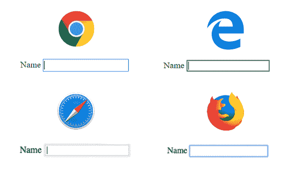

# 为什么你应该使用 CSS 焦点样式

> 原文：<https://blog.logrocket.com/why-you-should-use-css-focus-styles/>

人们会以多种方式使用你的网站。有些使用鼠标，有些使用触摸设备，有些使用屏幕阅读器，有些只使用键盘。在这篇文章中，你将学习所有关于焦点指示器的知识，如何设计它们，以及为什么它们对许多用户来说很重要。

## 什么是聚焦指示器？

聚焦输入元素时见过蓝色轮廓吗？这是浏览器用来指示元素被聚焦的本机焦点样式。



Native focus styles for the input element in Chrome, Edge, Safari, and Firefox.

所有交互元素都将显示蓝色轮廓。这包括链接(`<a>`)、按钮(`<button>`)和所有表单元素，如`input`和`select`。每个浏览器都有一个略微不同的默认轮廓样式，所以您可能想要更改默认样式(稍后将详细介绍)。

## 为什么焦点样式对可访问性很重要

每个人都使用鼠标或触摸设备来浏览网页，对吗？不——有许多用户依靠键盘来浏览网站。

我们可能认为只有一小部分是键盘用户，但实际数字可能会让你吃惊。仅在美国，就有大约 2000 万人有举起或抓握的困难，他们中的许多人使用键盘而不是鼠标来浏览网页。

### 电力用户

很多人整天和电脑打交道，为了更快地完成一些任务，他们经常使用键盘而不是鼠标。以我为例——我习惯在终端写代码或者做一些任务的时候只使用键盘。像我一样，许多其他高级用户更喜欢使用键盘浏览网页。

### 行动不便的人

有些用户不会使用鼠标。他们可能会使用类似于嘴棒的东西来操作标准键盘或模拟键盘的开关。

### 视力低下或有认知障碍的人

有些人使用屏幕阅读器，这主要是使用键盘控制。此外，还有很多人暂时依赖键盘——比如鼠标坏了的人。

## 更改焦点指示器的样式

现在我们知道了什么是焦点指示器以及人们为什么依赖它们，让我们看看如何改变默认的样式。

```
a:focus {
    outline: none;
    background-color: #651787;
    color: #fff;
}

```

这里我们使用`outline: none`移除默认的蓝色轮廓，同时改变元素的背景色和当它获得焦点时的颜色。通过这种方式，人们仍然可以很容易地识别出该元素当前被聚焦，但是现在的样式与您的设计相匹配，而不是枯燥的蓝色轮廓。

这里要注意一点:换颜色的时候要经常检查[颜色对比度](https://contrast-ratio.com)是否足够。这对视力低下的[人](https://www.w3.org/TR/low-vision-needs/)来说尤其重要，但是糟糕的色彩对比会影响到每个人。如果你曾经坐在阳光下上网，你就会知道为了能看到屏幕上的内容，有一个好的色彩对比度是多么重要。

## 如何使用`:focus-within`来设置一个可聚焦元素的父元素的样式

您想要设置聚焦元素的父元素的样式吗？太好了！有一个`[:focus-within](https://developer.mozilla.org/en-US/docs/Web/CSS/:focus-within)` CSS 伪类可以做到这一点。[浏览器支持](https://caniuse.com/#feat=css-focus-within)相当可靠，这是一个很大的改进。

让我们看看如何使用它:

```
<form>
  <label for="username">Username:</label>
  <input id="username" type="text">

  <label for="password">Password:</label>
  <input id="password" type="password">

  <input type="submit" value="Login">
</form>

```

这里我们有一个 HTML 格式的基本登录表单。下一步，我们将使用 CSS 来创建某种效果:

```
form {
  padding: 10px;
  position: relative;
  overflow: hidden;
}
form:before {
  content:"";
  background: #ddd;
  position: absolute;
  left: 0;
  right: 0;
  top: 0;
  bottom: 0;
  z-index: -1;
  transform: translateY(-100%);
  transition: transform 260ms ease-out;
}
form:focus-within:before {
  transform: translateY(0);

```

我们使用`:before`为表单创建一个背景，默认情况下使用`transform: translateY(-100%)`隐藏它。一旦用户聚焦于其中一个输入元素，背景将从顶部移动。这是通过使用`form:focus-within`选择器并将`:before`伪类的`translateY`设置为零来实现的。此外，我们在这里使用`transition`使其成为平滑效果。

[查看 JS Bin](https://jsbin.com/tumiheg/2/edit?html,css,output) 上的完整示例。

## 如何使用`:focus-visible`抑制焦点样式

有时使用`:focus`样式也会给鼠标/指针用户带来糟糕的用户体验。以带有上一个/下一个控件的图库为例。如果用户点击这些按钮中的一个，他们将获得焦点；因此，将显示焦点样式。虽然这对键盘用户来说很好，但对鼠标/指针用户来说可能太多了。

过去，有些人做出了错误的决定，使用下面的 CSS 来“修复”这个问题:

```
button:focus { outline: none; }

```

不要这样。当然，这也将删除键盘用户的焦点指示器，使其几乎无法使用您的图片库。

这就是`[:focus-visible](https://developer.mozilla.org/en-US/docs/Web/CSS/:focus-visible)`伪类发挥作用的地方。通过使用`:focus-visible`，焦点样式将仅在用户使用键盘聚焦一个元素时显示。

让我们看看如何使用它:

```
/* provide basic focus styles */
button:focus {
    ...
}
/* Remove focus styles for mouse users */
button:focus:not(:focus-visible) {
    outline: none;
}
```

这里，如果用户使用鼠标或指针聚焦一个元素，我们使用`:not`伪类显式地移除聚焦样式。这样键盘用户仍然可以看到焦点指示器，而鼠标用户看不到。太好了，问题解决了。

因为[浏览器支持](https://caniuse.com/#feat=css-focus-visible)仍然不是很好，你可以把它作为一个增强或者一个[聚合填充](https://github.com/WICG/focus-visible)直到有更广泛的支持。

## 注意焦点顺序

随着所有现代浏览器都支持 grid 和 flexbox，我们现在可以轻松地对 CSS 中的元素进行重新排序。这非常棒，你可以实现很棒的布局，但是在不改变元素本身顺序的情况下改变顺序还有一个问题。

默认情况下，[焦点顺序](https://www.w3.org/TR/UNDERSTANDING-WCAG20/navigation-mechanisms-focus-order.html)必须有意义，这可能会对我们产生负面影响。

让我用一个链接列表的例子来解释一下:

```
<ul>
  <li><a href="#">One</a></li>
  <li><a href="#">Two</a></li>
  <li><a href="#">Three</a></li>
  <li><a href="#">Four</a></li>
  <li><a href="#">Five</a></li>
</ul>

```

默认情况下，这些链接的视觉顺序和 tab 键顺序是匹配的。当使用`tab`键导航时，它将从一个变为两个，以此类推。现在，假设我们希望直观地更改顺序，并将第三个元素移动到最后一个位置:

```
ul {
  margin: 0;
  padding: 0;
  list-style: none;
  display: flex;
  flex-direction: column;
}

/* visually move the third element to the last position */
li:nth-child(3) {
  order: 1;
}

```

[完整示例见此处](https://jsbin.com/tifulec/1/edit?html,css,js,output)。

现在，第三个元素在视觉上位于最后一个位置，但是列表顺序仍然是连续的。视觉顺序和键盘导航顺序不再匹配；这对键盘用户来说是不可用的。在用 CSS 改变顺序时，你应该总是考虑到这一点，并且总是用你的键盘进行测试，以确认它是否仍然有意义。

## 结论

考虑到可访问性来构建网站和应用程序是非常棒的。设计焦点指示器的样式可以大大提高使用键盘的人的易用性。利用它，给你的网站添加一些好看的焦点风格——很多人会非常感激的。

## 使用 [LogRocket](https://lp.logrocket.com/blg/signup) 消除传统错误报告的干扰

[](https://lp.logrocket.com/blg/signup)

[LogRocket](https://lp.logrocket.com/blg/signup) 是一个数字体验分析解决方案，它可以保护您免受数百个假阳性错误警报的影响，只针对几个真正重要的项目。LogRocket 会告诉您应用程序中实际影响用户的最具影响力的 bug 和 UX 问题。

然后，使用具有深层技术遥测的会话重放来确切地查看用户看到了什么以及是什么导致了问题，就像你在他们身后看一样。

LogRocket 自动聚合客户端错误、JS 异常、前端性能指标和用户交互。然后 LogRocket 使用机器学习来告诉你哪些问题正在影响大多数用户，并提供你需要修复它的上下文。

关注重要的 bug—[今天就试试 LogRocket】。](https://lp.logrocket.com/blg/signup-issue-free)

## 你的前端是否占用了用户的 CPU？

随着 web 前端变得越来越复杂，资源贪婪的特性对浏览器的要求越来越高。如果您对监控和跟踪生产环境中所有用户的客户端 CPU 使用、内存使用等感兴趣，

[try LogRocket](https://lp.logrocket.com/blg/css-signup)

.

[](https://lp.logrocket.com/blg/css-signup)[https://logrocket.com/signup/](https://lp.logrocket.com/blg/css-signup)

LogRocket 就像是网络和移动应用的 DVR，记录你的网络应用或网站上发生的一切。您可以汇总和报告关键的前端性能指标，重放用户会话和应用程序状态，记录网络请求，并自动显示所有错误，而不是猜测问题发生的原因。

现代化您调试 web 和移动应用的方式— [开始免费监控](https://lp.logrocket.com/blg/css-signup)。