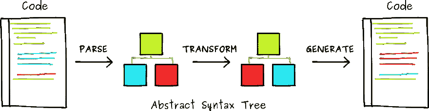
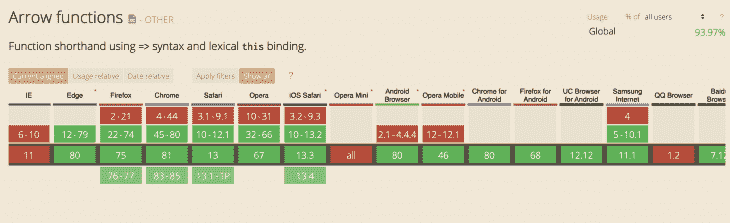

# 为什么你应该使用 SWC(而不是巴别塔)

> 原文：<https://blog.logrocket.com/why-you-should-use-swc/>

## 巴别塔是什么？

Babel 是一个帮助我们[将较新版本的 JavaScript 代码](https://scotch.io/tutorials/javascript-transpilers-what-they-are-why-we-need-them)如 [ES6](https://www.w3schools.com/js/js_es6.asp) 转换成较旧版本的 JavaScript 代码的工具——它甚至可以帮助你转换 [TypeScript](https://iamturns.com/typescript-babel/) 。

Babel 根据您为其定义的配置读取源代码，并编译更新的 JavaScript 特性，如[箭头功能](https://developer.mozilla.org/en-US/docs/Web/JavaScript/Reference/Functions/Arrow_functions)或[可选链接](https://developer.mozilla.org/en-US/docs/Web/JavaScript/Reference/Operators/Optional_chaining)。巴别塔的三个主要工具就是如此:

*   首先，Babel 的[解析器](https://github.com/babel/babel/tree/master/packages/babel-parser)获取 JavaScript 代码，并将其转换为一个[抽象语法树(AST)](https://en.wikipedia.org/wiki/Abstract_syntax_tree) ，这是计算机可以理解的源代码结构
*   接下来，Babel 的[遍历器](https://github.com/babel/babel/tree/master/packages/babel-traverse)获取 AST，研究它并将其修改为我们在 Babel 配置中定义的预期代码
*   最后，Babel 的[生成器](https://github.com/babel/babel/tree/master/packages/babel-generator)会将修改后的 AST 翻译回常规代码



Source: [https://www.sitepoint.com/understanding-asts-building-babel-plugin/](https://www.sitepoint.com/understanding-asts-building-babel-plugin/)

## 巴别尔的选择(写于铁锈)

[SWC](https://swc-project.github.io/) 也是一个 JavaScript 翻译程序，它是用 [Rust](https://www.rust-lang.org/) 编写的，比[Babel](https://swc-project.github.io/blog/2020/01/31/perf-swc-vs-babel)快得多。Rust 以其性能和可靠性而闻名，并鼓励许多企业用它重写部分或全部代码。例如:

Rust 如此高性能的原因之一是其处理[垃圾收集](https://en.wikipedia.org/wiki/Garbage_collection_(computer_science))的方式，这是一种内存管理方法，通过不再使用内存资源的数据对象来释放内存资源。由于 Rust 决定哪些内存资源在编译时不再需要，并且不必连续运行，因此处理时间减少，而性能提高。

众所周知，代码转换是一个昂贵的过程，这就是为什么用 Rust 编写的转换程序性能更高。我们将进一步探索这一点，但首先，我们应该确定我们是否需要一个 transpiler:

## 为什么我们需要一个运输工具？

在某些情况下，可能不需要使用 transpiler:

*   如果您正在构建一个简单的项目，该项目主要依赖于一个支持良好的 JavaScript 版本，如 [ES3](https://www-archive.mozilla.org/js/language/E262-3.pdf) 。例如，运行这段代码可以在几乎所有的浏览器上运行，所以如果您的 JavaScript 用法主要是这样的，那么没有 transpiler 也没问题:

```
// we print it, but we don't agree with it
function saySomething (something) {
    console.log(`${something}. But don't tell anyone.`);
}

saySomething("I don't like Javascript!");
```

*   如果您正在构建一个简单的项目，它依赖于较新版本的 JavaScript，比如 arrow 函数，但是您需要支持的浏览器也支持这些新特性。例如，在较新版本的 Chrome (45+)中运行以下代码应该没问题:



```
// we print it, but we don't agree with it
const saySomething = something => {
  console.log(`${something}. But don't tell anyone.`);
};

saySomething("I don't like Javascript!");
```

除了这些情况，应用程序中需要 transpiler 是必要的。浏览器使用不同类型的 JavaScript 引擎，如[V8](https://v8.dev/)(Chrome)[蜘蛛猴](https://developer.mozilla.org/en-US/docs/Mozilla/Projects/SpiderMonkey) (Firefox)，以及 [Chakra](https://en.wikipedia.org/wiki/Chakra_(JScript_engine)) (IE)。这意味着即使有一个标准的 JavaScript 规范，在不同的浏览器中获得标准的时间和它们的支持水平也有很大的不同。

这就是为什么我们需要在许多不同的浏览器上一致地处理我们的 JavaScript 代码，而不用担心破坏什么东西或者失去使用新特性的机会。

我们对 transpilers 的依赖不仅仅局限于将 [ES6](https://www.w3schools.com/js/js_es6.asp) 或[打字稿](https://www.typescriptlang.org/)转换为[ES5](https://www.w3schools.com/js/js_es5.asp)；transpilers 今天为我们带来了 JavaScript 的未来，并让我们处理许多 JavaScript 转换的情况，如 [ES2019](https://blog.logrocket.com/5-es2019-features-you-can-use-today/) 。对于今天的 JavaScript 开发人员来说，这是一个非常强大的工具。

所以我们已经确定了为什么我们需要运输钳。现在是时候用一个简单的设置来测试 SWC 的使用情况了，稍后将它的相对性能和速度与 Babel 进行比较。

## SWC 用法

SWC 可以作为一个软件包从 NPM 软件包管理器安装。

首先，在您的根目录下开始运行这个命令:

```
// use `cd` to go to the right directory and then run
mkdir swc_project

// initialize a package.json
npm init

// install swc core as well as its cli tool
npm install --save-dev @swc/core @swc/cli
```

通过运行这个命令，我们现在拥有了 SWC 核心和 CLI。核心包将帮助我们进行构建设置，而[CLI 包](https://swc-project.github.io/docs/usage-cli)可以在终端中用命令运行。

作为第一步，我们关注 CLI 工具来传输我们的 JavaScript 文件。假设我们在根目录下有下面的 JavaScript 文件:

```
//  async.js
const fetch = require("node-fetch");

async function getData() {
    let res = await fetch("https://jsonplaceholder.typicode.com/todos/1");
    let json = await res.json();
    console.log('data', json);
}

getData();
// result:
// ▶Object {userId: 1, id: 1, title: "delectus aut autem", completed: false}
```

您可以运行以下命令对该文件进行编译，如下所示:

```
// running this command will emit the transpiled data to stdout
// and it will be printed out in the terminal
npx swc async.js

// running this will create a new file called `output.js`
// with the transpiled data
npx swc async.js -o output.js

// running this will create a new directory called `transpiledDir`
// and will transpile all th files in the original dir
npx swc src -d transpiledDir
```

注意——要查看传输文件的样子，您可以使用这个 [SWC 游乐场](https://swc-playground.now.sh/)。

现在，作为第二步，我们希望将 SWC 作为一个工具包含在我们的构建系统中。对于这一个，我们想使用 [Webpack](https://webpack.js.org/) 作为一个更高级和可配置的构建器。

首先，让我们看看我们的`package.json`如何寻找 Webpack 和 SWC 的设置。有了这个设置，我们可以运行`npm run-script build`让 webpack 构建我们的包；此外，我们可以运行`npm run-script start`来让 Webpack 服务于我们的应用程序:

```
{
  "name": "swc-project",
  "version": "1.0.0",
  "scripts": {
    "test": "echo \"Error: no test specified\" && exit 1",
    "build": "rm -rf ./dist && webpack",
    "start": "webpack-dev-server"
  },
  "license": "MIT",
  "devDependencies": {
    "@swc/core": "^1.1.39",
    "css-loader": "^3.4.0",
    "html-loader": "^0.5.5",
    "html-webpack-plugin": "^3.2.0",
    "sass-loader": "^8.0.0",
    "style-loader": "^1.1.1",
    "swc-loader": "^0.1.9",
    "webpack": "^4.41.4",
    "webpack-cli": "^3.3.10",
    "webpack-dev-server": "^3.10.1"
  },
  "dependencies": {
    "node-fetch": "2.6.0",
    "react": "^16.12.0",
    "react-dom": "^16.12.0",
    "regenerator-runtime": "^0.13.5"
  }
}
```

我们上面构建和启动应用程序的配置存储在一个`[webpack.config.js](https://webpack.js.org/configuration/)`文件中，Webpack 会自动获取该文件。这个文件中有几件事情:

*   我们正在为 Webpack 设置名称和位置，以输出您的包、资产和文件，包括所有传输的文件
*   `[devServer](https://webpack.js.org/configuration/dev-server/)`:我们通过这个配置来服务我们的 Webpack 应用程序，告诉 Webpack 从哪里提供内容，并定义一个端口来监听请求
*   我们定义这个插件是为了让提供包含 Webpack 包的 HTML 文件的过程变得更容易

但是这个配置中最重要的部分是 [`swc-loader`](https://swc-project.github.io/docs/usage-swc-loader) ，它允许我们用。`js`或`.jsx`文件扩展名:

```
// global dependencies
const path = require('path');
const HTMLWebpackPlugin = require("html-webpack-plugin");

module.exports = {
  mode: "development",
  output: {
    path: path.resolve(__dirname, './dist'),
    filename: 'index_bundle.js'
  },
  devServer: {
    contentBase: path.join(__dirname, 'dist'),
    compress: true,
    port: 9000
  },
  module: {
    rules: [
        {
        test: /\.jsx?$/ ,
        exclude: /(node_modules|bower_components)/,
        use: {
            // `.swcrc` in the root can be used to configure swc
            loader: "swc-loader"
        }
      },
      {
        test: /\.html$/,
        use: [
          {
            loader: "html-loader",
            options: { minimize: true }
          }
        ]
      },
      {
        test: /\.scss/i,
        use: ["style-loader", "css-loader", "sass-loader"]
      }
    ]
  },
  plugins: [
    new HTMLWebpackPlugin({
      filename: "./index.html",
      template: path.join(__dirname, 'public/index.html')
    })
  ]
};
```

随着在我们的 Webpack 配置中设置好`swc-loader`,我们已经完成了 JavaScript 文件传输的一半。然而，我们仍然需要指导 SWC 如何转移我们的文件。原来，SWC 有一个类似于 Babel 的方法，在根目录下定义一个名为[的配置文件。swcrc](https://swc-project.github.io/docs/configuring-swc.html) 。让我们看看这个配置对于一个想要传输文件类型脚本的项目是什么样子的。

在这个配置中，我们使用`test`配置作为一个[正则表达式](https://en.wikipedia.org/wiki/Regular_expression)，只匹配文件扩展名为`.ts`的文件。此外，通过`jsx.parser`配置，我们将指导 SWC 使用哪个解析器进行编译(可能是`typescript / ecmascript`)。

然而，我们仍然可以通过定义哪些翻译选项用于我们的用例来控制语法解析。例如，在这个例子中，我们对传输 Typescript[decorator](https://www.typescriptlang.org/docs/handbook/decorators.html)和 [dynamic imports](https://basarat.gitbook.io/typescript/project/dynamic-import-expressions) 感兴趣，但是忽略传输文件扩展名为`.tsx`的文件:

```
// .swcrc

{
  "test": ".*.ts$",
  "jsc": {
    "parser": {
      "syntax": "typescript",
      "tsx": false,
      "decorators": true,
      "dynamicImport": true
    }
  }
}
```

现在，假设我们想在上面的`webpack SWC`示例中使用`[React](https://reactjs.org/)`。我们知道，在 React 中，我们可以使用一个名为`.jsx`的文件扩展名来编写 React 组件:

```
// App.jsx

// global dependencies
import React from 'react';
import ReactDOM from 'react-dom';

const App = () => {
  return <h1>My SWC App</h1>;
};

ReactDOM.render(<App />, document.querySelector("#root"));
```

通过 Webpack 提供这个文件需要正确的`webpack loader`,我们已经在上面定义了它。它还要求在`.swcrc`文件中有正确的翻译设置。现在，通过这种方法，我们使用了现代 JavaScript 的最新功能( [ES2019](https://medium.com/@selvaganesh93/javascript-whats-new-in-ecmascript-2019-es2019-es10-35210c6e7f4b) )并在传输时支持`.jsx`文件。此外，如果我们的 React 项目需要额外的 transpilation 设置，我们手头有[大量的设置](https://swc-project.github.io/docs/configuring-swc):

```
// .swcrc

{
    "jsc": {
      "parser": {
        "syntax": "ecmascript",
        "jsx": true
      }
    }
  }
```

## 巴别尔和 SWC 的速度比较

正如我们之前所讨论的，transpiler 的速度至关重要，因为它是构建过程的一部分，对于许多开发人员来说，在这方面节省的任何时间都是宝贵的。让我们来看看这两个工具在速度方面的比较。

首先，我们以一种人工的方式比较它们，也就是以同步的方式运行巴别塔和 SWC 的代码转换。众所周知，JavaScript 是单线程的，在现实应用中不可能以异步方式运行繁重的计算。但是这仍然会给我们一个速度比较的指标。让我们看看在单核 CPU 上运行的这些基准比较(由 SWC 项目的[维护者执行的测试):](https://swc-project.github.io/blog/2020/01/31/perf-swc-vs-babel#benchmark-for-many-works)

| 变换 | 速度(操作/秒) | 样品运行 |
| --- | --- | --- |
| SWC (ES3) | 每秒 616 次运算 | 88 |
| 巴别塔(第五章) | 每秒 34.05 次运算 | 58 |

这表明，尽管 SWC 的 ES3 改造过程成本更高，但与巴别塔相比，SWC 的传输速度还是很明显的。

现在，如果我们想对一个更真实的场景进行基准测试，我们可以针对`[await Promise.all()](https://developer.mozilla.org/en-US/docs/Web/JavaScript/Reference/Global_Objects/Promise/all)`运行示例，这是一个处理 JavaScript 中的操作的更昂贵和真实的场景。在这个基准测试中，CPU 内核的数量和并行计算开始发挥作用。[在](https://swc-project.github.io/blog/2020/01/31/perf-swc-vs-babel)运行的另一个基准测试中，进行了两个实验。两者都使用了一台带有 8 个 CPU 内核和 4 个并行度**的计算机。**

第一个实验是在 **4** 的承诺下进行的:

| 改变 | 速度(操作/秒) | 样品运行 |
| --- | --- | --- |
| SWC (ES3) | **1704** 操作/秒 | 73 |
| 巴别塔(第五章) | 27.28 次/秒 | 40 |

第二个实验用 **100** 承诺:

| 改变 | 速度(操作/秒) | 样品运行 |
| --- | --- | --- |
| SWC (ES3) | **2199** 操作/秒 | 54 |
| 巴别塔(第五章) | **32** 操作/秒 | 6 |

> 注意——如果您有兴趣自己运行测试并比较这些基准，您可以克隆[这个存储库](https://github.com/swc-project/node-swc),然后在终端中运行以下命令:

```
// clone and cd into the cloned repository
cd node-swc

// Node.js benchmark runner, modelled after Mocha and bencha, based on Benchmark.js.
npm i benchr -g

// run the multicore.js or any other benchmarks under /benches directory
benchr ./benches/multicore.js

```

我们在这些数字中可以发现的主要问题是，随着 Babel 在[事件循环](https://developer.mozilla.org/en-US/docs/Web/JavaScript/EventLoop)上工作，Babel 在异步操作中的性能正在下降。这与 SWC 形成对比，后者运行在一个[工作线程](https://nodejs.org/api/worker_threads.html)上，可以很好地随着 CPU 内核数量的增加而扩展。

总的来说，我们看到这两种工具之间明显的速度差距，因为在单线程和 CPU 核心上，SWC 往往比 Babel 快大约 **20** 倍，而在多核异步操作过程中，则快大约 **60** 倍。

## 结论

我们在本文中一起介绍了 trans piler 的基础知识，并从设置、执行和速度的角度比较了两种 JavaScript transpilers。通过这样做，我们了解到:

*   它们的构建工作流的设置是相似的
*   然而，与巴贝尔相比，SWC 有明显的速度优势

因此，如果您正在使用 Babel 并考虑转换以获得更快的构建时间，请确保:

话虽如此，SWC 背后的想法听起来很有希望，我们都将关注它的进展。

## 资源

使用 [LogRocket](https://lp.logrocket.com/blg/signup) 消除传统错误报告的干扰

## [LogRocket](https://lp.logrocket.com/blg/signup) 是一个数字体验分析解决方案，它可以保护您免受数百个假阳性错误警报的影响，只针对几个真正重要的项目。LogRocket 会告诉您应用程序中实际影响用户的最具影响力的 bug 和 UX 问题。

[](https://lp.logrocket.com/blg/signup)

然后，使用具有深层技术遥测的会话重放来确切地查看用户看到了什么以及是什么导致了问题，就像你在他们身后看一样。

LogRocket 自动聚合客户端错误、JS 异常、前端性能指标和用户交互。然后 LogRocket 使用机器学习来告诉你哪些问题正在影响大多数用户，并提供你需要修复它的上下文。

关注重要的 bug—[今天就试试 LogRocket】。](https://lp.logrocket.com/blg/signup-issue-free)

Focus on the bugs that matter — [try LogRocket today](https://lp.logrocket.com/blg/signup-issue-free).