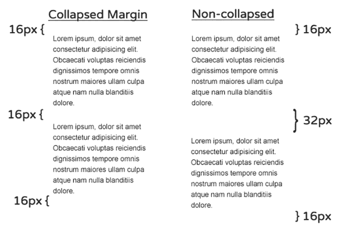
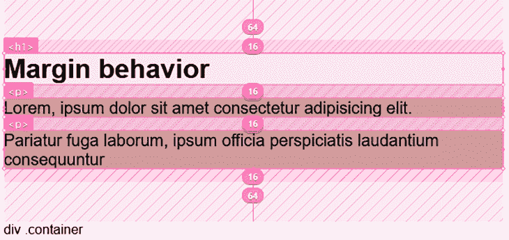
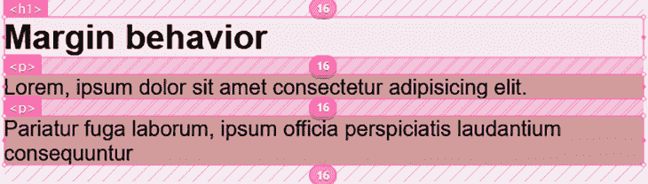
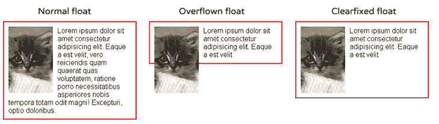
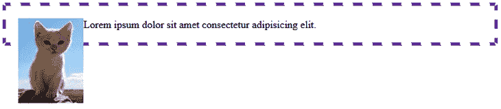
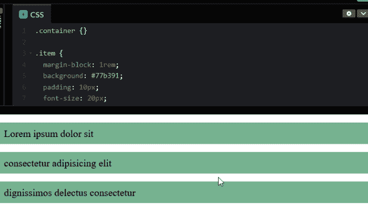
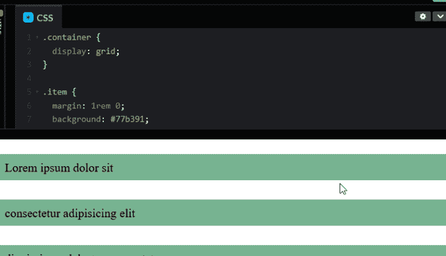
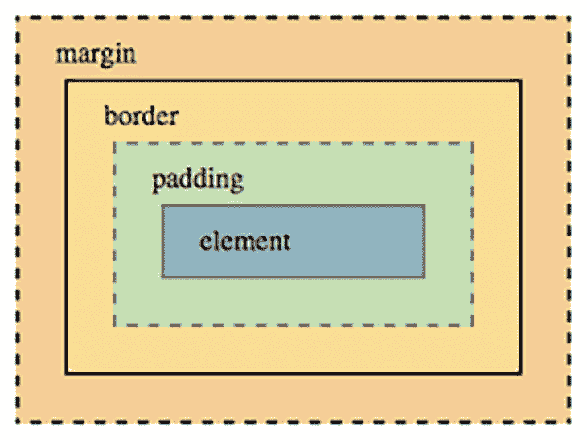
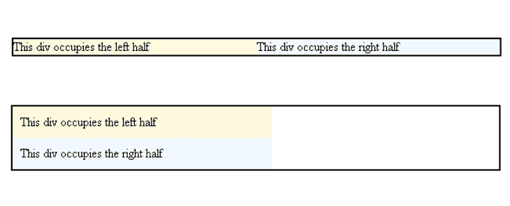

# 理解你的 CSS 失败的原因

> 原文：<https://blog.logrocket.com/why-your-css-fails/>

编者按:这篇文章于 2021 年 12 月 1 日更新，以确认 CSS Grid 和 Flexbox 项目的更广泛浏览器支持，改进对块格式化上下文和声明性 CSS 的解释，并使这篇文章更符合现代 CSS 的使用。

CSS 看起来似乎很简单。我们只需要在一些规则中声明一些东西应该是什么样子，浏览器就会发挥它的魔力。这导致许多课程和学习资源以一种实用的、易于遵循的、快速见效的方法来教授 CSS，这种方法很大程度上是基于像机器人一样记忆规则。

甚至一些最受欢迎的资源在教授 CSS 理论方面也有所欠缺:非常棒的 [freeCodeCamp 只是浏览了一下](https://learn.freecodecamp.org/)，总是值得信赖的 [W3Schools 几乎只是列出了属性和值](https://www.w3schools.com/css/default.asp)，甚至那里的高级课程也大多专注于快速构建一些东西，甚至没有提到一些核心概念。

嗯，这正是问题所在。我们学习 CSS 的方法不对。

首先，我们人类并不擅长记忆庞大的(并且不断增长的)规则集，但是只关注规则意味着跳过 CSS 理论概念，这每次都会回来咬我们一口。你知道这个笑话是怎么说的:

> 两个 CSS 属性走进一个酒吧。一个完全不同的酒吧里的高脚凳翻倒了。

这是有好处的！CSS 的声明性质使它以意想不到的方式工作，特别是对于习惯于使用 JavaScript 等命令式语言和定义良好的范围的开发人员来说。

在这篇文章中，我们将涵盖五个核心概念，我相信，如果教得正确，将拯救我们 99%的 CSS 问题。这些是:

块格式化上下文是最不为人知的，所以让我们从这里开始。

## 块格式上下文

CSS 布局的经典方法是流布局，也叫“正常流”。在 CSS 中，我们认为页面元素是盒子。当我们在正常流程中有任何块级盒子时，我们将它们描述为块格式化上下文的一部分。

在这种情况下，块元素是垂直排列的，一个在另一个下面，使用 CSS margin 属性，我们可以给这些元素增加间距。这可能看起来极其简单，直到我们遇到利润崩溃和浮动问题。

理解边距的行为是一项重要的 CSS 技能，所以我们将在接下来解释这一点。

### 边缘塌陷行为

当堆叠两个块级元素时，它们的垂直边距会折叠在一起。这种行为是有意义的，例如，在段落中，我们希望在顶部和底部有一个`16px`边距，但它们之间肯定没有`32px`边距。



压缩兄弟之间的利润似乎是一个合理的决定——对于给定的用例来说，这可以节省我们相当多的工作——但在其他情况下，尤其是在处理负利润时，它可能会导致各种奇怪的行为。

父母和子女之间的差距也在缩小，这通常不是我们所希望看到的。

让我们来演示一下这种奇怪的行为。给定一个包含标题和段落元素的`div`容器:

```
<div class="container">
  <h1>Collapsing margin</h1>
  <p>
    <!-- ... -->
  </p>
  <p>
    <!-- ... -->
  </p>
</div>

```

为了简洁起见，我们删除了段落内容。如果我们将`margin: 64px 0;`应用于`div`容器，将`margin: 16px 0;`应用于容器内的元素，就像这样

```
.container {
  /* ... */
  margin: 64px 0;
}

p, h1 {
  margin: 16px 0;
}

```

—我们会看到这样的结果:



我们在上面的布局中突出了空白区域。

在此部分顶部的图像中，我们看到了兄弟之间的边距是如何折叠的。第二幅图也展示了，正如在段落之间的间隙中所看到的，`<p>`，但是再次注意父元素的边距`div`(测量`64px`)是如何随着顶部和底部元素的边距(分别对应`h1`和`p`的`16px`)折叠的。

如果父元素没有边距，效果会更明显。通过从父项`div`中移除边距，我们将得到:

参见 [CodePen](https://codepen.io) 上 Ibaslogic([@ Ibaslogic](https://codepen.io/ibaslogic))
的笔 [noBFC](https://codepen.io/ibaslogic/pen/vYeKxON) 。



查看 CodePen 视图，我们会立即注意到视图顶部有一个缺口。这很奇怪，可能不是预期的结果。这种差距来自子代的边缘，并从父代溢出。

为了防止这种情况，我们可以让父元素成为块格式上下文。我们稍后将看到如何实现这一点。

### 浮动行为

至于花车，我们都去过；当内容小于浮动时，它将溢出我们打算用作容器的元素(或者换句话说，容器背景和边框现在达不到浮动的元素)。



大多数情况下，我们可以通过 clearfix 解决这个问题。这包括将包含`clear`属性的伪元素应用于容器元素。但是我们将使用块格式化上下文来解决浮动问题，而不是使用 hack。

## 那么，什么是块格式化上下文呢？

一个[块格式化上下文(BFC)](https://developer.mozilla.org/en-US/docs/Web/Guide/CSS/Block_formatting_context) 定义了边界折叠和浮动被包含的范围。我们可以把它看作是整体布局中的一个迷你布局。

当我们创建一个 BFC 时，我们告诉浏览器把它所包含的元素当作一个独立的浮动和边距布局。本质上，它允许元素包含内部浮动，排除外部浮动，并防止边缘塌陷。

### 创建块格式上下文

有许多[方法来创建块格式化上下文](https://developer.mozilla.org/en-US/docs/Web/Guide/CSS/Block_formatting_context)。它包括应用一些特定的 CSS 属性或使用文档的根元素。这里，我们使用一种方法来解决我们之前提到的问题——浮动图像和折叠边距。

让我们从父母和孩子之间的差距开始。为了防止这种情况，我们可以在容器元素上应用一个`display: flow-root;`。这将创建一个新的块格式上下文，并防止边距溢出。

```
.container {
  display: flow-root;
  /* ... */
}

```

正如我们在下面的 CodePen 中看到的，在应用格式上下文之前，顶部没有创建多余的间隙。

见 [CodePen](https://codepen.io) 上 Ibaslogic([@ Ibaslogic](https://codepen.io/ibaslogic))
用 BFC 的笔[。](https://codepen.io/ibaslogic/pen/MWEeppP)

使用上述方法，我们还可以将`display: flow-root;`应用于包含浮动对象的父元素，以解决溢出问题。现在，代替这种布局:



We will have this (see the CodePen view):

参见 [CodePen](https://codepen.io) 上 Ibaslogic([@ Ibaslogic](https://codepen.io/ibaslogic))
的 Pen [溢出元素](https://codepen.io/ibaslogic/pen/XWeKPwr)。

正如我们所看到的，了解块格式上下文是如何工作的，可以让我们更好地控制我们的浮动和边距，允许我们做出更好的布局，并防止我们意外地破坏它们。

## 网格和 Flexbox 行为

与 block 元素不同，flex 和 grid 项目的边距表现不同。当我们声明一个 flex 或 grid 容器时，直接子容器分别成为 flex 或 grid 项目。作为“flex 子项”或“grid 子项”，这些项目自然会创建一个块格式上下文，因此它们不再折叠。这可能会导致意外行为。

此外，一旦元素变成 flex 项目，在项目上使用`display: block;`和`display: inline;`没有影响。理解 flex 和 grid 行为使得使用它们变得非常容易。

让我们看一个包含三个项目的容器元素的例子:

```
<div class="container">
  <div class="item"><!-- ... --></div>
  <div class="item"><!-- ... --></div>
  <div class="item"><!-- ... --></div>
</div>

```

为了简洁起见，我们删除了`div`内容。

像每个 block 元素一样，兄弟元素之间的边距会折叠，子元素的边距会超出父元素。但是，当我们将容器变成网格或 flex 容器时，项目的边距不再折叠，子边距包含在容器中。

请参见下面的网格实现:



The same effect also happens for a flex container.

这不是我们希望在我们的布局中经历的事情。我们希望保持同级之间的折叠边距，同时防止子级边距溢出父级。

一个建议是避免用页边空白来分隔项目，因为它们倾向于累加而不是折叠，这会导致额外的间距。在我们的代码中，我们定义了`margin: 1rem 0;`来分隔顶部和底部的项目。

一旦我们去掉页边空白，这些东西就会粘在一起。然后我们可以对容器应用`gap`属性来添加预期的间距。



对于 Flexbox，我们也可以使用`gap`属性来分隔项目，因为现在所有现代浏览器都支持[。](https://caniuse.com/flexbox-gap)

## 了解级联

浏览器使用一种称为 Cascade(CSS 中的 C)的算法来决定当遇到冲突声明时(例如，当多个规则为元素的属性分配不同的值时)，哪些规则适用于每个元素。

算法中的第一个因素是源顺序。马克斯·斯托伊伯不久前用这个简单的 CSS 问题打破了 Twitter web 开发社区:

正确的选择是“都是蓝色的”，但是如果你错过了也不要难过——你肯定不是一个人。在他的问题中真正的诀窍是浏览器不看类在 HTML 中声明的顺序，而是在 CSS 中。

在这种情况下，后面的样式优先，即最靠近底部的样式是执行的样式。

## 使用 CSS 特异性

如前所述，CSS 源代码中的顺序只是级联算法中的众多因素之一。确定哪些规则应该应用于一个元素的一个真正重要的部分就是特殊性。不同类型的 CSS 选择器具有不同的权重。

以下是它们的列表，按优先顺序排列:

1.  id 选择器(`#something`)
2.  类选择器(`.something` ) &伪类(`:hover`)
3.  元素(`p` ) &)伪元素(`:``:``before`)

组合子(`+`、`>`和`~`)、通用选择器(`*`)和`:not`伪类对特异性没有影响。

通过 ID 定义的规则总是优先于通过类定义的规则，类优先于元素选择器。

### 书写特异性规则

当我们使用组合选择器时，比如`body #login button .red{}`，浏览器将计算 id、类/伪类和元素/伪元素的数量，并为每个规则分配一个特异性值，以便与其他规则进行比较，并决定使用哪一个。

这通常用三个计数器来表示:id、类和元素。例如，规则`body #login button .red{}`具有以下特性:

*   1 号 ID ( `#login`)
*   1 类(`.red`)
*   2 个元素(`body`和`button`)

这个规则的特殊性可以表示为`1, 1, 2`。

让我们考虑另一个例子。如果给定两个冲突的规则，将应用具有更高特异性的规则。

```
.btn .big { height: 40px }
.btn { height: 20px }

```

在上面的代码中，将应用前一个规则，因为它具有特殊性`0, 2, 0`，而后者具有特殊性`0, 1, 0`。

重要的是要记住，更具体类型的选择器总是优先。具有`1, 0, 0`特异性的规则——也就是说，单个 ID，比如`#red{color: red}`将被认为比另一个具有`0, 20, 10`的规则更重要。无论如何，你不会真的想写这样一个荒谬的选择器。

为了覆盖用`1` ID 定义的规则，您需要另一个至少有`1` ID 和`1`元素或类的规则——或者，您至少需要匹配特殊性并让源代码中的顺序控制。这就是为什么通常认为避免使用 id 进行样式设计是一个好的实践，因为它们很难被覆盖。

回到级联算法，我们可以把它想象成每个 HTML 元素都有一个相关的样式表，它在这个表中写入每个属性、它的当前值以及设置它的规则的特殊性。

```
<h1 id="main-title" class="red"> This is a title </h1>

.red{ color: red; }
h1#main-title{ border-bottom: 2px solid black}

```

这将赋予 H1 以下风格:

| 属性 | 值 | 特异性 |
| --- | --- | --- |
| 颜色 | 红色 | 0，1，0 |
| 边框-底部 | 2px 纯黑 | 1，0，1 |

如果我们的样式表有额外的、冲突的声明，cascade 将检查为给定属性设置当前值的特异性，将其与新规则的特异性进行比较，并且仅当新规则的特异性高于或等于前一个时才更改值。

特异性不是一个缺陷，而是一种特性——如果使用得当，它会非常方便。如果不是这样的话，也是非常令人沮丧的。为了编写可伸缩、可维护的 CSS，有很多架构可以帮助处理级联。因此，如果有一个 CSS 概念你应该真正掌握，这就是它。

一些方法，如[块元素修饰符(BEM)](https://blog.logrocket.com/a-deep-dive-into-css-modules/) 鼓励使用平面选择器(即，避免复杂的选择器，只为每个选择器使用一个类)来完全防止特异性战争。其他的，比如原始的 OOCSS，让你以一种有意识的方式编写更高特异性的代码。另一方面，函数式 CSS 倾向于避免声明冲突。

你的团队选择哪种架构并不重要，重要的是拥有一个每个人都遵循以避免问题的架构。

级联算法中还有其他[因素，比如内联 CSS 的优先级更高，以及使用`!important`关键字的声明。](https://blog.logrocket.com/how-css-works-understanding-the-cascade-d181cd89a4d8)

## 盒子模型

HTML 中的每个元素都创建一个矩形“框”来表示它。这些框中的每一个都有一组应用于它的规则，这些规则决定了它在浏览器中应该占据的宽度和高度，以及它的内容和间距。

唯一的例外是分别创建两个框的列表和表格，以及带有`display: none`或`display: contents`的元素，它们都不创建任何框。

该框应用了以下度量:



在现代 CSS 中，我们有两种主要的方法来定义盒子，我们可以使用属性`box-sizing`的值来切换。它们是:

更传统的——因此也是默认的——一个叫做`content-box`。在`content-box`中，声明的宽度和高度被解释为内容的尺寸，填充和边框会增加元素的实际呈现尺寸，这可能会非常令人沮丧。

例如，如果我们在两个左浮动元素上设置 50%的宽度，它们将完美地并排排列。但是当我们向它们添加一些填充或边框时，每一个都将占据父对象的 50%以上，因此，第二个将在第一个下方换行。



这通常需要使用奇怪的计算器和预处理器变量来补偿，在过去，每次我们改变边框或填充时，实际上都必须计算和调整宽度。

信不信由你，这个问题的解决方案是受 Internet Explorer 6 中一个奇怪的 bug 的启发。

当 IE6 设置为[怪癖模式](https://developer.mozilla.org/en-US/docs/Web/HTML/Quirks_Mode_and_Standards_Mode)时，`width`属性将设置元素的总呈现宽度，而填充和边框将从内容区域中取出，保持稳定和可预测的总宽度。这就是我们现在所知的`border-box`。

如今，大多数开发人员都选择将所有内容重置为`border-box`，所以您很可能会在代码库中找到这段代码的某个版本:

```
*, *:before, *:after {
  box-sizing: border-box;
}

```

上面有一些变化，有些人主张继承盒子大小:

```
html {
  box-sizing: border-box;
}

*, *:before, *:after {
  box-sizing: inherit;
}

```

有趣的是，CSS 中最常用的大小调整可以被认为是“还记得 IE6 中那个奇怪的 bug 吗？…真希望我们能做到这一点”。

为了进一步研究，这里有一个关于盒子模型和盒子尺寸的很好的指南。

## 堆叠上下文

CSS 主要是一个 2d 样式系统，但是它在处理 3d 和在 z 轴排序方面也非常强大。根据经验，当两个或多个元素重叠时，它们将按照它们在源代码中的顺序进行堆叠:HTML 中最后出现的元素将位于视窗中其他重叠元素的上方(也称为“离用户更近”)。

定位元素(将`position`设置为除默认值`static`之外的任何值)并使用`z-index`属性允许我们控制我们的设计层如何相互堆叠。但是如果你有超过五分钟的使用经验，我敢肯定你已经遇到了它的问题。

很多时候，我们把堆栈安排得井井有条，然后有什么东西莫名其妙地打破了它*。原来，您可以创建一个堆栈上下文，这是几个属性或元素的本地堆栈，其中应用了`z-index`。我们可以在每个本地堆栈中移动元素，也可以在包含的堆栈中移动元素，但是我们不能用一个堆栈中的元素插入另一个堆栈中的元素。*

 *[创建堆栈上下文的一些属性](https://developer.mozilla.org/en-US/docs/Web/CSS/CSS_Positioning/Understanding_z_index/The_stacking_context)是:

*   带有除了`auto`之外的`z-index`的定位元素
*   `opacity`低于`1`的元素
*   具有除`normal`之外的`mix-blend-mode`的元素
*   除了`none`之外的`clip-path`、`mask`、`filter`或`transform`的元素

这里有一个帮助理解这个概念的经典挑战:给定下面的代码，尝试将红框移到绿框后面，而不改变它的 z 索引、位置或 HTML 源代码。

提示:诀窍在于包含 div。

参见 [CodePen](https://codepen.io) 上 Philip Walton([@ Philip Walton](https://codepen.io/philipwalton))
的 [笔叠顺序(问题)](https://codepen.io/philipwalton/pen/ksBaI)。

解决方案是在包含红色跨度的`div`中创建一个新的堆栈上下文，这样红色跨度的`z-index`就不会影响主堆栈，让源顺序接管。

参见 [CodePen](https://codepen.io) 上 Philip Walton([@ Philip Walton](https://codepen.io/philipwalton))
的 [笔叠顺序(解)](https://codepen.io/philipwalton/pen/dfCtb)。

注意，即使我们给红色 span 一个 100 万的`z-index`,它也不会移动到绿色和蓝色 span 的前面，因为它被隔离在本地堆栈中。如果我们想移动它，我们需要改变包含`div`的位置和`z-index`。

同样，Benjamin Johnson [在这篇文章](https://blog.logrocket.com/how-css-works-creating-layers-with-z-index-6a20afe1550e)中深入讨论了堆栈环境，所以这是进一步理解其工作原理的一个很好的来源。我还推荐 [Phillip Walton 关于 z-index](https://philipwalton.com/articles/what-no-one-told-you-about-z-index/) 的文章，这是上述挑战的来源，也是对堆叠上下文如何工作的深入探讨。

## 结论

CSS 是一个非常强大的样式工具。无论您是选择预处理器和“普通”CSS，还是选择 CSS-in-JS 解决方案，这些核心概念都是您应该真正掌握的，以避免重复出现问题。

随着许多人来自强调 JS 的新兵训练营(行业本身也是如此)，以及诸如 Bootstrap 之类的预打包解决方案的激增，HTML 和 CSS 的质量已经付出了代价。

克里斯·科伊尔说这句话已经过去十年了，但这句话仍然适用:

> CSS 就像象棋。你可以用一天的时间学会基础，用一生的时间掌握它。

一些人确信新来者不尊重 HTML 和 CSS，认为它们“低于”他们，正是因为学习基础知识很容易。虽然我相信其中一些人是存在的，但我倾向于不同意。我相信大多数人实际上都在努力掌握它，只是他们迷失在不再相关的信息和太多的不良资源之间，这就是这种挫败感的来源。

掌握 CSS 的真正诀窍是你如何对待它。如果你可以使用一点建议，远离“快速结果”教程，远离框架，远离属性列表。获得实践经验并专注于学习理论，仔细阅读规范，深入研究你所学的每一个 CSS 知识，不管它看起来有多小，你总是会发现一些有趣的概念，使它“点击”到位。

## 你的前端是否占用了用户的 CPU？

随着 web 前端变得越来越复杂，资源贪婪的特性对浏览器的要求越来越高。如果您对监控和跟踪生产环境中所有用户的客户端 CPU 使用、内存使用等感兴趣，

[try LogRocket](https://lp.logrocket.com/blg/css-signup)

.

[](https://lp.logrocket.com/blg/css-signup)[https://logrocket.com/signup/](https://lp.logrocket.com/blg/css-signup)

LogRocket 就像是网络和移动应用的 DVR，记录你的网络应用或网站上发生的一切。您可以汇总和报告关键的前端性能指标，重放用户会话和应用程序状态，记录网络请求，并自动显示所有错误，而不是猜测问题发生的原因。

现代化您调试 web 和移动应用的方式— [开始免费监控](https://lp.logrocket.com/blg/css-signup)。*