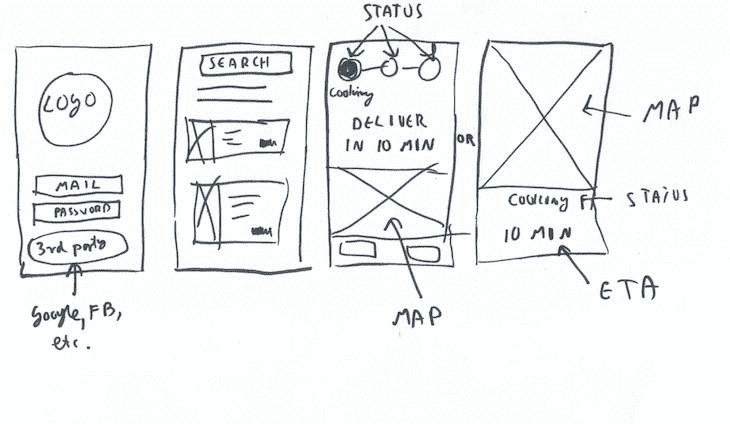
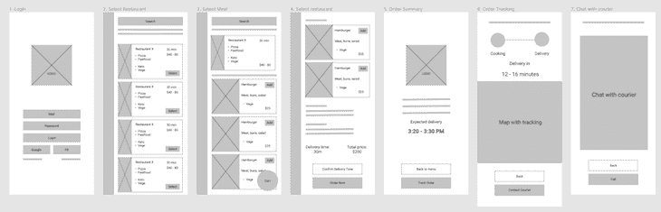
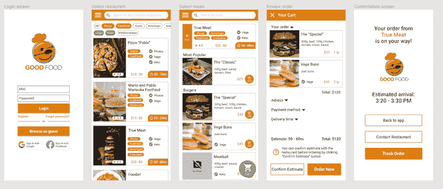
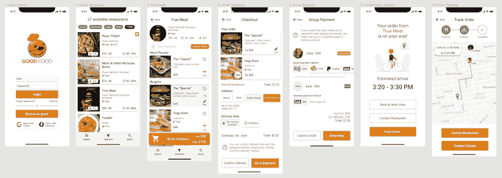
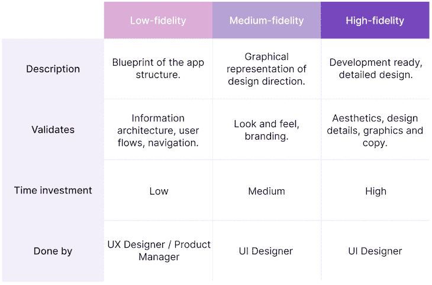
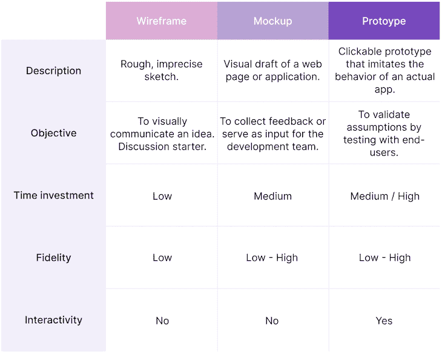

# 线框 vs .实体模型 vs .原型:它们有什么不同？

> 原文：<https://blog.logrocket.com/product-management/wireframe-vs-mockup-vs-prototype/>

构建产品是一项有风险且消耗资源的工作。幸运的是，有一些工具可以帮助我们降低整个过程的风险。

比方说我们正在构建一个移动应用程序。从第一天开始写代码是愚蠢的。毕竟，我们还不知道我们到底在建造什么，更不用说它应该是什么样子了。在实际应用上迭代是最昂贵的迭代形式。

这就是为什么设计师采用各种技术，如[线框](#what-is-a-wireframe)，创建[模型](#what-is-a-mockup)，和[原型](#mockup-vs-prototype)，在制造实际产品之前快速测试想法。但是线框、实体模型和原型之间有什么区别呢？

让我们仔细看看每一个，看看他们如何比较。

* * *

## 目录

* * *

## 什么是线框？

线框是展示一个想法的快速草图。这是使用图形工具，windows 画图，甚至是一支笔和一张纸巾来完成的。

写线框有三个主要原因:

1.  它帮助我们形象化我们的思维——正如他们所说，一张图片胜过 1000 个单词。有些事情展示起来要比描述起来容易得多
2.  **它让人们团结一致** —线框图给团队一些具体的参考。它降低了人们想象完全不同事物的风险，让每个人都在同一页上
3.  **它组织讨论** *—* 指出特定设计元素的能力是改变游戏规则的因素

假设我们正在讨论我们的应用程序的流程应该是什么样子。如果我们只是谈论它，我们将很难达成任何决定。但是如果每个人都勾画出他们想象中的用户流，我们将有一些具体的东西来评估和比较。

A quick wireframe can save hours of endless discussions and misunderstandings.

所需时间:约 2 分钟。

## 什么是模型？

实体模型是一个更高层次的线框。通常由 UX 设计师/产品经理(低保真度)或 UI 设计师(中/高保真度)在图形程序中完成。

实体模型的目的很大程度上取决于它的保真度，所以让我们来分解它。

### 低保真度

低保真度模型是一个数字化的，更加深思熟虑的线框版本。UX 的设计师或产品经理通常会做这些。

低保真度线框的目标是展示应用程序的结构应该是什么样子。它帮助您评估整体用户体验。

低保真度模型用于评估:

*   用户流量
*   信息架构
*   航行

Lo-fi mockups help everyone understand the overall architecture and structure of the app.

所需时间:约 15 分钟。

### 中等保真度

当我们拿着低保真度的模型开始添加颜色和品牌时，中等保真度的模型就诞生了。

而我们仍然评估总体结构、信息架构等。，我们还关注应用程序的整体外观和感觉:视觉表现感觉如何？它传递什么类型的信息？是否可及、直观？

我们还没有关注细节。这份拷贝并不完美；图片是占位符，按钮仍然需要一些四舍五入。我们需要的是高水平的评估。

中等保真度模型用于评估:

*   整体外观和感觉
*   品牌宣传

Medium-fidelity mockups allow us to assess the look and feel of the app.

所需时间:约 2 小时。

### 高保真度

高保真样机是我们的最终候选产品。每个点和像素已经在它的位置。现在我们可以变得挑剔，专注于细节和点睛之笔。

一旦我们完成，高保真样机可以交给开发团队实施。

高保真线框用于评估:

*   美学
*   设计细则
*   图形和副本

A high-fidelity mockup allows us to focus on details and finishing touches.

所需时间:约 5 小时。

## 低保真度与中保真度与高保真度模型

你如何决定关注哪种程度的忠诚？答案很简单:你没有。

不同级别的保真度不仅服务于不同的目的，而且是相加的。我们使用低保真度模型作为中等保真度模型的基础，然后将中等保真度模型转化为高保真度的最终产品。

立即投入到高保真模型中可能很有诱惑力，但很少值得这么做。

首先，对高保真实体模型的任何改变都比对低保真实体模型甚至是线框图的改变更昂贵。

评估高保真样机时，也很难着眼于大局。人们很容易被 CTA 按钮周围的阴影所吸引，即使我们还不确定是否要在那里放一个 CTA。这就是低保真度模型无色而直接的原因之一:促进对大画面而非无关细节的关注。

我们需要低保真度和高保真度模型，以真正从设计阶段获得最大收益。

* * *

订阅我们的产品管理简讯
将此类文章发送到您的收件箱

* * *

## 实体模型与原型

当我们将交互添加到模型中时，原型就诞生了。就像实体模型的情况一样，原型的保真度变化很大。

我们可以用纸片来建造一个低保真度的原型，并测试最初的反应。另一方面，成熟而详细的原型通常与实际应用程序难以区分。

[https://www.youtube.com/embed/yafaGNFu8Eg](https://www.youtube.com/embed/yafaGNFu8Eg)

视频

一个纸原型的例子。

与静态模型相反，原型允许我们从整体上体验交互。我们可以点击一些东西，看看设计是如何变化的，并大致“感受”一下产品。如果我们只是向潜在客户展示模型，并让他们做出评价，我们不会得到同样的体验(也不会得到反馈)。

如果我们正在建立一个真正创新的用户流，我们应该尽早开始原型化。然而，如果我们设计一个经过战斗考验的用户旅程，比如一个典型的电子商务流程，我们就可以节省资金，专注于高保真的原型制作。

## 如何将线框、模型和原型装配在一起？

线框、模型和原型在产品开发中起着至关重要的作用，它们都有不同的用途。

线框帮助我们可视化我们的想法，并改善合作。然后，模型允许我们评估和收集关于信息架构、外观和感觉以及内在细节的反馈。我们可以用原型来支持这个过程，以收集更详细的反馈。

在一个完美的世界里，时间和金钱不是问题，你应该采取以下所有的步骤:

1.  从线框开始，创造理解
2.  构建一个低保真度模型来评估高层结构
3.  用纸原型确认
4.  建立一个中等保真度的模型来确定整体的外观和感觉
5.  用数字原型确认
6.  建立一个高保真样机来评估结果
7.  使用详细的原型模拟真实的应用程序体验
8.  构建应用程序

然而，在实践中，跳过一些步骤是可以的。这完全取决于你的信心、资源和你愿意承担的风险。

*精选图片来源:[icon scout](https://iconscout.com/icon/info-webpage-wireframe-4323406)*

## [LogRocket](https://lp.logrocket.com/blg/pm-signup) 产生产品见解，从而导致有意义的行动

[LogRocket](https://lp.logrocket.com/blg/pm-signup) 确定用户体验中的摩擦点，以便您能够做出明智的产品和设计变更决策，从而实现您的目标。

使用 LogRocket，您可以[了解影响您产品的问题的范围](https://logrocket.com/for/analytics-for-web-applications)，并优先考虑需要做出的更改。LogRocket 简化了工作流程，允许工程和设计团队使用与您相同的[数据进行工作](https://logrocket.com/for/web-analytics-solutions)，消除了对需要做什么的困惑。

让你的团队步调一致——今天就试试 [LogRocket](https://lp.logrocket.com/blg/pm-signup) 。

[Bart Krawczyk Follow](https://blog.logrocket.com/author/bartkrawczyk/) Learning how to build beautiful products without burning myself out (again). Writing about what I discovered along the way.