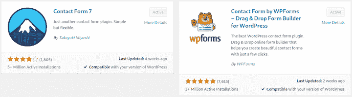
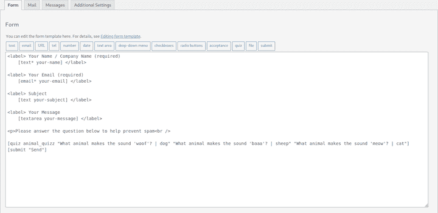
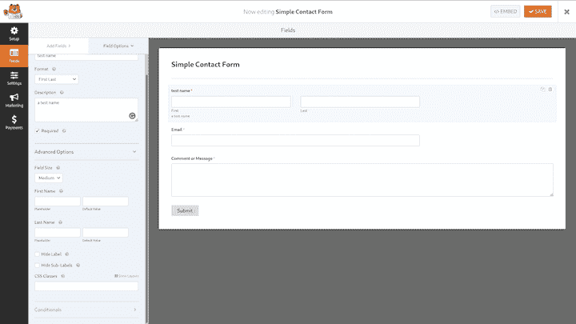
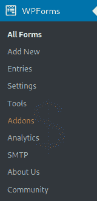
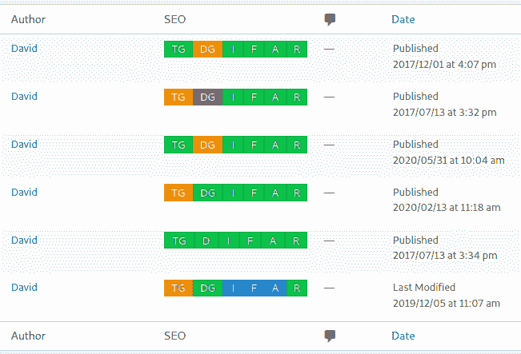
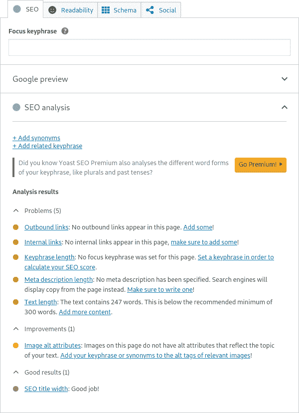

# WordPress 插件:终极指南

> 原文：<https://blog.logrocket.com/wordpress-plugins-the-ultimate-guide/>

WordPress 是目前最流行的内容管理系统。它自 2013 年以来一直存在，[为 39%的网站](https://w3techs.com/technologies/overview/content_management)提供支持。

由于其巨大的受欢迎程度，有大量令人困惑的第三方插件扩展了 WordPress 的功能。WordPress 是免费的开源软件，但是它的插件包括免费、免费增值和商业扩展。

在本指南中，我们将回顾最好的免费和免费增值 WordPress 插件。我们将关注 WordPress 的联系表单插件、反垃圾邮件插件和 SEO 插件。我们的结论将基于免费版本的功能，但我们会考虑付费功能是否有用。我们还会考虑免费增值广告的侵入性和恼人程度，以确定该插件是否值得使用。

我们将详细介绍以下内容:

## 什么是 WordPress 插件？

WordPress 插件是 PHP 脚本，要么增强现有的 WordPress 功能，要么为你的网站提供新的功能。这些插件通常是开源的、免费的，由志愿者开发。

WordPress 依靠第三方插件来提供许多其他 CMS 内置的功能。这是 WordPress 背后的人有意识的选择，它有它的优点和缺点。一方面，它创造了一个充满活力的市场；供应商之间的激烈竞争创造了人们需要的各种插件的广泛选择。

也就是说，缺少功能是不方便的。例如，大多数网站需要联系方式，但是 WordPress 没有提供。

## WordPress 上的插件是免费的吗？

公司和个人用 GNU 自由软件许可证在 [WordPress 插件目录](https://wordpress.org/plugins/)上发布他们插件的免费版本。用户可以评价和审查插件，并跟踪下载次数。免费版本的商业扩展可以根据 T2 的一套严格规则出售。

由于这种免费插件和商业插件的混合，许多看似免费的插件实际上只是引诱用户购买插件的一种方式。

## 有哪些最好的 WordPress 插件？

除非你正在开发最简单、最基本的网站，否则你将需要依赖插件。选择最好的 WordPress 插件很困难，原因如下:

*   WordPress 插件库很难理解。星级评定系统倾向于收集了更多星级的旧插件。通常，这些对于现代 WordPress 来说并不是最好的。此外，没有办法根据您正在寻找的标准来过滤搜索
*   很容易上当受骗。一个潜在暴利的巨大市场，吸引着见不得光的商业行为。很多免费插件并不是真的免费；您可能会发现需要通过购买扩展来解锁的基本功能。许多看似公正的在线评论实际上是由制作插件的公司支付的

理解 WordPress 5 和 [Gutenberg](https://blog.logrocket.com/setting-up-first-gutenberg-project/) 的影响也很关键。WordPress 5.0 于 2018 年 12 月发布，包含了新的古腾堡编辑器。这对于 WordPress 来说是一个范式的转变，因为它转向了以块为单位编辑你的内容。这震撼了整个 WordPress 生态系统，当你在寻找插件时，理解这种转变是非常重要的。

古腾堡标志着 WordPress 旧的做事方式和新的秩序之间的分野。许多老的插件已经存在了很长时间，并且是在古腾堡之前的世界中创建的。因此，你应该对任何不是为古腾堡设计的插件持怀疑态度。许多没有很好地集成或者利用 WordPress 最新版本[中提供的新功能。](https://wordpress.org/support/wordpress-version/version-5-5-1/)

事不宜迟，让我们来关注一下 WordPress 的一些顶级插件，包括联系人表单插件、反垃圾邮件插件和 SEO 插件。

大多数网站都需要联系方式。两个最流行的插件清楚地说明了高度商业化的免费增值和真正的免费开源软件之间的区别。

[联系形式 7](https://wordpress.org/plugins/contact-form-7/) 由来已久，几乎和 WordPress 本身一样长。这部分解释了为什么它有这么多活跃的装置。另一个原因是你可能不需要另一个联系方式。

Contact Form 7 插件使您能够:

*   创建多个表单。您可以使用短代码将它们插入到页面和帖子中
*   使用简单标记自定义表单
*   轻松集成反垃圾邮件工具。从简单的、用户定义的测验中进行选择，或者添加高级的第三方扩展，例如 [Google reCAPTCHA](https://developers.google.com/recaptcha/)

联系表单 7 在 WordPress 中有一个过时的外观，创建表单的方式也很复杂。这些是主要的不利因素，但是一旦你建立并运行了它，你的工作就完成了。只需用简单的标记构建您的表单，您就可以通过菜单单击标签来自动创建所有标签:

为更花哨的形式付出的代价是没完没了的唠叨、膨胀和不必要的 WordPress GUI 移植。

#### 如何使用测验功能来阻止垃圾邮件

我发现最有效的方法来阻止垃圾邮件是建立在联系形式 7。所有自动化的通用解决方案看起来都是可破解的，包括 Contact Form 7 作者的`Really Simple CAPTCHA`插件。

问用户一个只有人类才能回答的问题效果最好。你可以在上面的截图中看到多个随机问题的完整标记。它在表单上显示为:

联系形式 7 是在前古腾堡世界设计的，但目前没有什么更好的是为古腾堡明确建立的。幸运的是，你可以使用古腾堡扩展的免费[终极插件，其特点是](https://en-gb.wordpress.org/plugins/ultimate-addons-for-gutenberg/)[接触形式 7 Styler 块](https://www.ultimategutenberg.com/blocks/contact-form-7-styler/)。这使您能够在不求助于手动 CSS 的情况下对表单进行样式化，包含了许多非常棒的免费块，强烈推荐使用。

### 2.WPForms Lite

WPForms Lite 是 Contact Form 7 最受欢迎的替代产品。它的主要卖点是创建表单的易用性以及大量的功能和集成，其中大部分是付费的。

#### WPForms 是免费的吗？

WPForms Lite 是免费的，但是如果你想要额外的功能，你需要购买一个适合你需要的计划。

WPForms Lite 的内置功能包括:

*   创建多个表单。使用短代码将它们插入页面和帖子中
*   拖放联系人表单生成器
*   预构建的表单模板

其他付费功能包括:

*   PayPal、Stripe、Authorize Net、Constant Contact、AWeber、Mailchimp、GetResponse、Campaign Monitor、ActiveCampaign 和 Drip 附加组件
*   文件上传
*   地理位置数据
*   调查和民意测验
*   签名附件
*   形成遗弃
*   表单模板包
*   Webhooks

#### 使用 WPForms 的利与弊

与 Contact Form 7 相比，WPForms Lite(没有附加组件)的主要卖点是拖放式表单生成器。它更现代，也更容易使用:

主要的缺点是插件的每个区域都嵌入了令人难以置信的攻击性和恼人的广告。每当你尝试做任何事情时，你总是会被提醒一些你需要付费的功能。无处不在的营销策略令人厌恶。这基本上是 WPForms 不是 Contact Form 7 的首选的唯一原因。

#### GUI 中的广告

在 GUI 中，有相关扩展、无关扩展和其他公司的广告。以电子邮件营销集成设置为例:

如果要整合第三方邮件营销公司，需要付费。但是你的大部分 GUI 空间都变成了一个巨大的广告，而不是谨慎地提及这一点。

更糟糕的是，唯一的自由融合就是不断接触。他们没有免费计划，所以这个看似免费的选项实际上只是另一家公司的广告。

在你的 WordPress GUI 中，会出现一个 WPForms 菜单来访问特性。这些链接其实有一半是广告。

*   **条目**:整页广告，用于将表单数据保存到数据库的升级
*   **插件**:你可以购买的插件的整页广告
*   **分析**:同一公司的一个不相关插件的整页广告
*   SMTP :整页广告，让你购买他们的 WP 邮件 SMTP 插件
*   **关于我们**:团队照片和更多广告

如果你决定继续研究 WordPress 的最佳联系方式插件，并在谷歌上搜索`wpforms vs contact form 7`，你会发现:

看看谁发表了最上面的文章；你能猜出结论是什么吗？当然，这是一个带有严重偏见的广告，假装是一个真正的比较。

#### 应该使用 WPForms 吗？

免费产品在技术上没有任何问题，WPForms 也不是唯一一个使用秘密营销策略和积极的应用内广告的 WordPress 插件。

以下是您可能想给 WPForms 一个机会的原因:

*   GUI 和易用性优于 Contact Form 7
*   付费扩展可能是你正在寻找的
*   如果你不反对你的 WordPress 安装变成一个巨大的广告牌，它是一个创建表单的可靠插件

如果你在 WordPress 中启用了评论功能，你很快就会成为垃圾评论的受害者。这些垃圾邮件发送者似乎总能找到你，在你意识到之前，你可能会被淹没。拥有某种垃圾评论保护是强制性的。当然，你不希望实际用户的评论被屏蔽，所以需要一个好的解决方案。

### 反垃圾邮件蜂

幸运的是，WordPress 最好的垃圾评论插件是免费和开源的。 [Antispam Bee](https://wordpress.org/plugins/antispam-bee/) 拦截没有验证码的垃圾评论和引用通告。反垃圾邮件蜂最初由瑟奇·米勒开发，现在由[plugincollektiv](https://pluginkollektiv.org/)维护，它是在考虑数据保护和隐私的情况下构建的。

Antispam Bee 使您能够:

*   查看仪表板上的统计数据
*   信任认可的评论员。具有先前发布的评论的作者将始终被信任
*   在本地垃圾邮件数据库中查找。Antispam Bee 将评论与以前的已知垃圾邮件进行比较
*   验证评论者的 IP 地址。分析直接在博客中进行，无需外部服务
*   使用正则表达式。分析模式的注释；例如，它可能会将评论中的三个或更多链接视为垃圾邮件
*   来自使用 IP 的特定国家的黑名单或白名单评论

垃圾邮件发送者有许多狡猾的方法，反垃圾邮件蜜蜂知道他们。所有的检测方法都可以在插件设置页面中打开和关闭，并被[完整记录](https://antispambee.pluginkollektiv.org/documentation/)。

Antispam Bee 默认情况下不使用外部服务，因此它快速、安全且符合 GDPR 标准。Akismet 等其他插件依赖于通过它们的服务器过滤评论。您可以将 Antispam Bee 设置为仅允许某些语言的评论。这需要一个外部服务，但它是可选的。

## WordPress SEO 插件

搜索引擎优化是很重要的，如果你想让你的网站得到游客。这是一个非常大的课题。虽然一个插件不能写出你需要的精彩内容来获得点击量，但它可以关注你的现场搜索引擎优化。这包括但不限于:

*   关注社交媒体与 API 的集成，比如 Open Graph 和 Twitter Cards
*   生成供搜索引擎使用的站点地图和其他结构化数据
*   林挺你的内容的标题长度，关键字的使用和可读性

WordPress 的两个最好的 SEO 插件是 SEO 框架和 Yoast SEO。让我们详细检查一下这两者。

### 1.SEO 框架

[SEO 框架](https://wordpress.org/plugins/autodescription/)没有广告或垃圾邮件来烦你。如果你购买了包含额外功能的付费计划，公司会赚钱，但它不会骚扰你这么做。

其内置功能包括:

*   显示帖子是否遵循 SEO 最佳实践的可视交通灯指示器。悬停在以下位置时会显示神秘的赞赏:

*   社交媒体整合。输出开放图形、脸书、Twitter 元标签和嵌入脚本(由 WordPress、LinkedIn 和 Discord 使用)
*   自动生成结构化数据标记。这包括面包屑和一个网站链接搜索框
*   优化 robots 元检测，包括禁止索引任何档案的第二页或后面的页面，以防止重复错误
*   站长整合设置，增加了 Google、Bing、Yandex、百度、Pinterest 验证码

SEO 框架插件唯一值得注意的特性是关键字优化选项和可读性分数。如果您需要关键字优化，您将需要购买一个计划，并使用[焦点扩展](https://theseoframework.com/extensions/focus/)。这基本上是统计一些关键词在你的页面/文章中不同地方出现的次数。

### 2.Yoast SEO

Yoast SEO 被广泛认为是最好的 SEO 插件，它有大量的下载量来证明这一点。Yoast 插件分析你的帖子，并对如何提高它的搜索排名提出建议。

这似乎是一个巨大的优势，但我认为它不是。它实际上并没有被证明有效。只有谷歌知道它是如何抓取、评估和排列网页的。

#### Yoast 插件 SEO 是做什么的？

以下是 Yoast 提供的一些见解的示例:

关键短语功能是最有用的，因为它让你专注于你的主题。所有这些见解的缺点是，如果你不小心，它们会分散你写一篇好文章的注意力。你可以浪费很多时间试图拿满分，而忘记真正重要的是写出好的内容。

#### 应该用 Yoast SEO 吗？

除了 SEO 分析之外，其他功能几乎与 SEO 框架相同。SEO 框架的优势在于它不会无情地试图向你推销高级升级。它没有接近 WPForms Lite 广告的恐怖秀。Yoast SEO 曾经试图在 WordPress 仪表盘上放置一个[巨型广告横幅，但用户的反抗如此之大，以至于它不得不放弃。](https://github.com/Yoast/wordpress-seo/issues/13961)

## 结论

插件是 WordPress 的核心。发现和下载插件的最好方式是通过官方的 WordPress 插件目录，如果你不知道你在找什么，这个目录可能很难导航。

真正有用的免费插件和主要是付费扩展广告的免费增值插件之间很难找到平衡。公司和开发者当然应该为伟大的产品获得报酬，但是对一些人来说，扭曲插件目录规则的动机太大了。

通常情况下，一个基本的、高质量的、免费的插件就是你所需要的，但很容易被偷偷摸摸的营销所吸引，最终使用一些由于过度广告而变得臃肿和令人讨厌的东西。尤其是如果你正在为客户创建一个网站，这会给你带来不好的影响。