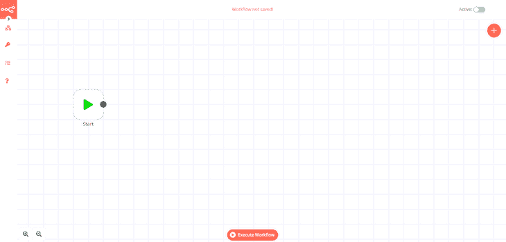
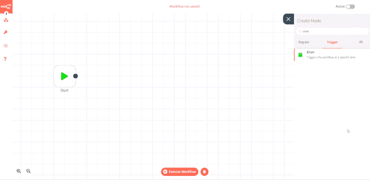
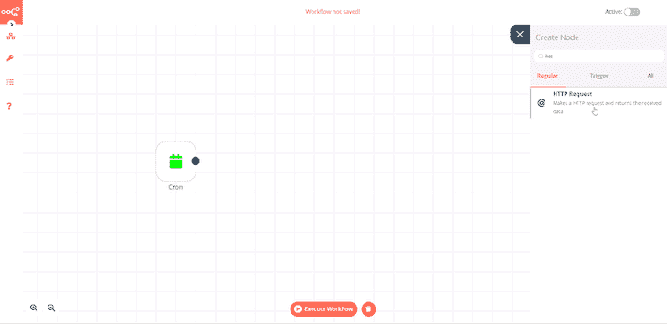
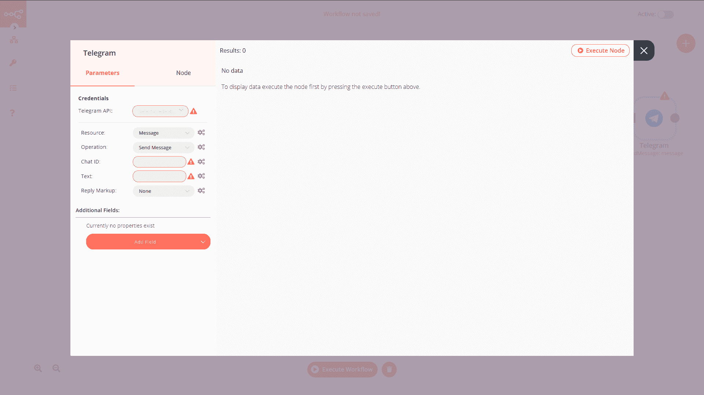
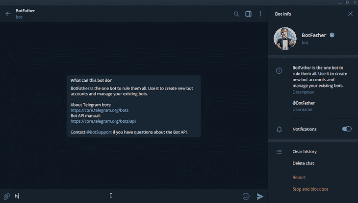
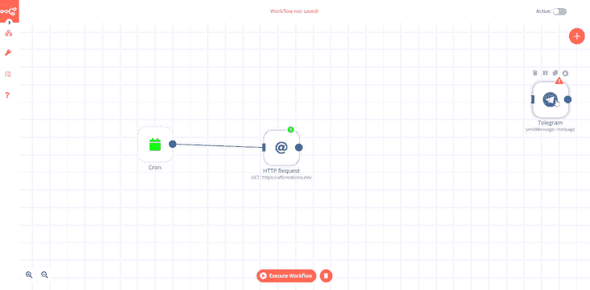
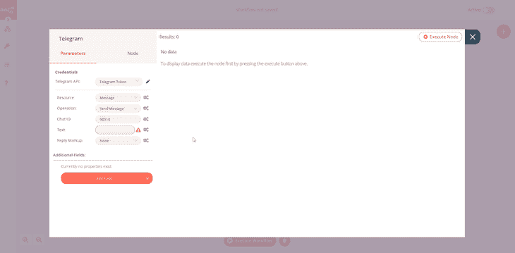
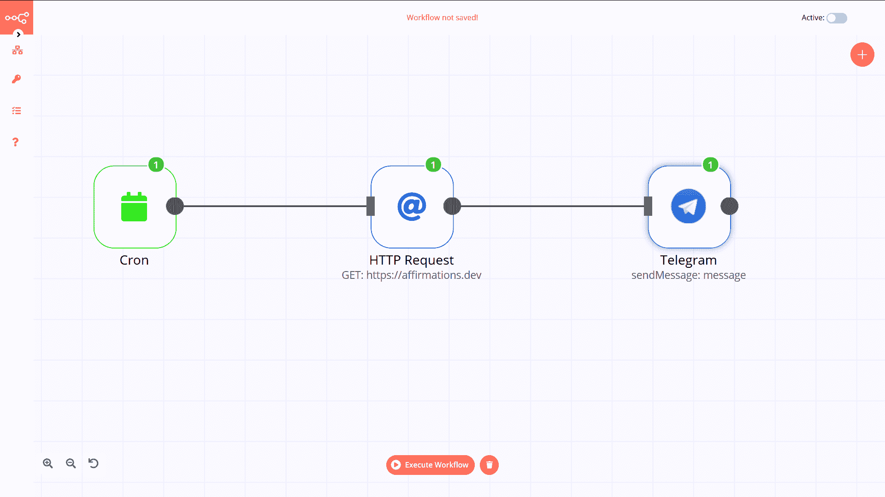
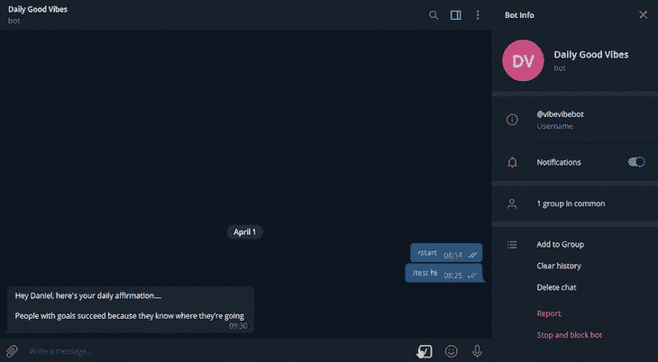

# 利用 n8n.io 实现工作流自动化

> 原文：<https://blog.logrocket.com/workflow-automation-with-n8n-io/>

将日常生活中无聊而平凡的任务自动化一直是人类本性的一部分——无论是每 4 天抓取一次网站，还是将更新分享到 Slack 频道。

当我使用一个非常有趣的工作流自动化工具时，我自己也是这样做的，这个工具叫做 [n8n.io](https://n8n.io) (发音为 nodemation)。

你知道——就像 Kubernetes 是 k8s，nodemation 是 n8n.io 一样。

挺甜蜜的。

开箱即用，看起来跟编程没多大关系。

快速查看[集成](https://n8n.io/integrations)页面，您会发现越来越多的第三方 API 让您的生活变得轻松。

如果您不能立即找到灵感，不要担心，模板和社区启发的[工作流](https://n8n.io/workflows)页面有一个很酷的已经自动化的工作流列表，您可以自己使用或从中获得一些想法。

这个产品很酷。

今天，我们将添加到工作流列表中。

世界上所有的事情都在发生，我们现在并没有经历最轻松的时刻，有时我们需要一点点的激励。

我们将创建一个工作流程，每天在您希望的时间向您的电报聊天或群组发送积极的肯定。

## 先决条件

起床用 n8n.io 真的很爽。

*   您需要安装 [Node.js](https://nodejs.org/en/)
*   您需要安装 [npm](https://www.npmjs.com/get-npm)

> 注意:如果你没有安装`node-gyp`，你可能会有一些麻烦。

官方的 GitHub 页面有关于如何在多种操作系统上运行的说明。

### 入门指南

一旦满足所有先决条件，就可以用`npm install n8n -g`安装 n8n CLI，并用`n8n`运行它。

出现提示时，在终端中按下`o`，在浏览器中打开本地地址，开始自动化工作流程。

您将看到这个屏幕:

Nodemation calls integrations **nodes**.

它有很多第三方节点和内置节点。

有时，节点可用于触发或启动工作流。

首先，我们将添加一个 [Cron](https://n8n.io/integrations/n8n-nodes-base.cron) 触发器，它将在特定时间启动我们的工作流。

如果你点击右上角的 **X** ，你将打开一个节点菜单。

点击触发选项卡，搜索 **Cron** 。

在你想要触发的时候点击它。

单击 execute workflow，您应该会在右下角看到一个小警告，告诉您工作流已成功运行。

> 请确保更改左侧选项卡中的设置，以便 Cron 作业在您所在时区的某个时间运行。这可能是一个问题。

我们的工作流程在每天的特定时间被触发。

现在我们需要从一个 API 请求数据来获得这些确认。

幸运的是，n8n 有一个 [HTTP 请求](https://n8n.io/integrations/n8n-nodes-base.httpRequest)节点，感谢 [affirmations.dev](https://github.com/annthurium/affirmations/blob/master/affirmations.js) 的人们，我们有一些很棒的消息要返回。

同样，我们单击右上角的 **X** 并搜索 HTTP，然后单击 HTTP 请求节点。

将`[https://affirmations.dev](https://affirmations.dev)`粘贴到`URL`部分并执行工作流程。

再次成功运行它，但是这次您得到了一些返回的数据，这在发出请求时总是好的。

关闭模式部分和流部分，单击并按住 Cron 节点上的圆圈，并将其拖动到 HTTP 请求节点的左侧。

这样，我们告诉 nodemation，当 Cron 节点被触发时，我们需要发出请求并返回一些数据。

我们收到了 JSON 格式的确认，我们希望能够通过电报发送出去。

我们有一个[电报节点](https://n8n.io/integrations/n8n-nodes-base.telegram)供我们使用。

正如我们之前对 Cron 和 HTTP 请求节点所做的那样，搜索并单击 Telegram。

有几个字段突出显示，我们还没有这些数据。

所以在我们使用电报节点之前，我们必须得到那些细节。我们需要做的是:

在这里，您为您的 bot 提供一个名称和一个惟一的用户名，并获得一个将您定向到 bot 的 URL 和通过 HTTP 访问 bot 的令牌。我们要保证它的安全。

点击机器人网址(t.me/<bot username="">)并在进入聊天窗口时按下**开始**。</bot>

*   将机器人添加到群组
*   在您刚刚添加机器人的群聊中发送`/test hi`
*   在您的浏览器中，转到`[https://api.telegram.org/bot<TOKEN>/getUpdates](https://api.telegram.org/bot<TOKEN>/getUpdates)`–用创建机器人时获得的令牌替换`<TOKEN>`。
*   你会得到一些 JSON，找到一个名为**聊天**的属性，得到相应的 ID(即`chat:{id:-12345`

现在我们有了电报 API 令牌和聊天 ID。

我们需要在 n8n 凭证部分添加凭证。

我们将其命名为 Telegram Token，然后将令牌从僵尸主机粘贴到访问令牌字段。

我们连接了 HTTP 请求节点和电报，因此我们可以将响应作为消息发送。

n8n 让我们可以从其他节点获取数据，并将其用于不同的领域。

在我们的例子中，我们从 HTTP 请求节点获取响应数据，并将其添加到我们将使用电报节点发送的消息中。

我们打开电报节点，单击文本字段旁边的齿轮，然后单击添加表达式。

我们有两个部分——变量选择器和表达式。

在表达式部分，我们输入消息。

因为我们希望在文本的末尾发送确认，所以在进入变量选择器之前，我们做了几个新的行。

我们使用这个部分将其他节点的数据插入到主表达式中。

为了选择数据，我们点击**当前节点>输入数据> JSON** ，然后选择我们想要的 JSON 属性，在我们的例子中是 affirmations。

这样，在“嘿，丹尼尔，这是你每天的确认”这个表达式的末尾，我们每天都有不同的确认，这取决于 API 请求返回的内容。

添加您的聊天 ID，并确保电报字段中的所有其他凭据都已填写。

我们将聊天操作保留为**发送消息**,因为这正是我们要做的。

关闭节点，然后单击执行工作流。

检查你的电报，你应该有一条来自你的每日好心情机器人的新消息。

回过头来看，我们几乎不用代码就完成的工作非常酷。

我们从一个 API 请求数据，并将其传送到我们的电报客户端。

由于有大量其他的酷节点，nodemation 有太多的工作要做。

现在，这是一个真正的工作流自动化的基本示例，请查看这里的。

这些恰好是我最喜欢的一些不太基本的:

## 结论

希望您现在已经了解了如何使用 n8n.io。我希望您能继续创建一些真正有用的工作流。

如果您做了或添加了它们以显示在 [n8n.io](https://n8n.io/dashboard) 工作流页面上，请在 [Twitter](https://twitter.com/malgamves) 上告诉我。

注意安全，保重。

## 200 只显示器出现故障，生产中网络请求缓慢

部署基于节点的 web 应用程序或网站是容易的部分。确保您的节点实例继续为您的应用程序提供资源是事情变得更加困难的地方。如果您对确保对后端或第三方服务的请求成功感兴趣，

[try LogRocket](https://lp.logrocket.com/blg/node-signup)

.

[https://logrocket.com/signup/](https://lp.logrocket.com/blg/node-signup)

LogRocket 就像是网络和移动应用程序的 DVR，记录下用户与你的应用程序交互时发生的一切。您可以汇总并报告有问题的网络请求，以快速了解根本原因，而不是猜测问题发生的原因。

LogRocket 检测您的应用程序以记录基线性能计时，如页面加载时间、到达第一个字节的时间、慢速网络请求，还记录 Redux、NgRx 和 Vuex 操作/状态。

[Start monitoring for free](https://lp.logrocket.com/blg/node-signup)

.