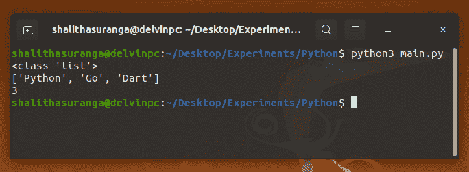
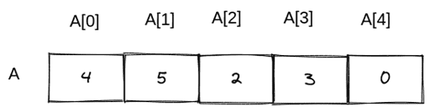
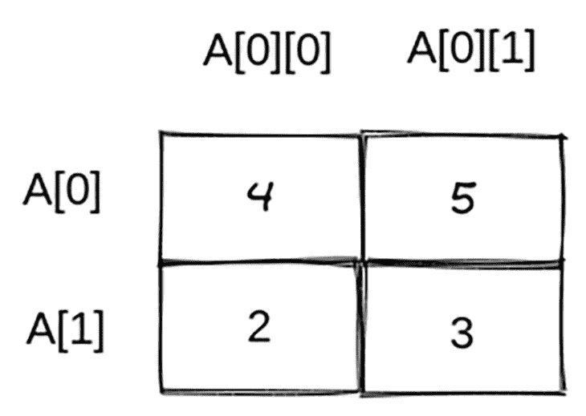
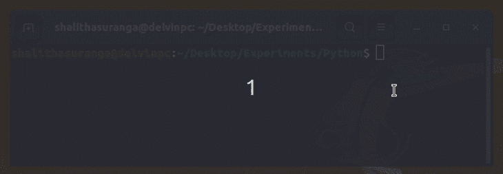

# 在 Python - LogRocket 博客中使用列表

> 原文：<https://blog.logrocket.com/working-lists-python/>

Python 是 web 开发人员、数据科学家、机器学习工程师和系统管理员中流行的通用语言。现在我们也可以用 Python 来构建跨平台的移动应用，用 [Kivy](https://github.com/kivy/kivy) 。Python 因其简单性、初学者友好性和丰富的插件生态系统而变得日益流行。

我们可以像任何其他动态类型语言一样，在 Python 中创建变量来存储单个数据记录。在我们的 Python 程序中，我们经常需要将一系列数据记录保存在一个变量中。对于这些场景，我们可以使用 Python 列表数据结构，它允许您用一个变量创建和操作多个项目。

在本教程中，我将用实际例子解释你需要知道的关于 Python 列表的一切。此外，我们将讨论一些与列表相关的高级主题，如多维列表、映射和过滤。

## 先决条件

你需要[安装 Python 3 解释器](https://www.python.org/downloads/)来开始。在大多数 Linux 发行版中，Python 3 是预装的。

在本教程中，我将使用`python3`命令来执行 Python 脚本，因为我是在 Linux 上演示的。

## 列表语法和原则

Python 列表是由两个方括号括起来的逗号分隔的元素列表。您可以向列表中添加任何元素类型。将以下代码添加到名为`main.py`的新文件中，以创建一个简单的列表。

```
languages = ['Python', 'Go', 'Dart']
print(type(languages))
print(languages)
print(len(languages))

```

现在，用您的 Python 解释器的二进制名称运行上面的代码。

```
python3 main.py

```

上面的代码创建了一个包含三个字符串元素的新列表。此外，它还打印出`languages`变量的类型、内容和项数，如下所示。



如您所见，`len`函数返回列表的当前项目计数。

您可以通过在两个方括号内提供索引来访问每个元素。列表索引从`0`开始，就像计算机科学中的通用数组一样。例如，下面的代码打印第二个元素的值:

```
languages = ['Python', 'Go', 'Dart']
print('The second element: ' + languages[1]) # Go

```

在 Python 中，可以为索引输入负值。`-1`是指`len(list) - 1`(最后一个元素)`-2`是指`len(list) - 2`(最后一个元素之前的元素)，以此类推。例如，如果您更改如下所示的第二个代码行，您将得到“Dart”作为输出。

```
print('The last element: ' + languages[-1]) # Dart

```

您也可以使用`in`关键字检查项目是否存在。

```
languages = ['Python', 'Go', 'Dart']
if 'Python' in languages:
    print('I <3 Python')

```

## 创建和初始化新列表

我们已经用预定义的值初始化了前面的列表。还有其他一些初始化列表的方法。

### 初始化没有值的列表

如果您事先不知道列表的内容，您可以创建一个空列表，稍后再填充它。例如，下面的代码通过在开头创建一个空列表来创建前面的`languages`列表。

```
languages = []
languages.append('Python')
languages.append('Go')
languages.append('Dart')
print(languages) # ['Python', 'Go', 'Dart']

```

这里我们使用了`append`方法向列表中添加一个新元素。

### 用生成的值初始化列表

我们经常需要生成即时列表。比如有时候我们要创建整数列表，比如`1`到`10`、`1`到`100`、`2`到`50`等等。我们可以使用内置的`range`函数来创建这些简单的数字序列，而不是把它们都写出来。下面的代码创建了一个包含介于`1`和`10`之间的整数的列表。

```
A = list(range(1, 10))
print(A) # [1, 2, 3, 4, 5, 6, 7, 8, 9]

```

在上面的代码中，`range`函数返回一个 range 对象，所以我们必须使用`list`函数从 range 对象中获取一个新的列表。我们可以使用`range`函数的第三个参数来添加数字之间的间隔或台阶。例如，下面的代码生成一个在`0`和`10`之间的偶数列表。

```
A = list(range(0, 10, 2))
print(A) # [0, 2, 4, 6, 8]

```

此外，您可以使用 Python 列表理解概念，从现有列表中生成一个新列表，如下所示。

```
numbers = [1, 20, 33, 44, 52]
even_numbers = [x for x in numbers if x % 2 == 0]
print(even_numbers)

```

列表理解概念使用列表迭代。我们将很快讨论更多的列表迭代例子！

## 修改列表

正如我们之前讨论的，我们可以通过提供索引来访问列表元素。我们可以使用相同的语法更新值。例如，下面的代码修改了第二个元素。

* * *

### 更多来自 LogRocket 的精彩文章:

* * *

```
languages = ['Python', 'Go', 'Dart']
languages[1] = 'C++'
print(languages) # ['Python', 'C++', 'Dart']

```

Python 支持在一个赋值语句中进行多个赋值，所以我们可以一次改变多个值，如下所示。

```
languages = ['Python', 'Go', 'Dart']
languages[1], languages[2] = 'C++', 'JavaScript'
print(languages) # ['Python', 'C++', 'JavaScript']

```

前面，我们使用了`append`方法在列表末尾插入一个新元素。这里，`insert`方法可以在特定索引的特定位置插入一个新元素。下面的代码片段通过在中间添加一个新项目来扩展列表。

```
A = list(range(1, 5))
middle = len(A) // 2 
A.insert(middle, 'Hello')
print(A) # [1, 2, 'Hello', 3, 4]

```

如果您是 Python 的新手，您可能已经注意到了这里的一个不寻常的情况。我们向整数列表中插入了一个字符串值。我们通常用静态类型的语言(如 Java、Go、C、C++等)创建特定数据类型的列表。但是，Python 允许创建混合数据类型的列表，因为它是一种动态类型语言。因此，您可以向同一列表中添加不同的数据类型。

也可以将两个列表加在一起。有两种方法可以合并两个列表:使用`extend`方法和使用`+`操作符。请看下面的示例代码片段。

```
A = [2, 3]
def add_two_items():
    global A
    A.extend([10, 50])

def add_another_two_items():
    global A
    A = A + [100, 200]

add_two_items()
add_another_two_items()
print('A = ', A) # A =  [2, 3, 10, 50, 100, 200]

```

在上面的示例代码中，`add_two_items`函数通过使用`extend`方法添加一个包含两个条目的新列表来修改全局列表`A`。另一方面，`add_another_two_items`函数通过使用`+`操作符来做同样的工作。

## 使用`pop`和`clear`方法从列表中删除项目

有时，由于使用了`pop`方法，Python 列表结构看起来像是[中众所周知的堆栈数据结构](https://en.wikipedia.org/wiki/Stack_(abstract_data_type))。我们可以使用`pop`方法通过提供一个索引从列表中删除一个元素。例如，看看下面的代码片段。

```
A = [2, 44, 22, 0]
A.pop(1) 
print(A) # [2, 22, 0]
A.pop()
print(A) # [2, 22]

```

第一个`pop`方法调用删除了`44`,因为它是第二项。之后，第二个`pop`方法调用删除最后一个元素，因为`pop`方法的默认索引是`-1`(最后一个元素)。

此外，您可以使用`remove`方法根据值删除元素，如下面的代码片段所示:

```
A = [2, 44, 22, 22]
A.remove(2) 
print(A) # [44, 22, 22]
A.remove(22)
print(A) # [44, 22]

```

正如您可能注意到的，如果需要删除值的重复条目，Python 将删除第一个匹配项。

如果需要一次从列表中删除所有项目，可以调用`clear`方法或者用一个新的空列表重新初始化列表。看下面这个例子。

```
A = [2, 44, 22, 22]
B = [2, 44, 22, 22]
A.clear()
B = []
print(A) # []
print(B) # []

```

## 遍历列表

我们经常需要遍历列表来处理或查询项目。Python 有两个循环语句:`for`循环和`while`循环。您可以使用下面的方法，用`for`循环和`while`循环遍历一个列表。

### 用 for-in 循环遍历列表

```
languages = ['Python', 'Go', 'Dart']
for language in languages:
    print(language)

```

上面的迭代很简单，但是如果需要的话，您必须创建一个额外的变量来获取当前条目的索引。

### 使用 for-in-range 循环遍历列表

```
languages = ['Python', 'Go', 'Dart']
for i in range(len(languages)):
    print('#' + str(i + 1), languages[i])

```

这种方法基于索引遍历列表，因此您可以使用`i`来获取当前条目的索引。但是，您总是必须编写`languages[i]`来查找当前项目。

### 用`while`循环遍历列表

```
languages = ['Python', 'Go', 'Dart']
i = 0
while i < len(languages):
    print('#' + str(i + 1), languages[i])
    i += 1

```

`while`基于循环的方法类似于 for-in-range。但是，我们需要显式递增计数器变量，以避免无限循环。

### 使用 for-in-enumeration 遍历列表

```
languages = ['Python', 'Go', 'Dart']
for i, language in enumerate(languages):
    print('#' + str(i + 1), language)

```

for-in-enumeration 方式是通过访问索引来遍历列表的最安全、最干净的方式。

## 排序和反转列表

Python 提供了内置的函数来排序和反转列表。

### 对列表进行排序

您可以使用内置的`sorted`函数或`sort`方法对列表进行排序。下面的示例代码用`sort`对列表`A`进行升序排序，用`sorted`对列表`B`进行降序排序。

```
A = [2, 33, 1, 0]
B = [22, 3, 0, -2]
A.sort()
print(A) # [0, 1, 2, 33]
B = sorted(B, reverse=True)
print(B) # [22, 3, 0, -2]

```

### 反转列表

类似于列表排序，我们可以使用`reverse`和`reversed`来反转列表。请参见下面的示例代码。

```
A = [2, 33, 1, 0]
B = [22, 3, 0, -2]
A.reverse()
print(A) # [0, 1, 33, 2]
B = list(reversed(B))
print(B) # [-2, 0, 3, 22]

```

## 列表切片

Python 提供了从现有列表块创建新列表的最小语法。您不需要使用循环来获取列表块的项目。例如，您可以获取列表中的前三个元素，如下所示。

```
A = [1, 2, 3, 4, 5, 6, 7, 8]
slice = A[0:3] # You can use A[:3] too
print(A) # [1, 2, 3]

```

下面的例子进一步解释了切片。

```
A = [1, 2, 3, 4]

print(A[:-1]) # [1, 2, 3]
print(A[2:3]) # [3]
print(A[-1:]) # [4]
print(A[:]) # [1, 2, 3 ,4], same as A.copy()
print(A[:len(A) // 2]) # [1, 2]

```

## 带有对象的列表

在前面的例子中，我们已经创建了字符串列表和整数列表。您确实可以根据自己的意愿创建任何数据类型的列表。例如，您可以创建带有内置类实例和用户定义的类实例的列表。以下代码生成学生姓名和年龄的列表。

```
class Student:
    def __init__(self, name, age):
        self.name = name
        self.age = age

students = []

students.append(Student('Mark', 25))
students.append(Student('Emma', 22))
students.append(Student('Jones', 24))

```

## 寻找最大值、最小值和总和

Python 提供了最少的内置函数来获取列表的最大值、最小值和总和。下面的例子演示了如何使用`max`、`min`和`sum`函数。

```
A = [2, 2, 3, 1]
print('max(A) = ', max(A)) # 3
print('min(A) = ', min(A)) # 1
print('sum(A) = ', sum(A)) # 8

```

## 高级 Python 列表概念

在本节中，我们将讨论多维列表、映射和过滤列表以及其他高级 Python 列表概念。

## n 维列表

之前，我们创建了一维列表；换句话说，以前的列表对于一个唯一的索引只有一个元素，如下图所示。



有时，我们不得不创建多维列表，比如为了存储[矩阵](https://en.wikipedia.org/wiki/Matrix_(mathematics))的细节，我们不得不创建一个 2D 列表结构(列表中的列表)。此外，为了存储 3D 渲染细节，我们需要一个 3D 列表结构。

我们可以用下面的 2D 列表结构存储一个简单的矩阵。



可以将上面的图表转换成下面的 Python 代码片段。

```
A = [[4, 5], [2, 3]]
print(A) #[[4, 5], [2, 3]]

```

现在，我们需要使用两次基于方括号的索引语法来获取一个存储值。例如，你需要写`A\[0\][1]`来得到值`5`。

同样，你可以根据自己的需求创建 N-D 列表，比如 3D 列表，4D 列表等。

## 映射和过滤

有时，我们需要将列表元素转换成不同的数据类型。例如，我们经常需要将字符串列表转换为整数列表。此外，有时我们必须应用自定义转换。在这些场景中，我们可以使用内置的`map`函数，而不使用传统的循环。

让我们用下面的代码将用户输入的字符串列表转换成整数列表。

```
A = input('Enter some numbers: ').strip().split(' ')
A = list(map(int, A))
print(A)

```

当您运行上面的代码时，您会看到下面的结果。



注意`int`在这里是一个函数，而不是一个数据类型。因此，我们可以编写一个自定义函数来转换数据元素。看看下面的代码，它将我们所有的列表项乘以 2。

```
A = [1, 2, 3, 4]

def multiply_by_two(x):
    return x * 2

B = list(map(multiply_by_two, A))
print(B) # [2, 4, 6, 8]

```

筛选也可以用于根据条件从列表中删除特定项目。例如，下面的代码删除所有奇数。

```
A = [1, 2, 3, 4, 5, 6, 7, 8]

def is_even(x):
    return x % 2 == 0

A = list(filter(is_even, A))
print(A) # [2, 4, 6, 8]

```

内置的`filter`函数通过将每个项目发送给`is_even`函数来调用每个项目的`is_even`。如果我们需要包含给定的项目，我们需要返回`True`。因此，如果`x`是偶数，`is_even`返回`True`。

## 结论

在本教程中，我们通过各种实例讨论了 Python 列表。 [Python](https://blog.logrocket.com/tag/python) 为基本的列表操作需求提供了内置的方法，比如排序、反转、过滤和映射。这些通用的 Python 列表解决方案允许您存储任意元素的列表，但是如果您希望只存储数字以获得更好的性能，那么 [NumPy 包的数组结构](https://numpy.org/doc/stable/reference/c-api/array.html?highlight=array%20structure)是一个很好的选择。

值得记住的是，列表并不总是合适的，您还需要学习其他集合类型。例如，如果需要创建一个只读列表，可以使用内置的[元组](https://docs.python.org/3/tutorial/datastructures.html#tuples-and-sequences)类型。由于列表允许重复的数据元素，如果您需要创建一个包含唯一数据元素的列表，而不需要通过包装列表结构来实现额外的逻辑，那么您可能需要使用 Python [set](https://docs.python.org/3/tutorial/datastructures.html#sets) 。

## 使用 [LogRocket](https://lp.logrocket.com/blg/signup) 消除传统错误报告的干扰

[](https://lp.logrocket.com/blg/signup)

[LogRocket](https://lp.logrocket.com/blg/signup) 是一个数字体验分析解决方案，它可以保护您免受数百个假阳性错误警报的影响，只针对几个真正重要的项目。LogRocket 会告诉您应用程序中实际影响用户的最具影响力的 bug 和 UX 问题。

然后，使用具有深层技术遥测的会话重放来确切地查看用户看到了什么以及是什么导致了问题，就像你在他们身后看一样。

LogRocket 自动聚合客户端错误、JS 异常、前端性能指标和用户交互。然后 LogRocket 使用机器学习来告诉你哪些问题正在影响大多数用户，并提供你需要修复它的上下文。

关注重要的 bug—[今天就试试 LogRocket】。](https://lp.logrocket.com/blg/signup-issue-free)