# 使用 Supabase Studio 

> 原文：<https://blog.logrocket.com/working-supabase-studio/>

毫不奇怪，Supabase 在开发者中的采用持续增长。该平台可用于在不到两分钟的时间内启动实时后端。Supabase 为实时数据库提供了一个开源的替代方案，并提供了一些重要的特性，如身份验证、文件存储和自动生成的 API。

Supabase 在后台使用 PostgreSQL 数据库。它被认为是建立在 Postgres 之上的最好的工具之一，Postgres 是一个非常可伸缩的关系数据库。该平台将从数据库中获取所有的表和列，并生成一个 REST API。其自动生成的 API 包括有用的内置特性，如过滤和排序。

Supabase 宣称自己是 Firebase 和其他后端即服务(BasS)平台的替代品。【Supabase 和 Firebase 哪个最好，部分取决于你项目的性质。Firebase 是一个完整的解决方案，提供多种功能，如文件存储、SDK、无服务器功能、身份验证等等。然而，Supabase 在某些情况下可能更有用，因为它利用了开源技术。

在本文中，我们将在 Subabase Studio 中建立一个项目，这是一个用于管理自托管 Supabase 项目的仪表板，并仔细研究该平台的许多特性。Supabase Studio 不受限制，没有任何类型的供应商锁定。我们还将浏览如何为本地开发和自托管设置 Supabase Studio 的教程。

## 入门指南

要设置您的示例项目，请前往 [Supabase](https://supabase.com) 并点击**开始您的项目**:

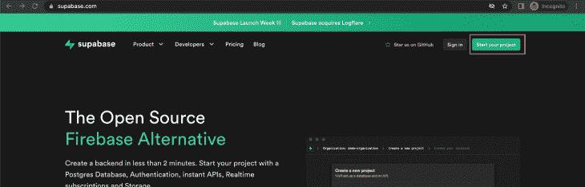

接下来，使用您的 GitHub 帐户登录。点击**新项目**在您帐户的指定组织下创建一个新项目:

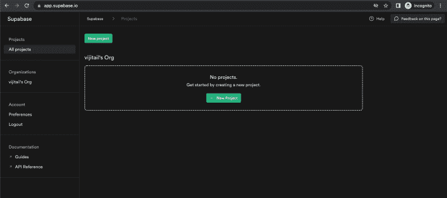

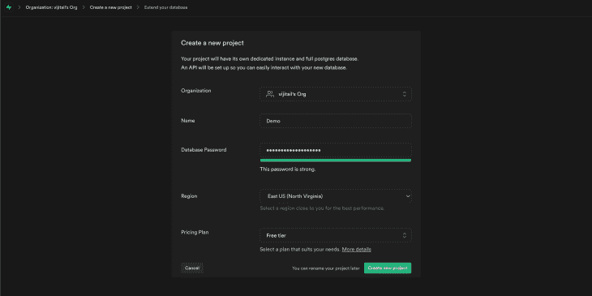

一旦建立了项目，您就可以获取 API 键和项目配置:

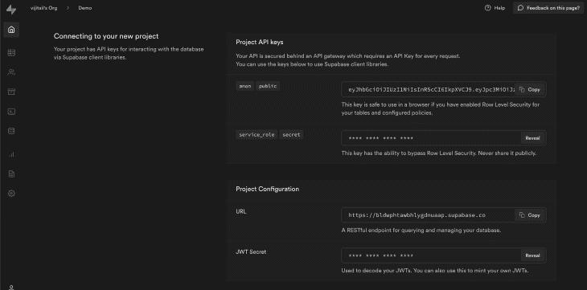

Supabase 提供了两个 API 键来启动。第一个是可以从浏览器或客户端应用程序安全使用的公钥。第二个是只应该在服务器上使用的秘密密钥，因为它可以用来绕过所有的安全规则和策略。

您可以使用项目 URL 从数据库中检索数据。

## Supabase Studio 功能

Supabase Studio 提供了几个有用的功能:

### 专用 PostgreSQL 数据库

Postgres 是最先进和最稳定的数据库之一。它的流行部分是因为它是免费和开源的。Postgres 建于 1994 年，作为一个 SQL 语言解释器，起到了替代 PostQUEL 的作用。Postgres 数据库提供简单的功能，使 Supabase Studio 用户能够轻松地:

*   创建表格视图
*   在数据中建立关系
*   克隆表格
*   从 SQL 编辑器获得帮助
*   使用实时服务器

要创建新表格，请使用 Supabase Studio 仪表板中的表格编辑器:

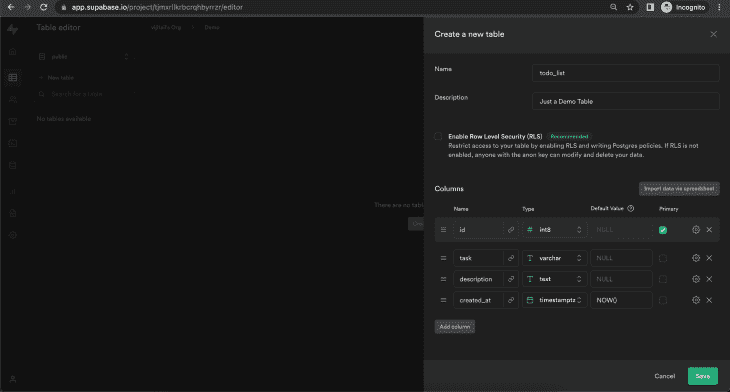

要访问这些表，您不需要成为数据库专家，甚至不需要了解 SQL。Supabase Studio 附带了一个表格视图，这是一个用于访问和查看表格的用户界面。使用表格视图就像处理电子表格一样简单。

对于有 SQL 背景的人来说，Supabase Studio 还有一个 SQL 编辑器:

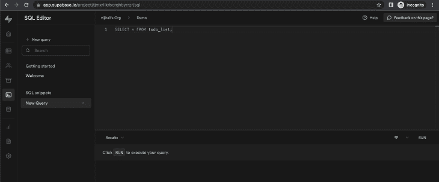

### 自动生成的 API

自动生成的 API 提供了对三种 API 的访问:REST、Realtime 和 GraphQL。在撰写本文时，GraphQL API 仍在开发中，尚未发布。

数据库更改会自动生成到 API 中。Supabase 还可以生成文档以及安全、快速的 API 配置。

您可以访问自动生成的 API，以便在表中读取和写入数据行:

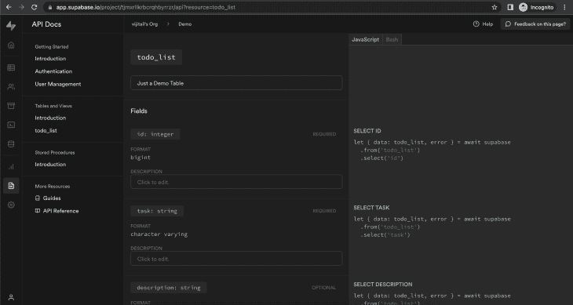

### 认证和用户管理

Supabase 认证系统分为两部分:认证和授权。

客户端应用程序可以通过几种方式验证用户详细信息，如电话登录、电子邮件和密码、一键链接(称为神奇链接)和社交提供商登录。

简单的 Supabase Studio UI 可用于支持不同的社交第三方提供商。在仪表板中，转到:**认证** > **设置** > **外部 OAuth** **提供者**并添加您的客户端和密钥:

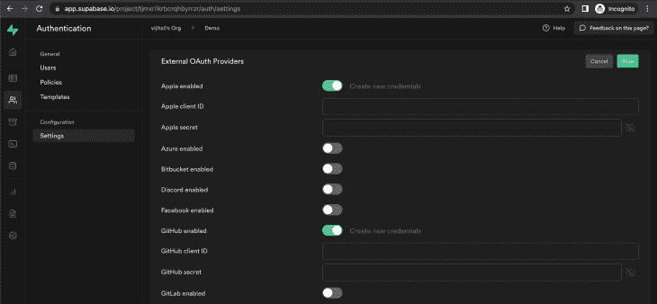

授权是一种借助行级安全性(RLS)启用粒度授权规则的功能。这些规则灵活而强大，可以使规则受益并适合独特的业务需求。

您可以向表中添加策略，并启用 RLS，以便对数据访问授权进行更强大、更灵活的控制。您也可以从头开始创建策略，或者使用模板并根据您的要求进行修改:

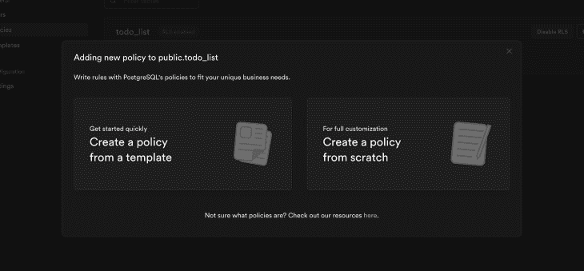

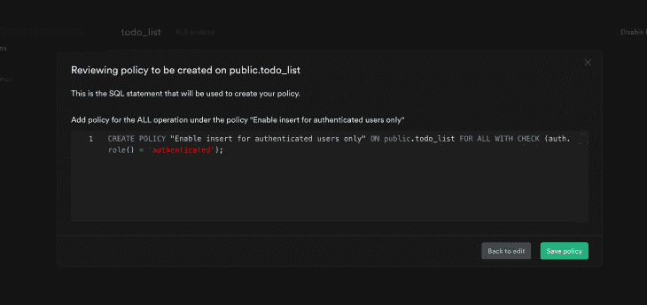

Supabase Studio 还提供了一个用户管理界面:

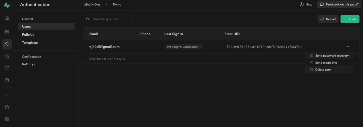

### 储存；储备

Supabase 可以存储任何类型的媒体文件，包括视频、音频和 gif。它的存储功能支持大型文件的存储可用性，这些文件也可以从一个端点提供。

存储功能还使用户能够将他们的数据组织到适当的文件中。此外，存储桶可用于在不同的容器中容纳和保存文件和文档。

可以通过编程或使用仪表板来创建存储桶。您还可以从仪表板上传和下载文件，并添加安全规则来限制用户访问。

要创建新的存储桶，请转到**存储**部分并点击**创建新的存储桶**:


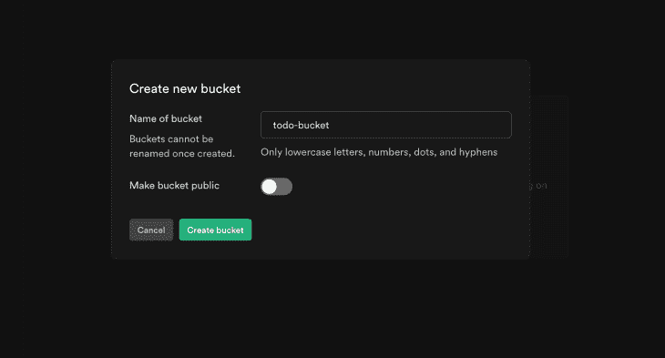

您也可以直接从仪表板上传新文件和创建新文件夹:

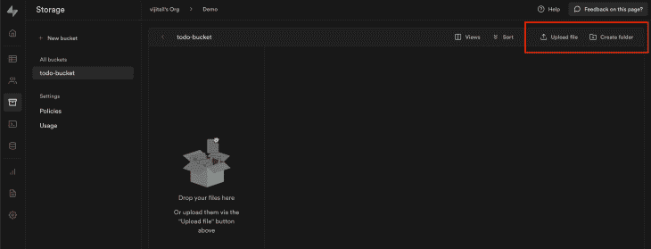

接下来，您可以添加用于访问存储桶的存储策略:

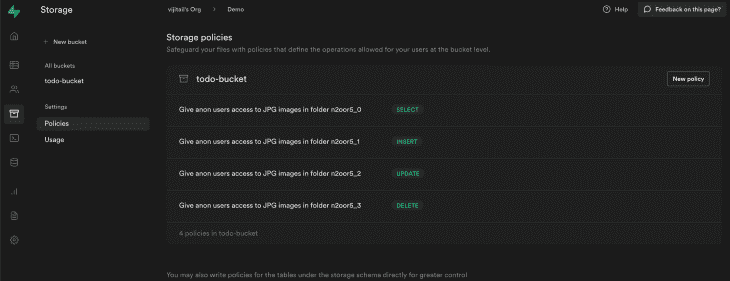

### JavaScript 库和 API

Supabase 提供模块化同构 JavaScript 库，以便从客户端应用程序或服务器与 Supabase 产品进行交互。PostgREST、GoTrue、Realtime 和 Storage 的所有特性库都捆绑在`supabase-js`库中。

每个子库都是独立的、独立的实现。例如，如果您只想使用 PostgREST 特性，您可以简单地使用`postgrest-js`库。除了官方的 JavaScript 库，Supabase 还为 C#、Python、Go、Java 等提供了社区驱动的库

### 与外部产品的集成

Supabase 支持与其他产品的集成，如 Auth0、Vercel、Snaplet、Draftbit、Appsmith 和 pgMustard。更多细节，请查看官方文档的[集成部分](https://supabase.com/docs/guides/integrations/appsmith)。

## 在本地安装 Supabase Studio

现在，让我们回顾一下如何为本地开发和自托管设置 Supabase Studio。

Supabase 提供了一个 CLI 工具，可用于在将应用程序推送到生产服务器之前，在您的系统上本地开发应用程序。

### 要求

要设置 Supabase Studio，首先需要在本地环境中安装以下软件:

按如下方式安装 Supabase CLI:

对于 Mac

```
> brew install supabase/tap/supabase

```

对于 Windows

```
> scoop bucket add supabase https://github.com/supabase/scoop-bucket.git
> scoop install supabase

```

### 运行本地服务器

接下来，创建一个用于设置 Supabase Studio 的文件夹:

```
> mkdir SupabaseDemo
> cd SupabaseDemo

```

使用 Supabase CLI 工具初始化项目:

```
> supabase init

```

该命令将创建一个 Supabase 文件夹，其中包含本地运行 Supabase Studio 所需的所有配置。

要在本地环境中启动项目，请确保 Docker 服务正在本地运行。然后运行以下命令:

```
> supabase start

```

这个命令将使用 Docker 来安装 Supabase 的开源服务。一旦安装了依赖项并且本地服务器正在运行，您将在终端上看到所有凭证:

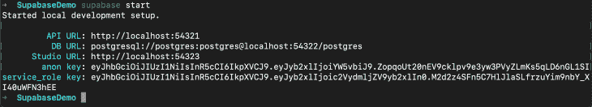

您可以在浏览器上打开 Studio URL 来访问 Supabase Studio 仪表板:


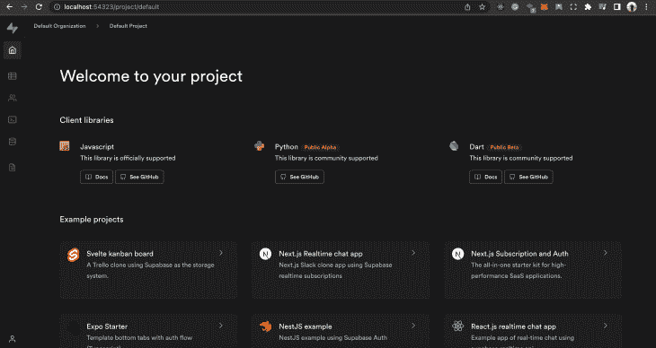

## Supabase 的下一步是什么？

在撰写本文时，Supabase 还处于测试阶段，但预计在不久的将来会完全投入生产。几个额外的升级和功能也在工作中。两个备受期待的特性是:GraphQL 支持和 Supabase 功能。

### GraphQL 支持

Supabase 最近开源了支持 GraphQL 的原生 Postgres 扩展`pg_graphql`。该扩展检查 Postgres 模式，并用高性能解析器反映 GraphQL 模式。模式生成、查询解析和解析器都捆绑在数据库服务器中，不需要外部服务。

在撰写本文时，该扩展正处于积极开发阶段。最终，该功能将在核心 Supabase 仪表板中可用。

### 超级功能

Supabase 函数将允许开发人员编写无服务器代码，并从外部源或数据库触发器调用代码。有关 Supabase 功能的更多信息，请查看 Supabase 博客上的这篇[文章。](https://supabase.com/blog/2021/07/30/supabase-functions-updates#supabase-functions)

## 结论

Supabase 是一个很棒的工具，可以在几分钟内创建托管后端服务。您可以使用 Supabase 创建一个新的应用程序，只需要少量的配置、一堆模板和一些依赖项。很快，您就可以创建一个成熟的应用程序，提供用户身份验证和管理，以及访问用户数据的复杂安全规则。

在本文中，我们演示了如何在 Subabase Studio 中建立一个项目。我们还回顾了该平台的许多特性。

查看 [Supabase 博客](https://supabase.com/blog)或参考[官方技术指南](https://supabase.com/docs/guides/examples)了解 Supabase 的最新信息。

## 使用 [LogRocket](https://lp.logrocket.com/blg/signup) 消除传统错误报告的干扰

[](https://lp.logrocket.com/blg/signup)

[LogRocket](https://lp.logrocket.com/blg/signup) 是一个数字体验分析解决方案，它可以保护您免受数百个假阳性错误警报的影响，只针对几个真正重要的项目。LogRocket 会告诉您应用程序中实际影响用户的最具影响力的 bug 和 UX 问题。

然后，使用具有深层技术遥测的会话重放来确切地查看用户看到了什么以及是什么导致了问题，就像你在他们身后看一样。

LogRocket 自动聚合客户端错误、JS 异常、前端性能指标和用户交互。然后 LogRocket 使用机器学习来告诉你哪些问题正在影响大多数用户，并提供你需要修复它的上下文。

关注重要的 bug—[今天就试试 LogRocket】。](https://lp.logrocket.com/blg/signup-issue-free)