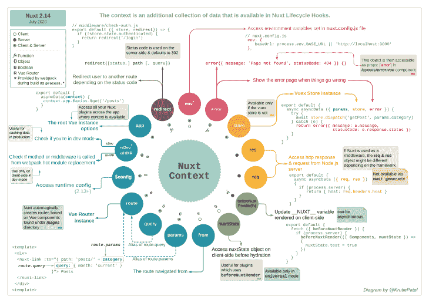

# 在 Nuxt.js 中使用上下文、助手和高级属性

> 原文：<https://blog.logrocket.com/working-with-context-helpers-and-advanced-properties-in-nuxt-js/>

### 快速小结

Nuxt 有很多有用的特性和概念，使得应用程序的开发变得简单和无缝。在本教程中，我们将看看这些概念(例如，上下文)以及它们如何在开发中有所帮助。

我们还将关注像`router`属性这样的特性，如何配置它来做更多默认的事情，以及它在哪里有用。

## 介绍

Nuxt 是一个框架，旨在给你一个遵循 Vue 官方指导方针的强大架构。

它可增量采用，可用于创建从静态登录页面到复杂的企业级 web 应用程序的所有内容。我们将看看 Nuxt 中一些非常有用的特性。

它们包括:

*   语境
*   助手
*   加载属性

一些特性可以根据个人喜好进行配置，而其他特性可以提供一种更简单的方式来执行应用程序中的困难/复杂功能(例如，Nuxt 助手)。

在本教程结束时，读者应该:

*   很好地理解上下文对象，如何使用它的属性，以及在哪里可以使用它
*   了解 Nuxt 助手以及如何使用它们
*   能够配置 Nuxt 加载组件并创建自定义加载组件

## 语境



Nuxt `context`是 Nuxt 生命周期钩子中提供的关于应用程序当前请求的额外数据集合。这个对象可用于一些 Nuxt 函数，如`asyncData`和`nuxtServerInit`。

虽然我们在 Vuex 商店中也有一个`context`，它与这个不同，因为 Vuex 商店`context`提供了关于你的商店的附加信息(像`commit`和`state`)，但是 Nuxt `context`提供了关于整个应用程序的额外数据(像`query`、`params`和`store`)。

`context`对象可以分为三部分。

即:

*   随时可用
*   可用的服务器端
*   可用客户端

### 随时可用

这包括在`context`对象中始终可用的属性，而不管应用程序的状态如何——即客户端和服务器端。

这意味着这些属性可以在应用程序的整个状态中随时使用。

始终可用的属性示例包括:

*   `app`:这是你所有插件`$axios`、`store`、`router`所在的属性。在`app`属性下可用的一些属性也可以直接在`context`对象下找到，例如`store`和`$axios`(如果安装了 nuxt Axios 模块)。
*   `store`:此属性包含关于您的商店的所有信息(getters、state、mutation 和 actions ),只有在您的应用程序中启用了 Vuex 商店时才可用。有了这个属性，您可以在像中间件和插件文件夹这样的地方访问您的存储。
*   `route`:这个属性包含了你的路线信息——比如`fullPath`、`params`和`query`都可以在这里找到。在为应用程序创建特定路线和路线属性的中间件时，这很方便。
*   `params`:该属性可用于访问某些页面的路由参数。这在创建依赖于路由参数值进行操作的中间件时，或者在利用`asyncData`、`fetch`或插件时非常有用。如上所述，这也可以通过访问`route`属性下的参数来实现。
*   `query`:该属性与`route`属性下的属性相同。它包含当前路线的查询值，在`asyncData`、`fetch`中创建中间件和插件时会很有用。
*   `env`:访问环境变量的一种方法是调用`process.env.VARIABLE_NAME`。在 Nuxt 中，使用上下文对象中的`env`属性可以找到我们所有的环境变量。我相信这是一个更短更干净的方法来访问你的 env 变量。
*   `isDev`:这个属性和 Vue apps 中的`process.env.NODE_ENV`的作用是一样的，它帮助你决定你的应用是开发还是生产模式。但是在这种情况下，它返回一个布尔值，这意味着它在开发阶段是`true`，在生产阶段是`false`。
*   `isHMR`:布尔值，让您知道方法/中间件是否是从 webpack 热模块替换中调用的(仅在开发模式下的客户端为真)。
*   `redirect`:这种方法的工作方式与 [Vue 导航卫士](https://www.smashingmagazine.com/2020/08/vue-router-features/)中的`next()`类似，都是用来重定向到不同的路线。在为您的应用程序编写身份验证中间件时，如果您试图在未授权用户不满足访问特定路由的要求时将他们重定向到不同的路由，该属性会很方便。
*   `error`:该方法用于将错误状态和消息传递给错误页面。它通常接受一个对象`statusCode`和`message`，这个对象总是呈现在你的应用程序的错误页面上。

### 可用的服务器端

这些属性只有在服务器端(`asyncData` & `nuxtServerInit`)访问`context`对象时才可用，在客户端工作时不能使用/访问。

这些属性包括:

*   `req</code`
*   `res`
*   `beforeNuxtRender`

### 可用客户端

这些是`context`对象中的属性，它们只在客户端可用并且总是可用，不能在服务器端访问。

这些属性包括:

## 助手

Nuxt 有一个专门的助手，旨在改善用户体验，并在某些情况下作为逃生出口。它可以通过 Vue 组件中的`this.$nuxt`访问，也可以通过客户端的`window.$nuxt`访问。

该助手下可用的属性和方法包括:

*   使用`isOffline` / `isOnline`检查用户的网络连接状态
*   使用`refresh()`更新应用程序的状态
*   使用`$loading`控制 Nuxt 加载器

### `isOffline`和`isOnline`

这两个属性提供了一种检查用户 internet 连接的方法。这意味着您不需要担心编写自己的自定义函数来帮助在您的 Nuxt 应用程序中确定这一点。这些属性在每次使用时都返回`Boolean`值。

也就是说，对于离线用户，`this.$nuxt.isOffline`将返回`true`，而`this.$nuxt.isOnline`将返回`false`，反之亦然，如果用户有网络连接的话。

### `refresh()`

在开发过程中，有些情况下，用户与应用程序的交互可能需要您更新显示给用户的数据。

如果您使用应用程序的`methods`中的`normal functions`获取数据，这可能不是问题，但是当使用`asyncData`或`fetch`在服务器端获取数据时，更新这些数据的唯一干净的方法是刷新页面，最终刷新整个应用程序。

* * *

### 更多来自 LogRocket 的精彩文章:

* * *

使用`refresh()`方法，您可以通过在方法或内联(直接连接到事件监听器)中调用`this.$nuxt.refresh()`来更新数据，而无需刷新应用程序。

### `$loading`

在开发过程中，当用户在应用程序上执行某些操作时，您可能希望 Nuxt 中的加载指示器出现。

使用`$loading`属性，这可以通过调用`this.$nuxt.$loading.start()`来启动加载动画或者调用`this.$nuxt.$loading.finish()`来停止动画来实现。

## 负载特性

默认情况下，Nuxt 附带了一个默认的加载器组件，在路由之间切换时会被激活。默认情况下，加载组件的`color`为黑色，当出现错误时，它会变为红色。

使用 loading 属性可以在 Nuxt 中修改这个加载组件的更多属性。同时，该组件可以被禁用，也可以完全替换为另一个组件。

要修改这些属性，您只需在配置文件(`nuxt.config.js`)中添加一个`loading`属性。让我们看看这个属性下的一些可用属性，以及如何修改它们。

**nuxt.config.js**

```
export default {
  loading: {
    color: '#eee', // color of the loading component
    height: '5px', // height of the loading component
    throttle: 500, // set a delay in ms before loading starts
    duration: 3000 // how long it would take for the loader to go from start to finish
  }
}
```

这里，我们更改了加载组件的`color`、`height`、`throttle`和`duration`，如果您现在尝试在路由之间切换，您应该会看到应用程序中反映了这一更改。

“加载”属性下的其他可用属性包括:

*   `failedColor`:用于设置失败导航/请求的颜色(默认为红色)，接受字符串
*   `continuous`:用于控制当请求/导航过程花费的时间超过`duration`时，加载组件是否应该重新启动。它接受布尔值，其默认值为 false
*   `css`:该选项用于决定组件是否使用默认的 CSS 样式。它接受一个布尔值，默认情况下，它被设置为 true
*   `rtl`:控制加载组件的方向(`rtl`是从右到左的简称)。默认情况下，它被设置为`false`,因此，加载组件从左侧开始，并移动到右侧

Nuxt 还允许您通过调用`this.$nuxt.$loading.start()`来启动加载组件，并通过调用`this.$nuxt.$loading.finish()`来停止加载组件。

当您想要在同一页面上使用加载动画时，例如对服务器的 API 请求，以及常规导航用例之外的事情，这就很方便了。

如果您不想要默认的加载器，您可以禁用它或者创建您自己的定制组件并将其传递给`loading`属性，这样 Nuxt 将自动调用它。

要禁用加载组件，请将`false`传递给配置文件或特定页面中的`loading`属性:

**nuxt.config.js**

```
loading: false
```

或者，如果希望更好地控制加载组件的工作方式，可以创建自定义加载组件。

您的自定义组件必须具有以下属性，因为这些属性对于您的组件准确工作是必不可少的。

*   组件的`data()`中的一个布尔值，用于控制加载器组件的活动状态，默认情况下设置为 false
*   `start`–该方法通过将布尔值从 1 设置为真来启动加载动画
*   `finish`–该方法通过将布尔值从 1 设置为假来停止加载动画

## 结论

我们已经查看了 Nuxt 上下文对象、所有属性，以及如何在我们的应用程序中使用它们。我们还研究了 Nuxt 中的一些助手，它们是什么，我们如何使用它们来简化开发，以及它们给了我们多大的灵活性。

最后，我们查看了加载属性，如何配置默认的加载组件，以及如何在我们的应用程序中创建定制的加载组件。

### 进一步阅读

使用 [LogRocket](https://lp.logrocket.com/blg/signup) 消除传统错误报告的干扰

## [LogRocket](https://lp.logrocket.com/blg/signup) 是一个数字体验分析解决方案，它可以保护您免受数百个假阳性错误警报的影响，只针对几个真正重要的项目。LogRocket 会告诉您应用程序中实际影响用户的最具影响力的 bug 和 UX 问题。

[](https://lp.logrocket.com/blg/signup)

然后，使用具有深层技术遥测的会话重放来确切地查看用户看到了什么以及是什么导致了问题，就像你在他们身后看一样。

LogRocket 自动聚合客户端错误、JS 异常、前端性能指标和用户交互。然后 LogRocket 使用机器学习来告诉你哪些问题正在影响大多数用户，并提供你需要修复它的上下文。

关注重要的 bug—[今天就试试 LogRocket】。](https://lp.logrocket.com/blg/signup-issue-free)

Focus on the bugs that matter — [try LogRocket today](https://lp.logrocket.com/blg/signup-issue-free).