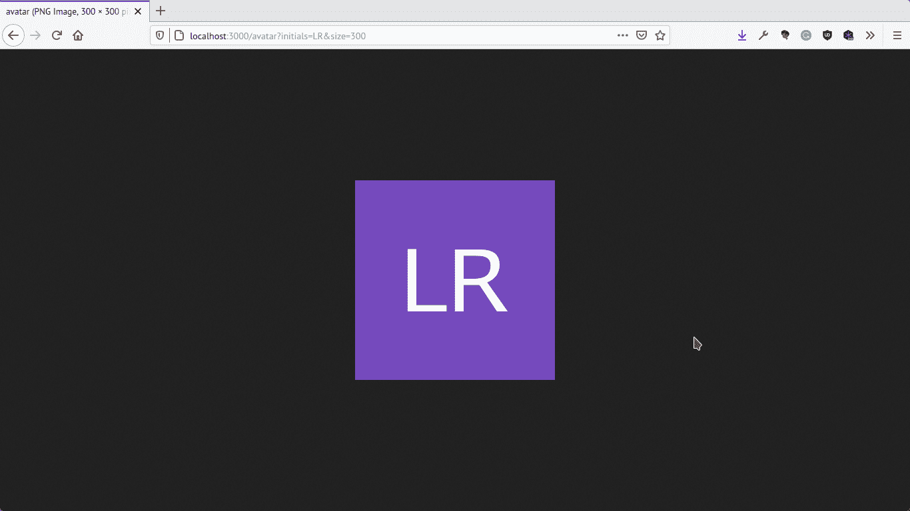

# 使用 Go images - LogRocket 博客

> 原文：<https://blog.logrocket.com/working-with-go-images/>

Web 应用程序经常需要为用户呈现头像，而用户并不总是热衷于上传他们的图片。一个流行的方法是根据用户名字的首字母来生成他们的头像。在本教程中，我们将探索如何在 Go 中创建这样的化身，并使用 [chi 路由器](https://github.com/go-chi/chi)通过 HTTP 提供服务。

## 设置

为了跟进，您需要安装一个合理的最新版本的[Go](https://golang.org/doc/install)(版本 1.14 或更高)。

> 注意:下面使用的 shell 命令是针对 Linux/macOS 的，如果与您的操作系统不同，请随意使用它的等效命令。

首先，为项目创建一个文件夹，并初始化一个新的 Go 模块:

```
$ mkdir go-avatars && cd go-avatars
$ go mod init gitlab.com/idoko/go-avatars
```

接下来，通过在您的工作目录(即`go-avatars`)中运行下面的命令来添加您需要的依赖项:

```
$ go get golang.org/x/image github.com/golang/freetype github.com/go-chi/chi
```

依赖项包括 [`image`](https://pkg.go.dev/golang.org/x/image) ，它提供了在 Go 中处理图像的方法， [`freetype`](https://pkg.go.dev/github.com/golang/freetype/) 用于处理字体(和在图像上书写)，以及 [`chi`](https://pkg.go.dev/mod/github.com/go-chi/chi) 路由器，用于通过 HTTP 服务生成的头像。

## 创建图像画布

为了给我们的角色准备背景，我们在工作目录中创建了一个`main.go`文件，并实现了两个功能——`main`和`createAvatar`。打开`main.go`文件，添加下面的代码块:

```
package main
import (
    "fmt"
    "image"
    "image/color"
    "image/draw"
    "image/png"
    "log"
    "os"
    "time"
)
func main() {
    initials := "LR"
    size := 200
    avatar, err := createAvatar(size, initials)
    if err != nil {
        log.Fatal(err)
    }
    filename := fmt.Sprintf("out-%d.png", time.Now().Unix())
    file, err := os.Create(filename)
    if err != nil {
        log.Fatal(err)
    }
    png.Encode(file, avatar)
}
func createAvatar(size int, initials string) (*image.RGBA, error) {
    width, height := size, size
    bgColor, err := hexToRGBA("#764abc")
    if err != nil {
        log.Fatal(err)
    }
    background := image.NewRGBA(image.Rect(0, 0, width, height))
    draw.Draw(background, background.Bounds(), &image.Uniform{C: bgColor},
        image.Point{}, draw.Src)
    //drawText(background, initials)
    return background, err
}
```

`createAvatar`函数创建一个正方形画布，其宽度和高度与传递给该函数的`size`参数相同。它将十六进制颜色代码转换为 RGBA 颜色代码，然后将 RGBA 均匀地绘制在画布上。接下来，我们将实现`hexToRGBA`函数来转换颜色。

## 将十六进制代码转换为 RGBA 颜色

将`hexToRGBA`函数的实现添加到`main.go`文件中:

```
func hexToRGBA(hex string) (color.RGBA, error) {
    var (
        rgba color.RGBA
        err  error
        errInvalidFormat = fmt.Errorf("invalid")
    )
    rgba.A = 0xff
    if hex[0] != '#' {
        return rgba, errInvalidFormat
    }
    hexToByte := func(b byte) byte {
        switch {
        case b >= '0' && b <= '9':
            return b - '0'
        case b >= 'a' && b <= 'f':
            return b - 'a' + 10
        case b >= 'A' && b <= 'F':
            return b - 'A' + 10
        }
        err = errInvalidFormat
        return 0
    }
    switch len(hex) {
    case 7:
        rgba.R = hexToByte(hex[1])<<4 + hexToByte(hex[2])
        rgba.G = hexToByte(hex[3])<<4 + hexToByte(hex[4])
        rgba.B = hexToByte(hex[5])<<4 + hexToByte(hex[6])
    case 4:
        rgba.R = hexToByte(hex[1]) * 17
        rgba.G = hexToByte(hex[2]) * 17
        rgba.B = hexToByte(hex[3]) * 17
    default:
        err = errInvalidFormat
    }
    return rgba, err
}
```

该实现使用来自 [`gox`](https://github.com/icza/gox/blob/master/imagex/colorx/colorx.go) 库的代码，并通过将十六进制颜色代码转换为字节序列来工作。对于十六进制三元组(即 6 位数字、3 字节十六进制数)，每个字节的第一位数字乘以 16(左移 4 位)并与同一字节的第二位数字相加，得到 RGB 等效值。

如果十六进制字符串是三个数字(比如#FFF)，那么我们只需要将每个数字乘以 17 就可以得到相应的 RGB 值。

你可以在维基百科页面上了解更多关于网络颜色之间转换的信息。

用`go run ./main.go`运行`main.go`文件，在项目目录中生成一个颜色一致的文件，如下图所示(名为`out-xxxxxxxx.png`)。


## 在背景上绘制文本

接下来，我们将实现负责在空白画布上书写首字母的`drawText`函数。在编辑器中打开`main.go`文件，并将下面的代码添加到其中:

```
func drawText(canvas *image.RGBA, text string) error {
    var (
        fgColor  image.Image
        fontFace *truetype.Font
        err      error
        fontSize = 128.0
    )
    fgColor = image.White
    fontFace, err = freetype.ParseFont(goregular.TTF)
    fontDrawer := &font.Drawer{
        Dst: canvas,
        Src: fgColor,
        Face: truetype.NewFace(fontFace, &truetype.Options{
            Size:    fontSize,
            Hinting: font.HintingFull,
        }),
    }
    textBounds, _ := fontDrawer.BoundString(text)
    xPosition := (fixed.I(canvas.Rect.Max.X) - fontDrawer.MeasureString(text)) / 2
    textHeight := textBounds.Max.Y - textBounds.Min.Y
    yPosition := fixed.I((canvas.Rect.Max.Y)-textHeight.Ceil())/2 + fixed.I(textHeight.Ceil())
    fontDrawer.Dot = fixed.Point26_6{
        X: xPosition,
        Y: yPosition,
    }
    fontDrawer.DrawString(text)
    return err
}
```

该函数接受一个`image.RGBA`指针作为参数，这确保它正在修改传递给它的同一个图像。它使用 Go 标准库中的 [goregular](https://blog.golang.org/go-fonts) 字体进行渲染。

绘制文本本身使用的是`font.Drawer`结构，它的主要工作是在图像上书写。我们传入 avatar 画布作为抽屉目标(`Dst`)和一个完全白色的图像作为源(`Src`)图像，它以白色呈现文本。

我们还计算了文本的水平起点(`xPosition`)，首先测量文本的长度，从整个画布宽度中减去长度，然后将结果除以 2(考虑左右边距)。

类似地，垂直位置(`yPosition`)的计算方法是，首先将画布高度和文本高度之差减半，然后再次加上文本高度，将文本推入适当的位置。

记得取消注释`createAvatar`函数中的`drawText(background, initials)`行。

此外，如果您的编辑器没有为您导入依赖项，您可能需要手动导入。

用`go run ./main.go`运行`main.go`文件，您应该会在您的工作目录中看到生成的图像。


## 使用 chi 路由器渲染生成的图像

为了让我们的头像在浏览器中可用，我们将修改我们的`main`函数，让它通过 HTTP 渲染生成的图像。用下面的代码替换现有的`main`函数:

```
router := chi.NewRouter()
        router.Use(middleware.Logger)
        router.Get("/avatar", func(w http.ResponseWriter, r *http.Request) {
                initials := r.FormValue("initials")
                size, err := strconv.Atoi(r.FormValue("size"))
                if err != nil {
                        size = 200
                }
                avatar, err := createAvatar(size, initials)
                if err != nil {
                        log.Fatal(err)
                }
                w.Header().Set("Content-Type", "image/png")
                png.Encode(w, avatar)
        })
        http.ListenAndServe(":3000", router)
```

上面的代码片段首先使用 chi 设置了`/avatar`路由来处理 HTTP 请求。然后，该函数从查询参数中提取姓名首字母和大小，并使用它来生成头像。

由于`png.Encode()`采用了一个`io.Writer`接口(由`http.ResponseWriter`实现)，我们新的`main`函数可以直接服务于生成的图像供浏览器渲染。

在你的终端运行`go run ./main.go`启动 HTTP 服务器，访问[HTTP://localhost:3000/avatar？initials=JD & size=300](http://localhost:3000/avatar?initials=JD&size=300) 在你的终端查看结果。



## 结论

我发现动态头像比静态默认头像更具美感，在本文中，我们看到了在 Golang 中实现它的方法。您可以进一步使用由首字母确定的背景颜色，一种方法是创建一个十六进制颜色字符串的切片或数组，并根据首字母的散列从切片中选择一种颜色。

教程的完整源代码在 [GitLab 上。](https://gitlab.com/idoko/go-avatars)我写了一个基于代码的迷你包，你可以在你的代码中使用[这里](https://github.com/idoqo/avi)。