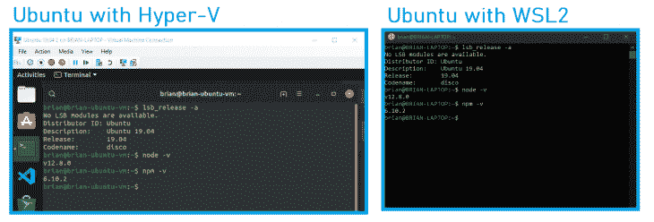
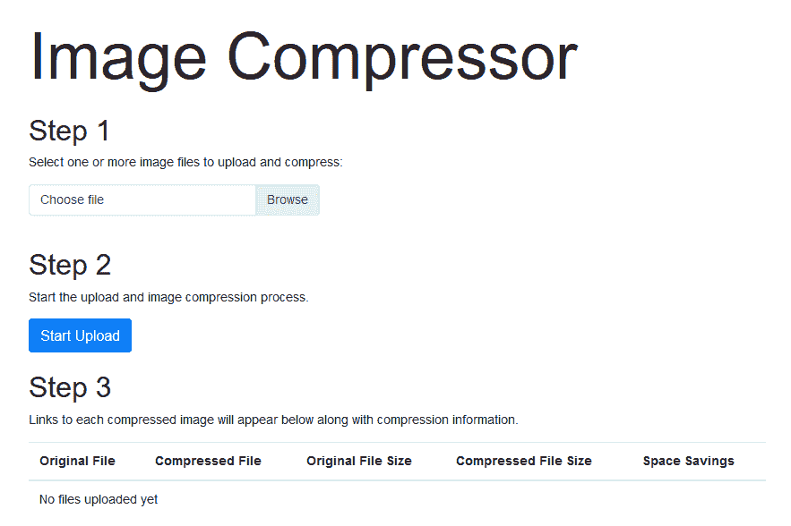
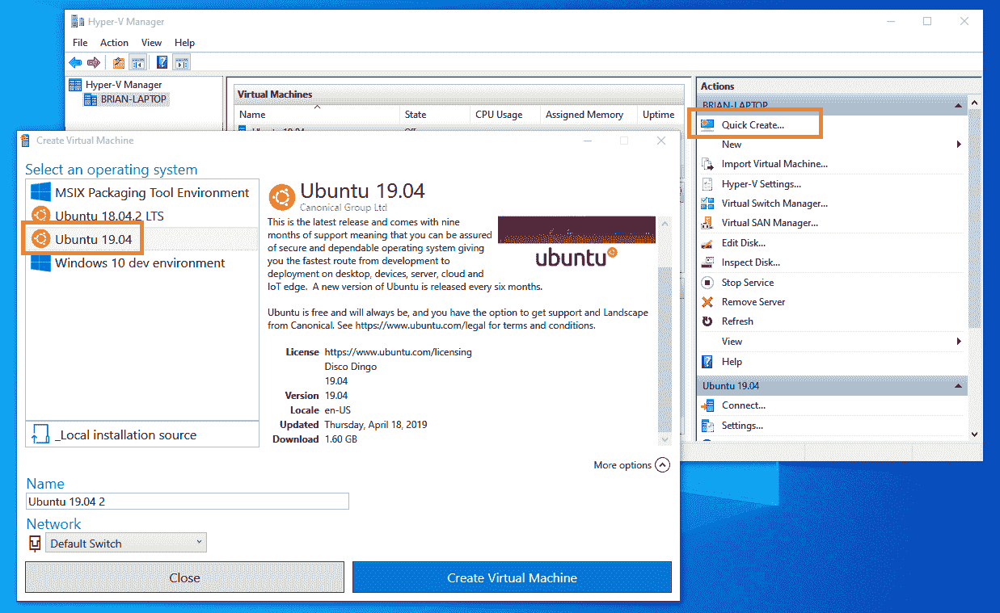
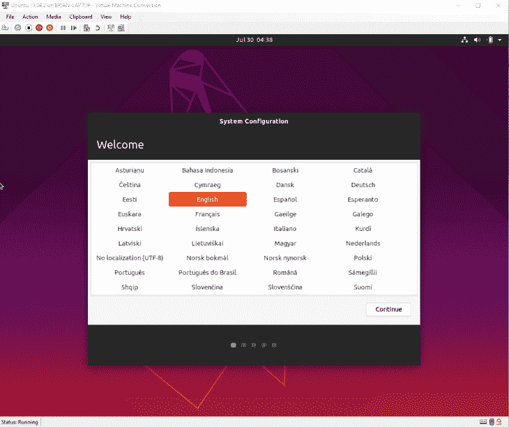
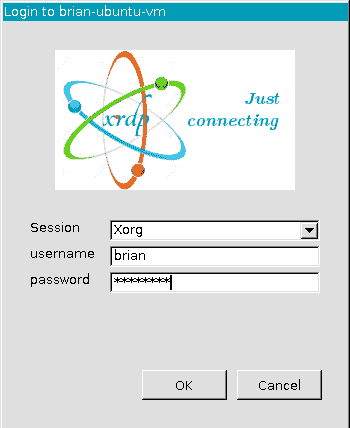
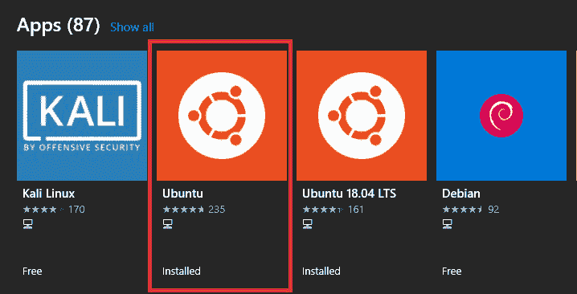

# 在 Hyper-V 和 WSL2 - LogRocket 博客上使用 Node.js

> 原文：<https://blog.logrocket.com/working-with-node-js-on-hyper-v-and-wsl2/>

Node.js 的一个主要好处是它提供了多平台支持。无论您运行的是 Mac、Linux 还是 Windows，体验几乎是无缝的。

但是，每个平台之间可能会有细微的差异，尤其是在开发与底层操作系统密切交互的 Node.js 应用程序时。

那么，您如何确保您在 Windows 工作站上编码、运行和测试的内容在您的主机 Linux 服务器上以相同的方式运行呢？

在本文中，我们将为那些希望在 Linux 上运行和测试 Node.js 应用程序的 Windows 开发人员提供两种选择:Hyper-V 虚拟机和 Windows Subsystem for Linux 2 (WSL2)。

我们将通过 Node 12 在两个系统中运行来设置 Ubuntu 19 的实例，比较两者之间的差异，并最终确定哪个系统最适合处理每个场景。



示例应用程序

## 为了彻底测试开发人员的体验，我们将使用预构建的**图像压缩器**示例应用程序。

这是一个简单的 Node.js web 应用程序，它接受一个或多个图像文件上传，压缩图像，并允许用户下载压缩的图像。



Image Compressor 与底层操作系统的文件系统交互，需要一些处理能力来执行图像压缩。

该应用程序还显示在服务器上压缩图像需要多长时间，这将允许我们在 Hyper-V 和 WSL2 之间进行基本的性能比较。

图像压缩程序可以从 GitHub 上的[briandesousa/Image-Compressor](https://github.com/briandesousa/image-compressor)库下载。只需简单的`npm install & npm start`就可以安装启动 app。运行后，您可以在访问该应用

*提示:最近构建的 WSL2 支持使用 `localhost` 来访问运行在 WSL2 中的服务器。我发现这种能力并不稳定。*

*最初 ， 示例应用程序可以在[http://localhost:3000](http://localhost:3000)， 访问，但是过了一段时间后，我就再也无法连接到它了。*

使用 `net stop LxssManager` 和 `net start LxssManager` 重新启动 WSL2 子系统似乎可以瞬间 解决 问题。

Hyper-V 上的 Ubuntu

## 我们将从在 Windows Hyper-V 虚拟机上运行的 Ubuntu 19 上设置 Node 12 服务器开始。为此，您的系统需要满足一些要求:

您的系统必须运行 Windows 10 专业版或更高版本。家庭版不支持 Hyper-V

*   你的系统必须满足微软设定的硬件要求
*   您必须[在您的系统上启用 Hyper-V](https://docs.microsoft.com/en-us/virtualization/hyper-v-on-windows/quick-start/enable-hyper-v)
*   在我们开始之前，让我们花点时间了解一下微软在过去几年里是如何拥抱 Linux 的。我们将使用 Hyper-V 管理器中的**快速创建**功能，以最简单的方式建立一个 Ubuntu 19 虚拟机。

稍后你会看到在 WSL2 中运行 Ubuntu 系统是多么容易。很难相信现在在 Windows 中运行 Linux 是多么简单。

要开始，首先从“开始”菜单启动 Hyper-V 管理器。点击右上角的**快速创建**选项，然后选择 Ubuntu 19 操作系统选项。



Hyper-V 管理器将下载一个 Ubuntu 映像并设置虚拟机。该过程完成后，您将看到一个窗口，您可以使用该窗口编辑虚拟机的设置。

默认情况下，Hyper-V 在分配适当的 CPU、RAM、硬盘空间和其他硬件资源方面做得不错。但是，如果您对调整设置感兴趣，您可以在此时或以后这样做。

首先点击**连接**，然后**启动**启动虚拟机。新的 Ubuntu 系统将会打开一个虚拟机连接窗口。

Ubuntu 启动后，通过系统配置向导来设置系统参数，如语言、时区、机器名、用户名和密码。



系统配置完成后，Ubuntu 需要重启。重新启动后，Hyper-V 管理器将提示您重新连接到虚拟机。

这一次，系统会提示您输入在前面步骤中指定的用户名和密码。



运行示例应用程序

## 从现在开始，我们将使用命令行来更新系统、安装必要的软件、下载和运行示例应用程序。从应用程序菜单启动命令窗口，并完成以下任务:

确保安装了所有 Ubuntu 系统更新:

*   使用 snap 安装最新稳定版本的 Node.js 12:

```
sudo apt update
sudo apt upgrade
```

*   `sudo snap install node --channel=12/stable --classic`

*提示:如果 snap install 因“操作太早，设备尚未播种或设备型号未被确认**，**”而失败，请尝试使用* `sudo apt purg snapd & sudo apt install snapd` 重新安装 snap。

在启动应用程序之前，记下虚拟机的 IP 地址。您将需要它来直接从 Windows 中访问 web 应用程序。使用`ip addr | grep eth0`快速定位 IP 地址。

```
git clone https://github.com/briandesousa/image-compressor.git ~/image-compressor
cd ~/image-compressor
npm install
```

*   用`npm run debug`在调试模式下启动 app。您将在控制台中看到一条消息，指示应用程序正在侦听端口 3000。
*   此时，您可以切换回 Windows，启动您最喜欢的浏览器，并使用虚拟机的 IP 地址访问`[http://<ip&gt](http://<ip&gt);:3000`。你能看到图像压缩程序吗？

启动并运行 Hyper-V 虚拟机非常快速和简单。这个过程中最耗时的部分是等待 Hyper-V 管理器下载并安装 Ubuntu 操作系统。

根据你的互联网连接速度和硬件，你可能会发现 WLS2 上的 Ubuntu 安装速度要快得多。

用于 Linux 2 的 Windows 子系统上的 Ubuntu

## WSL2 被认为是针对 Linux 的原始 Windows 子系统的全面改进。目前，WSL2 只对从 [build 18917 开始的 Windows 内部人员开放。](https://www.bleepingcomputer.com/news/microsoft/windows-subsystem-for-linux-2-wsl-2-released-to-insiders/)

它现在使用完整的 Linux 内核，以及虚拟化技术。这意味着它与 Hyper-V 有相似的系统需求。

在使用 WSL2 之前，您需要启用一些可选的特性。以管理员身份打开 powershell 命令窗口，并运行以下命令:

默认情况下，启用 WSL 的原始版本。我们希望将 WSL2 作为默认设置，这样我们安装的任何 Linux 发行版都可以在 WSL2 下运行。在同一个 powershell 命令窗口中，运行以下命令:

```
Enable-WindowsOptionalFeature -Online -FeatureName VirtualMachinePlatform
Enable-WindowsOptionalFeature -Online -FeatureName Microsoft-Windows-Subsystem-Linux
```

*提示:关于如何设置 WSL2 的深入指导可以在[这里](https://docs.microsoft.com/en-us/windows/wsl/wsl2-install)找到。*

```
wsl --set-default-version 2
```

现在 WSL2 已经设置好了，我们将从微软商店安装 Ubuntu 发行版。从“开始”菜单启动商店应用程序，然后在“Linux”上搜索

您将在搜索结果中找到一些 Linux 发行版。我们将要安装的这个简单地命名为 *Ubuntu* 。



从 Microsoft Store 安装 Ubuntu 应用程序后，返回 powershell 窗口并运行此命令以确认 Ubuntu 已安装并在 WSL2 下运行:

从开始菜单打开 Ubuntu 应用程序。一个连接到新的 Ubuntu WSL2 系统的 Ubuntu 命令窗口将会打开。在开始使用之前，系统会提示您创建用户名和密码。

```
> wsl -l -v
      NAME            STATE           VERSION
      Ubuntu          Running         2
```

在 WSL2 上升级 Ubuntu

## 你有没有注意到我们从微软商店安装的 Ubuntu 应用没有指定版本号？这是故意的。

Ubuntu 应用程序的通用版本将始终安装最新的 Ubuntu LTS 版本。用户仍然可以使用商店中其他版本的 Ubuntu 应用程序直接安装以前版本的 Ubuntu，这些应用程序的名称中包含明确的 Ubuntu 版本号。

但是等等——我们有一个小问题。我们的 Hyper-V 虚拟机运行的是最新最棒的 Ubuntu 19“Disco Dingo”，但 WSL2 Ubuntu 应用安装的是 Ubuntu 18“仿生海狸”。

您可以通过在 Ubuntu 命令窗口运行`lsb_release -a`并观察输出来确认这一点:

我们想把苹果比作苹果，所以我们应该升级到 Ubuntu 19 来匹配我们的 Hyper-V 虚拟机。幸运的是，升级过程相当简单。

```
No LSB modules are available.
Distributor ID: Ubuntu
Description:    Ubuntu 18.04.3 LTS
Release:        18.04
Codename:       bionic
```

首先，我们需要将`/etc/update-manager/release-upgrades`中的`Prompt`设置从`lts`改为`normal`。您可以使用自己选择的命令行编辑器编辑该文件。我更喜欢用`nano`:

接下来，运行以下命令升级到 Ubuntu 的最新普通版本:

```
sudo nano /etc/update-manager/release-upgrades
```

升级需要一些时间才能完成。在升级过程中，可能会提示您解决以前修改过的文件的冲突。

```
sudo do-release-upgrade
```

您需要决定是否接受即将到来的更改。根据我的经验，用引入的更改替换修改过的文件是安全的。

一旦升级完成，你可以使用`lsb_release -a`来检查 Ubuntu 版本，以确认你现在运行的是 Ubuntu 19。

运行示例应用程序

## 从现在开始，您会注意到设置说明与我们在 Hyper-V 虚拟机上设置示例应用的方式非常相似，但有一些注意事项。

在 Ubuntu 命令窗口中，完成以下步骤:

确保安装了所有的 Ubuntu 系统更新。

*   使用`apt`工具安装 Node.js。在我们的 Hyper-V 虚拟机上，我们使用了`snap`。然而，`snap`在 WSL2 中默认不工作。

```
sudo apt update
sudo apt upgrade
```

*   也许有可能让[让`snap`在 WSL2 上工作](https://discourse.ubuntu.com/t/using-snapd-in-wsl2/12113)，但是这超出了本文的范围。

如果用`node -v`检查 Node.js 的安装版本，会注意到安装了一个较老的版本，比如 v8.10.0。默认情况下，Ubuntu 软件包仓库包含一个相当旧的 Node.js 版本，但是我们可以从不同的软件包仓库安装一个较新的版本。

```
sudo apt install nodejs
```

*   最简单的方法是下载并运行 NodeSource.com 提供的一个方便的脚本，然后重新安装 Node.js。为了下载脚本，我们需要先安装`curl`。

确认 Node.js 12 安装了`node -v`

```
sudo apt install curl
curl -sL https://deb.nodesource.com/setup_12.x | sudo -E bash -
sudo apt install nodejs
```

*   下载、安装并运行图像压缩器示例应用程序:
*   记下您的 Ubuntu 系统的 IP 地址，以便您可以从主机浏览器访问示例应用程序。使用`ip addr | grep eth0`快速定位 IP 地址。

```
git clone https://github.com/briandesousa/image-compressor.git ~/image-compressor
cd ~/image-compressor
npm install
```

*   用`npm run debug`在调试模式下启动 app。您将在控制台中看到一条消息，指示应用程序正在侦听端口 3000。
*   此时你可以切换回 Windows，启动你最喜欢的浏览器，用 Ubuntu 系统 IP 地址访问`http:/<ip>/:3000`。你能再次看见图像压缩器应用程序吗？

将 Hyper-V 与 WSL2 进行比较

## 在 Hyper-V 虚拟机中运行 Ubuntu Linux 与在 WSL2 中运行操作系统的最大区别在于能够在 Hyper-V 中访问 Ubuntu 用户界面。

用户界面允许您安装和使用不仅仅是命令行工具。

根据您系统的硬件性能，您可能会发现 WSL2 是更快的选择。为了加快在 Hyper-V 上运行 Ubuntu Linux 的过程，您可以设置对虚拟机的 SSH 访问。

这加快了命令行访问的速度。然而，WSL2 可能仍然占上风，因为它不需要 SSH 来实现访问。

连续部署设置

## 如果您打算在 Windows 中开发并在 Linux 中运行您的应用程序，您可能希望设置一个连续部署模式，在该模式中，您将代码从 Windows 推送到远程 Git repo，并自动在您的 Linux 系统上提取和部署这些更改。

这种模式可以用 WSL2 实现，但是 Hyper-V 虚拟机更适合，原因如下:

虚拟机可以在没有活动连接的情况下在后台运行。只要虚拟机启动，进程就可以保持运行，而 WSL2 要求命令窗口保持打开以保持进程运行。

*   虚拟机状态在主机系统重新启动后保持不变。您的流程可以继续运行，您可以从中断的地方继续开发，而不必重新启动 WSL2 命令窗口和重新启动您的流程。
*   差异汇总

## 让我们从 Node.js 开发者的角度总结一下 Hyper-V 虚拟机和 WSL2 的区别:

**比较点**

| **Hyper-V 上的 Linux** | **wsl 2 上的 Linux** | 有一个图形用户界面 |
| --- | --- | --- |
| 是 | 不 | 有命令行界面 |
| 是的，在 GUI 中或通过 SSH 启动命令窗口 | 是 | 最新版本的 Ubuntu 开箱即用 |
| 是的，Hyper-V 管理器快速创建有最新的 Ubuntu 版本 | 不，Ubuntu 应用程序安装最新的 LTS 版本，但可以升级 | 安装开发人员软件的方法 |
| `apt`、`snap`，快照存储(GUI) | `apt` | 易于安装最新版本的 Node.js |
| 简单，使用`snap` | 不那么容易，需要从备用软件包库中安装`apt` | Node.js 服务器可以从主机操作系统访问 |
| 是，通过动态 IP 地址 | 是，通过动态 IP 地址或`localhost` | 可以在后台运行 Node.js 服务器 |
| 是的，虚拟机继续在后台运行，甚至在主机系统重启后也是如此 | 可以，但是你需要打开 Ubuntu WSL2 命令窗口 | 比较性能 |

## WSL2 中最受推崇的改进之一是性能——特别是文件系统性能。

那么，与 Hyper-V 虚拟机相比，WSL2 中的文件系统性能如何呢？

嗯，我们可以使用我们的图像压缩器示例应用程序得到一个大致的概念，它执行一些内存中的压缩操作，然后将压缩的图像写入磁盘。

为了比较两个系统之间的性能，我在每个系统上将 50MB 的图像文件上传到 Image Compressor，并观察应用程序用多长时间来响应图像的压缩版本。

以下是每个系统的平均时间:

Hyper-V 平均时间:62 秒

WSL2 平均时间:59 秒

在这个基本的性能测试中，WSL2 始终以大约 5%的速度领先。

我应该用什么？

## 您对在一个或多个 Linux 环境中运行和测试您的应用更感兴趣吗？ WSL2 可能是最好的选择，因为您可以安装一些不同的发行版。WSL2 实例是相当轻量级的，这意味着如果需要，您甚至可以同时运行几个实例。

**您是否希望直接在 Linux 操作系统中开发、测试和运行您的应用？** Hyper-V 可能是一个不错的选择，因为您可以使用 GUI shell 运行完整的 Linux 操作系统，安装所有开发工具(GUI 或 CLI ),并根据需要向虚拟机分配任意多或少的系统资源。

你需要在不受 WSL2 支持的 Linux 发行版上运行和测试你的应用吗？
WSL2 目前支持 Ubuntu、SUSE Linux Enterprise Server、Debian、Kali。如果你想运行一个不同的发行版，你可能会想要使用 Hyper-V，它支持更广泛的 Linux 发行版。

Hyper-V 虚拟机和 Linux 的 Windows 子系统对于开发人员来说都是非常强大的工具。虽然 Hyper-V 虚拟机总会有一席之地，但 Windows 子系统 for Linux 的发展速度尤其令人感兴趣。

使用 Windows 和 Linux 系统的 Node.js 开发人员应该关注 WSL 并注意它的潜力。

200 只显示器出现故障，生产中网络请求缓慢

## 部署基于节点的 web 应用程序或网站是容易的部分。确保您的节点实例继续为您的应用程序提供资源是事情变得更加困难的地方。如果您对确保对后端或第三方服务的请求成功感兴趣，

.

[try LogRocket](https://lp.logrocket.com/blg/node-signup)

LogRocket 就像是网络和移动应用程序的 DVR，记录下用户与你的应用程序交互时发生的一切。您可以汇总并报告有问题的网络请求，以快速了解根本原因，而不是猜测问题发生的原因。

[](https://lp.logrocket.com/blg/node-signup)[https://logrocket.com/signup/](https://lp.logrocket.com/blg/node-signup)

LogRocket 检测您的应用程序以记录基线性能计时，如页面加载时间、到达第一个字节的时间、慢速网络请求，还记录 Redux、NgRx 和 Vuex 操作/状态。

.

[Start monitoring for free](https://lp.logrocket.com/blg/node-signup)

.