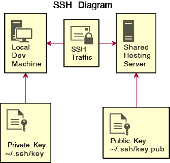
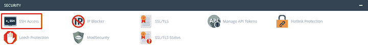
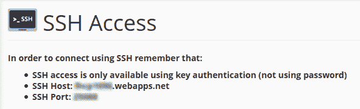
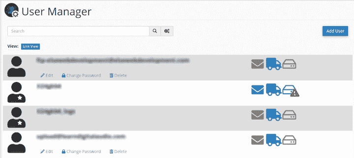
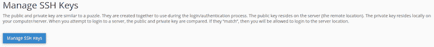
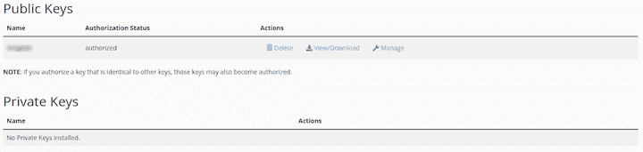
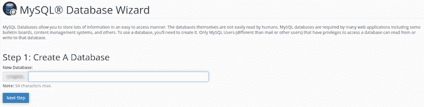
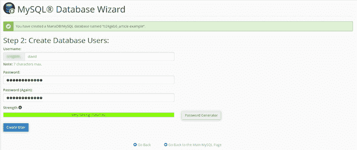
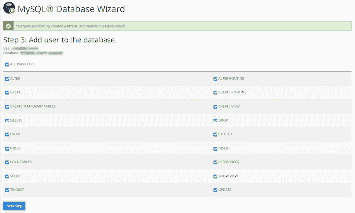

# WP-CLI 教程:如何部署 WordPress - LogRocket 博客

> 原文：<https://blog.logrocket.com/wp-cli-tutorial-how-to-deploy-wordpress/>

WordPress 是目前世界上最受欢迎的内容管理系统，有 39%的网站在使用它。对于想要管理自己内容的客户来说，这是一个很好的解决方案。作为开发人员，您负责安装和设置。

像 [Softaculous](https://www.softaculous.com/) 脚本这样的工具使基本安装变得更加容易，但是仍然有许多繁琐的安装后工作在命令行上要快得多。在命令行上输入的任何内容都可以转换成脚本，因此您可以自动化您所做的一切。一旦你学会了基础知识，你就能节省很多时间，尤其是当你需要定期安装和设置 WordPress 的时候。

在本教程中，我们将解释如何使用 WP-CLI 在远程共享服务器上安装和设置 WordPress。它主要面向对 Linux 和服务器了解有限的前端开发人员。

我们将详细介绍以下内容:

要跟进，您需要:

*   具有 SSH 访问权限以及用户帐户和密码的服务器—不需要 root 访问权限
*   在本地计算机上安装安全的 shell 软件。这允许您安全地登录并在服务器上执行命令
*   cPanel 是一个不错的选择

## 什么是 WP-CLI？

WP-CLI 是 WordPress 的官方命令行界面。它使你能够执行无数的 WordPress 开发任务，比如更新插件，配置多站点安装，等等。，无需使用 web 浏览器。

WP-CLI 的主要好处是节省您的时间，因为它使您无需离开命令行就可以执行只需要几行代码的简单任务。这有助于提高你的效率，因为你可以从 WordPress 管理面板访问许多功能，而不需要登录网站。

WP-CLI 手册包括参考指南、教程和开始使用该工具所需的一切。

## 什么是宋承宪？

SSH 使用加密来允许您登录到远程服务器并安全地运行命令。仅使用密码登录是可能的，但是最佳实践是使用公钥和私钥。私钥存储在您的计算机上，公钥仅存储在服务器上:




一旦设置完成，您就可以通过您的终端访问服务器，就好像它是您自己的本地机器一样。

## 什么是 OpenSSH？

[OpenSSH](https://www.openssh.com/) 是 SSH 协议的开源实现，随大多数 Linux 发行版、macOS 和 [Windows 10](https://docs.microsoft.com/en-us/windows-server/administration/openssh/openssh_overview) 一起提供。

要检查您的本地计算机上是否安装了 OpenSSH，请键入`ssh-V`。您应该会得到类似于以下内容的结果:

```
OpenSSH_8.0p1, OpenSSL 1.1.1c FIPS  28 May 2019

```

这个版本似乎很旧，但已经更新了安全端口。

## 使用 SSH 登录您的服务器

要使用 SSH，您需要从/关于服务器获取以下信息:

*   `HostName` —用于在网络上识别服务器的名称
*   `User` —您在服务器上的用户名
*   `Port` —服务器上与通信协议类型(本例中为 SSH)相关联的地址
*   `IdentityFile` —与服务器上的公钥相匹配的私钥

为了简单起见，我们假设服务器有我们将要使用的公钥和私钥。通常，它们都是在本地计算机上创建的，而公共计算机则被上传到服务器。

我们将使用流行的 [cPanel GUI](https://cpanel.net/) 来定位我们需要的信息。如果你没有 cPanel，你需要联系你的主机提供商以获得所需的信息。我建议您发送以下内容作为支持票:

> 我想使用 SSH 登录到我的服务器，并需要以下信息:`HostName`、`User`、`Port`、`IdentityFile`(带有从哪里下载公钥和私钥的信息)。谢了。

#### 1.发现`HostName`和`Port`

在 cPanel 中，您需要的信息在`security > ssh`下面:



`HostName`显示为`SSH Host`,`Port`显示为`SSH Port`:



#### 2.发现`User`

这是您在服务器上的用户名。导航至`preferences > user manager`:


在`user manager`中，你会看到所有的用户，可能包括由你的托管公司设置的看起来奇怪的用户，这些用户似乎没有任何用途。希望很明显哪个用户是你——复制并粘贴到某个安全的地方。



#### 3.寻找`IdentityFile`

`security > ssh`



按下`manage SSH keys`按钮，你会看到一个页面，包括所有当前可用的公钥和私钥。下载公钥和私钥，并将它们复制到您的`~/.ssh`目录中。

在下图中，没有私钥；它已被删除，因为服务器上不再需要它。



如果您想生成并使用自己的密钥，请查看这个[指南来设置 SSH 密钥](https://www.freecodecamp.org/news/the-ultimate-guide-to-ssh-setting-up-ssh-keys/)。

### 创建一个`config`文件

使用 SSH 登录到您的服务器的最快方法是在`~/.ssh`目录中创建一个名为`config`的文件。复制并粘贴此模板，并填写您自己的详细信息:

```
Host any-alias-you-like
    HostName xxxxxxxx.xxxxxxx.xxx
    User xxxxxxxx
    Port xxxxx
    IdentityFile ~/.ssh/private-key-file

```

现在，您可以随时登录:

```
ssh any-alias-you-like

```

## 如何在您的服务器上安装 WP-CLI

按照以下步骤在您的服务器上安装 WP-CLI。

### Linux 文件系统概述

Linux 是一个多用户操作系统。你可能只是众多用户中的一员。系统管理员是拥有 root 权限的特殊用户。他们可以做任何他们想做的事。还有，文件系统的`root`是`/`，这是一个独立但又相关的概念。

典型的共享服务器文件系统如下图所示。因为您是以普通用户的身份登录的，所以唯一与您相关的区域是您的主目录。

```
/                       < type `cd /` to go to the root of file system
├── tmp
├── etc
├── run
├── root
├── dev
├── sys
├── proc
├── mnt
├── boot
├── var
├── home
│   ├── user1           < type `cd` to go to your home directory
│   │    └── www        < root directory of your webserver
│   │        └── blog   < subdirectory
│   └── user2           < other users you can't see unless you are the root user
├── usr
├── lost+found
├── srv
├── sbin -> usr/sbin
├── opt
├── media
├── lib64 -> usr/lib64
├── lib -> usr/lib
└── bin -> usr/bin

```

当您成功登录到您的服务器时，shell 命令提示符将变为`[[email protected]](/cdn-cgi/l/email-protection)`。假设您将使用共享服务器，并且没有 root 访问权限。

要转到您的主目录，请键入`cd`。您可以键入`ls`来查看内容，或者键入`ls -la`来查看隐藏的文件，并使用长列表格式。

### 在您的主目录中安装 WP-CLI 可执行文件

您需要一个我们有权使用的目录，它在您的 [`$PATH`](https://stackoverflow.com/questions/16560332/what-is-this-path-in-linux-and-how-to-modify-it) 中。要查看您的`$PATH`，请输入`echo $PATH`。每个位置由一个`:`隔开。它看起来一团糟，所以如果我们使用`tr`命令用新的行`\n`替换`:`，我们可以更清楚地看到结果:

```
echo $PATH | tr ':' '\n'

```

因为我们正在我们的主目录中寻找一个位置，所以我们可以使用`grep`来过滤结果:

```
echo $PATH | tr ':' '\n' | grep "home"

```

在新安装的 Centos 上，您会看到:

```
/home/user-name/.local/bin
/home/user-name/bin
/home/user-name/.local/bin
/home/user-name/bin

```

如果您看到多个条目，请不要担心；这只是意味着它们被某人或某个随机脚本添加了多次。如果你有`/home/username/bin`，那就用那个。如果没有，您需要自己创建它并将其添加到`$PATH`中。

执行以下命令，将 WP-CLI 安装到服务器上的`~/bin/`目录中:

```
curl -O https://raw.githubusercontent.com/wp-cli/builds/gh-pages/phar/wp-cli.phar # download
chmod +x wp-cli.phar # make executable
mv wp-cli.phar ~/bin/wp # move and rename

```

要测试它是否已安装并正常工作:

```
wp --info

```

您可以随时轻松更新到最新版本:

```
wp cli update
```

注意:如果 WP-CLI 命令需要帮助，请使用`wp [name of command] --help`。

## 安装 WordPress

要安装 WordPress，请遵循以下步骤。

### 选择安装 WordPress 的位置

每台服务器的设置方式都略有不同。一般来说，如果您在自己的主目录中，您应该会看到一个名为`www`的目录。那是你的网站所在的地方；它是你的网络服务器的根目录。如果您要在这里安装，该站点将位于根位置—例如，`[http://example.com/](http://example.com/)`。如果您希望站点出现在子目录中，您可以创建一个子目录并将其安装到:

```
cd www
mkdir blog
# Install into the blog directory

```

现在 WordPress 会出现在`[http://example.com/blog/](http://example.com/blog/)`

你也可以在你的主目录中看到带有类似`examplesite.com`的网站名称的目录。这就是你的主机是如何设置的。如果你不确定在哪里安装，考虑询问你的主机技术支持。

### 使用 cPanel MySQL 数据库向导创建数据库

WordPress 需要一个 MySQL 数据库来操作。您需要创建这个数据库，并添加一个可以访问它的用户。如果你没有 cPanel，你可能有 phpMyAdmin，可以使用它，或者让你的主机技术支持为你创建一个数据库。

在 cPanel 中，创建数据库很简单。只需跟随向导并给用户`ALL PRIVILEGES`。







如果你非常注重安全，你可能想在安装后[删除所有多余的特权](https://www.wpwhitesecurity.com/secure-mysql-database-privileges-wordpress/)。

### 为你选择的语言下载核心 WordPress 文件

第一步是`cd`进入你想要安装 WordPress 的目录，然后下载正确语言的最新 WordPress。在我们的例子中，我们使用`en_GB`:

```
cd www
wp core download --locale=en_GB

Downloading WordPress 5.5.3 (en_GB)...
md5 hash verified: 1c2c3d7bde057d99a869cd33331b2114
Success: WordPress downloaded.

# and look inside the directory with `ls`

[email protected] [~/www]$ ls

index.php    readme.html      wp-admin            wp-comments-post.php  wp-content   wp-includes        wp-load.php   wp-mail.php      wp-signup.php     xmlrpc.php
license.txt  wp-activate.php  wp-blog-header.php  wp-config-sample.php  wp-cron.php  wp-links-opml.php  wp-login.php  wp-settings.php  wp-trackback.php

```

### 通过添加数据库详细信息来设置`wp-config.php`

接下来，设置`wp-config.php`文件。我们将添加我们创建的数据库的详细信息:

```
wp config create --dbname=exampledb --dbuser=exampledbuser --dbpass='securepswd'

```

*   将密码放在单引号中，以防出现需要转义的字符
*   通常在共享服务器中，它会强制在您为数据库名称和密码选择的任何名称前面加上用户前缀，所以不要混淆，如果需要的话，使用`dbname`而不是`ti8jhjsdf_dbname`

### 安装 WordPress

这是最后阶段。在这里，我们添加所需的其他细节，包括:

```
--url=The address of the new site, start with https:// and end with /subdirectory if needed
--title=The title of the new site
--admin_user=The name of the admin user, don't pick 'admin' for security reasons
[--admin_password=] The password for the admin user. Defaults to randomly generated string.
--admin_email=The email address for the admin user

wp core install --url=https://example.com --title="My Site" --admin_user=exampleAdmin --admin_password=securepass [email protected]

```

现在您可以在`[https://example.com/wp-admin](https://example.com/wp-admin)`以管理员身份登录。

## WordPress 安装后设置

现在我们有了一个基本的 WordPress 安装，让我们定制它。

### 设置漂亮的网址

这对 SEO 有好处。这意味着 URL 将是你的文章名称，没有额外的内容，比如文章发表的日期。

`wp rewrite structure '/%postname%/' --hard`

### 删除不需要的插件

WP 附带了几个你可能不想要的插件。要删除它们:

`wp plugin delete akismet hello`

### 安装 WordPress 插件并激活它们

你将会有一个你想要的插件的大列表。将它们添加到此列表:

`wp plugin install antispam-bee --activate`

您可以通过以下方式列出您当前的插件:

`wp plugin list`

### 安装 WordPress 主题

要在 WordPress 中安装主题:

`wp theme install twentytwenty --activate`

`wp theme install ../my-theme.zip`

## WP-CLI 省时命令

WP-CLI 中的以下命令可以帮助您节省大量时间。

### 检查文件篡改

`wp plugin verify-checksums --all`

### 导出数据库进行备份

这可以作为备份脚本的一部分来自动备份您的整个 WP 网站:

`wp db export`

请记住在之后删除它，因为您不希望它出现在公共文件夹中。

当您在站点上裁剪图像时，这非常方便:

`wp media image-size`

## 结论

我希望您现在能够体会到使用 WP-CLI 优于 SSH 的巨大优势。如果您不熟悉命令行，这看起来似乎需要学习很多东西，但是一旦您了解了基础知识，您就拥有了开发人员的超能力！

WP-CLI 有许多命令，在本教程中我们只触及了皮毛。不要忘记看看 WP-CLI 手册来了解更多关于这个神奇软件的信息。

最初看起来可能不明显的一大优势是，所有这些命令都可以通过放在脚本中实现自动化。一旦你安装并建立了一个站点，你可以把所有的命令粘贴到一个脚本中，然后再按一个按钮就可以了。

例如，下面是我们在本文的脚本中使用的命令:

## 使用 [LogRocket](https://lp.logrocket.com/blg/signup) 消除传统错误报告的干扰

[](https://lp.logrocket.com/blg/signup)

[LogRocket](https://lp.logrocket.com/blg/signup) 是一个数字体验分析解决方案，它可以保护您免受数百个假阳性错误警报的影响，只针对几个真正重要的项目。LogRocket 会告诉您应用程序中实际影响用户的最具影响力的 bug 和 UX 问题。

然后，使用具有深层技术遥测的会话重放来确切地查看用户看到了什么以及是什么导致了问题，就像你在他们身后看一样。

LogRocket 自动聚合客户端错误、JS 异常、前端性能指标和用户交互。然后 LogRocket 使用机器学习来告诉你哪些问题正在影响大多数用户，并提供你需要修复它的上下文。

关注重要的 bug—[今天就试试 LogRocket】。](https://lp.logrocket.com/blg/signup-issue-free)

```
#!/bin/bash

wp core download --locale=en_GB
wp config create --dbname=exampledb --dbuser=exampledbuser --dbpass='securepswd'
wp core install --url=https://example.com --title="My Site" --admin_user=davidAdmin --admin_password=securepass [email protected]

wp rewrite structure '/%postname%/' --hard
wp plugin delete akismet hello
wp plugin install antispam-bee --activate

```