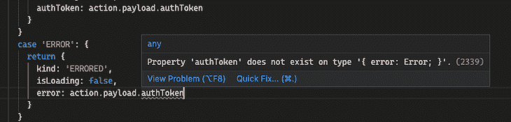
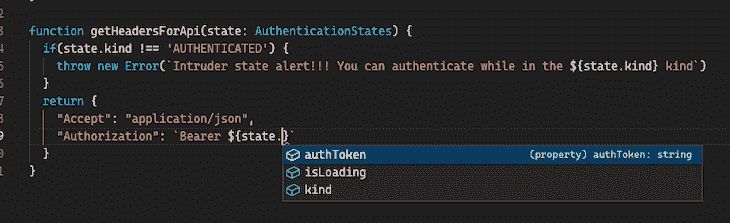
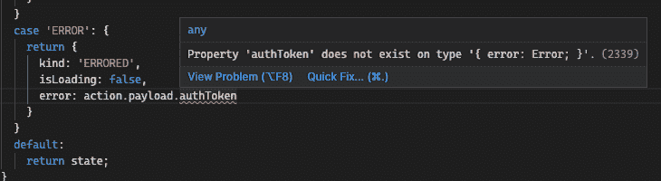

# 通过创建更好的 TypeScript 类型来编写更少的测试

> 原文：<https://blog.logrocket.com/write-fewer-tests-by-creating-better-typescript-types/>

您编写的每一行代码都包含了在应用程序的整个生命周期中进行维护的需求。代码行数越多，需要的维护就越多，随着应用程序适应不断发展的需求，需要更改的代码也就越多。

不幸的是，流行的观点认为我们需要更多的测试代码而不是应用程序代码。在这篇文章中，我将讨论为什么这个想法不太正确，以及我们如何改进我们的代码以避免写这么多测试。

首先，我们应该解决几个问题:

### 高级 TypeScript 不仅仅是条件类型或特定的语言功能

我看到一些在线课程宣称高级 TypeScript 只是从 TypeScript 特性的洗衣单中挑选一些复杂的特性，比如条件类型。

事实上，advanced TypeScript 使用编译器在我们的应用程序代码中寻找逻辑缺陷。高级类型脚本是使用类型来限制您的代码可以做什么的实践，并使用来自其他类型系统的可靠范例和实践。

### 类型驱动开发总是最好的方法

类型驱动开发是围绕类型编写您的类型脚本程序，并选择使类型检查器易于捕捉逻辑错误的类型。使用类型驱动开发，我们在自文档化和可执行的类型定义中对应用程序的状态转换进行建模。

非代码文档在编写的那一刻就过时了。如果文档是可执行的，我们别无选择，只能保持最新。测试和类型都是可执行文档的例子。

### 测试是好的；不可能的状态更好

我无耻地从理查德·费尔德曼的精彩演讲《让不可能的状态变得不可能》中剽窃了上面的标题。

在我看来，使用像 TypeScript 这样强大的类型系统的真正好处是用状态来表达应用程序逻辑，这些状态只根据运行应用程序的当前上下文来显示它们的字段和值。

在这篇文章中，我将使用一个身份验证工作流作为例子，说明我们如何编写更好的类型来避免编写如此多的测试。

*向前跳转:*

## 使用单接口方法的缺陷

当考虑身份验证时，它归结为系统是否知道当前用户。

下面的界面似乎没有争议，但是它隐藏了几个缺陷:

```
export interface AuthenticationStates {
  readonly isAuthenticated: boolean;
  authToken?: string;
}

```

如果我们将这个看似很小的接口引入到我们的代码中，我们将需要编写测试来验证许多分支`if`语句。我们还必须编写代码来检查给定用户是否经过身份验证。

该接口的一个大问题是，当`isAuthenticated`为`false`时，没有什么可以阻止我们将有效字符串赋给`authToken`字段。如果在处理一个已知用户时，`authToken`字段只对代码可用会怎样？

另一个小问题是使用`boolean`字段来区分州。我们之前说过，我们的类型应该是自文档化的，但是如果我们想要支持这一点，布尔是一个糟糕的选择。表示这种状态的更好方法是使用字符串联合:

```
export interface AuthenticationStates {
  readonly state: 'UNAUTHENTICATED' | 'AUTHENTICATED';
  authToken?: string;
}

```

我们的`AuthenticationStates`类型的最大问题是只有一个数据结构包含了我们所有的字段。如果在一轮测试之后，我们发现我们想要向用户报告系统错误，该怎么办？

使用单接口方法，我们最终得到了几个可选字段，它们创建了更多的分支逻辑，并增加了我们需要编写的单元测试的数量:

```
export interface AuthenticationStates {
  readonly state: 'UNAUTHENTICATED' | 'AUTHENTICATED';
  authToken?: string;
  error?: {
     code: number;
     message: string;
  }
}

```

## 使用代数数据类型和不可能的状态

下面重构的`AuthenticationStates`类型在函数式编程界被称为[代数数据类型(ADT)](https://codewords.recurse.com/issues/three/algebra-and-calculus-of-algebraic-data-types) :

```
export type AuthenticationStates =
  | {
      readonly kind: "UNAUTHORIZED";
    }
  | {
      readonly kind: "AUTHENTICATED";
      readonly authToken: string;
    }
  | {
      readonly kind: "ERRORED";
      readonly error: Error;
    };

```

一种代数类型(但不是唯一的)是[区别并](https://blog.logrocket.com/understanding-discriminated-union-intersection-types-typescript/)，上面的`AuthenticationStates`类型也是如此。

区别并集是一种模式，它向编译器指示一个类型可能具有的所有值。每个联合成员必须有相同的具有唯一值的基本字段(布尔型、字符串型、数字型)，称为鉴别器。

在上面的例子中，`kind`字段是鉴别符，其值为`"AUTHENTICATED"`、`"UNAUTHENTICATED"`或`"ERRORED"`。每个工会成员可以包含只与其特定的`kind`相关的字段。在我们的案例中，`authToken`与`AUTHENTICATED`之外的任何工会成员无关。

下面的代码通过使用`AuthenticationStates`类型作为`getHeadersForApi`函数的参数来进一步说明这个例子:

```
function getHeadersForApi(state: AuthenticationStates) {
  return {
    "Accept": "application/json",
    "Authorization": `Bearer ${state.??}`; // currently the type has no authToken
  }
}

```

假设我们的代码不包含任何逻辑来确定或缩小应用程序所处状态的`kind`。在这种情况下，即使我们在文本编辑器中键入代码，类型系统也会保护我们的安全，不会给我们一个`authToken`选项:



如果我们可以通过编程确定`state`只能属于`kind` `AUTHENTICATE`，那么我们就可以不受惩罚地访问`authToken`字段:



如果`state`不属于`kind` `AUTHENTICATED`，上面的代码会抛出一个错误。

## 确定联合成员是否是当前成员(也称为类型缩小)

抛出异常是告诉编译器哪个联合成员是当前成员的一种方式。向下钻取到单个联合成员也被称为[类型缩小](https://blog.logrocket.com/how-to-use-type-guards-typescript/)。当编译器知道其精确的鉴别器字段时，可鉴别联合上的类型缩小。一旦编译器知道分配了哪个鉴别器字段，该联合成员的其他属性就可用了。

以这种方式缩小类型并抛出异常就像在我们的代码中加入一个测试，而没有创建一个单独的测试文件的仪式。

```
type AuthenticationStates =
  | {
      readonly kind: "UNAUTHORIZED";
      readonly isLoading: true;
    }
  | {
      readonly kind: "AUTHENTICATED";
      readonly authToken: string;
      readonly isLoading: false;
    }
  | {
      readonly kind: "ERRORED";
      readonly error: Error;
      readonly isLoading: false;
    };

type AuthActions =
  | { 
      type: 'AUTHENTICATING';
    }
  | { 
      type: 'AUTHENTICATE',
      payload: {
        authToken: string
    }
  }
  | {
    type: 'ERROR';
    payload: {
      error: Error;
    }
  }

function reducer(state: AuthenticationStates, action: AuthActions): AuthenticationStates {
  switch(action.type) {
    case 'AUTHENTICATING': {
      return {
        kind: 'UNAUTHORISED',
        isLoading: true
      }
    }

    case 'AUTHENTICATE': {
      return {
        kind: 'AUTHENTICATED',
        isLoading: false,
        authToken: action.payload.authToken
      }
    }

    case 'ERROR': {
      return {
        kind: 'ERRORED',
        isLoading: false,
        error: action.payload.error
      }
    }
    default:
      return state;
  }
} 

```

通过有区别的联合，我们可以从文本编辑器和 IntelliSense 获得关于哪些字段当前可用的即时反馈。

下面的截图显示了一个愚蠢的开发人员(我)试图在`ERROR` case 语句中访问`authToken`。这根本不可能:



上述代码的另一个好处是,`isLoading`不是一个可能被错误赋值并引入错误的模糊布尔值。该值只能是处于`AUTHENTICATING`状态的`true`。如果这些字段只对当前的工会成员可用，则需要较少的测试代码。

## 使用`ts-pattern`代替 switch 语句

[Switch 语句](https://blog.logrocket.com/evaluating-alternatives-typescript-switch-case/)极其有限，并且存在可能导致错误和不良实践的风险。幸运的是，几个 npm 包可以帮助缩小有区别的联合的类型，而`[ts-pattern](https://github.com/gvergnaud/ts-pattern)` [库](https://github.com/gvergnaud/ts-pattern)是一个很好的选择。

让你用一个简洁的表达式表达复杂的条件，类似于函数式编程中的模式匹配。有一个 [tc-39 提案](https://github.com/tc39/proposal-pattern-matching)将模式匹配添加到 JavaScript 语言中，但它仍处于第一阶段。

安装`ts-pattern`之后，我们可以将代码重构为类似模式匹配的东西:

```
const reducer = (state: AuthenticationStates, action: AuthActions) =>
  match<AuthActions, AuthenticationStates>(action)
    .with({ type: "AUTHENTICATING" }, () => ({
      kind: "UNAUTHORISED",
      isLoading: true
    }))

    .with({ type: "AUTHENTICATE" }, ({ payload: { authToken } }) => ({
      kind: "AUTHENTICATED",
      isLoading: false,
      authToken
    }))

    .with({ type: "ERROR" }, ({ payload: { error } }) => ({
      kind: "ERRORED",
      isLoading: false,
      error
    }))
    .otherwise(() => state);

```

`match`函数接受一个可以用来测试模式的输入参数，每个`with`函数定义一个条件或模式来测试输入值。

## 解析，不验证:使用类型安全验证模式

我们都写过那些可怕的[表单验证函数](https://blog.logrocket.com/react-form-validation-sollutions-ultimate-roundup/)，它们像下面这样验证用户输入:

```
function validate(values: Form<User>): Result<User> {
  const errors = {};

  if (!values.password) {
    errors.password = 'Required';
  } else if (!/^(?=.*?[A-Z])(?=.*?[a-z])(?=.*?[0-9])(?=.*?[#[email protected]$%^&*-]).{8,}$/i.test(values.password)) {
    errors.password = 'Invalid password';
  }

  // etc.
  return errors;
};

```

这些`validate`函数需要大量的测试代码来覆盖所有不同的分支`if`语句，这些分支语句将不可避免地在函数体中成倍增长。

更好的方法是分析数据并创建一个类型安全的模式，该模式可以在运行时针对传入的数据执行。优秀的包 [Zod](https://github.com/colinhacks/zod) 为 TypeScript 带来了运行时语义，而没有复制现有的类型。

[Zod 允许我们定义模式](https://blog.logrocket.com/schema-validation-typescript-zod/),这些模式定义了我们期望接收数据的形状，并且能够从模式中提取类型脚本类型。我们避免了过多的`if`语句以及用这种方法编写许多测试的需要。

下面是一个简单的`UserSchema`定义了四个字段。代码调用`z.infer`从模式中提取`User`类型，这令人印象深刻，并节省了大量重复输入。

```
export const UserSchema = z.object({
  uuid: z.string().uuid(),
  email: z.string().email(),
  password: z.string().regex(/^(?=.*?[A-Z])(?=.*?[a-z])(?=.*?[0-9])(?=.*?[#[email protected]$%^&*-]).{8,}$/),
  age: z.number().optional()
});

export type User = z.infer<typeof UserSchema>;
/* returns
type User = {
  uuid: string;
  email: string;
  password: string;
  age?: number | undefined;
}
*/

```

当我们解析而不是验证时，我们分析数据，创建一个可以解析数据的模式，*和*我们免费获得类型。这段代码是自文档化的，在运行时有效，并且是类型安全的。

作为奖励，Zod 提供了许多开箱即用的验证。例如，`uuid`字段将只接受有效的`UUID`字符串，而`email`字段将只接受正确格式化为电子邮件的字符串。一个匹配应用程序密码规则的自定义正则表达式被提供给`regex`函数来验证`password`字段。所有这些都是在没有任何`if`语句或分支代码的情况下发生的。

## 结论:测试和类型并不相互排斥

在这篇文章中，我并不是说我们应该停止编写测试，把我们所有的注意力放在编写更好的类型上。

相反，我们可以使用类型检查功能来直接对照应用程序代码检查我们的逻辑——在这个过程中，我们可以编写少得多的单元测试代码，以利于编写更好的集成和端到端测试来测试整个系统。我说的更好，并不是指我们必须写更多的测试。

记住黄金法则:代码越多，问题就越多。

## [LogRocket](https://lp.logrocket.com/blg/typescript-signup) :全面了解您的网络和移动应用

[](https://lp.logrocket.com/blg/typescript-signup)

LogRocket 是一个前端应用程序监控解决方案，可以让您回放问题，就像问题发生在您自己的浏览器中一样。LogRocket 不需要猜测错误发生的原因，也不需要向用户询问截图和日志转储，而是让您重放会话以快速了解哪里出错了。它可以与任何应用程序完美配合，不管是什么框架，并且有插件可以记录来自 Redux、Vuex 和@ngrx/store 的额外上下文。

除了记录 Redux 操作和状态，LogRocket 还记录控制台日志、JavaScript 错误、堆栈跟踪、带有头+正文的网络请求/响应、浏览器元数据和自定义日志。它还使用 DOM 来记录页面上的 HTML 和 CSS，甚至为最复杂的单页面和移动应用程序重新创建像素级完美视频。

[Try it for free](https://lp.logrocket.com/blg/typescript-signup)

.