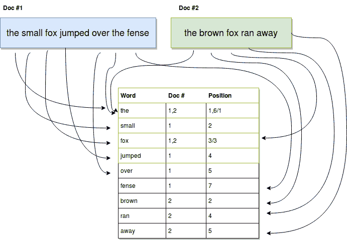

# 如何使用 Node.js 和 Elastic - LogRocket Blog 编写自己的搜索引擎

> 原文：<https://blog.logrocket.com/write-your-own-search-engine-using-node-js-and-elastic/>

许多人倾向于给谷歌的搜索算法(也称为[页面排名](https://en.wikipedia.org/wiki/PageRank))添加许多神秘色彩，因为它总是设法在前几页向我们展示我们正在寻找的结果(即使在有数百个结果页面的情况下)。

它是如何工作的？为什么这么准？这些问题没有真正的答案，当然，除非你是谷歌内部维护它的团队的一员。

我们不需要侵入谷歌的服务器，窃取他们的算法，就可以开发出一种非常强大的搜索功能，你可以轻松地将它集成到你的网站/网络应用中，同时获得出色的用户体验。

我实际上指的是通常所说的“全文搜索”。如果您来自传统的 web 开发世界，您可能习惯于使用 SQL 数据库，例如 [MySQL](https://www.mysql.com/) 或 [PostgreSQL](https://www.postgresql.org/) ，它们默认允许您在字符串字段中执行基于通配符的搜索，例如:

```
SELECT * FROM Cities WHERE name like 'new%';
```

使用上面的查询，您通常会得到匹配的结果，例如:

*   纽约
*   新德里
*   新奥尔良

您得到了模式，如果您的数据库中有更复杂的对象，比如带有标题和正文的博客文章，您可能还想对它们进行更“有趣”的搜索，比如:

```
SELECT * FROM BLOG_POSTS WHERE title like '%2019%' OR body like '%2019%';
```

现在上面的查询也会产生一些结果，但是这些结果的最佳顺序是什么呢？因为电话号码 *444220192* 在它的体内而匹配的博客帖子会在标题为*“2019 年最佳足球队”*的博客帖子之前被返回，这有意义吗？后一种匹配肯定更相关，但是简单的通配符匹配无法做到这一点。

正因为如此，在您的站点上添加全文搜索可能是一个很好的匹配(特别是如果您希望您的用户搜索非结构化的内容，例如 FAQ 或可下载的文档，等等)。

## 转到全文

这些是基本通配符搜索的用例。诚然，最常见的 SQL 数据库，如 MySQL 和 PostgreSQL，已经包含了某种形式的基本全文功能，但如果您想充分利用这种技术，您需要一个专用的搜索引擎，如 [Elastic](https://www.elastic.co/) 。

这些引擎的工作方式是通过创建所谓的“倒排索引”。在我们示例的上下文中，我们试图索引文本文档，它们从每个文档中提取每个单词，并记录它们出现在文档中的引用及其在文档中的位置。因此，不必在每个文档中搜索子串(就像上面的 SQL 示例一样)，只需要在单词列表中搜索子串，那些匹配的单词就已经知道它们在索引中出现的位置。



上图以非常简单的方式显示了如何构建倒排索引:

1.  索引上列出了每个单词
2.  对源文档的引用存储在每个单词上(允许对不同文档的多次引用)
3.  在每个文档中，我们还记录了单词的位置(第 3 列)

有了这些信息，我们可以简单地搜索索引，并匹配您的查询和索引中的单词之间的任何重合(我们甚至可以使用子字符串进行搜索，并仍然返回有效的结果)。

这仍然没有让我们得到我们所需要的，因为我们没有任何关于相关性的信息。标题上的匹配和正文上的匹配哪个更重要？完全匹配还是部分匹配？这些是我们的引擎在搜索时需要知道的规则，幸运的是，我们今天使用的引擎( [Elastic](https://www.elastic.co/) )会处理这些规则，甚至更多。

那么让我们看看这个基本的倒排索引，看看我们如何使用弹性来利用这一技术，好吗？

## 变得有弹性

安装和运行一个本地版本的 Elastic 真的非常简单，特别是如果你按照官方说明去做的话。

一旦启动并运行了它，您就可以使用它的 RESTful API 和手头的任何 HTTP 客户端与它进行交互(我将使用 [curl](https://curl.haxx.se/) ，默认情况下它应该安装在大多数常见的操作系统中)。

一旦设置好了，真正的工作就可以开始了，不要担心，我将带您完成本文中的以下所有步骤:

1.  你需要创建一个索引
2.  之后，您将为索引中的文档创建一个映射
3.  一旦一切都设置好了，你就可以索引文档了
4.  最终，搜索将成为可能

为了让事情更容易理解，让我们假设我们正在构建一个图书馆的 API，它将允许你搜索不同数字书籍的内容。

出于本文的目的，我们将保持最少的元数据，但是您可以根据您的特定用例添加所需的数量。这些书将从古腾堡项目下载，并首先被手工索引。

### 如何创建你的第一个索引

根据定义，Elastic 中的每个索引文档都需要插入到索引中，这样，如果您开始索引不同的和不相关的对象，就可以很容易地在您需要的范围内进行搜索。

如果方便的话，你可以把索引想象成一个容器，一旦你决定搜索某个东西，你需要选择一个容器。

要创建新的索引，只需运行以下命令:

```
$ curl -X PUT localhost:9200/books
```

通过这一行，您将您的请求发送到您的*本地主机*(当然，假设您正在进行本地测试)，并使用端口 9200，这是 Elastic 的默认端口。

路径“books”是正在创建的实际索引。命令的成功执行将返回类似以下内容:

```
{
  "acknowledged" : true,
  "shards_acknowledged" : true,
  "index" : "books"
}
```

现在，记住这条路，让我们进入下一步，创建一个地图。

### 如何为您的文档创建地图

这一步实际上是可选的，您可以在查询执行期间定义这些参数，但是我总是发现维护外部映射比绑定到代码的业务逻辑更容易。

您可以在这里设置如下内容:

*   我们的书名和正文可以做哪些**类型的匹配**(是完全匹配吗？我们使用全文还是基本匹配？等等)
*   每场比赛的重量。或者换句话说，标题中的匹配与正文中的匹配有多相关？

为了创建特定索引的映射，您必须使用 mappings 端点并发送描述新映射的 [JSON](https://blog.logrocket.com/the-quiet-revolution-how-json-displaced-xml-1e1f3e8552f7/) 。下面是一个遵循上述数字图书索引思想的示例:

```
{
  "properties": {
    "title": {
      "type": "text",
      "analyzer": "standard",
      "boost": 2
    },
    "body": {
      "type": "text",
      "analyzer": "english"
    }
  }   
}
```

这个映射定义了两个字段，标题和正文，标题需要用标准分析器进行分析，正文考虑到这些都是英语书，将使用英语语言分析器。我还增加了标题上的匹配，这使得它们中的任何一个都比书的正文上的匹配相关两倍。

为了在我们的索引上设置它，我们需要做的就是使用下面的请求:

```
$ curl -X PUT "localhost:9200/books?pretty" -H 'Content-Type: application/json' -d'
{ 
  "properties": {
    "title": {
      "type": "text",
      "analyzer": "standard",
      "boost": 2
    },
    "body": {
      "type": "text",
      "analyzer": "english"
    }
  }
}
'
```

成功的执行将产生如下结果:

```
{
  "acknowledged" : true
}
```

现在我们的索引和映射已经准备好了，我们要做的就是开始索引，然后执行搜索。

### 如何将内容索引成弹性的

尽管从技术上来说，我们不需要编码就可以做到这一点，但我将在 Node.js 中创建一个快速脚本来加速将书籍发送到 Elastic 的过程。

这个脚本很简单，它将从一个特定的目录中读取文件的内容，抓取第一行并将其作为标题，然后其他所有内容将作为正文的一部分进行索引。

下面是简单代码:

```
const fs = require("fs")
const request = require("request-promise-native")
const util = require("util")

let files = ["60052-0.txt", "60062-0.txt", "60063-0.txt", "pg60060.txt"]
const readFile = util.promisify(fs.readFile)

async function indexBook(fid, title, body) {
    let url = "http://localhost:9200/books/_doc/" + fid
    let payload = {
        url: url, 
        body: {
            title: title, 
            body: body.join("\n")
        },
        json: true
    }
    return request.put(payload)
}
( _ => {
    files.forEach( async f => {
        let book = await readFile("./books/" + f);
        [title, ...body] = book.toString().split("\n");
        try {
            let result = await indexBook(f, title, body);
            console.log("Indexing result: ", result);
        } catch (err) {
            console.log("ERROR: ", err)
        }
    })
})();
```

我所做的就是浏览我的数组中的图书列表，并将它们的内容发送给 Elastic。用来索引的方法是 PUT，路径是`your-host:your-port/index-name/_doc/a-doc-ID`。

*   我使用默认的主机和端口( *localhost* 和 *9200*
*   我的索引是我之前创建的:*书籍*
*   我使用的索引是文件名，我知道它对于每本书都是唯一的

这实质上留给我们一件事去做，查询我们的数据。

* * *

### 更多来自 LogRocket 的精彩文章:

* * *

### 如何在弹性中查询索引

为了查询索引，我们可以像目前为止一样使用 Elastic 的 REST API，或者我们可以继续使用 [Elastic 的官方 Node.js 库](https://www.npmjs.com/package/elasticsearch)。

为了展示一些不同的东西，我将向您展示如何使用 Elastic 的 NPM 模块执行搜索查询，如果您想开始使用它，请随时查看他们的文档。

一个快速的例子应该足以将我到目前为止所讨论的一切付诸实践，它将对索引文档执行全文搜索，并根据相关性(这是弹性使用的默认标准)返回一个排序的结果列表。

下面的代码就是这么做的，让我给你演示一下:

```
var elasticsearch = require('elasticsearch');
var client = new elasticsearch.Client({
  host: 'localhost:9200/books'
});

let q = process.argv[2];

( async query => {
    try {
        const response = await client.search({
            q: query
        });
        console.log("Results found:", response.hits.hits.length)
        response.hits.hits.forEach( h => {
            let {_source, ...params } = h;
            console.log("Result found in file: ", params._id, " with score: ", params._score)
        })
    } catch (error) {
        console.trace(error.message)
    }
})(q)
```

上面的代码将您在执行脚本时使用的第一个单词作为 CLI 参数，并将其用作查询的一部分。

如果您继续阅读，您应该能够下载并索引 Guterberng 项目中的一些书籍，并编辑其中两本。在其中一行中添加“testing”一词作为第一行的一部分，在另一行中添加相同的词，但在文本的中间。这样，您就可以根据我们设置的映射了解相关性是如何工作的。

对我来说，我得到的结果如下:

```
Results found: 2
    Result found in file:  60052-0.txt  with score:  2.365865
    Result found in file:  pg60060.txt  with score:  1.7539438
```

由于我使用文件名作为文档索引，我可以重用这段信息来显示相关的结果。

本质上，你现在可以下载任意多的书，并使用之前的代码对它们进行索引。你有自己的搜索引擎，能够快速搜索并返回相关的文件名供你打开。这里的速度是我之前提到的使用倒排索引的好处之一，因为它不需要每次都遍历每个文档的整个主体，它只会搜索您在内部索引中输入的单词，并返回它在索引过程中引用的列表。

由此得出的一个直接结论是，你可以有把握地说，索引一个文档比搜索要昂贵得多(从计算角度来说)。由于通常情况下，大多数搜索引擎花费大部分时间搜索而不是索引，这是一个完全好的权衡。

## 结论

这就是我对弹性的介绍，我希望你和我一样觉得有趣。就我个人而言，这个 NoSQL 数据库(它也是众所周知的)是我最喜欢的数据库之一，这要感谢你用很少的代码获得的强大功能。

通过对书籍进行分类并将这些信息保存为索引元数据的一部分，您可以轻松地扩展上面的代码。之后，您可以记录用户搜索的书籍类型，然后根据他们的偏好用不同的提升值调整单个映射(例如，一些用户喜欢科幻书籍，而另一些用户喜欢基于历史的书籍)。这会给你一个更接近谷歌的行为。想象力是极限！

请在评论中告诉我你过去是否使用过 Elastic，以及你使用过什么样的疯狂搜索引擎！

否则，*下一场见！*

## 200 只显示器出现故障，生产中网络请求缓慢

部署基于节点的 web 应用程序或网站是容易的部分。确保您的节点实例继续为您的应用程序提供资源是事情变得更加困难的地方。如果您对确保对后端或第三方服务的请求成功感兴趣，

[try LogRocket](https://lp.logrocket.com/blg/node-signup)

.

[](https://lp.logrocket.com/blg/node-signup)[https://logrocket.com/signup/](https://lp.logrocket.com/blg/node-signup)

LogRocket 就像是网络和移动应用程序的 DVR，记录下用户与你的应用程序交互时发生的一切。您可以汇总并报告有问题的网络请求，以快速了解根本原因，而不是猜测问题发生的原因。

LogRocket 检测您的应用程序以记录基线性能计时，如页面加载时间、到达第一个字节的时间、慢速网络请求，还记录 Redux、NgRx 和 Vuex 操作/状态。

[Start monitoring for free](https://lp.logrocket.com/blg/node-signup)

.