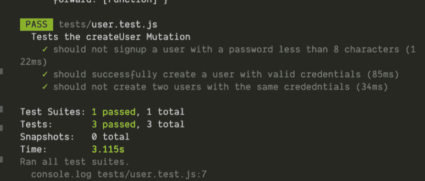
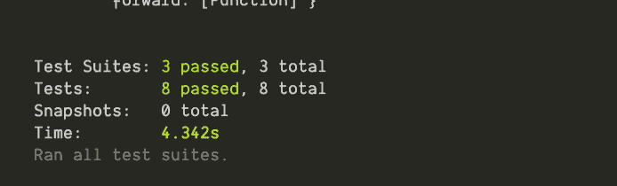

# 使用 Jest 为 GraphQL 服务器编写端到端测试

> 原文：<https://blog.logrocket.com/writing-end-to-end-tests-for-graphql-servers-using-jest/>

为应用程序编写端到端测试有助于确保应用程序按预期运行。当我们向现有应用程序添加新功能时，它也很方便，因为它确保新引入的功能与我们现有的功能很好地集成。

如果不是这样，我们的测试套件将会失败，这将促使我们对应用程序进行适当的修改，以确保测试成功。

为了让这篇文章易于理解，我创建了这个[样板项目](https://github.com/gbols/End-to-End-Test-With-Jest)，它公开了几个解析器，本质上是对`User`和`Todo`类型的 CRUD 操作。

设置项目后，我们可以执行一些查询和变化。

这些查询和变化会给我们一个项目如何工作的概述。

重要的是，我们要熟悉我们的 GraphQL 服务器所公开的解析器的期望——这是有效和正确测试的基础。

样板项目包括帮助我们理解项目基础的文档。

为了开始测试，我们需要一个单独的数据库。这有助于我们保持原始数据库的完整性。

我们将有一组不同的环境变量来运行测试，如
`~/config/test.env`所示

这些变量是在我们运行测试套件时从脚本标签中的`package.json`载入的:

```
"scripts": {
    "test": "env-cmd -f ./config/test.env",
     .....
  },
```

要开始编写测试，我们需要安装 Jest，这是一个帮助编写测试的库:

```
npm install --save-dev jest

// ~/Documents/ultimate-todo
mkdir tests
cd tests
```

我们将更新我们的`package.json`来运行我们的测试:

```
"scripts": {
    "test": "env-cmd -f ./config/test.env jest --runInBand",
     .....
  },
```

到目前为止，我们一直从默认情况下位于 [http://localhost:4000/](http://localhost:4000/) 的 GraphQL 客户端平台向我们的 GraphQL 服务器发出请求。然而，我们需要从代码中向服务器发出请求。

为此，我们需要安装`apollo-boost`。

我们还将安装 Babel register，因为 Jest 需要能够使用我们的服务器，它的代码是用 es6 编写的。巴别塔注册帮助 Jest 理解我们的代码。

```
npm install apollo-boost graphql cross-fetch @babel/register -D
```

我也更喜欢设置 Jest config 来启动，然后在运行所有测试套件后拆除服务器。

```
// ~/Documents/ultimate-todo/tests
mkdir config
cd config

//create both files 
touch globalSetup.js globalTeardown.js

//globalSetup.js
require('@babel/register');

const server = require('../../src/app').default;

module.exports = async () => {
  global.httpServer = server;
  await global.httpServer.listen();
};

//globalTeardown.js
module.exports = async () => {
  await global.httpServer.stop();
};
```

Jest 将在测试开始时使用文件`gbolbalSetup.js`，在测试结束时使用文件`gbolbalTeardown.js`。

我们现在要做的就是在我们的`package.json`中设置它，以便 Jest 可以在运行我们的测试套件时选择它们。

```
.....
 "jest": {
    "globalSetup": "./tests/config/globalSetup.js",
    "globalTeardown": "./tests/config/globalTeardown.js"
  },
....
```

现在我们已经完成了所有的设置，让我们编写一些测试。

```
// ~/Documents/ultimate-todo/tests
touch user.tests.js // file to contain tests for the user type.
```

我们将从编写`creatUser`突变的测试开始。

如果我们探索我们的突变的实现，我们可以清楚地看到有 3 种可能性。

1.  提供的密码少于 8 个字符。
2.  用户已成功创建。
3.  提供的电子邮件已被占用

我们将编写测试来解释所有这些结果。

```
// ~/Documents/ultimate-todo/tests/utils
import ApolloClient from 'apollo-boost';

export const client = new ApolloClient({
  uri: 'http://localhost:4000/',
  onError: (e) => { console.log(e) },
});

//~/Documents/ultimate-todo/tests/user.test/js
import 'cross-fetch/polyfill';
import ApolloClient, { gql } from 'apollo-boost';
import { prisma } from '../src/generated/prisma-client';
import { client } from './utils/getClient';

beforeAll(async () => {
  await prisma.deleteManyUsers()
})
describe('Tests the createUser Mutation', () => {
    it('should not signup a user with a password less than 8 characters', async () => {
          const createUser = gql`
            mutation {
              createUser(data: {
                name: "Gbolahan Olagunju",
                email: "[email protected]",
                password: "dafe",
              }){
                token
                user {
                  name
                  password
                  email
                  id
                }
              }
            }
            `;

    await expect(client.mutate({
      mutation: createUser
    })).rejects.toThrowError("password must be more than 8 characters");
  })
  it('should successfully create a user with valid credentials', async () => {
    const createUser = gql`
            mutation {
              createUser(data: {
                name: "Gbolahan Olagunju",
                email: "[email protected]",
                password: "dafeMania"
              }){
                token
                user {
                  id
                }
              }
            }
            `;

     const res = await client.mutate({
      mutation: createUser
    })
    const exists = await prisma.$exists.user({id : res.data.createUser.id});
    expect(exists).toBe(true);
  });

  it('should not create two users with the same crededntials', async () => {
    const createUser = gql`
            mutation {
              createUser(data: {
                name: "Gbolahan Olagunju",
                email: "[email protected]",
                password: "dafeMania"
              }){
                token
                user {
                  name
                  password
                  email
                  id
                }
              }
            }
            `;
    await expect(client.mutate({
      mutation: createUser
    })).rejects.toThrowError("A unique constraint would be violated on User. Details: Field name = email");
  });
});
```

上面的代码如预期的那样工作。



[运行 npm 测试获得的输出]

我们需要我们的测试行为一致，所以我们必须在所有测试运行之前清空我们的数据库。为此，我们将在测试开始时添加一个 beforeAll 块。

```
...
  onError: (e) => { console.log(e) },
});
beforeAll(async () => {
  await prisma.deleteManyUsers()
})
...
```

让我们继续为我们的`createTodo`、`updateTodo`和`deleteTodo`突变编写测试。

已经在 localhost 上与 playground 进行了交互，我们知道我们需要一个用户进行身份验证来执行这个操作。

因此，我们需要更新创建客户端的方式，以迎合经过身份验证的用户。当前代码创建了一个未经验证的用户。

让我们修改这个`Apolloclient`的实例来反映这个变化。

```
// ~/Documents/ultimate-todo/tests/utils
import ApolloClient from 'apollo-boost';

export const getClient = (token) => {
   return new ApolloClient({
    uri: 'http://localhost:4000/',
    request: (operation) => {
      if(token) {
        operation.setContext({
          headers: {
            "Authorization": `Bearer ${token}`
          }
        })
      }
    },
    onError: (e) => { console.log(e) },
  });
}
```

接下来，我们将编写测试来覆盖所有 TODO 类型的测试用例。

```
//~/Documents/ultimate-todo/tests/todo.test/js

import 'cross-fetch/polyfill';
import { gql } from 'apollo-boost';
import { prisma } from '../src/generated/prisma-client';
import { getClient } from './utils/getClient';
const client = getClient();
let  authenticatedClient;
let todoId;
beforeAll(async () => {
  await prisma.deleteManyUsers()
  await prisma.deleteManyTodoes();
  const createUser = gql`
            mutation {
              createUser(data: {
                name: "Gbolahan Olagunju",
                email: "[email protected]",
                password: "dafeMania"
              }){
                token
                user {
                  id
                }
              }
            }
            `;

     const authenticatedUser = await client.mutate({
      mutation: createUser
    });
    authenticatedClient = getClient(authenticatedUser.data.createUser.token);
});
describe('Tests that can be performed on the Todo Mutation', () => {
  it('should not allow an authenticated user create a TODO ', async () => {
      const createTodo = gql`
      mutation {
        createTodo(data: {
          title: "Buy Potatoes",
          body: "Buy yam from the supermarket for everyone to eat at 10pm"
        }){
          title
          body
          id
        }
      }
      `;
      await expect(client.mutate({
        mutation: createTodo
      })).rejects.toThrowError("Authentication required");
  });
  it('should create a todo for a authenticated user', async () => {
    const createTodo = gql`
    mutation {
      createTodo(data: {
        title: "Buy Potatoes",
        body: "Buy yam from the supermarket for everyone to eat at 10pm"
      }){
        title
        body
        id
      }
    }
    `;
    const todo = await authenticatedClient.mutate({
      mutation: createTodo
    });
    todoId = todo.data.createTodo.id
    const exists = await prisma.$exists.todo({id: todoId});
    expect(exists).toBe(true);
  });
  it('should update a TODO', async () => {
    const variables = {
      id: todoId
    }
    const updateTodo = gql`
    mutation($id: ID!){
      updateTodo(id: $id , data: {
        title: "Buy Ice Cream",
        body: "Buy Ice Cream from the store"
      }){
        title
        body
      }
    }
    `;
    const updatedTodo = await authenticatedClient.mutate({
      mutation: updateTodo, variables
    });
    expect(updatedTodo.data.updateTodo.title).toBe('Buy Ice Cream');
    expect(updatedTodo.data.updateTodo.body).toBe('Buy Ice Cream from the store');
  });
  it('should delete a TODO', async () => {
    const variables = {
      id: todoId
    }
    const deleteTodo = gql`
    mutation($id: ID!){
      deleteTodo(id: $id){
        title
        body
      }
    }
    `;
    const deletedTodo = await authenticatedClient.mutate({
      mutation: deleteTodo, variables
    });
    const exists = await prisma.$exists.todo({id : todoId});
    expect(exists).toBe(false);
  });
});
```

最后，我们将编写测试来覆盖我们对`TODO`类型和`USER`类型的查询。

为了实现这一点，我们将在数据库中植入我们可以断言的虚拟数据。

```
touch queries.test.js

    ////~/Documents/ultimate-todo/tests/queries.test/js

    import 'cross-fetch/polyfill';
    import { gql } from 'apollo-boost';
    import { prisma } from '../src/generated/prisma-client';
    import { getClient } from './utils/getClient';

    const client = getClient();
    beforeAll( async () => {
      await prisma.deleteManyUsers()
      const createUser = gql`
      mutation {
        createUser(data: {
          name: "Gbolahan Olagunju",
          email: "[email protected]",
          password: "dafeMania"
        }){
          token
          user {
            id
          }
        }
      }
      `;

      await client.mutate({
      mutation: createUser
      });
    });
    describe('the Queries that can be performed on TODO and USER type', () => {
      it('should be able to see author\'s profile without sensitive info being displayed', async () => {
        const userQuery = gql`
        query {
          users {
            id 
            name
          }
        }
        `;
        const { data } = await client.query({
          query: userQuery
        });
        expect(data.users.length).toBe(1);
        expect(data.users[0].name).toBe('Gbolahan Olagunju');
      });
    });
```



### 结论

这里，我们展示了如何使用 Apollo server 在 GraphQL 服务器上用 Jest 编写端到端测试的细节。

## 监控生产中失败和缓慢的 GraphQL 请求

虽然 GraphQL 有一些调试请求和响应的特性，但确保 GraphQL 可靠地为您的生产应用程序提供资源是一件比较困难的事情。如果您对确保对后端或第三方服务的网络请求成功感兴趣，

[try LogRocket](https://lp.logrocket.com/blg/graphql-signup)

.

[](https://lp.logrocket.com/blg/graphql-signup)[https://logrocket.com/signup/](https://lp.logrocket.com/blg/graphql-signup)

LogRocket 就像是网络和移动应用的 DVR，记录下你网站上发生的每一件事。您可以汇总并报告有问题的 GraphQL 请求，以快速了解根本原因，而不是猜测问题发生的原因。此外，您可以跟踪 Apollo 客户机状态并检查 GraphQL 查询的键值对。

LogRocket 检测您的应用程序以记录基线性能计时，如页面加载时间、到达第一个字节的时间、慢速网络请求，还记录 Redux、NgRx 和 Vuex 操作/状态。

[Start monitoring for free](https://lp.logrocket.com/blg/graphql-signup)

.

*   没有涵盖所有的测试案例，但是应该与已经存在的内容相似。
*   本文中的例子没有测试订阅。
*   写作时使用了大量的重复，以使文章易于理解。然而，在生产代码中，它很容易变得难以管理。