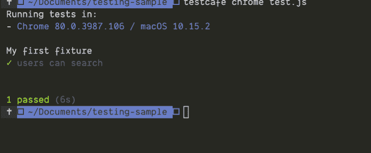
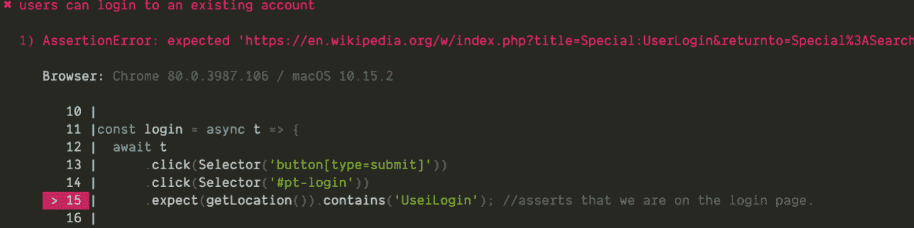

# 用 TestCafe - LogRocket 博客编写可重用的端到端测试

> 原文：<https://blog.logrocket.com/writing-reusable-end-to-end-tests-with-testcafe/>

端到端测试包括测试应用程序的流程。

这通常包括测试用户与应用程序交互的各种方式。

它有助于确定应用程序是否按预期工作。

由于开发前端应用程序的复杂性增加，端到端测试或 UI 测试在过去几年中得到了越来越多的采用，这伴随着不同的团队为相同的代码库做出贡献。

因此，有些失误可能不一定被预先建立的测试方法所涵盖，例如单元测试或集成测试，这就产生了端到端测试的需求。

在本文中，我们将使用 TestCafe 作为我们选择的工具。其他值得一提的框架还有 [cypress.io](https://www.cypress.io/) 、[夜魔](http://www.nightmarejs.org/)和[硒](https://selenium.dev/)。

## 如何运行测试用例

我们将通过查看以下内容来深入探讨 TestCafe:

*   构建测试的方法
*   编写可重用的函数
*   测试后进行清理
*   执行断言

首先，您需要在本地机器上安装 Node.js。

如果没有，这里有他们[官网](https://nodejs.org/en/)的链接。

一旦完成 Node.js 的安装，您还需要安装 TestCafe。

我将添加`-g`标志来全局安装它，这样我就不必为每个项目安装它。

下面是完成这项工作的命令:

```
npm install -g testcafe
```

我们将把 https://en.wikipedia.org/作为我们的首选网站。

让我们创建一个脚本来运行我们的测试写入:

```
mkdir testcafe-sample
cd testcafe-sample 
touch test.js
```

内部 Test.js:

```
import { Selector, ClientFunction } from 'testcafe';

const getLocation = ClientFunction(() => document.location.href);
```

```
fixture `My first fixture`
    .page `https://www.wikipedia.org/`;
    test('users can search', async t => {
      await t
      .click(Selector('#searchInput'))
      .typeText(Selector('#searchInput'), 'vikings')
      .click(Selector('button[type=submit]'))
      .expect(getLocation()).contains('en.wikipedia.org/wiki/Vikings');
    });
```

我们通过在终端中运行以下命令来运行它:

```
testcafe chrome test.js
```



我们通过传递给选择器函数的 CSS 选择器来选择页面上的内容。

我们也有`ClientFunction`让我们接触像`window.location`这样的本地 API。

我们已经测试了用户可以搜索。

我们还将测试用户是否可以登录现有帐户。

为了本文的目的，我创建了一个示例帐户。

下面是实现这一点的代码:

```
   test('users can login to an existing account', async t => {
      await t
      .click(Selector('button[type=submit]'))
      .click(Selector('#pt-login'))
      .expect(getLocation()).contains('UserLogin'); //asserts that we are on the login page.
      await t
      .click(Selector('#wpName1'))
      .typeText(Selector('#wpName1'), 'Johnny Dowe')
      .click(Selector('#wpPassword1'))
      .typeText(Selector('#wpPassword1'), '96#[email protected]_in8*wR')
      .click(Selector('button#wpLoginAttempt'))
      .expect(getLocation()).contains('search');
    });
```

模拟普通用户在使用我们的应用程序时会遵循的流程很重要，所以我们将把它提取到一个单独的函数中。

```
const login = t => {
await t
      .click(Selector('button[type=submit]'))
      .click(Selector('#pt-login'))
      .expect(getLocation()).contains('UserLogin'); //asserts that we are on the login page.
      await t
      .click(Selector('#wpName1'))
      .typeText(Selector('#wpName1'), 'Johnny Dowe')
      .click(Selector('#wpPassword1'))
      .typeText(Selector('#wpPassword1'), '96#[email protected]_in8*wR')
      .click(Selector('button#wpLoginAttempt'))
      .expect(getLocation()).contains('search');
}
```

类似地，我们可以有一个功能，帮助用户在我们的应用程序上执行一个操作后注销。

在这里，我们将使用维基百科作为参考。

流程:

登录为 65030 年的网址

* * *

### 更多来自 LogRocket 的精彩文章:

* * *

假设我们想为维基百科写一些代码——使用我们的可重用函数，伪代码看起来像这样:

```
test('users should be able to contribute', async t => {
      await login(t);
      /*
      some code to contribute to wikipedia
      */
      await logout(t);
    });
```

我们可以在行动中看到可重用性，每当我们想要执行一个动作时，我们都有一个流程。

我们将假设一些事情来运行这个例子。

首先，我们假设我们在桌面上运行应用程序。

我们可以通过调整窗口大小来模拟手机环境。

下面是可以做到这一点的示例代码:

```
fixture`some description`
  .page`some url`
  .beforeEach(async t => {
    await t.resizeWindow(375, 667);
  });
```

我使用了一个示例帐户，由于维基百科设置的安全措施，该帐户在运行几次测试套件后可能会被停用。

您可以创建自己的帐户，并使用新的详细信息运行脚本。

测试脚本可能会在你运行时失败，这是因为维基百科的网站布局方式，所以选择器可能不适用。

错误消息总是在控制台中报告。

下面是它最有可能的样子:



## 结论

在这篇文章中，我们讨论了如何使用`Testcafe`直观的 API 在 web 应用程序上编写端到端的测试。

关于 TestCafe，还有很多东西我没有涉及到，但是我希望这能让你了解如何开始使用 TestCafe。

这里有一个[存储库](https://github.com/gbols/testcafe)，它包含了所有用于参考的代码。

## 使用 [LogRocket](https://lp.logrocket.com/blg/signup) 消除传统错误报告的干扰

[](https://lp.logrocket.com/blg/signup)

[LogRocket](https://lp.logrocket.com/blg/signup) 是一个数字体验分析解决方案，它可以保护您免受数百个假阳性错误警报的影响，只针对几个真正重要的项目。LogRocket 会告诉您应用程序中实际影响用户的最具影响力的 bug 和 UX 问题。

然后，使用具有深层技术遥测的会话重放来确切地查看用户看到了什么以及是什么导致了问题，就像你在他们身后看一样。

LogRocket 自动聚合客户端错误、JS 异常、前端性能指标和用户交互。然后 LogRocket 使用机器学习来告诉你哪些问题正在影响大多数用户，并提供你需要修复它的上下文。

关注重要的 bug—[今天就试试 LogRocket】。](https://lp.logrocket.com/blg/signup-issue-free)

## 200 只显示器出现故障，生产中网络请求缓慢

部署基于节点的 web 应用程序或网站是容易的部分。确保您的节点实例继续为您的应用程序提供资源是事情变得更加困难的地方。如果您对确保对后端或第三方服务的请求成功感兴趣，

[try LogRocket](https://lp.logrocket.com/blg/node-signup)

.

[](https://lp.logrocket.com/blg/node-signup)[https://logrocket.com/signup/](https://lp.logrocket.com/blg/node-signup)

LogRocket 就像是网络和移动应用程序的 DVR，记录下用户与你的应用程序交互时发生的一切。您可以汇总并报告有问题的网络请求，以快速了解根本原因，而不是猜测问题发生的原因。

LogRocket 检测您的应用程序以记录基线性能计时，如页面加载时间、到达第一个字节的时间、慢速网络请求，还记录 Redux、NgRx 和 Vuex 操作/状态。

[Start monitoring for free](https://lp.logrocket.com/blg/node-signup)

.