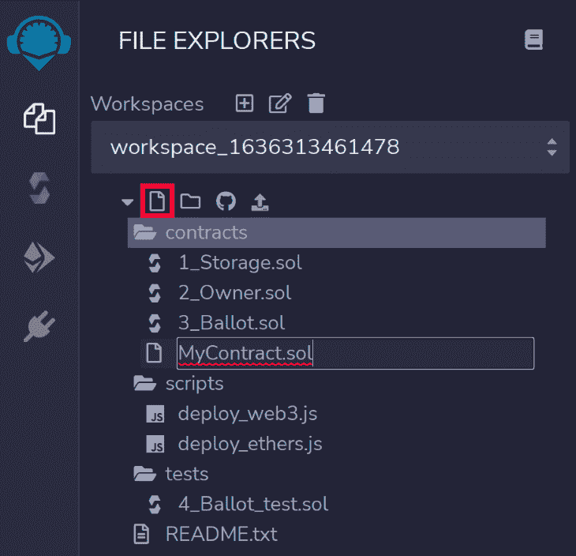
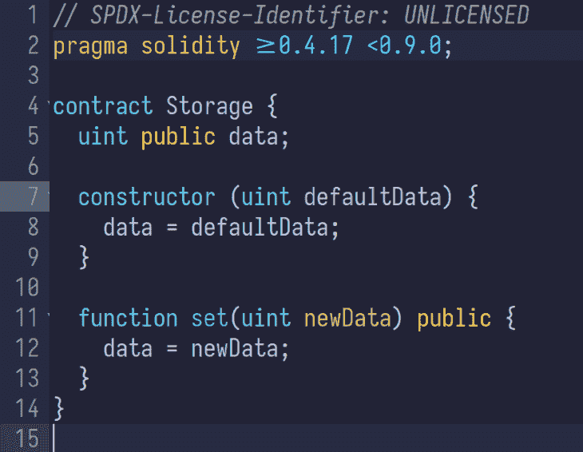
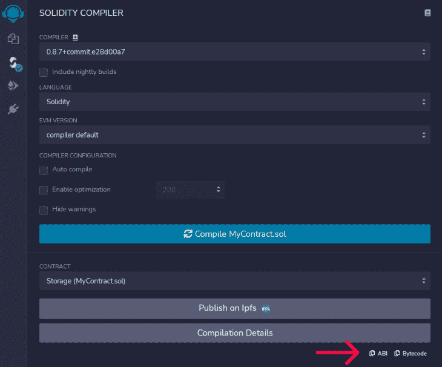
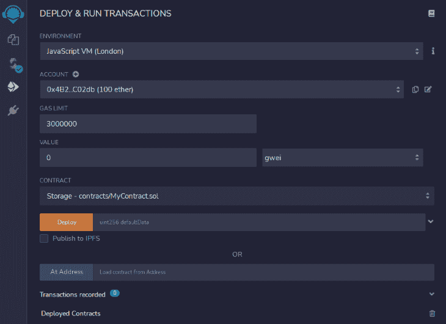
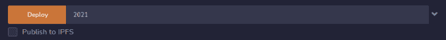
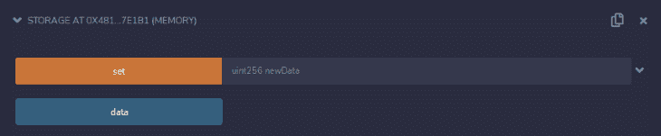
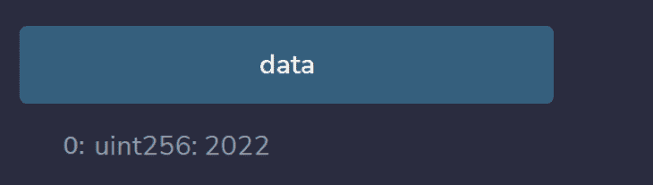

# 用 Solidity 写智能合同

> 原文：<https://blog.logrocket.com/writing-smart-contracts-solidity/>

## 什么是智能合同？

由以太坊推广的智能合约是在区块链上存储和执行的程序。这个术语是在 90 年代末创造的，试图“为理想的安全提供蓝图”

这个蓝图使用代码管理事件发生时各方之间的关系，使其非常安全，并像代码本身一样可预测。

## 智能合同与外部账户

与外部(以太坊)账户非常相似，智能合约有地址，可以持有和转移资金。然而，外部帐户并不局限于单个网络。您可以使用同一个帐户连接到任意数量的区块链网络。

另一方面，智能合约只能连接到一个特定的网络。由于其透明的本质和运行于其上的系统(区块链)的不变性，它们可以增加或取代现实生活中的合同。编写这种契约最流行的方式是通过 Solidity 编程语言。

## 介绍坚固性

[Solidity](https://soliditylang.org/) 是一种编译的面向对象编程语言，由以太坊团队创建，具有类似 JavaScript 的语法。与 JavaScript 不同，Solidity 是强类型的，并且充分利用了继承。

Solidity 将我们的源代码编译成可部署的字节码和一个[应用二进制接口](https://fr.wikipedia.org/wiki/Application_binary_interface) (ABI)，以便使用其他智能合约或编程语言与字节码进行交互。

## 用可靠性写一份聪明的合同

```
// SPDX-License-Identifier: UNLICENSED
pragma solidity >=0.4.17 <0.9.0;

contract Storage {
  uint data;

  function set(uint newData) public {
    data = newData;
  }

  function get() public view returns (uint) {
    return data;
  }
}

```

因为智能合同的源代码通常易于阅读，所以在第一行`[SPDX](https://spdx.org/licenses/)-License-Identifier:`之后指定代码的许可是个好主意。

接下来，`pragma`指令告诉编译器使用哪个版本的 Solidity。版本以`0.`开始，表示在小的、常规的更新中会有突破性的变化。我们的智能合同可以针对版本`0.4`或更高版本进行编译，但不能针对版本`0.9`进行编译。

## 契约

Solidity 中的契约与 JavaScript 类非常相似，因为它们包含变量和方法，这些变量和方法可以相互交互。但是不像类，你不需要一个`this`关键字来访问 Solidity 中的变量。声明后面必须有分号(函数定义不算在内)。)

我们的`Storage`契约保存整数`data`(由`uint`类型关键字注释)并公开两个可以改变和显示它的函数。`data`变量是一个存储变量，将在我们的合同生命周期内存在。如果我们部署这个契约，任何人都可以调用`set`和`get`来修改和检索`data`的值。

### 初始化我们在可靠性合同中的变量

 **为了用一个值初始化我们的`data`变量，契约可以提供一个接受零个或多个参数的`constructor`函数:

```
contract Storage {
  uint data;

  constructor (uint defaultData) {
    data = defaultData;
  }

  function set(uint newData) public {
    data = newData;
  }

  function get() public view returns (uint) {
    return data;
  }
}

```

#### 遗产

一个合同可以通过`is`关键字继承另一个合同:

```
// SPDX-License-Identifier: UNLICENSED
pragma solidity >=0.4.17 <0.9.0;

contract C {
    string public greeting = 'hello';
}

contract D {
    string public farewell = 'goodbye';
}

contract E is C, D {}

```

契约`D`将可以访问`greeting`和`farewell`变量。

## 实度函数

坚实度函数具有以下模式:

```
function <function name>(<parameters type>) \[function type\] [returns (<return type>)] {}

```

常用的功能类型有`public`、`external`、`private`、`internal`、`view`、`pure`、`payable`。

下面是控制函数可见性的类型的工作方式:

*   任何人都可以调用这个函数
*   除了合同，任何人都可以调用这个函数。使用`external`型代替`public`型可以提高性能，并可能节省大量的汽油
*   `private`:只有持有该功能的合同才能调用
*   `internal`契约及其衍生物可以调用函数

这些类型控制对状态的访问:

*   `view`:该功能只读取状态
*   `pure`:该函数既不读取也不写入状态

注意`payable`是在函数被调用时可以接受支付时使用的。

函数类型的更详细模式如下所示:

```
{public|external|private|internal} [pure|view|payable]

```

因此，在我们的契约中，类型为`public view returns (uint)`的`get`函数是通用的，它读取数据并返回一个整数。

然而，Solidity 为我们提供了一个快捷方式来自动创建显示我们状态的`get`函数。只需在我们的变量`data`前添加关键字`public`，就会创建一个`data`函数来替换我们的`get`函数:

```
contract Storage {
  uint public data; // a data function will be created to access the `data` variable

  constructor (uint defaultData) {
    data = defaultData;
  }

  function set(uint newData) public {
    data = newData;
  }
}

```

## 使用 Remix 部署

为了在区块链网络上测试和部署我们的合同，我们可以依靠像 [Remix](https://remix.ethereum.org/) 这样的 IDE 来简化我们的工作，或者使用[真实编码环境](https://blog.logrocket.com/develop-test-deploy-smart-contracts-ganache/)。对于本文，我们将使用 Remix。

Remix 是一个 Solidity IDE，用于编译、部署和手动测试 Solidity 代码。它可以与以太坊测试网络阵列以及主网络接口。

首先，在`contracts`目录下创建一个新合同，并复制我们的合同代码。





当我们的 Solidity 代码被保存时，Remix 将自动编译我们的代码，创建一个发送到网络的字节码，以及一个与部署的契约交互的 ABI。

我们可以在 Solidity 编译器选项卡中检查字节码和 ABI:



如果我们的代码编译成功，我们可以在 **deploy** 和 **run** transactions 选项卡下开始部署和连接它。

在这个选项卡中，我们可以选择我们的环境、要部署的合同以及要使用哪个帐户来部署它。意味着 Remix 将在我们的浏览器中维护一个区块链网络，以尽可能快地进行测试。

值输入与`payable`函数调用相关联，对于我们的契约来说是不必要的。



在选项卡的底部，我们看到了`Deployed Contracts`，这表明我们可以部署一个或多个契约的多个实例。

在`Contracts`下，Remix 在`constructor`函数中选择了我们的`defaultData`。输入一个整数并点击**部署**以部署新合同:





`data`按钮代表为我们的`public data`变量自动生成的 getter，而`set`按钮代表我们的`set`方法。

色差可以归因于这样一个事实，即我们的 getter `data`函数不会修改我们应用程序中的状态，因此，在区块链上运行不需要任何成本。然而，我们的`set`函数是一个消耗 gas 和资源来运行的事务类型的函数，很像最初的`Deploy`按钮。

运行`data`函数将返回我们的初始输入`2021`并且`set`相应地修改它。




## 结论

在本文中，我们研究了 Solidity 契约的基本构建块，以及如何使用 Remix IDE 编写、编译、部署和测试我们的 Solidity 代码。从这一点开始，我们应该更进一步，使用真正的环境，使用[加纳切](https://blog.logrocket.com/develop-test-deploy-smart-contracts-ganache/)和[松露](https://blog.logrocket.com/truffle-suite-tutorial-develop-ethereum-smart-contracts/)。黑客快乐。

## 加入像 Bitso 和 Coinsquare 这样的组织，他们使用 LogRocket 主动监控他们的 Web3 应用

影响用户在您的应用中激活和交易的能力的客户端问题会极大地影响您的底线。如果您对监控 UX 问题、自动显示 JavaScript 错误、跟踪缓慢的网络请求和组件加载时间感兴趣，

[try LogRocket](https://lp.logrocket.com/blg/web3-signup)

.

[](https://lp.logrocket.com/blg/web3-signup)[https://logrocket.com/signup/](https://lp.logrocket.com/blg/web3-signup)

LogRocket 就像是网络和移动应用的 DVR，记录你的网络应用或网站上发生的一切。您可以汇总和报告关键的前端性能指标，重放用户会话和应用程序状态，记录网络请求，并自动显示所有错误，而不是猜测问题发生的原因。

现代化您调试 web 和移动应用的方式— [开始免费监控](https://lp.logrocket.com/blg/web3-signup)。**