# 在 JavaScript 中编写 VS 代码扩展

> 原文：<https://blog.logrocket.com/writing-vs-code-extensions-in-javascript/>

Visual Studio 代码 (VS 代码)在构建时就考虑到了可扩展性。几乎 VS 代码的每一部分都可以通过[扩展 API](https://code.visualstudio.com/api/references/vscode-api) 进行定制和增强。事实上，VS 代码的许多核心特性都是作为[扩展](https://github.com/microsoft/vscode/tree/main/extensions)构建的，当然，你也可以构建自己的扩展！

VS 代码的产品开发精神是默认为 web 开发设置编辑器。它涵盖了 HTML、CSS、JavaScript、TypeScript 和 Markdown。这些功能由微软管理，他们接受社区贡献。除此之外的一切都留给社区作为扩展来提供。通过在 [VS 代码市场](https://marketplace.visualstudio.com/)中发布扩展，其他人也可以使用它们。

现在，你可能想知道:那我怎么写一个呢？我是不是应该跟着[官方文件](https://code.visualstudio.com/api)走？

你可以！但是 VS 代码是用[电子](https://www.electronjs.org/)构建的，也就是说你可以用 JavaScript 写一个扩展，或者任何可以转换成 JavaScript 的东西，比如 TypeScript。VS 代码的代码库是用 TypeScript 编写的，所以文档是面向 TypeScript 的。微软提供的所有[代码示例](https://github.com/microsoft/vscode-extension-samples)都是用 TypeScript 编写的。所以，如果你不知道 TypeScript，你会遇到一些障碍。

在本文中，我将讨论以下内容:

*   为 JavaScript 开发人员构建扩展提供补充信息
*   详述一些我觉得在官方文件中被忽略的话题
*   讨论如何建立一个项目并编写你的第一个扩展
*   提供例子让你自己尝试

## VS 代码扩展的类型

您可以编写不同类型的扩展，有些根本不需要 JavaScript。大体上，它们分为以下几类:

*   **Snippets** :针对特定语言或框架的代码片段的集合。代码片段是在 JSON 文件中声明的。*不需要 JavaScript。*你可以阅读[片段指南](https://code.visualstudio.com/api/language-extensions/snippet-guide)了解更多信息
*   颜色主题(Color themes):颜色主题允许你定制 UI 组件和编辑器中文本的颜色。颜色是在 JSON 文件中配置的。*不需要 JavaScript*。你可以阅读文章[创建 VS 代码主题](https://css-tricks.com/creating-a-vs-code-theme/)了解更多信息
*   **扩展包**:扩展包是可以作为单个扩展安装的扩展的集合。它们有助于创建推荐给他人的精选集合，并有助于启用/禁用某些项目的相关扩展集。所有的工作都在`package.json`中完成。*不需要 JavaScript*。你可以阅读文章 [VSCode:如何创建你自己的扩展包](https://medium.com/@sanik.bajracharya/vscode-how-to-create-your-own-extension-pack-483385644c29)了解更多信息
*   **语言包(本地化)**:语言包允许用户更改 VS 代码的显示语言。它们由一组特定的 JSON 文件组成，这些文件包含 UI 不同部分的本地化字符串资源。*不需要 JavaScript*
*   **Other** :这涵盖了您想要在 VS 代码中定制或增强的所有内容。这就是我们使用 JavaScript 的地方。您可能构建的一些示例如下:
    *   在 UI 中添加自定义组件和视图
    *   支持新的编程语言
    *   支持特定运行时的调试

在本文中，我们将重点关注“其他”类别。从这里开始，当我提到扩展时，这就是我所指的扩展类型。

## 入门指南

**你需要有一个典型的 JavaScript 环境设置**。你需要安装[节点](https://nodejs.org/en/)和一个包管理器([纱](https://yarnpkg.com/)或 [NPM](https://www.npmjs.com/) )。

如果你已经有了，你可以阅读[你的第一个扩展](https://code.visualstudio.com/api/get-started/your-first-extension)指南建立一个新项目。指南推荐使用 [Yeoman](https://yeoman.io/) 为你生成一个默认项目。它为您提供了在命令行上创建项目的向导式体验。要创建一个 JavaScript 项目，您可以选择选项**新建扩展(JavaScript)** 。

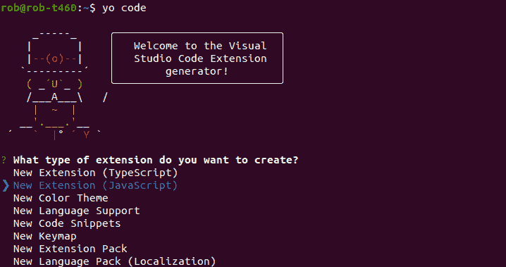

它将生成一个带有“Hello World”命令的默认项目，以及一个空的测试套件。

我认为最好从头开始创建我们的第一个项目。我将创建一个默认项目的精简版本。这将有助于你更清晰地理解代码，减少干扰。

## 编写您的第一个扩展

让我们从头开始创建“Hello World”示例。我们想要创建一个 **Hello World** 命令，该命令将显示一条弹出消息，说(击鼓)，“Hello World！”

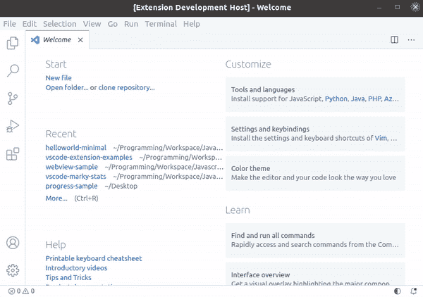

### 扩展清单(`package.json`)

像典型的节点项目一样，我们使用 NPM 来处理项目的配置和依赖关系。项目配置包含在`package.json`中。这在文档中被称为*扩展清单*。如果你需要复习，你可以在`package.json`阅读[本指南](https://nodejs.dev/learn/the-package-json-guide)。

让我们创建我们的`package.json`。我们总是需要填写至少六个字段，如下所示。

```
{
  "name": "example",
  "version": "0.0.1",
  "engines": {
    "vscode": "^1.32.0"
  },
  "main": "extension.js",
  "contributes": {
    "commands": [
      {
        "command": "example.helloWorld",
        "title": "Hello World"
      }
    ]
  },
  "activationEvents": [
    "onCommand:example.helloWorld"
  ]
}

```

您需要提供属性`name`、`version`、`engines`和`main`，就像您为一个典型的节点项目所做的那样。我们将在同一个文件夹中创建一个名为`extension.js`的 JavaScript 文件，作为我们的主模块。

必须声明的特定于 VS 代码的属性有:

*   `contributes`:这是给你[贡献点](https://code.visualstudio.com/api/references/contribution-points)的。这是 VS 代码，用于声明您正在扩展应用程序的哪一部分。在这里，我们可以通过[命令](https://code.visualstudio.com/api/references/contribution-points#contributes.commands)来展示我们的功能，创建新的[视图](https://code.visualstudio.com/api/references/contribution-points#contributes.views)，定义[用户设置、](https://code.visualstudio.com/api/references/contribution-points#contributes.configuration)等等
*   `activationEvents`:声明[激活事件](https://code.visualstudio.com/api/references/activation-events)来指定触发加载(激活)扩展的事件。扩展并不总是活动的！例如，您可以指定某个扩展名仅在降价文件打开时激活，如`"activationEvents": ["onLanguage:markdown"]`。最常用的有:`[onCommand](https://code.visualstudio.com/api/references/activation-events#onCommand)`、`[onLanguage](https://code.visualstudio.com/api/references/activation-events#onLanguage)`、`[onStartupFinished](https://code.visualstudio.com/api/references/activation-events#onStartupFinished)`

我们想在命令面板中添加一个新命令。我们在`contributes.commands`属性中指定了这一点。我们在`command`子属性中分配一个惟一的 ID。微软似乎遵循的命名惯例是`<extension name>.<command name>`，但是没有任何限制。代码中引用此 ID 来为命令提供功能。

`title`子属性是出现在命令面板中的命令文本(如下)。

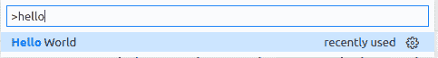

我们只想在命令运行时激活扩展，所以我们将使用`onCommand`激活事件。

扩展清单完成了。

您可以阅读扩展清单的 [VS 代码参考以获得更多关于属性的信息。](https://code.visualstudio.com/api/references/extension-manifest)

### 主模块

现在就来创作`extension.js`吧。

```
const vscode = require("vscode");

module.exports = {
  activate,
  deactivate,
};

function activate(context) {
  // This must match the command property in the package.json
  const commandID = "example.helloWorld";
  let disposable = vscode.commands.registerCommand(commandID, sayHello);
  context.subscriptions.push(disposable);
}

function sayHello() {
  vscode.window.showInformationMessage("Hello World!");
}

function deactivate() {}

```

您可以像在典型的 Node.js 应用程序中一样对待您的文件。每个文件都被视为一个独立的模块，遵循 [commonJS 模块语法](https://nodejs.org/api/modules.html#modules_modules_commonjs_modules)。

**需要导入** `vscode` **模块才能使用 VS 代码扩展性 API。**默认可用。

**你必须在你的主模块**中有一个 `activate` **函数。当您声明的激活事件之一发生时，就会执行`activate`函数。这是为扩展设置关键初始化任务的地方。我们通过`[commands.registerCommand](https://code.visualstudio.com/api/references/vscode-api#commands.registerCommand)`函数将我们在`package.json`中声明的命令链接到我们的`sayHello`函数。**

如果您创建对象并希望在卸载(停用)扩展时释放资源，您可以将它添加到数组`[ExtensionContext.subscriptions](https://code.visualstudio.com/api/references/vscode-api#ExtensionContext.subscriptions)`。VS 法规将这些称为一次性用品。

`deactivate`函数给你一个机会在卸载你的扩展之前进行清理。我们不需要经常进行显式清理——如果是这种情况，您可以省略`deactivate`方法。如果您确实需要异步清理某些东西，请确保从函数中返回一个`[Promise](https://developer.mozilla.org/en-US/docs/Web/JavaScript/Reference/Global_Objects/Promise)`。

### 运行扩展

通过启动调试会话来运行扩展。您可以按下`F5`或选择菜单中的`Run > Start Debugging`来启动会话。如果项目中有`.vscode/launch.json`配置，这将在新的**扩展开发主机**窗口中编译和运行扩展。

如果没有配置，如果 VS 代码检测到项目的类型，可能会提示您使用快速选择输入来选择配置的环境。否则，您可能需要手动创建一个`launch.json`。

您可以点击**添加配置**按钮来帮助您自动完成，选择 **VS 代码扩展开发**作为选项，它将填写属性。

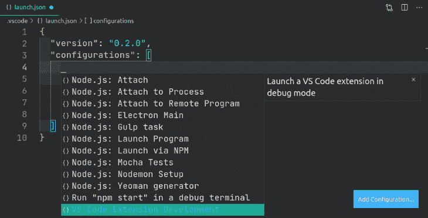

从命令面板(`Ctrl+Shift+P`)运行 **Hello World** 命令，你会看到一个弹出消息“Hello World！”。干得好，您已经编写了您的第一个 VS 代码扩展！

## VS 代码扩展的典型项目结构

如果您使用 [Yeoman Generator](https://code.visualstudio.com/api/get-started/your-first-extension) 为您创建一个项目，它将创建如下所示的文件夹结构。我描述了每个文件的功能:

```
.
├── .vscode
│   ├── launch.json    // Config for launching and debugging the extension. This is created by default when you run the project.
├── README.md          // Description of your extension. This is used by the VS Code Marketplace as the 
├── extension.js       // Extension source code
├── test
│   └── runTest.js     // Source code to run your test suite
│   └── suite
│           └── extension.test.js    // This is where you write your test cases 
│           └── index.js             // Configuration of Mocha and the test suite 
├── package.json        // Extension manifest

```

我要做的一件事是添加一个 *src* 文件夹来存放 JavaScript 文件。这里，`extension.js`位于根文件夹中，当您构建一个更大的扩展时，它会很快变得杂乱无章。

## 熟悉 API

熟悉任何 API 都需要一些时间。每个 API 都有自己的惯例和特质。我认为一些定位和一套好的例子对提供一条快乐的学习道路大有帮助。

我没有发现 VS 代码 API 很容易学习。功能描述很短，并且在某些方面缺乏上下文。我发现自己在查看已发布的扩展的示例和源代码，然后偶尔回溯到 API 来完成任务。

我最初想要的是对架构的概述和学习 API 词汇的方法。这种类型的定位对快速高效至关重要。先说架构。

### API 的架构概述

下面的屏幕截图概括了应用程序的主要 UI 组件。它们是[活动栏](https://code.visualstudio.com/api/references/extension-guidelines#view-containers)、侧边栏、编辑器、面板和[状态栏](https://code.visualstudio.com/api/extension-capabilities/extending-workbench#status-bar-item)。

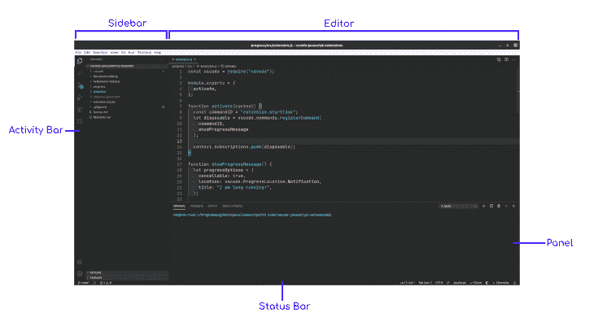

除此之外，我发现文档中关于 UI 组件的术语有点不连贯。

您可以将对视图的引用视为自定义的原子 UI 组件。视图可以是:

视图被放置在视图容器中。可以将视图添加到以下项目之一:

*   活动栏中的浏览器视图容器
*   活动栏中的源代码管理(SCM)视图容器
*   运行和调试活动栏中的视图容器
*   活动栏中的测试视图容器
*   您自己的视图容器

您可以通过运行**视图:打开视图**命令来查看所有可用的视图。

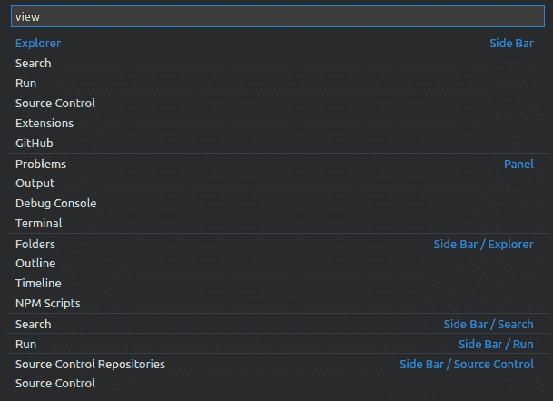

在`package.json`中用`[contributes.views](https://code.visualstudio.com/api/references/contribution-points#contributes.views)`属性声明了一个视图。

可以将视图容器添加到活动栏或面板中。它在`package.json`的`[contributes.viewsContainers](https://code.visualstudio.com/api/references/contribution-points#contributes.viewsContainers)`属性中声明。

下面的例子展示了一个添加到活动栏的自定义“Package Explorer”*视图容器*，它有两个自定义视图。

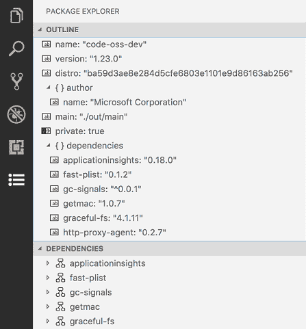

您想要创建的其他 UI 组件通常是通过`[window](https://code.visualstudio.com/api/references/vscode-api#window)`名称空间中的函数来完成的，例如状态栏项目。我们将在下一节讨论这一点。

如果你想支持另一种编程语言，你可以阅读[语言扩展概述](https://code.visualstudio.com/api/language-extensions/overview)，它涵盖了语言背后的架构。到目前为止，大多数编程语言都有扩展，所以您不太可能走这条路！

### 名称空间概述

让我们讨论一下您最常使用的名称空间。

**UI 组件最重要的名称空间是** `[window](https://code.visualstudio.com/api/references/vscode-api#window)`。这是指应用程序的当前窗口。它具有访问和操作大多数 UI 组件的功能:

*   要访问一些 UI 组件，有许多属性:`activeTextEditor`是具有焦点或最近更改的打开文件，`activeTerminal`是具有焦点或最近更改的终端窗格
*   创建一个新组件，它有`createTreeView(..)`、`createStatusBarItem(..)`和`createWebview(..)`等`createXXX`功能
*   为了显示通知和对话框，它有`showInformationMessage(..)`、`showQuickpick(..)`和`showInputBox(..)`等`showXXX`功能。这种模式的一个例外是进度通知，它是用函数`withProgress(..)`创建的
*   对于文档内部的上下文信息，有一些`registerXXX`函数，比如用于代码镜头的`registerCodeLensProvider(..)`和用于工具提示的`registerHoverProvider`

您可以使用以下内容填充视图内容:

*   通过提供一个[数据提供者](https://code.visualstudio.com/api/references/vscode-api#TreeDataProvider)到`createTreeView(..)`或者通过`registerTreeDataProvider(..)`直接注册[数据提供者](https://code.visualstudio.com/api/references/vscode-api#TreeDataProvider)来获得一个[树形视图](https://code.visualstudio.com/api/references/vscode-api#TreeView)
*   通过向`registerWebviewViewProvider(..)`注册[提供商](https://code.visualstudio.com/api/references/vscode-api#WebviewViewProvider)来获得[网络视图](https://code.visualstudio.com/api/references/vscode-api#WebviewView)。WebviewViews 允许在视图中呈现任意 HTML

在文件资源管理器中操作项目打开的名称空间是`[workspace](https://code.visualstudio.com/api/references/vscode-api#workspace)`。您可以对文件执行操作并响应文件系统事件。

对于编辑文档，名称空间是`[TextEditor](https://code.visualstudio.com/api/references/vscode-api#TextEditor)`和`[TextDocument](https://code.visualstudio.com/api/references/vscode-api#TextDocument)`。文本内容可通过`TextEditor.document`属性获得。`TextDocument`允许您通过`TextEditor`中的范围和行检索文本。

名称空间处理命令，命令是您可以引用的功能单元。可以使用 [registerCommand](https://code.visualstudio.com/api/references/vscode-api#commands.registerCommand) 和[registerTextEditorCommand](https://code.visualstudio.com/api/references/vscode-api#commands.registerTextEditorCommand)功能将命令添加到编辑器中。可以通过命令面板、菜单和其他贡献点在 UI 中执行命令。您还可以以编程方式执行命令。

所有全局、用户和工作区设置的名称空间是`[WorkspaceConfiguration](https://code.visualstudio.com/api/references/vscode-api#WorkspaceConfiguration)`。

`[ExtensionContext](https://code.visualstudio.com/api/references/vscode-api#ExtensionContext)`名称空间为您的扩展提供了上下文属性，比如全局文件路径、一些日志信息和机密的存储。一个`ExtensionContext`的实例作为第一个参数被提供给`activate`函数。

文档还列出了一些常见的 API 模式。

### 在没有类型脚本知识的情况下解释 API

在 TypeScript 中，您为变量提供类型，并定义自己的类型。当你写 JavaScript 时，你不需要任何类型，所以我想我们可以忽略 API 中的类型，对吗？

否-您仍然需要了解需要为参数提供什么值以及作为返回值提供什么值。你需要满足 API 的期望。您仍然需要知道应该提供一个数字还是一个字符串。不同之处在于，在这个过程中，您不需要显式地分配类型。

让我们看几个例子来阐明这在现实中是如何发生的。

### 处理枚举

让我们向状态栏添加一个项目，如下所示。代码可以在[这里](https://github.com/robole/vscode-javascript-extensions/tree/main/statusbar)找到。

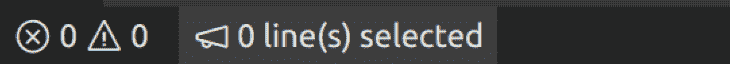

从我们的名称空间概述中，我们知道`window.createStatusBarItem(..)`是我们感兴趣的函数。函数定义如下。

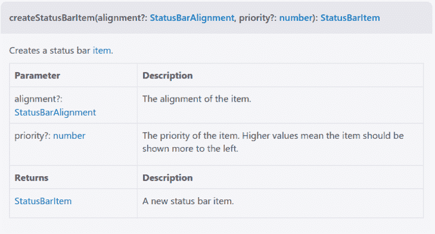

第一个参数名为 alignment，类型为[status balalignment](https://code.visualstudio.com/api/references/vscode-api#StatusBarAlignment)。那么我们为此提供了什么价值呢？

查看定义，我们看到它是一个枚举。

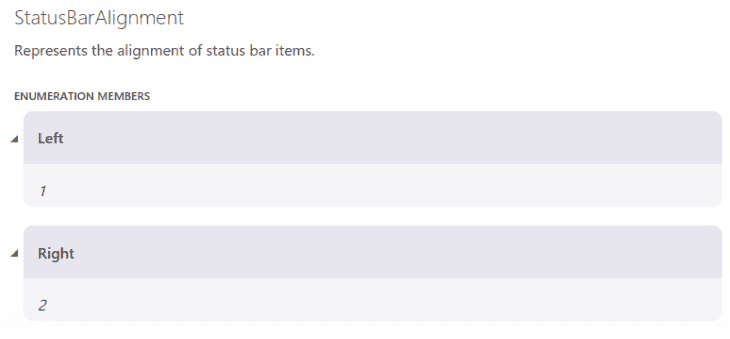

枚举定义了一个固定的值列表。枚举的本机值是一个数字。因此，如果我们想让我们的状态栏项目左对齐:我们可以为这个参数提供一个值`1`或`vscode.StatusBarAlignment.Left`。后者可读性更强。

第二个参数是一个数字。只需提供您选择的数字。

```
let item = vscode.window.createStatusBarItem(
      vscode.StatusBarAlignment.Left,
      1
);

item.text = `$(megaphone) 0 line(s) selected`;
item.show();

```

然后我们可以参考 [StatusBarItem](https://code.visualstudio.com/api/references/vscode-api#StatusBarItem) 定义来理解如何添加标签和显示项目。上面的代码足以显示一个状态栏项目。

### 如何处理对象和回调

让我们创建一个进度通知，如下所示。代码可以在[这里](https://github.com/robole/vscode-javascript-extensions/tree/main/progress)找到。

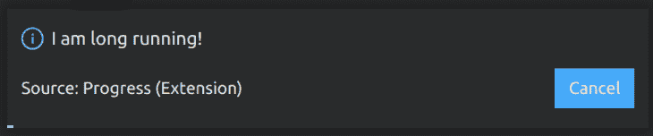

从我们的名称空间概述中，我们知道`window.withProgress(..)`是我们感兴趣的函数。函数定义如下。

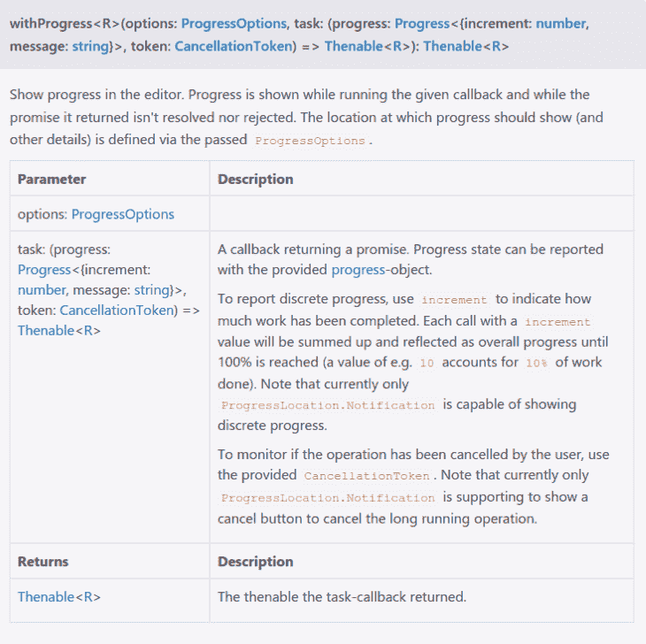

这个定义比较复杂，但是不要被吓倒。

第一个参数*选项*，是一种[进度选项](https://code.visualstudio.com/api/references/vscode-api#ProgressOptions)。您需要检查定义并为其创建一个对象文字。

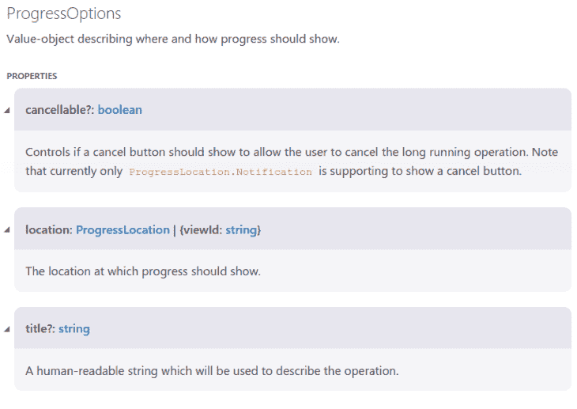

属性*可取消*和*标题*是原始类型。*位置*属性也是一个枚举。

```
let progressOptions = {
    cancellable: true,
    location: vscode.ProgressLocation.Notification,
    title: "I am long running!",
};

```

第二个参数是一个回调，它有自己的一组参数。这里，我用我感兴趣的两个参数创建了一个匿名函数。*进度*参数是我们用来报告任务状态的参数。

这个函数的返回类型是 **Thenable** ，这是 VS Code 对于一个承诺的类型。我们创建一些超时来模拟一个正在运行的任务，并在完成后解析一个承诺。我们从函数返回这个承诺，以满足预期的异步行为。

```
vscode.window.withProgress(progressOptions, (progress, token) => {
    token.onCancellationRequested(() => {
      console.log("User canceled the long running operation");
    });

    progress.report({ increment: 0 });

    setTimeout(() => {
      progress.report({
        increment: 50,
        message: "Half way done!",
      });
    }, 2000);

    const p = new Promise((resolve) => {
      setTimeout(() => {
        resolve();
      }, 4000);
    });

    return p;
  });
}

```

## JavaScript 中 VS 代码扩展的例子

我收集了一些例子，可以在 [GitHub repo](https://github.com/robole/vscode-javascript-extensions) 中找到。

## 测试扩展

您应该像测试任何 JavaScript 代码一样测试您的扩展。

使用[摩卡](https://mochajs.org)测试框架，[约曼生成器](https://code.visualstudio.com/api/get-started/your-first-extension)为你创建一个样板测试套件。你可以使用任何你想要的测试框架。如果你喜欢摩卡，那么[测试扩展指南](https://code.visualstudio.com/api/working-with-extensions/testing-extension)涵盖了基本内容。

请注意，如果您尝试从命令行运行测试，它将抛出一个错误:

```
Running extension tests from the command line is currently only supported if no other instance of Code is running.

```

这是并发运行不同版本 VS 代码的一个限制。解决方案是使用 [VS 代码内部人员](https://code.visualstudio.com/insiders/)进行开发，您可以从命令行运行测试。或者您可以从调试启动配置中启动扩展测试(如下所示)。

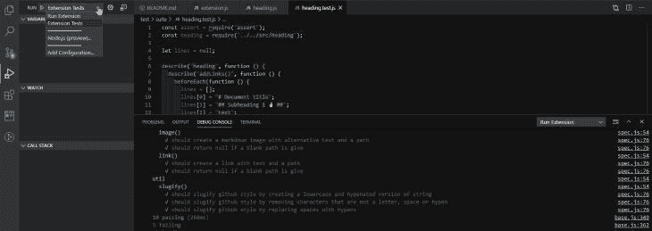

## 发布扩展

如果你想和别人分享你的扩展，可以发布到 [VS 代码扩展市场](https://marketplace.visualstudio.com/vscode)。或者，你可以[将一个扩展](https://code.visualstudio.com/api/working-with-extensions/publishing-extension#packaging-extensions)打包成可安装的 VSIX 格式，然后自己发布。你可以阅读[出版推广指南](https://code.visualstudio.com/api/working-with-extensions/publishing-extension)了解这方面的概要。

## 结论

编写自己的 VS 代码扩展可能是一个有趣且有益的项目。构建一个你每天都在使用的东西来辅助你的工作流程是令人难以置信的满足。它确实需要一些时间和精力来掌握开发环境并学习如何有效地使用 API。如果您已经有了使用 Node 的经验，这并不是什么难事。

关键的一点是，知道 TypeScript 不是先决条件——任何具有一些 JavaScript 知识的人都应该能够轻松地构建自己的扩展。我希望这篇文章能够为用普通的 ole JavaScript 构建扩展提供一条顺畅的学习之路。

## 通过理解上下文，更容易地调试 JavaScript 错误

调试代码总是一项单调乏味的任务。但是你越了解自己的错误，就越容易改正。

LogRocket 让你以新的独特的方式理解这些错误。我们的前端监控解决方案跟踪用户与您的 JavaScript 前端的互动，让您能够准确找出导致错误的用户行为。

[](https://lp.logrocket.com/blg/javascript-signup)

LogRocket 记录控制台日志、页面加载时间、堆栈跟踪、慢速网络请求/响应(带有标题+正文)、浏览器元数据和自定义日志。理解您的 JavaScript 代码的影响从来没有这么简单过！

[Try it for free](https://lp.logrocket.com/blg/javascript-signup)

.