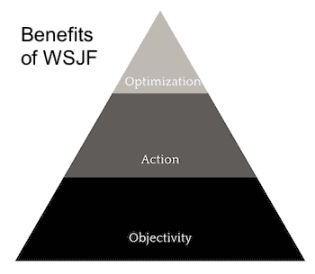
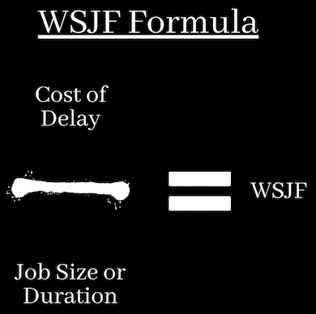

# 为敏捷团队解释加权最短工作优先(WSJF)

> 原文：<https://blog.logrocket.com/product-management/wsjf-explained-agile-teams/>

通常，生活中真正重要的不是你最终选择的精确路线，而是你得出这个结论的标准。

正如了解你自己和你为什么做某些事情可以增加我们的自我意识一样，拥有合理的[标准来区分任务的优先次序](https://blog.logrocket.com/product-management/product-feature-prioritization-frameworks-strategies/)可以让你更多地了解你的团队和你的组织优势。

在解释加权最短作业优先的重要性之前，让我们先来看一下该方法的简单定义。稍后，我们将概述计算 WSJF 的公式，并检查其在[产品管理](https://blog.logrocket.com/product-management/)和其他业务功能中常见的实际挑战中的使用。

* * *

## 目录

* * *

## 什么是加权最短作业优先(WSJF)？

顾名思义，加权最短作业优先有两个关键变量来对任务进行分类:作业对整个项目的重要性(“weight[ed]”)及其长度(“Shortest”)。这些参数组合在一起，作为优先化工具(“优先”)。

简而言之，WSJF 意味着任务的相关性和时间分配将决定它在序列中的顺序。

在传统的、等级更高的工作场所，任务分配方法很简单。老板、商业文化和简单的习惯力量通常决定先做什么。然而，自从数字革命改变了我们的生活和工作，[出现了更精简、更协作的方法](https://blog.logrocket.com/product-management/what-is-lean-product-management-how-to-apply/)来充分利用这些技术。

## 什么是可扩展的敏捷框架(SAFe)？

特别是，敏捷软件开发的[原则](https://blog.logrocket.com/product-management/four-agile-manifesto-values-explained/)(最早在 2001 年有影响力的[敏捷经理](https://agilemanifesto.org/principles.html)中概述)已经扩展到了经济的几乎所有其他领域。在敏捷中，个人和交互、持续的产品开发、客户偏好和适应性占据中心位置。

敏捷原则反映在最流行的敏捷方法之一的[扩展敏捷框架(SAFe)](https://www.scaledagileframework.com/safe-for-lean-enterprises/) 中。SAFe 反映了数字产品对更高速度、监控能力和质量保证的需求。

虽然 SAFe 可以应用于整个公司甚至整个经济，但它的七项能力通常是在较小的初创公司、公司部门和项目相关团队的背景下设想的。

## 7 项敏捷能力是什么？

正如你可能已经猜到的，七项安全/敏捷能力高度依赖于可行的优先级标准，如 WSJF。

七项敏捷能力是:

1.  [团队和技术敏捷性](#team-and-technical-agility)
2.  [敏捷产品交付](#agile-product-delivery)
3.  [企业解决方案交付](#enterprise-solution-delivery)
4.  [精益投资组合管理](#lean-portfolio-management)
5.  [组织敏捷性](#organizational-agility)
6.  [持续学习文化](#continuous-learning-culture)
7.  [精益-敏捷领导](#lean-agile-leadership)

### 1.团队和技术敏捷性

团队和技术敏捷性指的是项目中的人力资本以及他们在敏捷技术方面的培训。他们将依靠 WSJF 等工具来理解为什么以及如何组织里程碑。

### 2.敏捷产品交付

敏捷和产品交付指的是产品(商品或服务)开发方法，通过这种方法，有一个探索、集成和部署的连续循环。没有 WSJF 和等效的测量框架，就无法理解依赖性和需求。

### 3.企业解决方案交付

这是指围绕你的团队的制度环境。想想供应商必须如何及时获得重要的产品组件。在这里，WSJF 对于揭示适应项目需求的途径是至关重要的。

### 4.精益投资组合管理

当你的团队、部门或公司开始成长时，通常很难理解你的各种产品是如何相互作用的。WSJF 帮助你理解哪些依赖是有用的，哪些是耗费资本和时间的。

### 5.组织敏捷性

你能以多快的速度[对变化](https://blog.logrocket.com/product-management/four-agile-manifesto-values-explained/#responding-to-change-over-following-a-plan)做出反应，无论是积极的还是消极的？有不同的方法来衡量时间，但是 WSJF 特别适合敏捷，因为它将任务相关性与时间长度结合起来。

### 6.持续学习文化

类似地，这指的是一旦识别出威胁或机会，你的团队和你的产品获得新知识的内在需求。WSJF 可以帮助你识别那些对于手头的任务来说更紧急、更重要的技能。

### 7.精益-敏捷领导

最后，敏捷中的管理者不同于其他管理者。他们的指导不能是自上而下和遥远的，而是水平的和基于证据的。WSJF 提供了一致的方法来确保决策得到团队的理解和支持。

## 使用 WSJF 的 3 个好处

你不需要上商学院或了解企业能力理论，就能理解一家公司的关键制约因素:资金和时间。正如他们所说，时间就是金钱，这就是为什么充分利用你的时间总是有经济意义的。

In these days of agile enterprises, though, the way we *perceive* time also matters.

例如，也许看待项目的标准方式是线性的:我们从研究开始，转向开发，然后测试、部署和收集反馈。或者，您可以将产品开发视为一个无限循环，在实际研究和开发可扩展的解决方案之前，您首先寻求对原型的反馈。

WSJF 对任务时间和相关性的考虑使其适用于线性和循环式项目开发。虽然这可能是其他公式的情况，但 WSJF 从其他优先级框架中脱颖而出，因为它强调客观性、行动和优化。

### 客观性

关于客观性，WSJF 为利益相关者提供了一个清晰、透明的衡量标准，以了解他们的需求为什么以及何时会得到满足。显然，在大多数情况下，大多数团队都希望:

*   为他们的事业吸引尽可能多的资源
*   其他团队使用他们自己的资源来满足他们各自的依赖性

WSJF 的公式可以大大减少这种资源争夺中出现的协调失败和冲突。如果每个人都意识到这一点，团队将学会调整他们的期望，专注于他们的任务。

### 行动

WSJF 对行动的偏好至关重要。任何长期任务都可能成为沉没成本谬误和类似认知偏差的牺牲品。简而言之，这意味着你觉得你不能放弃一个特定的行动过程，因为你已经在它上面花费了大量的时间或资源。

正如任何在电影院看了一部冗长乏味的电影的人会告诉你的那样，理性的行动是重新评估继续朝同一方向看是否真的有用。

过去的投资不应该成为未来投资的指南。相反，WSJF 公式使你能够阐明一个特定的任务是否仍然值得花费，或者资源是否应该重新定向到一个更紧急和更重要的里程碑。这样，你就有一个合理的指导方针来引导你的精力。

### 最佳化

在处理数字产品以及开发者和消费者的交互方式时，优化是必不可少的。如果没有足够的指南针，领导者很容易将[虚荣心指标](https://www.tableau.com/learn/articles/vanity-metrics#:~:text=What%20are%20vanity%20metrics%3F,way%20that%20informs%20future%20strategies.)强加给他们的团队，而虚荣心指标通常会导致虚荣心特征或产品——也就是说，不良信息会导致您的整个产品组合中出现不良或不一致的元素。

WSJF 把领导者和团队的优先权集中在真正重要的事情上:任务的重要性和成本。虽然生活中有许多其他理由来证明选择的合理性，但当你在办公室时，这是两个最相关的理由。

## WSJF 是如何计算的？

当 WSJF 运作良好时，客观、行动和优化是预期的贡献，但在这种方法论的讨论和应用中也出现了危险的陷阱。其中大多数都与发现用于公式的值的过程有关。

计算 WSJF 的公式如下:

> *WSJF =延误成本/预计工作规模或时间*

每一方的值是如何分配的？让我们打开两个项目。

* * *

订阅我们的产品管理简讯
将此类文章发送到您的收件箱

* * *

### 延误成本

The cost of delay figure is a composite number. It is the sum of the following three components:

#### 1.用户-商业价值

由于产品和功能可以供内部或外部消费，这里的价值既可以指客户，也可以指公司的利益相关者。

例如，你可能不得不决定是为 UX 团队清理一堆新数据，还是专注于在你的应用程序中实现你的新品牌形象。

#### 2.时间关键性

时间关键度基本上是指任何与截止日期、路径和依赖性相关的任务要素。这些可以是物质的，也可以是思想的。

例如，一个销售团队可能会依靠你来完成一个新的网站部分，这样他们就可以开始一项活动。但也有可能你的经理只是认为向其他利益相关者展示你的进展是有益的。

#### 3.风险降低/机会实现价值

有两种方式来看待这个因素:消极地或积极地。你可以根据项目从长远来看确保公司地位的能力来判断项目，即防范风险。或者，您可以根据他们打开新市场和新计划的潜力来判断他们，例如，释放新的机会。

### 工作规模或持续时间

上述三个因素有两个主要的价值分配策略:工作规模或持续时间。

工作规模或持续时间是一个可以根据你的优先顺序进行调整的特征。在某些活动中，例如为产品发布创建图形，一旦确定了关键原则，就很容易测量数量，甚至是直到完成的准确时间。在这里，您可以很容易地为一项任务分配小时数、天数或月数

同时，还有许多其他更抽象的任务。例如，在开发一个新特性的注册表单时，您可能有不同的优先级——可用性、数据深度、个性化等。在不同版本之间进行试验，直到达到一个可接受的解决方案，这可能需要比预期更长的时间。

继续阅读，学习如何在不清楚或难以估计工作规模/持续时间时分配价值。

## WSJF 评分在实践中是如何运作的？

有两种广泛使用的赋值方法，此外还有第三种 WSJF 方法，在这种情况下这个因素并不重要。在这两种情况下，组成延迟数字成本的组成部分相加，并除以工作规模，从而每个功能，产品或项目得到一个分数。

得分最高的元素应该是优先级最高的，依此类推。最好的做法是在不同的团队中多次进行这项练习，以使分数正常化。

求解公式的第一种方法是用精确的数字。这通常意味着您的组织或您正在使用的产品管理软件具有内置的方法来[计算价值、关键程度、风险降低](https://blog.logrocket.com/product-management/what-metrics-kpis-product-managers-track/)、、[和工作规模](https://blog.logrocket.com/product-management/what-metrics-kpis-product-managers-track/)。不同的组织和项目有不同的标准，但结果是一样的。

另一种方法是自己想出这些价值，然后在整个组织中推广使用。

在许多情况下，WSJF 用户仅仅依靠经典的[斐波那契](https://blog.logrocket.com/product-management/planning-poker-agile-estimation-scrum/#why-is-the-fibonnaci-sequence-used-in-planning-poker)T2T4 数列，其中每个连续的数字是前面两个数字相加的结果:1，2，3，5，8，13，21…

这些数字只是随机估计，但是它们之间的距离足够大，可以进行有用的分类。通常最好从 1 开始作为最小的数字，然后给其他每个元素分配一个奇异值。您可以对公式的两边使用此方法，并对结果进行归一化，以获得合适的 WSJF 等级。

## 一种计算 WSJF 的定性方法

对 WSJF 方法最大的批评之一是关于这些值和它们在公式中的使用。众所周知，当涉及到我们的日常活动时，分配价值、风险和时间是一件非常困难的事情(例如，清洗我们的汽车，更新我们的护照)。在一个有多个移动部分的公司中，这甚至更为复杂。

这是一个优雅的解决方案出现的地方。不要仅仅通过公式来思考 WSJF，你可以简化它，并把它作为一个定性工具。这在项目开始时特别有用。你可以用这样一个简单的表格来做:

| **定性(非数学)WSJF** | **大作业尺寸** | **轻工作尺寸** |
| **延迟的高成本** | 最高优先级；以此为起点，将大部分资源集中在任务上 | 高优先级；将适度的资源集中在任务上 |
| **延迟成本低** | 低优先级；调整大部分资源供后期使用 | 最低优先级；留待将来完成 |

虽然您可能会发现很难分配正确的斐波纳契值，但使用定性或非数学 WSJF，您只能操作四个盒子。您可以依靠粗略的假设来对项目中的任务进行分类。这在探索新的市场或产品时特别有用。

一旦你对自己的目标和能力有了更好的认识，你就可以尝试数学上的 WSJF 公式来为你的团队提供更好的指导，以确定任务的优先级。

## 关键要点

WSJF 是一种任务优先化方法，对于使用敏捷方法的团队特别有用。它将注意力集中在客观的关键任务上，偏向于行动，并优化资源。

标准的 WSJF 公式是用延误成本(CoD)除以工作规模或时间(JST)得到的。即 WSJF = CoD/JST，其中 CoD 指的是用户价值、时间关键度和风险降低，JST 代表任务中涉及的时间或其他要求。如果您没有确切的值，您可以依靠斐波那契数列来分配近似值，从最低的 1 开始。

对于那些不太喜欢数学的人来说，WSJF 也是一个定性的工具。特别是在产品或功能开发的早期阶段，用延迟成本和时间成本作为通用变量来构建一个四区域矩阵是非常有用的，它可以真正帮助指导经理和团队。

*精选图片来源:[icon scout](https://iconscout.com/icon/agile-transition-4801792)*

## [LogRocket](https://lp.logrocket.com/blg/pm-signup) 产生产品见解，从而导致有意义的行动

[LogRocket](https://lp.logrocket.com/blg/pm-signup) 确定用户体验中的摩擦点，以便您能够做出明智的产品和设计变更决策，从而实现您的目标。

使用 LogRocket，您可以[了解影响您产品的问题的范围](https://logrocket.com/for/analytics-for-web-applications)，并优先考虑需要做出的更改。LogRocket 简化了工作流程，允许工程和设计团队使用与您相同的[数据进行工作](https://logrocket.com/for/web-analytics-solutions)，消除了对需要做什么的困惑。

让你的团队步调一致——今天就试试 [LogRocket](https://lp.logrocket.com/blg/pm-signup) 。

[Roy Cobby Follow](https://blog.logrocket.com/author/roycobby/) Researcher with a professional background in marketing and social media management in education and public policy, at business schools, academic journals, and stakeholder-based organizations.