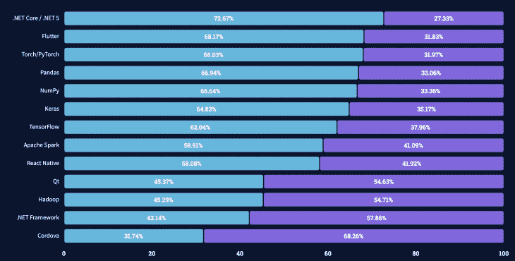
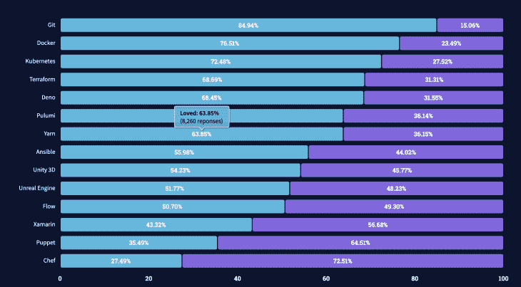

# xa marin vs . React Native-log rocket 博客

> 原文：<https://blog.logrocket.com/xamarin-vs-react-native/>

***编者按**:这篇文章最后一次更新于 2022 年 6 月 15 日，以包括更多关于 Xamarin 和 React Native 的最新统计数据和信息。*

在本指南中，我们将重点介绍两个流行的跨平台开发框架:Xamarin 和 React Native。我们将根据性能、受欢迎程度和社区支持等标准来评估每一个，并描述同时使用 [Xamarin](https://blog.logrocket.com/tag/xamarin/) 和 React Native 的利弊。

### 内容

## 什么是跨平台开发？

跨平台移动应用程序开发是使用单一技术堆栈为多个平台(如 iOS 和 Android)构建移动应用程序的过程。

这意味着，您可以一次编写代码，并立即在多个平台上部署，而不是创建应用程序的多个版本，每个版本都使用针对每个平台的专用本地语言编写。

### 跨平台开发的优势

跨平台开发和原生开发各有利弊。在这一节中，我们将回顾跨平台移动开发框架(如 Xamarin 和 React Native)的优缺点。

首先是一次编写、随处部署的能力。跨平台开发的最大优势是拥有可以导出到多个操作系统的单一代码库。

接下来是应用之间的一致性。拥有一个共享的代码库可以让你在所有平台上保持相同的外观、感觉和体验。所有更新和修复也会自动反映在任何地方。

第三是节约资源。你只需要一个团队来开发一个共享的代码库，而不是让拥有不同技能的不同团队来开发你的应用的多个本地版本。这允许您利用更小的团队和更快的开发时间来节省时间和金钱。

最后是拥有更广泛受众的能力。将你的应用程序发布在多个平台上，可以让你不费吹灰之力就扩大你的市场覆盖面，从而增加你获得更多下载和用户的机会。

### 跨平台开发的缺点

下面是一些与跨平台开发相关的缺点。

首先是性能问题。虽然跨平台框架致力于提供尽可能接近本机应用的应用，但它们仍然无法与各自的平台无缝集成，并且本机和非本机组件之间的通信不一致，从而降低了应用的速度和性能。

接下来是跨平台不一致的问题。跨平台开发工具并不具备每个不同平台提供的所有特性，所以您可能需要采用一些变通方法。这些框架可能还需要一些时间来更新平台发布的最新特性和更新。

最后，跨平台开发通常提供有限的功能。每个平台中都有许多在跨平台应用中不可用的原生特性和集成，这限制了您可以提供的用户体验。

## 什么是 Xamarin？

Xamarin 是一个开源、跨平台的移动应用开发框架，成立于 2011 年。

### Xamarin 是做什么用的？

Xamarin 对于跨平台共享代码和业务逻辑以及用 C#和 Visual Studio 编写跨平台应用程序特别有用。根据[官方文件](https://docs.microsoft.com/en-us/xamarin/get-started/what-is-xamarin#:~:text=Xamarin%20is%20an%20open%2Dsource,%2C%20Android%2C%20and%20Windows%20with%20.&text=Xamarin%20applications%20can%20be%20written,file%20on%20Android%2C%20or%20an%20.)，Xamarin 让你可以跨平台共享平均 90%的应用程序代码。这意味着您可以在每个平台上实现原生的外观和感觉，更不用说原生的性能，而无需使用多种语言编写。

你可以在 PC 或 Mac 上编写 Xamarin 应用程序，并将它们编译成原生包，就像。apk 文件和。分别适用于 Android 和 iOS 设备的 ipa 文件。

Xamarin 用于编写服务于各种行业的应用程序，包括能源、媒体、医疗保健、交通等。

使用 Xamarin 构建的应用包括:

*   微软新闻
*   超级巨人游戏
*   斯托里托
*   敏锐地
*   UPS Mobile
*   世界银行
*   只是给予
*   Olo
*   赛默飞世尔科技公司
*   APX

### 为什么要用 Xamarin？

以下是与 Xamarin 跨平台移动应用程序开发相关的一些好处。

首先是性能；众所周知，Xamarin 应用程序具有近乎原生的性能水平。

其次是 Xamarin 完整的开发生态系统:C#。Net 和 Microsoft Visual Studio 是您使用 Xamarin 构建移动应用程序所需要的一切，使其成为最完整的跨平台移动应用程序开发框架之一。

接下来是无缝的用户体验。 [Xamarin。Forms](https://dotnet.microsoft.com/apps/xamarin/xamarin-forms) 通过提供一个模板库，允许您利用标准界面元素，这样您就可以跨不同平台重用您的代码。也可以用 [Xamarin.iOS](https://docs.microsoft.com/en-us/xamarin/ios/) 和 [Xamarin。Android](https://docs.microsoft.com/en-us/xamarin/android/) 用于手动定制，如果需要。

最后，Xamarin 对于小团队是免费的。

### 使用 Xamarin 的缺点

现在，让我们放大一些与用 Xamarin 编写跨平台移动应用程序相关的缺点。

* * *

### 更多来自 LogRocket 的精彩文章:

* * *

首先是更新延迟。每当推出新的平台功能或更新时，通常会有一段延迟，直到这些变化反映在 Xamarin 工具中，这可能会导致您的应用程序出现问题。

其次是更大的应用程序大小。Xamarin 应用程序可以为发布版本增加大约 5 兆字节，为调试版本增加 20 兆字节，使它们比原生应用程序更大。这主要是因为用于将 C#调用转换为本机调用的库。

Xamarin 非常适合 UI 简单的应用程序。然而，使用 Xamarin 构建复杂的应用程序或移动游戏可能不是最好的选择，因为您将不得不花费大量时间编写特定于平台的代码，这违背了使用它的目的。

最后，您可能需要用本机代码重写应用程序中 UI 的某些部分。这意味着你需要一些本地编程语言的知识，比如 Android 的 Kotlin 或 Java，iOS 的 Swift 或 Objective-C

### Xamarin 开发工具

以下是旨在改善 Xamarin 开发人员体验的工具和库的部分列表。

*   Xamarin 开发语言
*   C#
*   Xamarin IDEs:
*   Xamarin 工具:
    *   努格特
    *   Xamarin 检查员
    *   棱镜
    *   制造商
    *   雷沙尔珀
*   Xamarin 测试工具:
    *   努尼特
    *   xUnit.net
    *   Visual Studio 单元测试框架

## 什么是 React Native？

React Native 是脸书在 2015 年创建的一个开源、跨平台的移动应用开发框架。它旨在使开发人员能够使用 JavaScript 和本地平台功能来构建移动应用程序。

### 为什么使用 React Native？

下面是使用 React Native 构建跨平台移动应用的一些[好处。](https://blog.logrocket.com/why-keep-faith-react-native/)

React Native 实现了原生 UI 组件，允许应用程序看起来像原生应用程序，因此提供了高质量的用户界面。

其次，React Native 提供了一个庞大的 UI 组件库，允许更快的开发时间。它还可以访问本机功能，如摄像头和加速度计。

通过特定于平台的代码，React Native 允许您通过使用本机代码来进一步优化单独的本机应用程序。

接下来，React Native 支持热重新加载，这允许开发人员立即将更改应用到应用程序，而不必重新编译它们。

最后，React Native 可靠且免费；它是由脸书开发和支持的，现在仍然是一个开源平台。

使用 React Native 构建的高端应用包括:

*   脸谱网
*   照片墙
*   超级饮食
*   特斯拉
*   网络电话
*   拼趣

### 使用 React Native 的缺点

尽管它有很多优点，但在决定用 React Native 编写下一个移动应用程序之前，你应该考虑一些缺点。

首先是导航。React Native 中内置的导航并不是无缝的，也不能与本机导航相提并论。其次是复杂的 UI；通过构建复杂的动画和过渡来应对本地的挑战。

### React 本机开发工具

以下是旨在改善 React 原生开发人员体验的工具和库的部分列表:

*   反应本地开发语言
*   Java Script 语言
*   反应本地 ide:
*   React 本机工具:
*   反应本机 UI 组件:
    *   NativeBase
    *   UI 小猫
    *   反应原生纸
*   React 本机测试工具:
    *   React 本机测试库
    *   戒瘾诊所

## Xamarin 比 React Native 好吗？

现在，您已经很好地了解了 Xamarin 和 React Native 的用途、各自的优缺点，以及哪些知名公司使用这些框架为客户构建移动应用程序，现在终于到了比较 Xamarin 和 React Native 的时候了。

我们将根据以下标准评估 Xamarin 与 React Native:

*   表演
*   流行
*   开发语言
*   成分
*   代码重用
*   定价
*   支持和生态系统

### 表演

在选择跨平台开发框架时，您应该考虑的一个最重要的因素是应用程序性能。

虽然 React Native 和 Xamarin 提供了接近原生的应用性能，但一些人认为 [Flutter 的性能更好](https://blog.logrocket.com/why-flutter-is-overtaking-react-native/)，因为 Dart 代码被编译成 C-library，这意味着它接近原生代码。这提高了通信速度并提供了更好的性能。

然而，很难对性能进行基准测试，因为它取决于许多因素和变量，包括设备、代码、应用程序和正在使用的功能。

### 流行

Xamarin 在 120 个国家拥有超过 160 万名开发人员，多年来已经发展了相当多的用户群。然而，这很大程度上是因为它是最古老的框架之一。

自发布以来，React Native 缓慢但肯定地获得了人气，在 2017 年超过了 Xamarin。

根据 Stack Overflow 的“2021 年开发者调查”，React Native 比 Xamarin 更“受欢迎”，58.08%的开发者表示有兴趣继续使用 React Native 进行开发，而 Xamarin 的这一比例为 43.32%。

### 开发语言

跨平台工具开发语言是做决定时要考虑的另一个关键因素。

Xamarin 使用。Net 语言，比如 C#和 F#，这些都是通用语言，可以用来写原生平台代码。React Native 使用 JavaScript，这不是为它发明的，但它仍然在 React Native 应用程序方面做得很好。

由于 JavaScript 最初是为 web 开发的，所以您可能会遇到一些问题或遇到一些必需的解决方法。因此，一些 API 可能无法工作，而其他 API 可能必须由 React Native 代理。

根据 TIOBE 编程社区指数，截至 2022 年 6 月，C#是全球第五大最受欢迎的编程语言，其次是排名第七的 JavaScript。这使得 Xamarin 和 React 成为开发语言的可靠选择；两者都使用熟悉的语言，这有助于提高您的工作效率，并使您免于忍受陡峭的学习曲线。

### 成分

React Native 提供了一些预构建和部分自适应的组件，如按钮和文本输入。然而，这些组件中的大多数并不是真正自适应的。如果您需要更高级的东西，您必须通过重组这些内置组件来自己构建它。

Xamarin。Forms 提供了一个完整的跨平台 UI 工具包，由两个平台的本地 UI 组件组成，这些组件被编译成特定于平台的 UI 组件。也可以使用 Xamarin.iOS 或 Xamarin。Android 用于自定义应用程序 UI 和更好的性能。

### 代码重用

代码重用是将开发人员带到跨平台框架的原因，那么用每个框架编写的代码中有多少是真正可重用的呢？

React Native 允许您编写一次代码，然后发布到任何地方，但它也支持平台差异。这意味着，您必须不时地找出您正在哪个平台上运行，并根据您正在运行的平台加载不同的组件或组件集。尽管如此，相当一部分代码仍然可以重用。

Xamarin 引以为豪的是，通过利用这种语言，它允许开发人员重用高达 96%的 C#代码。Xamarin 还提供表单组件，使其比 React Native 和 Flutter 更适合代码重用，React Native 和 Flutter 平均共享 60-90%的代码。

### 定价

虽然 Xamarin 和 React Native 都是免费的开源平台，但 Xamarin 只对个人和小公司免费。对于大型企业，单用户许可证起价为 499 美元，Visual Studio Enterprise 年度订阅的价格最高可达 2，999 美元。

虽然这对大型企业来说可能不是问题，但成本仍然会增加，这可能会导致更大的公司使用 React Native。

### 支持和生态系统

当选择一个框架时，你也应该考虑它的社区支持，特别是如果你是新手的话。这包括论坛、文档、教程等。

React Native 获得了相当多的支持。你可以很容易地在论坛或 QA 网站(如 Stack Overflow)上找到许多学习资料或开发人员，以便在你需要任何帮助时寻求支持。

对于 Xamarin，支持相当有限。然而，微软提供了可靠的文档和一些免费的 Xamarin 课程和学习途径来帮助你开始。

## 结论

在选择跨平台开发工具时，没有一刀切的选择。Xamarin 和 React Native 都被证明在构建优秀的移动应用程序方面是成功的。您的特定需求和偏好决定了哪个框架最适合您。

例如，如果您已经有一些 JavaScript 的知识，那么使用 React Native 可能是明智的。归根结底，这完全取决于你在构建什么，以及你希望实现什么。任何框架都有它的缺陷，但是优势远大于那些挫折的框架可能是你的正确选择。

## [LogRocket](https://lp.logrocket.com/blg/react-native-signup) :即时重现 React 原生应用中的问题。

[LogRocket](https://lp.logrocket.com/blg/react-native-signup) 是一款 React 原生监控解决方案，可帮助您即时重现问题、确定 bug 的优先级并了解 React 原生应用的性能。

LogRocket 还可以向你展示用户是如何与你的应用程序互动的，从而帮助你提高转化率和产品使用率。LogRocket 的产品分析功能揭示了用户不完成特定流程或不采用新功能的原因。

开始主动监控您的 React 原生应用— [免费试用 LogRocket】。](https://lp.logrocket.com/blg/react-native-signup)