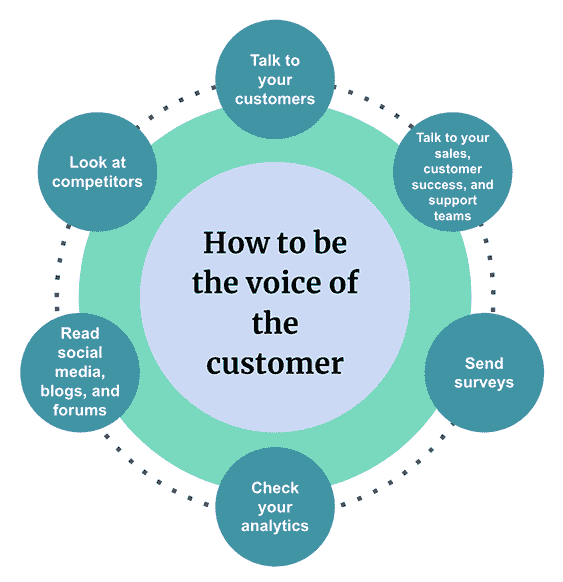

# 你不是你的客户:如何避免制造错误的产品

> 原文：<https://blog.logrocket.com/product-management/you-are-not-your-customer-how-to-avoid-building-the-wrong-product/>

作为经前综合症患者，我们的大脑总是塞满了不同的东西，需要我们去学习和掌握。好吧，这里还有一个更重要的想法，我要请你融入其中，不要忘记:

你可能会认为你是你的顾客。但你不是。你可以成为客户的声音，这是非常不同的事情。你越早知道越好。这将为你和你的客户避免很多痛苦。

在这篇文章中，我们将讨论为什么感觉你是你的客户并基于此做出决定是一个问题。我们还将讨论帮助你远离这种谬误的策略。

* * *

## 目录

* * *

## 为什么很容易认为你是你的顾客

我明白，相信我，我明白。

如果你是顾客，那么你的工作就简单多了！构建路线图的艰巨任务很好，并不难。你确切地知道需要建造什么，正如你了解你自己一样。当出现支持问题时，很容易确定需要重点关注哪些问题。你只需要问自己“这对我有影响吗？”

答案往往是否定的，你就完了。生活很简单，对吗？

用户体验？这也很简单。你知道你需要什么样的经验，所以团队只需要建立这种经验。如果你是顾客，你永远是英雄。对吗？

## 有什么问题吗？

为了达到效果，我说得有点极端，但事实是，许多产品人员确实是这样想的，包括世界上一些最大的科技公司。是的，这是个问题。

如果你将自己视为客户，那么你会根据你认为必要或有益的事情做出决定。问题是你的客户可能不同意。你可能会投资错误的东西——客户不需要的东西。

不要被这个策略曾经奏效的事实所迷惑。对于一个 MVP 来说，你可能有足够的判断力，但这种感觉会很快改变。虽然，很多时候，这种策略也不起作用。随着越来越多的客户使用你的产品，尤其是付费客户，他们的需求会有所不同。如果你坚持只建造你认为最好的东西，你可能会付出巨大的代价。

由于这种方法，多种产品躺在失败海洋的底部。

## 一艘沉船

我在微软工作时，参与了一个非常大的项目，这个项目将彻底改变云计算。这是一个寻找客户解决方案的经典案例。几年来，产品开发是由领导层的信念推动的，他们认为这是适合市场的。

经过大约 18 个月的发展，该公司开始与潜在客户交谈，并为一个私人活动空运了一批(50-100 名)客户。展示产品后，得到的反应并不是该公司所希望得到的。客户不明白为什么这个产品是必要的，他们觉得公司投资的东西并不是他们关心的问题。这是一个巨大的觉醒。

后来，我和我们的一位高管讨论了反馈意见。他说，“这些是错误的顾客，他们不是正确的观众。”我对这个回答感到震惊。我说，“如果他们不是合适的客户，那我们为什么要和他们见面？”蟋蟀。

未来，这个项目被完全取消了。数千万美元付诸东流。

如果花更多的精力去了解客户真正想要的是什么并确认他们的需求，这一切都是可以避免的。

## 确认偏差

“我知道他们想要什么，数据也支持！”

这是你成为顾客的一个常见理由。事情是这样的，我们的大脑很狡猾。当我们坚信某件事是真的时，我们能够并且确实以支持这些信念的方式解释数据。这正是确认偏差的意义所在。

在我前面提到的例子中，我很有信心这发挥了很大的作用。该团队已经完成了研究，但是基于他们必须交付特定类型的解决方案的愿望，分析是有偏差的。在我领导的工作中，我个人也受到了这一点的影响。这是产品经理都需要非常小心的事情。

## 如何成为客户的代言人

成为客户的代言人意味着你是他们的代表。[你将为他们关心的问题辩护](https://blog.logrocket.com/product-management/what-is-customer-centricity-how-to-achieve-it/)并确保产品能充分满足他们的需求。你需要能够区分你自己对产品的期望和信念，以利于你的客户表达他们的需求。

为了代表你的客户，你首先需要倾听和理解他们。我不能过分强调你在这里投入时间的重要性。

* * *

订阅我们的产品管理简讯
将此类文章发送到您的收件箱

* * *

倾听客户有许多不同的定性和定量方法，以下是我认为最成功的几种方法:

### 与客户交谈

没有什么能替代与客户直接对话的能力。我认为产品经理应该至少每周和他们的客户交谈一次，如果不是每天的话。我发现他们愿意谈论产品，尤其是当他们知道他们的分享可以帮助塑造产品的时候。这可以通过许多不同的媒介，如电话、信息、在线会议或亲自参加活动。

与客户交谈时，努力练习少说多听。引导好奇心，寻求理解他们试图解决什么问题，你的产品如何适应，以及他们的体验。验证你的假设是否正确。在这里，倾听非常重要，因为客户喜欢被倾听，并在被倾听时感受到自己的价值。

[除了了解他们为什么](https://blog.logrocket.com/product-management/customer-feedback-why-you-should-seek-how-to-obtain/)之外，倾听还能帮助你发现其他领域，以便进一步深入了解，或者发现机会。

### 与您的销售、客户成功和支持团队交流

如果与您的组织相关，请包括开发人员倡导者。这些团队可以很好地代表你的客户在说什么。他们可以从功能和体验的角度告诉您您的客户面临的关键问题。

销售人员(包括销售工程师和解决方案架构师)可以告诉您客户喜欢什么，以及阻碍达成交易的主要差距。客户成功会让你深入了解客户在尝试购买产品时所面临的问题。支持可以帮助您了解人们经常遇到的问题以及解决方法。

对于一个平台产品，开发者倡导者将是一个很好的资源来理解是什么阻碍了开发者的采用，或者他们在哪里遇到了麻烦。

### 发送调查

[调查是收集数据](https://blog.logrocket.com/product-management/customer-satisfaction-survey-templates-examples-questions/)并了解不同客户群使用模式的绝佳方式。有了调查，少即是多。试着将你的问题浓缩到 10 个或更少，因为数据显示客户更有可能回答。

看到调查结果后，我会挑选一些客户进行交谈，这样我可以进一步了解他们的答案，并尽量避免得出错误的结论。

### 检查您的分析

产品分析是了解客户如何使用你的产品的一个很好的工具。如果你没有产品分析，你应该！您将了解哪些功能使用得最多和最少，用户如何在产品中流动，以及他们在哪里停滞不前。你可能会对你所学到的东西感到惊讶，并发现客户正在以你想象不到的方式使用产品。

与调查类似，直接跟踪客户以了解*为什么*您会看到您所看到的，这一点很重要。

### 阅读社交媒体、博客和论坛

这些都是了解产品体验的绝佳资源。特别是论坛可以成为人们陷入困境的金矿。这里的一个警告是，这些资源可能具有很高的信噪比。最初，寻找信号可能会非常困难。随着时间的推移和练习，这变得越来越容易。

### 看看竞争对手

不要害怕看你的竞争对手。这将有助于你了解他们的优点和缺点。你可以了解他们产品的功能，这对你的产品很有价值。您还可以了解他们的客户正在经历的棘手问题，如果您能解决这些问题，您就可以获得竞争优势，甚至赢得他们的一些客户

## 提取和综合数据

你已经花了必要的时间收集数据，你可能已经收集了大量的数据。怎么用呢？你需要提炼并合成它。这意味着从你所有的资源中收集共同的主题，总结你所看到的和为什么。这是一项需要时间来掌握的技能，但它是至关重要的。如果你带着一堆数字去见你的领导，却不解释原因，你可能会遭到很多反对。

## 它不是微不足道的，你如何能适应它？

如您所见，这是一个不小的工作量。你如何在日复一日和最后一分钟的任务中适应这一点？优先排序。

首先，你得想办法。为了腾出空间，你可能不得不把事情放在优先级较低的位置。第二，这项工作正在进行。这并不像你只是坐了一天就完事了——不，这是不断地将这些习惯融入到其他事情中。

可能有一天是两个小时，另一天是 30 分钟，第三天是 5 分钟。只要你在做一件事，你就会看到好处，尽你所能去做。应用这些数据收集、提取和综合的实践将帮助你充分表达客户的声音，并确保产品满足他们的需求。您的客户值得拥有！

## 你不是你的顾客，但你可以成为他们的代言人

总之，如果你认为自己是你的客户，不管它看起来有多吸引人，都是有问题的。了解你的客户，成为他们的代言人，回应他们的需求。

我强烈推荐的一本好书是辛迪·阿尔瓦雷斯的《精益客户开发》。在该课程中，您将学习一种全面的方法来参与和了解客户的需求，以及如何让他们参与产品开发。

如果做得好，这将对你的产品在市场上的表现产生巨大的积极影响。

## [LogRocket](https://lp.logrocket.com/blg/pm-signup) 产生产品见解，从而导致有意义的行动

[LogRocket](https://lp.logrocket.com/blg/pm-signup) 确定用户体验中的摩擦点，以便您能够做出明智的产品和设计变更决策，从而实现您的目标。

使用 LogRocket，您可以[了解影响您产品的问题的范围](https://logrocket.com/for/analytics-for-web-applications)，并优先考虑需要做出的更改。LogRocket 简化了工作流程，允许工程和设计团队使用与您相同的[数据进行工作](https://logrocket.com/for/web-analytics-solutions)，消除了对需要做什么的困惑。

让你的团队步调一致——今天就试试 [LogRocket](https://lp.logrocket.com/blg/pm-signup) 。