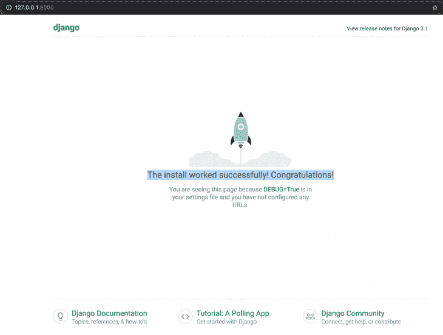
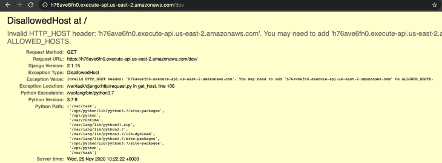
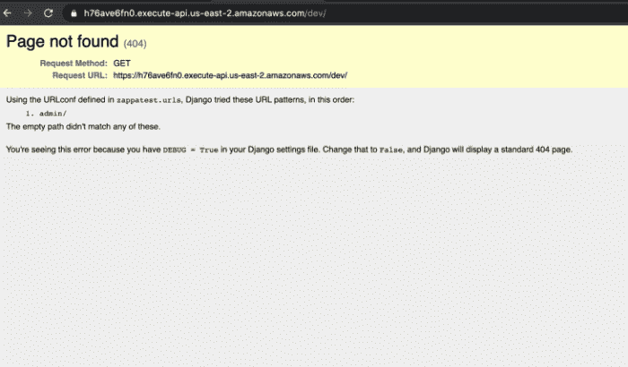
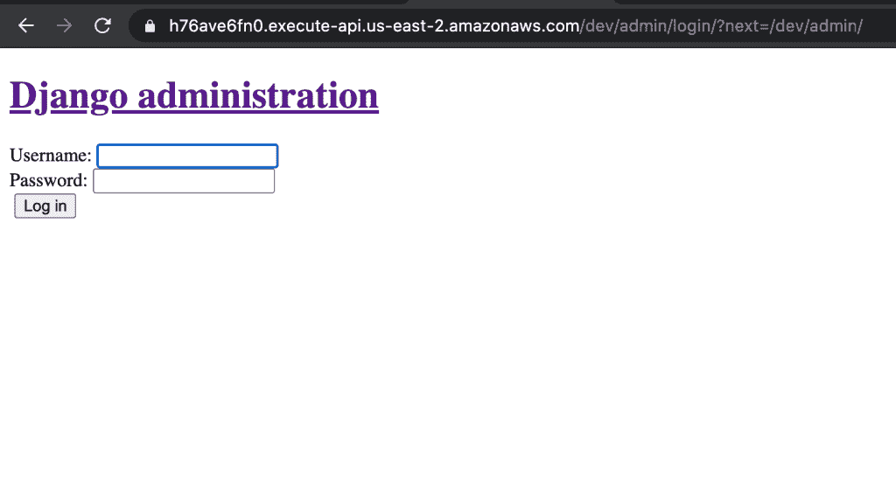
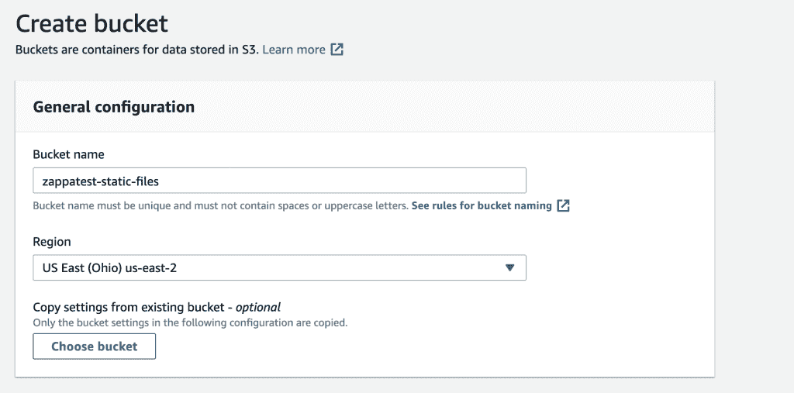
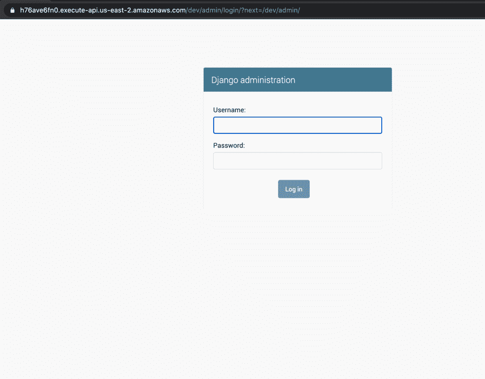

# 使用 Zappa 和 AWS Lambda 部署无服务器 Django 应用程序

> 原文：<https://blog.logrocket.com/zappa-and-aws-lambda-for-serverless-django/>

无服务器架构已经成为近年来软件开发和部署的讨论热点之一。本教程解释了使用 Zappa 和 Amazon Web Services (AWS) Lambda 在 Django 应用程序中实现无服务器架构的概念。

### Zappa 要求

为了跟随本教程，Zappa 假设您具备以下条件:

*   AWS Lambda IAM 证书(遵循本指南中的
*   姜戈的一些经历
*   带有 [Pipenv](https://pypi.org/project/pipenv/) 和 [Django](https://djangoforbeginners.com/initial-setup/) 设置的 Python 开发环境

## 无服务器意味着什么？

无服务器意味着您不再需要手动维护自己的服务器。相反，您可以订阅一个平台，比如 AWS Lambda，它会为您管理工作区基础设施。有点用词不当，无服务器并不意味着没有服务器，而是服务器、操作系统和其他相关基础设施的管理都是为您处理的。

### **AWSλ**

[AWS Lambda](https://docs.aws.amazon.com/lambda/index.html) 是一个流行的功能即服务(FAAS ),它通过为您完成几乎所有繁重的工作来帮助您运行和管理服务器。作为奖励，你只需要为你的服务器实际使用的时间付费。

### 扎帕

Zappa 是一个开发运营工具箱，旨在帮助开发人员在部署和管理与 AWS Lambda 和 AWS API 网关上的 [web 服务器网关接口(WSGI)](https://wsgi.readthedocs.io/en/latest/what.html) 兼容的无服务器 Web 应用程序时减轻工作量。如果你熟悉使用 [Laravel Vapor](https://vapor.laravel.com/) 来管理 Laravel 应用程序，那么你会注意到 Zappa 为基于 Python web 的框架提供了类似的功能，如 Django 和 [Flask](https://flask.palletsprojects.com/en/1.1.x/) 。

虽然 Zappa 作为部署工具有许多功能，但以下是它最显著的一些优势:

*   将你的项目打包成 Lambda 就绪的 zip 文件，并上传到亚马逊 S3
*   设置必要的 AWS IAM 角色和权限
*   将您的应用程序部署到不同阶段(开发、试运行、生产)
*   自动配置项目的 API 网关路由、方法和集成响应
*   将项目的 API 网关请求转换成有效的 WSGI，并返回 API 网关兼容的 HTTP 响应

接下来，我们将介绍如何在 Django 应用程序中设置 Zappa 和 AWS Lambda。

## 和扎帕一起建立我们的姜戈项目

Zappa 支持 Python 3.6、3.7 和 3.8。在我们设置 Django 项目之前，通过运行以下命令来验证您是否拥有受支持的 Python 版本:

```
$ python3 --version

```

如果返回错误消息，您可能需要考虑降级到 Python 的早期版本。

我遇到的一个问题是在运行 Django 版时收到一个错误。有一个 SQLite 版本冲突，似乎在运行 Zappa 时抛出一个错误。为了避免这种情况，您可能需要使用版本 2.1.9。

下面安装有 Zappa 的脚手架 a Django 2.1.9:

```
mkdir djangoprojects && cd djangoprojects # creates and navigate into directory called djangoprojects
pipenv install --python 3.7 # Sets up a Pipenv environment specific to Python 3.7
pipenv install django~=2.1.9 # Install Django 2.1.9
pip3 install zappa #install zappa with pip3 (I ran into an issue installing with pipenv but pip3 seemed to work just fine)
django-admin startproject zappatest
cd zappatest ## navigate to the zappatest folder
pipenv shell #activate the pipenv shell
python3 manage.py runserver ## serve the project locally

```

安装成功后，输出应该如下所示:



## 设置 AWS 凭据

要在您的计算机上本地设置 AWS 访问密钥，请打开您的 AWS 仪表板控制台，在[中创建一个具有管理员访问权限的 IAM 用户](https://docs.aws.amazon.com/IAM/latest/UserGuide/getting-started_create-admin-group.html)，然后获取 AWS 凭证部分，并获取`access_key`和`asecc_secret_key`。

接下来，`cd`进入你电脑的根目录，在`.aws`文件夹里面创建一个`.aws`文件夹。然后，创建一个名为`credentials`的文件，并以如下格式添加您的 AWS 访问键:

```
cd ~ # navigate to your root directory
mkdir .aws # create a .aws folder
cd .aws # navigate into the created aws folder
touch credentials # create a file named credentials

```

在您选择的文本编辑器中打开凭证文件(我使用了 [nano](https://www.nano-editor.org/) ，并添加以下内容:

```
[default]
aws_access_key_id = your_aws_access_key_id
aws_secret_access_key = your_aws_secret_access_key

```

在保存和退出之前，不要忘记用 AWS 控制台中提供的键值替换`your_aws_access_key_id`和`your_aws_secret_key`。

## 集成 Zappa 进行部署

一旦你准备好在你的项目上设置 Zappa，通过运行`zappa init`初始化`zapp_settings.json`文件。

当你这样做的时候，你会被问到一些问题，包括你是否希望你的应用程序被全球部署。我的建议是拒绝，因为这只是一个演示项目。对于其余的提示，选择默认选项。

在配置过程的最后，您的`zappa_settings.json`文件应该如下所示:

```
{
    "dev": {
        "django_settings": "zappatest.settings",
        "profile_name": "default",
        "project_name": "zappatest",
        "runtime": "python3.7",
        "s3_bucket": "zappa-bqof1ad4l"
    }
}

```

最后，您需要指定您希望应用程序部署在哪个区域。为此，打开`zappa_setting.json`文件并将您指定的`aws_region`添加到 dev 对象，例如:

```
{
    "dev": {
        ...
        "profile_name": "default",
        "aws_region" : "us-east-2",
        ...
    }
}

```

## 姜戈，扎帕，AWS …发射🚀

要在开发模式下将应用程序部署到 AWS Lambda，请运行:

```
$ zappa deploy dev

```

请注意，当您在这个阶段访问应用程序的 URL 时，您将会收到一条 DisallowedHost 错误消息，因为 Django 无法识别应用程序所来自的 URL:



要解决这个问题，请将主机添加到`zappatest/settings.py`文件中的`ALLOWED_HOSTS`数组，如下所示:

```
...
ALLOWED_HOSTS = ['127.0.0.1', 'h76ave6fn0.execute-api.us-east-2.amazonaws.com',]
...

```

接下来，通过运行:
`$ zappa update dev`更新远程部署

您现在应该可以看到标准的 404 Django 页面:



如果你正在做一个项目，比如一个简单的 API，这应该足够让你开始了。

对于更复杂的项目，如果您访问`/admin`路径来访问 django-admin 接口，您将会看到以下结果:



这是因为我们部署的项目没有被配置为处理静态文件。我们将在下一节讨论这种配置。

## 处理静态文件

### **创建存储桶**

首先，创建一个具有唯一名称的 S3 存储桶(稍后您需要记住这个名称):



### **允许其他主机访问**

在您的 bucket 的“permissions”选项卡中，导航到 [CORS](https://developer.mozilla.org/en-US/docs/Web/HTTP/CORS) 规则设置，并添加以下配置以允许来自其他主机的访问:

```
[
    {
        "AllowedHeaders": [
            "*"
        ],
        "AllowedMethods": [
            "GET"
        ],
        "AllowedOrigins": [
            "*"
        ],
        "MaxAgeSeconds": 3000
    }
]

```

### **安装****django-S3-存储包**

*再次打开项目根文件夹中的终端，运行
`$ pip install django-s3-storage`安装 django-S3-存储包*

 *### **将姜戈 S3 添加到您已安装的****a***PPS *中**

开放`settings.py`并包括 django *s3* 存储:

```
INSTALLED_APPS = [
  ... 
'django_s3_storage'
]

```

### **配置 Django S3 存储**

将下面的代码块放在 settings.py 中的任意位置，然后将“zappatest-static-files”替换为您在命名 bucket 时使用的任何名称:

```
S3_BUCKET_NAME = "zappatest-static-files"
STATICFILES_STORAGE = "django_s3_storage.storage.StaticS3Storage"
AWS_S3_BUCKET_NAME_STATIC = S3_BUCKET_NAME
# serve the static files directly from the specified s3 bucket
AWS_S3_CUSTOM_DOMAIN = '%s.s3.amazonaws.com' % S3_BUCKET_NAME
STATIC_URL = "https://%s/" % AWS_S3_CUSTOM_DOMAIN
# if you have configured a custom domain for your static files use:
#AWS_S3_PUBLIC_URL_STATIC = "https://static.yourdomain.com/"

```

### **将静态文件推入桶中**

接下来，更新更改，并通过运行以下命令将静态文件推送到桶中:

```
$ zappa update dev
$ zappa manage dev "collectstatic --noinput"

```

### **渲染页面**

最后，再次打开管理页面，您的页面应该会正确呈现:



## 结论

在本文中，我们使用 Zappa 和 Amazon Web Services (AWS) Lambda 探索了 Django 应用程序中的无服务器架构。

我们首先使用 pipenv 和 pip3 在本地启动并运行 Django 项目。然后，我们设置我们的 Zappa 配置，并在开发模式下部署到 AWS Lambda。最后，我们用 AWS S3 添加了对静态文件的支持，以确保我们的 web 应用程序看起来和功能都符合我们的要求。

虽然我们在本文中已经介绍了很多，但是关于无服务器 Django 还有很多需要学习的地方。为了继续你的学习，我建议你查看 Python Python 索引(PYPI)网站上的官方 Zappa 文档，以及 T2 的 AWS Lambda 文档。

## 使用 [LogRocket](https://lp.logrocket.com/blg/signup) 消除传统错误报告的干扰

[](https://lp.logrocket.com/blg/signup)

[LogRocket](https://lp.logrocket.com/blg/signup) 是一个数字体验分析解决方案，它可以保护您免受数百个假阳性错误警报的影响，只针对几个真正重要的项目。LogRocket 会告诉您应用程序中实际影响用户的最具影响力的 bug 和 UX 问题。

然后，使用具有深层技术遥测的会话重放来确切地查看用户看到了什么以及是什么导致了问题，就像你在他们身后看一样。

LogRocket 自动聚合客户端错误、JS 异常、前端性能指标和用户交互。然后 LogRocket 使用机器学习来告诉你哪些问题正在影响大多数用户，并提供你需要修复它的上下文。

关注重要的 bug—[今天就试试 LogRocket】。](https://lp.logrocket.com/blg/signup-issue-free)*