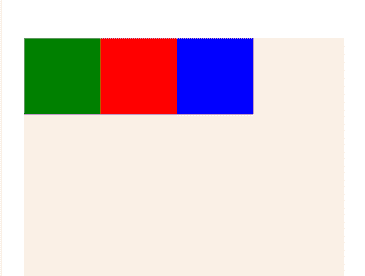
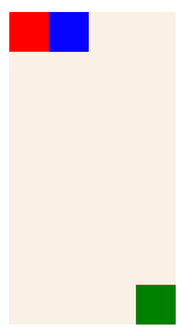
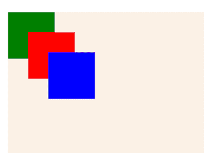
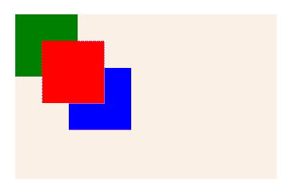
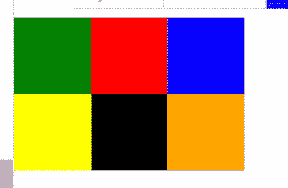

# 在 React Native to stack 元素中使用类似 zIndex 的方法

> 原文：<https://blog.logrocket.com/zindex-react-native-stack-elements-best-practices/>

React Native 是一种用于开发 Android 和 iOS 应用程序的流行技术。尽管它是建立在 React——脸书用于创建用户界面的 JavaScript 工具包——之上，React Native 的目标是移动平台，而不是浏览器。

使用 React Native，您可以使用与 web 开发中相同的技术，如 CSS 和 JavaScript。React Native 还为您提供了大量元素来构建您的移动应用程序的 UI。

在构建 UI 时，两个或更多 React 原生元素很容易相互重叠。换句话说，这些元素是相互堆叠的。出现这种情况时，您可能不喜欢它们在屏幕上出现的顺序。

您可以使用 React Native 中的 CSS 参数`position`和`zIndex`来管理重叠组件的堆叠顺序。本教程将探讨这些和其他堆叠元素的技术和最佳实践。

我们将涵盖:

要学习本教程，你需要 React Native 的基础知识，对 CSS 有所了解，以及一个关于 Expo 小吃的[入门应用。](https://snack.expo.dev)

## 使用 CSS `position`属性在 React Native 中堆叠

CSS `position`属性用于在页面上定位一个元素，相对于它的正常位置或者绝对位置。换句话说，它相对于最近的定位祖先来定位元素。

在将`position`属性应用到一个元素之后，您将使用`top`、`bottom`、`left`和`right`属性来指定您想要元素被放置的确切位置。

在这一节中，我们将使用三个`<View>`元素，以及一点 CSS，在我们的应用程序中创建三个重叠的容器。

至此，您应该已经在 Expo Snack 上设置好了您的入门应用程序。如果是这样，用项目中的`App.js`文件中的默认组件替换下面的`App`组件:

```
export default function App() {
  return (
    <View style={styles.container} >
      <View style={[styles.square, {backgroundColor: 'green'}]} />
      <View style={[styles.square, {backgroundColor: 'red'}]} />
      <View style={[styles.square, {backgroundColor: 'blue'}]} />
    </View>
  );
}

```

这里我们将三个背景颜色不同的`<View>`元素放在一个容器`<View>`元素中。

接下来，在同一个文件中，用以下样式替换默认的`styles`代码:

```
const styles = StyleSheet.create({
  container: {
    margin: 20,
    marginTop: 30,
    flex: 1,
    flexDirection:'row',
    backgroundColor: 'linen',    
  },
  square: {
    height: 70,
    width: 70,        
  },
});

```

使用上面的代码，三个嵌套的`<View>`元素被设计成正方形，并在父容器中正确对齐。输出如下所示:



在上面的图像中，元素是水平对齐的，并且彼此明显分开。但是，比方说，你想把绿色容器放在底部而不是顶部。您可以使用 CSS `position`属性来重新定位绿色容器。

让我们看看实际情况。在`App.js`文件中，在绿色容器的`<View>`元素上添加`position: 'absolute'`属性，并将`bottom`和`right`属性都设置为`0`，如下面的代码所示:

```
return (
    <View style={styles.container} >
      <View style={       
        [
          styles.square, 
          {backgroundColor: 'green', position: 'absolute', bottom: 0, right: 0}
        ]
        } 
      />
      <View style={[styles.square, {backgroundColor: 'red'}]} />
      <View style={[styles.square, {backgroundColor: 'blue'}]} />
    </View>
  );

```

有了这段代码，第一个容器将被放置在屏幕的右下角，这是我们使用`bottom: 0, right:` `0`设置的。这为我们提供了以下输出:



请注意，第二个容器现在占据了第一个容器的位置，而第三个容器占据了第二个位置。这是因为`position: 'absolute'`完全从正常流程中移除了元素。

让我们现在让所有三个容器重叠。将所有嵌套的`<View >`元素的样式属性更新为以下内容:

```
return (
    <View style={styles.container} >
      <View style={[styles.square, {backgroundColor: 'green', position: 'absolute', top: 0, left: 0}]}/>
      <View style={[styles.square, {backgroundColor: 'red', position: 'absolute', top: 30, left: 30}]}/>
      <View style={[styles.square, {backgroundColor: 'blue', position: 'absolute', top: 60, left: 60}]} />
    </View>
  );

```

这里我们从顶部偏移红色方块`30px`，从左侧偏移`30px`，从顶部偏移第三个方块`60px`，从左侧偏移`60px`。结果如下图所示:



在上面的图像中，你可以看到所有三个框都重叠了，并且蓝色的框被放在另外两个框的前面，因为它具有最高的优先级。但是如果你想把红盒子放到前面呢？

答案是设置它的`zIndex`值。

## 在 React Native 中使用`zIndex`来堆叠和重新定位元素

当两个或多个 React 本地元素重叠时，它们的`zIndex`值将决定它们在堆栈中的位置。具有最高`zIndex`的元素将被放置在前面，而具有最低`zIndex`的元素将被放置在后面。

默认情况下，React Native 中的`zIndex`值从上到下递增。回到三个重叠方块的图像，这个默认行为很明显，蓝色方块的`zIndex`值最高，而绿色方块的`zIndex`值最低。

要把红色方块放在前面，你要做的就是把它的`zIndex`设置成一个大于等于`1`的整数值。

```
// <View />
<View style={[styles.square, {backgroundColor: 'red', position: 'absolute', top: 30, left: 30, zIndex: 1}]}/>
// <View />

```

结果如下:



要在红色方块前面放置另一个方块，请在该元素的 style 属性上设置一个更大的`zIndex`值。

到目前为止，我们已经演示了如何使用 React Native 中的 CSS `position`和`zIndex`属性来[堆叠元素。在 React Native 中，`FlatList`元素提供了一种堆叠元素的现代方式。](https://blog.logrocket.com/best-practices-stacking-elements-css/)

## 用`FlatList`堆叠反应原生元素

[React Native 提供了一个](https://blog.logrocket.com/deep-dive-react-native-flatlist/) `[FlatList](https://blog.logrocket.com/deep-dive-react-native-flatlist/)` [元素](https://blog.logrocket.com/deep-dive-react-native-flatlist/)，允许你使用网格布局在屏幕上放置元素。在这一节中，我们将通过增强我们在上一节中创建的元素来演示如何使用`FlatList`来堆叠元素。

让我们在我们的`App.js`文件中添加一个简单的`FlatList`元素。在文件的顶部，从`react-native`导入`FlatList`:

```
import { FlatList, ... } from 'react-native';

```

接下来，就在`App`组件上方，创建一个具有几种颜色的`bgColorArr`数组。然后，创建一个名为`renderItem`的函数，并从中返回一个`<View>`元素:

```
const bgColorArr = [
  'green',
  'red',
  'blue',
  'yellow',
  'black',
  'orange'
]

function renderItem({item}) {
  return (    
      <View style={[styles.square, {backgroundColor: item}]}/>          
  );
}

```

接下来，修改`App`组件。用一个`FlatList`替换`return`语句中的所有四个`<View>`元素:

```
return (
    <FlatList data={bgColorArr} renderItem={renderItem} />
  );

```

这里我们传递了以下内容:

*   `bgColorArr`:我们想要迭代的项目(背景颜色)的数组
*   `renderItem`:我们要为每个项目(即每种颜色)渲染的组件

因此，`FlatList`将用不同的背景颜色呈现六个`View`元素:


在这里，项目呈现在一行中，但是您也可以指定列。让我们看看怎么做。

### 用`FlatList`将项目渲染到列中

在这一节中，我们将把这些项目呈现到一个包含三列的网格系统中。

再次修改`App`组件。添加两个属性`numColumn`和`key`，并将它们的值设置为`3`:

```
return (
    <FlatList 
      data={bgColorArr} 
      renderItem={renderItem}
      numColumns={3}
      key={3} 
    />
  );

```

输出如下所示:



### 使用 React Native 的`Dimension` API 创建响应列

为了确保项目在不同的屏幕分辨率上对齐良好，可以使用 React Native 提供的`Dimension` API 根据设备获取宽度和高度。

在`App.js`文件中，得到屏幕的宽度，除以列数，得到每列的大小。然后，将该值传递给呈现项的 width 属性:

```
const screenWidth = Dimensions.get("windows").width;
const numColumns = 4
const tileSize = screenWidth / numColumns

function renderItem({item}) {
  return (    
      <View style={[styles.square, {backgroundColor: item, width: tileSize, height: tileSize }]}/>          
  );
}

```

此代码确保您始终准确使用可用间距。不要忘记从文件顶部的`react-native`导入`Dimension`，这样代码才能工作。

## 结论

我希望这篇教程能帮助你更好地理解堆栈。现在，你应该能够在 React 本地应用中创建[灵活的网格系统，使用我们在这篇文章中提到的技术——`zIndex`、`position`和`Flatlist`。](https://blog.logrocket.com/using-flexbox-react-native/#how-make-grid-flexbox)

如果你对这个话题有任何疑问，请留下评论，我会尽快回复。祝你一周愉快！

## [LogRocket](https://lp.logrocket.com/blg/react-native-signup) :即时重现 React 原生应用中的问题。

[](https://lp.logrocket.com/blg/react-native-signup)

[LogRocket](https://lp.logrocket.com/blg/react-native-signup) 是一款 React 原生监控解决方案，可帮助您即时重现问题、确定 bug 的优先级并了解 React 原生应用的性能。

LogRocket 还可以向你展示用户是如何与你的应用程序互动的，从而帮助你提高转化率和产品使用率。LogRocket 的产品分析功能揭示了用户不完成特定流程或不采用新功能的原因。

开始主动监控您的 React 原生应用— [免费试用 LogRocket】。](https://lp.logrocket.com/blg/react-native-signup)